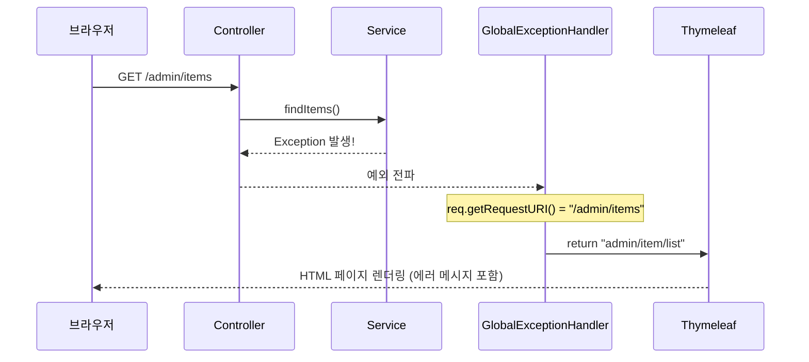
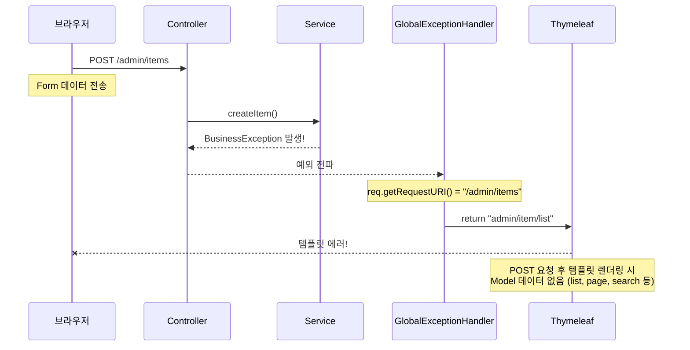
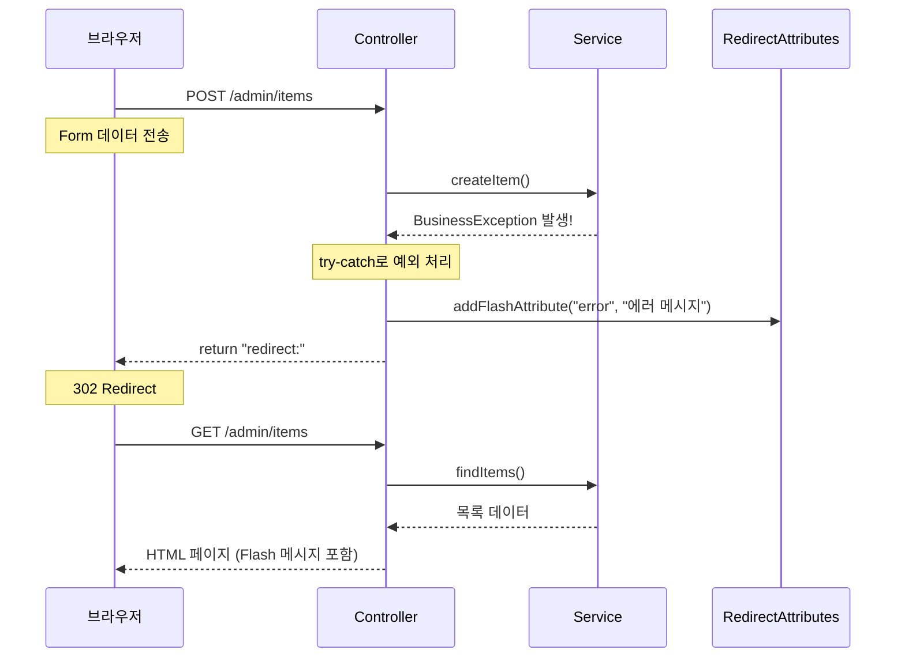
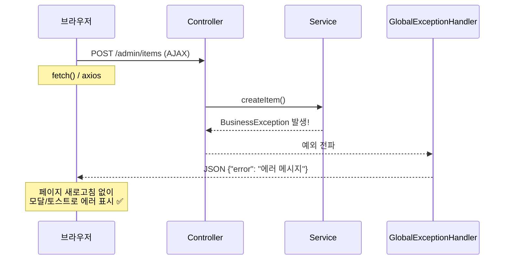
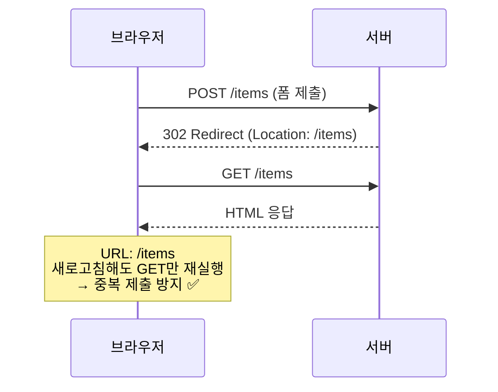
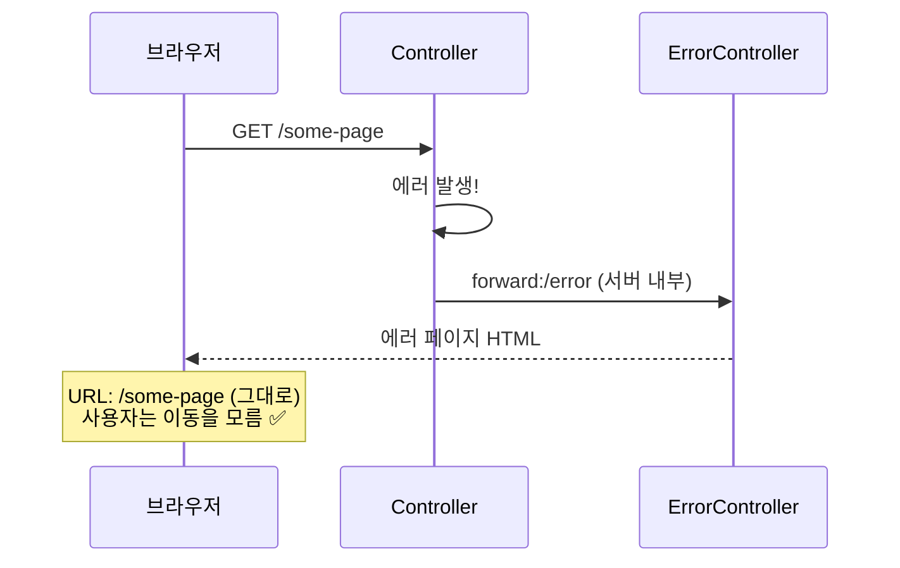
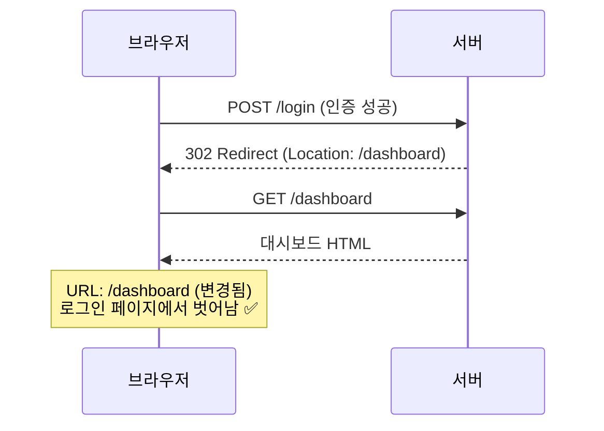
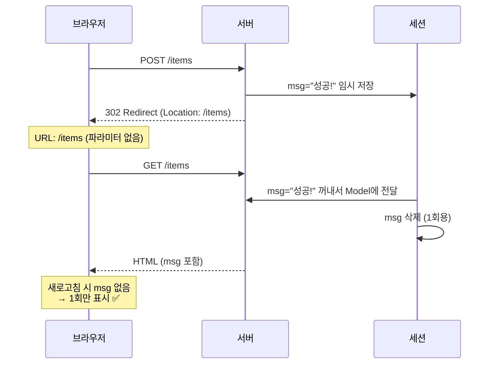
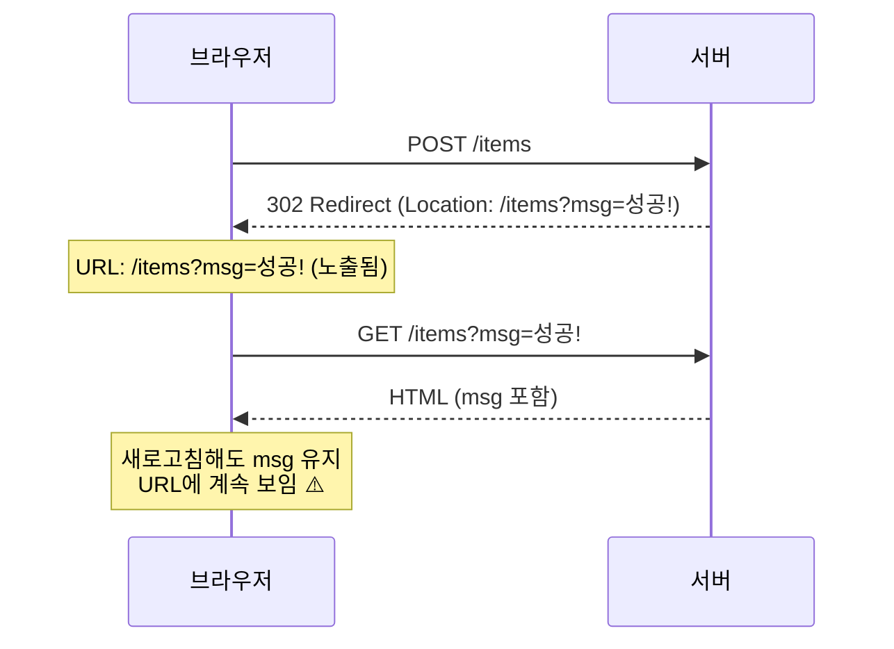

## 문제 상황

Spring Boot + Thymeleaf 기반의 SSR(Server-Side Rendering) 어드민 페이지를 개발하면서 예외 처리에 대한 의문이 생겼다. GET 요청에서 발생한 예외는 `@ControllerAdvice`의 공통 예외 핸들러에서 잘 처리되는데, POST 요청에서는 같은 방식이 동작하지 않았다.

왜 HTTP 메서드에 따라 예외 처리 방식이 달라야 할까?

---

## GET 요청 - 공통 예외 핸들러 사용 가능

GET 요청에서 예외가 발생하면 `GlobalExceptionHandler`가 동일한 템플릿을 다시 렌더링하는 방식으로 처리할 수 있다.



### GET 요청이 동작하는 이유

- `req.getRequestURI()`가 `/admin/items`를 반환
- 이 경로에 해당하는 Thymeleaf 템플릿 `admin/item/list.html`이 존재
- 에러 메시지와 함께 동일한 화면을 다시 렌더링

---

## POST 요청 - 공통 예외 핸들러 사용 불가

POST 요청에서 예외가 발생하면 같은 방식으로 처리할 수 없다.



### POST 요청이 실패하는 이유

핵심은 **GET Controller와 POST Controller가 서로 다른 메서드**라는 점이다.

```java
// GET 요청 - 목록 조회
@GetMapping("")
public String itemList(Model model, ItemSearchCriteria criteria) {
    List<Item> list = itemService.findItems(criteria);

    // ✅ 여기서 Model에 데이터를 넣음
    model.addAttribute("list", list);
    model.addAttribute("page", pageInfo);
    model.addAttribute("search", criteria);

    return "admin/item/list";  // Thymeleaf 템플릿
}

// POST 요청 - 등록
@PostMapping("")
public String itemCreate(ItemForm form) {
    itemService.createItem(form);  // ← 여기서 예외 발생!

    // ❌ Model에 list, page, search 데이터를 넣는 코드가 없음

    return "redirect:";
}
```

예외가 `GlobalExceptionHandler`로 가면 `admin/item/list.html` 템플릿을 렌더링하려 한다. 그런데 이 템플릿은 `${list}`, `${page}` 등의 데이터를 필요로 하는데, POST 메서드에서는 이 데이터를 Model에 넣지 않았기 때문에 **템플릿 렌더링 자체가 실패**한다.

> GET은 같은 메서드에서 Model 데이터를 이미 추가했기 때문에 되고, POST는 다른 메서드라서 Model에 아무것도 없어서 안 된다.
{: .prompt-info }

---

## 해결책 - Controller에서 직접 예외 처리

POST 요청의 예외는 Controller에서 try-catch로 직접 처리하고 redirect해야 한다.



### 구현 코드

```java
@PostMapping("")
public String itemCreate(ItemForm form, RedirectAttributes ra) {
    try {
        itemService.createItem(form);
        ra.addFlashAttribute("success", "등록되었습니다.");
    } catch (BusinessException e) {
        ra.addFlashAttribute("error", e.getMessage());  // Flash로 전달
    } catch (Exception e) {
        ra.addFlashAttribute("error", "시스템 오류가 발생했습니다.");
    }
    return "redirect:";  // GET으로 redirect
}
```

### Controller 레벨 예외 처리가 필요한 이유

1. Redirect 대상 지정: Controller만 어느 화면으로 redirect할지 알 수 있음
2. Flash Attribute 사용: redirect 후에도 에러 메시지 전달 가능
3. PRG 패턴 준수: POST → Redirect → GET으로 새로고침 시 중복 제출 방지

---

## POST도 GlobalExceptionHandler에서 처리할 수 있을까?

앞서 POST는 Controller에서 직접 처리해야 한다고 했지만, 방법이 아예 없는 건 아니다. 몇 가지 대안을 살펴보자.

### 방법 1: HTTP Method 분기 처리

`GlobalExceptionHandler`에서 HTTP 메서드를 확인하고 분기 처리할 수 있다.

```java
@ControllerAdvice
public class GlobalExceptionHandler {

    @ExceptionHandler(BusinessException.class)
    public String handleBusinessException(
            BusinessException e,
            Model model,
            HttpServletRequest req,
            RedirectAttributes ra) {

        // POST/PUT/DELETE면 redirect
        if (!"GET".equalsIgnoreCase(req.getMethod())) {
            ra.addFlashAttribute("error", e.getMessage());
            return "redirect:" + req.getRequestURI();
        }

        // GET이면 템플릿 직접 렌더링
        model.addAttribute("error", e.getMessage());
        return extractViewPath(req.getRequestURI());
    }
}
```

> 단점: redirect 경로가 항상 현재 URI가 맞는지 보장할 수 없다. 예를 들어, 등록 후 목록으로 가야 하는 경우에는 적합하지 않다.
{: .prompt-warning }

### 방법 2: AJAX 방식으로 변경 (추천)

POST를 폼 제출 대신 **AJAX**로 처리하면 `GlobalExceptionHandler`에서 JSON 응답으로 통일할 수 있다.



**GlobalExceptionHandler 구현:**

```java
@ControllerAdvice
public class GlobalExceptionHandler {

    @ExceptionHandler(BusinessException.class)
    @ResponseBody
    public ResponseEntity<Map<String, String>> handleBusinessException(BusinessException e) {
        return ResponseEntity.badRequest()
            .body(Map.of("error", e.getMessage()));
    }
}
```

**프론트엔드 구현:**

```javascript
fetch('/admin/items', {
    method: 'POST',
    body: formData
})
.then(res => res.json())
.then(data => {
    if (data.error) {
        showErrorMessage(data.error);  // 모달이나 토스트로 표시
    } else {
        location.reload();  // 성공 시 새로고침
    }
});
```

> AJAX 방식의 장점:
> - 페이지 새로고침 없이 에러 표시
> - 예외 처리 로직 일원화
> - UX 향상 (모달 안에서 에러 표시 가능)
{: .prompt-tip }

### 방법 3: Custom Annotation으로 redirect 경로 지정

어노테이션을 만들어서 각 Controller 메서드에 에러 시 redirect할 경로를 지정할 수 있다.

**어노테이션 정의:**

```java
@Target(ElementType.METHOD)
@Retention(RetentionPolicy.RUNTIME)
public @interface OnErrorRedirect {
    String value();  // redirect 경로
}
```

**Controller에서 사용:**

```java
@PostMapping("")
@OnErrorRedirect("/admin/items")  // 에러 시 이 경로로 redirect
public String itemCreate(ItemForm form) {
    itemService.createItem(form);
    return "redirect:";
}
```

**GlobalExceptionHandler에서 어노테이션 읽기:**

```java
@ControllerAdvice
public class GlobalExceptionHandler {

    @ExceptionHandler(BusinessException.class)
    public String handleBusinessException(
            BusinessException e,
            HandlerMethod handlerMethod,
            RedirectAttributes ra) {

        OnErrorRedirect annotation = handlerMethod.getMethodAnnotation(OnErrorRedirect.class);
        if (annotation != null) {
            ra.addFlashAttribute("error", e.getMessage());
            return "redirect:" + annotation.value();
        }

        // 어노테이션 없으면 기본 처리
        throw e;
    }
}
```

### 어떤 방법을 선택할까?

| 방법 | 적합한 상황 |
|------|------------|
| 방법 1 (Method 분기) | 빠르게 적용하고 싶을 때 |
| **방법 2 (AJAX)** | 신규 프로젝트, UX가 중요할 때 **(추천)** |
| 방법 3 (Annotation) | 기존 SSR 유지하면서 일원화하고 싶을 때 |

---

## 정리

| 구분 | GET 요청 | POST/PUT/DELETE 요청 |
|------|----------|---------------------|
| 예외 처리 위치 | GlobalExceptionHandler | Controller (try-catch) |
| 응답 방식 | 템플릿 직접 렌더링 | Redirect (PRG 패턴) |
| 에러 전달 | Model attribute | Flash attribute |
| 이유 | URI = 템플릿 경로 | Model 데이터 없음 + Redirect 필요 |

---

## 관련 개념 정리

### redirect: vs redirect 차이

콜론(`:`)이 핵심이다.

```java
return "redirect:";      // ✅ 현재 경로로 HTTP redirect (302)
return "redirect";       // ❌ "redirect"라는 이름의 템플릿 파일을 찾음
```

| 반환값 | Spring 해석 | 결과 |
|--------|-------------|------|
| `"redirect:/login"` | redirect 명령 | 302 응답 → 브라우저가 GET /login 요청 |
| `"redirect"` | 뷰 이름 | templates/redirect.html 렌더링 |
| `"forward:/other"` | forward 명령 | 서버 내부에서 /other로 요청 전달 |
| `"forward"` | 뷰 이름 | templates/forward.html 렌더링 |

---

### Forward vs Redirect 차이

| 구분 | Forward | Redirect |
|------|---------|----------|
| 처리 위치 | 서버 내부 | 브라우저 |
| URL 변경 | 안 바뀜 | 바뀜 |
| 요청 횟수 | 1번 | 2번 |

**언제 뭘 쓰나?**

**1) POST 처리 후 → Redirect (PRG 패턴)**



**2) 에러 페이지 표시 → Forward (URL 유지)**



**3) 로그인 후 원래 페이지로 → Redirect (URL 변경)**



---

### Flash Attribute 동작 원리

Redirect는 새 요청이라 Model 데이터가 사라지는 문제가 있다. Flash Attribute는 이를 해결한다.

**동작 흐름:**
1. POST 요청에서 `ra.addFlashAttribute("msg", "성공!")` → Session에 임시 저장
2. 302 Redirect 응답
3. GET 요청 시 Spring이 Session에서 Flash 데이터 꺼냄 → Model에 자동으로 넣어줌 → Session에서 삭제 (1회용)

**1) addFlashAttribute - 세션에 임시 저장 (URL에 안 보임)**



**2) addAttribute - URL 파라미터로 전달 (URL에 보임)**



---

### Session vs Flash Attribute 차이

| 구분 | Session | Flash Attribute |
|------|---------|-----------------|
| 수명 | 직접 삭제할 때까지 유지 | 1회 읽으면 자동 삭제 |
| 삭제 | 직접 (`invalidate()`) | 자동 (1회 읽으면) |
| 새로고침 | 유지됨 | 사라짐 |
| 예시 | 로그인 상태, 장바구니 | "저장되었습니다" 메시지 |

> Session = 지갑 (계속 가지고 다님), Flash Attribute = 포스트잇 (한 번 보고 버림)
{: .prompt-tip }

Flash Attribute는 **세션을 이용한 1회용 데이터 전달 메커니즘**이다.

---

### Session 저장 위치

기본적으로 서버(Tomcat) 메모리에 Session 저장소가 있고, JSESSIONID를 키로 세션 데이터를 저장한다.

**클라이언트 식별 방법:**
- 서버: 세션 데이터 저장
- 브라우저: 쿠키에 세션 ID(JSESSIONID)만 저장

최초 요청 시 서버가 세션 생성 후 `Set-Cookie: JSESSIONID=ABC123` 응답, 이후 요청 시 브라우저가 `Cookie: JSESSIONID=ABC123` 전송하면 서버가 해당 세션을 찾는다.

**서버가 여러 대일 때 문제:**

서버 A에서 로그인해서 세션이 생성됐는데, 다음 요청이 서버 B로 가면 세션이 없어서 로그인이 풀린다.

**해결: 외부 세션 저장소 (Redis 등)**

모든 서버가 공유하는 외부 저장소(Redis)에 세션을 저장하면 어느 서버로 가도 세션을 찾을 수 있다.

| 저장 위치 | 장점 | 단점 |
|-----------|------|------|
| 메모리 (기본) | 빠름 | 서버 재시작 시 삭제, 분산 불가 |
| Redis | 빠름, 분산 가능 | 별도 서버 필요 |
| DB | 영구 저장 | 느림 |

---

## 마무리

SSR 환경에서 GET과 POST의 예외 처리 방식이 다른 이유는 결국 **Controller 메서드가 다르기 때문**이었다. GET 메서드에서는 템플릿에 필요한 Model 데이터를 이미 채워넣지만, POST 메서드에서는 그렇지 않다. 따라서 POST 예외 처리 시에는 redirect를 통해 GET 메서드를 다시 호출하는 PRG 패턴을 사용해야 한다.

이 과정에서 redirect 후에도 메시지를 전달하기 위해 Flash Attribute를 사용하고, 이는 Session을 이용한 1회용 데이터 전달 메커니즘이라는 것까지 연결해서 이해할 수 있었다.
