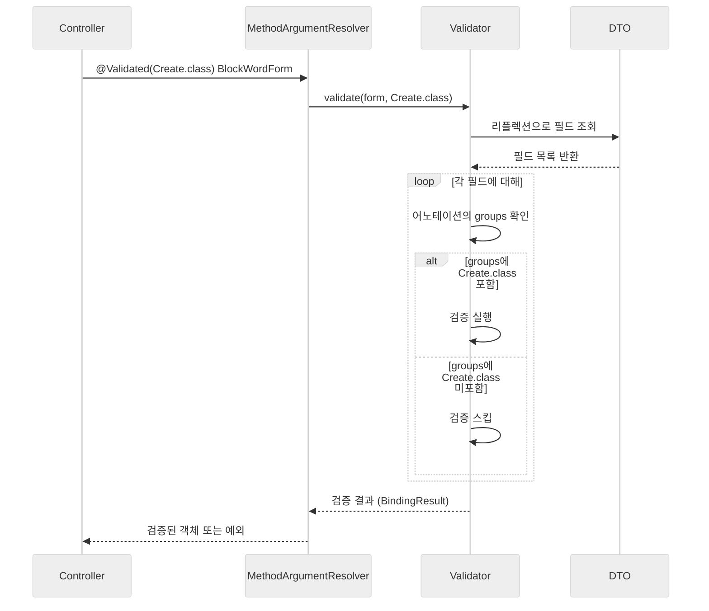

## 1. 문제 상황 이해하기

등록과 수정 API를 개발하다 보면 같은 필드를 사용하지만 검증 규칙이 다른 경우가 자주 발생합니다.

예를 들어 차단문구 관리 기능을 구현할 때, 등록과 수정 시 필요한 검증이 다음과 같이 달랐습니다.

| 필드 | 등록 시 | 수정 시 |
|------|---------|---------|
| `no` (PK) | 불필요 | 필수 |
| `userId` | 필수 | 불필요 (변경 불가) |
| `word` | 필수 | 필수 |
| `note` | 선택 | 선택 |

> 같은 필드를 사용하지만, 상황에 따라 검증 규칙이 달라야 합니다.
{: .prompt-info }

## 2. 일반적인 해결 방법의 한계

가장 먼저 떠오르는 해결책은 등록용 DTO와 수정용 DTO를 분리하는 것입니다.

```java
public class BlockWordCreateForm {
    @NotBlank private String userId;
    @NotBlank private String word;
    private String note;
}

public class BlockWordUpdateForm {
    @NotNull private Long no;
    @NotBlank private String word;
    private String note;
}
```

이 방식은 동작하지만 다음과 같은 문제가 있습니다:

1. **코드 중복**: `word`와 `note` 필드가 중복됩니다
2. **유지보수 비용 증가**: 필드가 10개, 20개로 늘어나면 두 클래스를 모두 수정해야 합니다
3. **검증 메시지 불일치 위험**: 한쪽만 수정하고 다른 쪽을 놓칠 수 있습니다

## 3. Validation Groups란?

Bean Validation(JSR-380)에서는 이런 문제를 해결하기 위해 **Validation Groups**라는 기능을 제공합니다.

> Validation Groups는 같은 DTO를 사용하면서 상황에 따라 다른 검증 규칙을 적용할 수 있게 해주는 기능입니다.
{: .prompt-tip }

핵심 아이디어는 간단합니다. 각 검증 어노테이션에 "이 검증은 어떤 그룹에서 실행할지" 표시해두고, 검증 시점에 원하는 그룹만 선택해서 실행하는 것입니다.

## 4. Validation Groups 구현하기

### 4-1. 마커 인터페이스 정의

먼저 그룹을 식별할 인터페이스를 정의합니다. 내용이 없는 빈 인터페이스입니다.

```java
public class ValidationGroups {
    public interface Create {}
    public interface Update {}
}
```
{: file="ValidationGroups.java" }

> 왜 빈 인터페이스를 사용할까요? `groups` 속성은 `Class<?>[]` 타입이라 기술적으로는 아무 클래스나 넣을 수 있습니다. 하지만 빈 인터페이스를 사용하는 것이 관례입니다. 이를 **마커 인터페이스(Marker Interface)**라고 부르며, 타입 안전성을 제공하면서도 불필요한 구현을 강제하지 않습니다.
{: .prompt-info }

### 4-2. DTO에 groups 속성 지정

각 검증 어노테이션에 `groups` 속성을 지정합니다.

```java
import static com.example.validation.ValidationGroups.*;

@Getter @Setter @NoArgsConstructor
public class BlockWordForm {

    @NotNull(message = "수정할 항목을 선택해주세요.", groups = Update.class)
    private Long no;

    @NotBlank(message = "업체를 선택해주세요.", groups = Create.class)
    private String userId;

    @NotBlank(message = "차단문구를 입력해주세요.", groups = {Create.class, Update.class})
    private String word;

    private String note;  // 양쪽 모두 선택 필드
}
```
{: file="BlockWordForm.java" }

`word` 필드처럼 여러 그룹에서 검증해야 하면 배열로 지정합니다.

### 4-3. Controller에서 그룹 지정

Controller에서 `@Validated` 어노테이션에 원하는 그룹을 지정합니다.

```java
@PostMapping("/block")
public ResponseEntity<?> create(
        @Validated(Create.class) @ModelAttribute BlockWordForm form) {
    // Create 그룹의 검증만 실행
    // userId, word 검증 O / no 검증 X
    return ResponseEntity.ok(service.create(form));
}

@PutMapping("/block")
public ResponseEntity<?> update(
        @Validated(Update.class) @ModelAttribute BlockWordForm form) {
    // Update 그룹의 검증만 실행
    // no, word 검증 O / userId 검증 X
    return ResponseEntity.ok(service.update(form));
}
```
{: file="MessageController.java" }

## 5. @Valid vs @Validated 비교

둘 다 검증을 트리거하지만 중요한 차이가 있습니다.

| 구분 | @Valid | @Validated |
|------|--------|------------|
| 패키지 | `jakarta.validation` (표준) | `org.springframework.validation` (Spring) |
| Groups 지원 | ❌ | ✅ |
| 중첩 객체 검증 | ✅ | ✅ |

> Validation Groups를 사용하려면 반드시 `@Validated`를 사용해야 합니다.
{: .prompt-warning }

```java
// ❌ 동작하지 않음 - @Valid는 groups를 지원하지 않음
public ResponseEntity<?> create(@Valid(Create.class) BlockWordForm form) { ... }

// ✅ 올바른 사용
public ResponseEntity<?> create(@Validated(Create.class) BlockWordForm form) { ... }
```

## 6. 내부 동작 원리

어노테이션에 그룹을 지정하면 어떻게 검증이 분리되는 걸까요?

어노테이션은 **메타데이터**일 뿐입니다. 그 자체로는 아무 동작도 하지 않습니다. 실제 검증은 `Validator`가 수행합니다.



동작 순서를 정리하면 다음과 같습니다:

1. `@Validated(Create.class)`를 만나면 Spring의 `MethodArgumentResolver`가 동작합니다
2. `Validator.validate(form, Create.class)` 호출합니다
3. Validator가 리플렉션으로 DTO의 모든 필드를 조회합니다
4. 각 필드의 검증 어노테이션에서 `groups` 속성을 확인합니다
5. 요청된 그룹(`Create.class`)이 포함되어 있으면 검증을 실행하고, 아니면 스킵합니다
6. 검증 실패 시 `MethodArgumentNotValidException`이 발생합니다

## 7. 대안 비교

Validation Groups가 만능은 아닙니다. 상황에 따라 다른 접근법이 더 적합할 수 있습니다.

### 7-1. DTO 분리

필드 구성이 크게 다르거나 검증 로직이 복잡하면 DTO를 분리하는 것이 오히려 명확합니다.

```java
public class BlockWordCreateForm {
    @NotBlank private String userId;
    @NotBlank private String word;
}

public class BlockWordUpdateForm {
    @NotNull private Long no;
    @NotBlank private String word;
}
```

### 7-2. 상속 활용

공통 필드가 많다면 상속으로 중복을 줄일 수 있습니다.

```java
public class BlockWordBaseForm {
    @NotBlank private String word;
    private String note;
}

public class BlockWordCreateForm extends BlockWordBaseForm {
    @NotBlank private String userId;
}

public class BlockWordUpdateForm extends BlockWordBaseForm {
    @NotNull private Long no;
}
```

### 7-3. Service 계층 검증

복잡한 비즈니스 검증은 Service에서 처리하는 것이 좋습니다.

```java
@Service
public class BlockWordService {

    public void create(BlockWordForm form) {
        validateForCreate(form);
        // ...
    }

    private void validateForCreate(BlockWordForm form) {
        if (form.getUserId() == null) {
            throw new BusinessException("업체를 선택해주세요.");
        }
        if (existsWord(form.getUserId(), form.getWord())) {
            throw new BusinessException("이미 등록된 차단문구입니다.");
        }
    }
}
```

## 8. 언제 Validation Groups를 사용해야 할까?

다음 조건을 만족하면 Validation Groups가 효과적입니다:

- 등록/수정이 **대부분의 필드를 공유**하는 경우
- 차이점이 **PK 필드 유무** 정도로 단순한 경우
- 검증이 **필드 단위의 단순 검증** (NotNull, NotBlank 등)인 경우

반면 다음 상황에서는 다른 방법을 고려해야 합니다:

- 등록/수정 필드 구성이 **50% 이상 다른** 경우
- **교차 필드 검증**이 필요한 경우 (예: 시작일 < 종료일)
- **DB 조회가 필요한 검증**인 경우 (예: 중복 체크)

## 정리

지금까지 Validation Groups에 대해 알아보았습니다. 핵심 내용을 정리하면 다음과 같습니다:

- **Validation Groups**는 같은 DTO를 사용하면서 상황에 따라 다른 검증 규칙을 적용할 수 있게 해주는 Bean Validation 기능입니다
- **마커 인터페이스**로 그룹을 정의하고, 검증 어노테이션에 `groups` 속성을 지정합니다
- Controller에서 **@Validated(Group.class)**를 사용하여 원하는 그룹의 검증만 실행합니다
- 어노테이션은 메타데이터일 뿐이며, 실제 동작은 **Validator가 리플렉션**으로 처리합니다
- 필드 구성이 크게 다르거나 복잡한 검증이 필요하면 **DTO 분리**나 **Service 계층 검증**을 고려해야 합니다