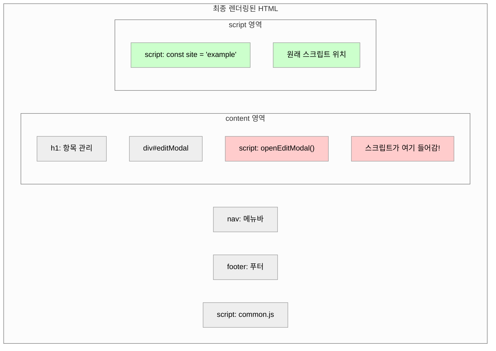

## 1. 개요

Thymeleaf로 개발하다 보면 자연스럽게 '모달을 따로 파일로 빼면 재사용하기 좋지 않을까?'라는 생각이 든다. 그런데 막상 시도해보니 예상치 못한 문제가 터졌다.

> 모달의 HTML은 분리할 수 있지만, JavaScript는 페이지 컨텍스트에 의존하기 때문에 함께 분리하기 어렵다.
{: .prompt-warning }

직접 겪었던 문제와 그 과정에서 알게 된 것들을 공유해보려 한다.

## 2. 이상적인 모달 분리 구조

먼저 완벽하게 분리된 모달이 어떻게 동작해야 하는지 살펴보자.

### 2-1. 독립적인 확인 모달 예시

```html
<!-- modal/confirm.html -->
<th:block th:fragment="confirmModal">
    <div class="modal fade" id="confirmModal">
        <div class="modal-dialog">
            <div class="modal-content">
                <div class="modal-header">
                    <h5 class="modal-title">확인</h5>
                </div>
                <div class="modal-body">
                    <p id="confirmMessage"></p>
                </div>
                <div class="modal-footer">
                    <button type="button" class="btn btn-secondary" data-bs-dismiss="modal">취소</button>
                    <button type="button" class="btn btn-primary" id="confirmBtn">확인</button>
                </div>
            </div>
        </div>
    </div>

    <script>
        const confirmModal = {
            callback: null,

            show: function(message, onConfirm) {
                document.getElementById('confirmMessage').textContent = message;
                this.callback = onConfirm;
                new bootstrap.Modal(document.getElementById('confirmModal')).show();
            }
        };

        document.getElementById('confirmBtn').addEventListener('click', function() {
            if (confirmModal.callback) confirmModal.callback();
            bootstrap.Modal.getInstance(document.getElementById('confirmModal')).hide();
        });
    </script>
</th:block>
```
{: file="modal/confirm.html" }

### 2-2. 사용하는 페이지

```html
<!-- list.html -->
<th:block th:replace="~{modal/confirm :: confirmModal}"></th:block>

<script>
    confirmModal.show('정말 삭제하시겠습니까?', function() {
        // 삭제 로직
    });
</script>
```
{: file="list.html" }

> 이 구조의 핵심은 모달이 **자체적으로 완결**되어 있고, 페이지는 **인터페이스만 호출**한다는 점이다.
{: .prompt-tip }

## 3. 문제 발생 원인

### 3-1. Thymeleaf 레이아웃 구조의 이해

Thymeleaf의 레이아웃 시스템은 빈 칸이 있는 문서 양식과 비슷하다. 각 페이지가 그 빈 칸을 채우는 방식으로 동작하는 셈이다.

```
┌─────────────────────────────┐
│        [회사 로고]           │  ← 공통 헤더
├─────────────────────────────┤
│                             │
│    [ 내용 들어갈 자리 ]       │  ← 빈 칸 (content)
│                             │
├─────────────────────────────┤
│     [ 스크립트 자리 ]        │  ← 빈 칸 (script)
└─────────────────────────────┘
```

#### 공통 레이아웃 파일

```html
<!DOCTYPE html>
<html>
<head>
    <title>Admin</title>
    <link rel="stylesheet" href="/css/common.css">
</head>
<body>
    <nav>메뉴바 (모든 페이지 공통)</nav>

    <!-- 빈 칸 1: 각 페이지의 내용이 들어갈 자리 -->
    <div layout:fragment="content">
        여기에 각 페이지 내용이 들어감
    </div>

    <footer>푸터 (모든 페이지 공통)</footer>

    <script src="/js/common.js"></script>

    <!-- 빈 칸 2: 각 페이지의 스크립트가 들어갈 자리 -->
    <th:block layout:fragment="script">
        여기에 각 페이지 스크립트가 들어감
    </th:block>
</body>
</html>
```
{: file="layout/main.html" }

#### 개별 페이지 파일

```html
<html layout:decorate="~{layout/main}">

<!-- 빈 칸 1 채우기: "content" 영역 -->
<div layout:fragment="content">
    <h1>항목 관리</h1>
    <table>...</table>
    <div id="editModal">...</div>
</div>

<!-- 빈 칸 2 채우기: "script" 영역 -->
<th:block layout:fragment="script">
    <script>
        const site = 'example';
        function openEditModal() { ... }
    </script>
</th:block>

</html>
```
{: file="list.html" }

이 구조의 장점은 다음과 같다.

| 장점 | 설명 |
|------|------|
| 중복 제거 | 헤더, 푸터, 메뉴를 매 페이지마다 작성할 필요가 없다 |
| 스크립트 위치 보장 | `</body>` 바로 앞에 스크립트가 위치하도록 보장된다 |
| 일관성 | 모든 페이지가 같은 구조를 갖게 된다 |

### 3-2. th:replace의 동작 방식

`th:replace`는 단순히 대상 파일의 내용을 그 자리에 **복사-붙여넣기**한다. 만약 모달 파일에 스크립트를 포함하면 어떻게 될까?

```html
<!-- modal/edit.html -->
<div th:fragment="editModal">
    <div id="editModal">
        모달 내용...
    </div>
    <script>
        function openEditModal() { ... }
    </script>
</div>
```
{: file="modal/edit.html" }

이 모달을 list.html에서 include하면 다음과 같이 렌더링된다.

```html
<div layout:fragment="content">
    <h1>항목 관리</h1>

    <!-- modal/edit.html 내용이 여기에 복사됨 -->
    <div id="editModal">
        모달 내용...
    </div>
    <script>
        // 스크립트도 content 영역 안에 복사됨
        function openEditModal() { ... }
    </script>

</div>

<th:block layout:fragment="script">
    <script>
        const site = 'example';
    </script>
</th:block>
```



### 3-3. 발생하는 문제점

1. **실행 순서 문제**: content 영역의 스크립트가 먼저 실행되는데, 이때 필요한 변수가 아직 정의되지 않았다
2. **구조 문제**: HTML 표준에서 `<script>`는 보통 `</body>` 바로 앞에 모아두는 것이 좋다
3. **의존성 문제**: 모달의 스크립트가 페이지 변수를 사용하려면, 해당 변수가 먼저 정의되어 있어야 한다

> `th:replace`는 단순 복사-붙여넣기이므로, 모달에 스크립트를 넣으면 content 영역 안에 들어가버린다. 스크립트는 `layout:fragment="script"` 영역에 있어야 하는데, 모달 파일에서는 이 영역에 접근할 방법이 없다.
{: .prompt-danger }

## 4. JavaScript 의존성 문제

### 4-1. 페이지 컨텍스트에 의존하는 모달

실제 프로젝트에서 수정 모달은 다음과 같은 의존성을 가진다.

```javascript
// list.html의 스크립트

// Thymeleaf 인라인 표현식: 서버 변수를 JavaScript로 변환
const site = /*[[${site}]]*/ '';
const gridData = /*[[${list}]]*/ [];
const pageData = /*[[${page}]]*/ {};

// TUI Grid 라이브러리로 테이블 생성
const grid = new tui.Grid({
    el: document.getElementById('grid'),
    data: gridData,
    // ...
});

// 수정 모달 열기 함수
function openEditModal(no) {
    // site 변수 사용
    fetch(`/${site}/api/items/detail?no=${no}`)
        .then(response => response.json())
        .then(data => {
            document.getElementById('editNo').value = data.no;
            document.getElementById('editWord').value = data.word;
        });
}
```
{: file="list.html" }

### 4-2. 모달에 스크립트를 넣으면 발생하는 에러

```html
<!-- modal/edit.html -->
<div th:fragment="editModal">
    <!-- HTML 생략 -->

    <script>
        // ReferenceError: site is not defined
        fetch(`/${site}/api/items/detail?no=${no}`)

        // ReferenceError: grid is not defined
        const checkedRows = grid.getCheckedRows();
    </script>
</div>
```
{: file="modal/edit.html" }

모달의 JavaScript가 `site`, `grid` 등 페이지에서 정의된 변수에 의존하기 때문에, 스크립트를 모달 파일로 분리하면 해당 변수를 찾을 수 없어 에러가 발생한다.

### 4-3. Thymeleaf 인라인 표현식 이해하기

```javascript
const site = /*[[${site}]]*/ '';
```

이 문법은 **Natural Templating**을 위한 것이다.

| 상황 | 결과 |
|------|------|
| HTML을 직접 브라우저로 열 때 (서버 없이) | `/*...*/`는 주석으로 무시 → `const site = '';` |
| 서버(Spring)를 통해 열 때 | Thymeleaf가 값으로 치환 → `const site = 'example';` |

> Natural Templating 덕분에 서버 없이도 HTML을 직접 열어서 디자인과 레이아웃을 확인할 수 있다.
{: .prompt-info }

## 5. 결과와 문제점

HTML만 분리하고 JavaScript를 페이지에 남기면 다음과 같은 상황이 벌어진다.

- **절반만 분리된 상태**: HTML과 JavaScript가 서로 다른 파일에 위치하게 된다
- **관련 코드 분산**: 모달의 HTML은 `modal/edit.html`에, JavaScript는 `list.html`에 존재한다
- **유지보수 어려움**: 수정할 때 두 파일을 동시에 확인해야 한다
- **로직 추적 어려움**: 모달의 동작을 이해하려면 여러 파일을 뒤져봐야 한다

## 6. 모달 분리 기준

### 6-1. 분리해야 하는 경우 (공통 모달)

| 모달 종류 | 특징 | 예시 |
|----------|------|------|
| 확인/취소 다이얼로그 | 메시지만 받아서 표시, 콜백 실행 | `confirmModal.show('삭제하시겠습니까?', callback)` |
| 로딩 스피너 | show()/hide()만 호출 | `loadingModal.show()` |
| 에러 알림 | 메시지만 받아서 표시 | `errorModal.show('오류 발생')` |

**특징**:
- 페이지 컨텍스트에 의존하지 않는다
- 재사용성이 높다
- 독립적으로 동작 가능하다

### 6-2. 분리하지 말아야 하는 경우 (페이지 특화 모달)

| 모달 종류 | 의존성 | 이유 |
|----------|--------|------|
| 항목 등록 모달 | 서버에서 전달받은 목록, site 변수 | 서버 변수에 의존한다 |
| 항목 수정 모달 | site 변수, grid 객체, API 호출 | 페이지 객체에 의존한다 |
| 사용자 정보 수정 모달 | 페이지별 다른 필드, 검증 로직 | 페이지별로 로직이 다르다 |

**권장사항**:
- 한 파일에 HTML + JavaScript가 함께 있는 게 낫다
- 코드 응집도가 높아진다
- 수정할 때 한 곳만 보면 된다

## 7. 정리

Thymeleaf에서 모달을 분리할 때는 다음 사항을 먼저 확인해보자.

- **JavaScript 의존성을 먼저 확인**: 페이지 변수에 의존하는지, 레이아웃 구조와 호환되는지 살펴본다
- **재사용 가능성이 낮으면 분리하지 않는다**: 코드 응집도를 유지하고 과도한 추상화는 피한다
- **공통 컴포넌트만 분리**: 확인 다이얼로그, 로딩 스피너 등 독립적인 컴포넌트만 분리한다
- **실용성을 우선**: 이론적으로 완벽해 보이는 구조가 실무에서는 오히려 불편할 수 있다

> 컴포넌트 분리의 핵심 기준은 **재사용성**과 **의존성**이다. 재사용성이 높고 의존성이 낮은 컴포넌트만 분리하는 게 좋다.
{: .prompt-tip }

## 참고 자료

- [Thymeleaf Layout Dialect 공식 문서](https://github.com/ultraq/thymeleaf-layout-dialect)
- [Thymeleaf Standard Expression Syntax](https://www.thymeleaf.org/doc/tutorials/3.0/usingthymeleaf.html#standard-expression-syntax)
