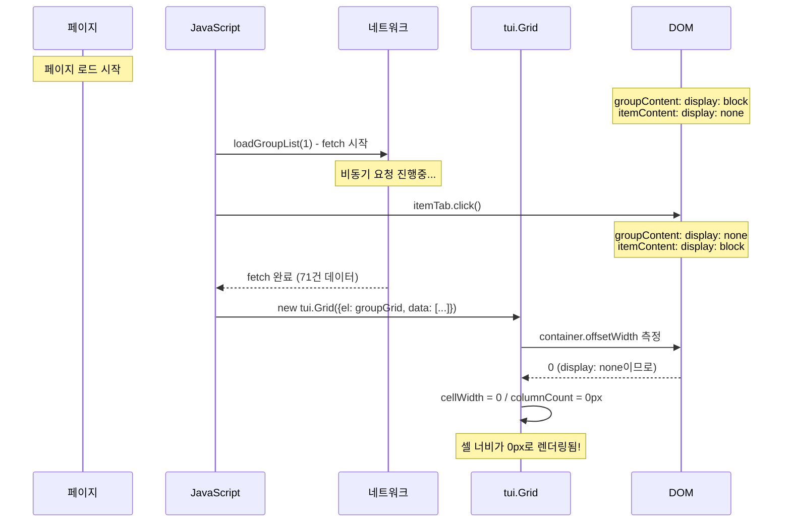

## 문제 상황

관리자 페이지에서 Bootstrap 탭으로 "그룹"과 "항목" 두 개의 탭을 구현했다. 사용자 경험을 위해 마지막으로 선택한 탭을 sessionStorage에 저장하고, 페이지 새로고침 후에도 해당 탭으로 자동 복원하는 기능을 추가했다.

그런데 이상한 버그가 발생했다.

**재현 순서:**
1. 항목 탭에서 검색 실행
2. 검색 후 페이지 새로고침됨
3. 그룹 탭을 클릭
4. "총 71건"이라는 카운트는 표시되지만 **그리드 셀이 비어있음**

```
+----------------------------------------------------------+
|  [그룹 탭 O]  [항목 탭]                                    |
+----------------------------------------------------------+
|  총 71건                                                  |
+----------------------------------------------------------+
|  V  | 아이디 | 업체명 | 그룹명 | 변경자 | 변경일시        |  <- 헤더는 보임
+----------------------------------------------------------+
|  O  |        |        |        |        |                 |  <- 데이터가
|  O  |        |        |        |        |                 |     비어있음!
|  O  |        |        |        |        |                 |
+----------------------------------------------------------+
```

| 항목 | 기대 | 실제 |
|------|------|------|
| 총 건수 | 71건 | 71건 |
| 헤더 | 보임 | 보임 |
| 데이터 셀 | 보임 | **비어있음** |

데이터는 정상적으로 조회되었는데(71건), 왜 셀에는 아무것도 표시되지 않는 걸까?

## 원인 분석

### CSS display 속성의 특성

이 문제를 이해하려면 먼저 CSS `display` 속성의 특성을 알아야 한다.

| 값 | 의미 |
|---|---|
| `display: block` | 화면에 보임 |
| `display: none` | 화면에서 완전히 숨김 |

Bootstrap 탭에서는 활성 탭의 콘텐츠에 `display: block`을, 비활성 탭에는 `display: none`을 적용한다.

```html
<!-- 활성 탭 (보임) -->
<div class="tab-pane show active">  <!-- = display: block -->
    보임
</div>

<!-- 비활성 탭 (숨김) -->
<div class="tab-pane">  <!-- = display: none -->
    숨김
</div>
```

여기서 핵심은 **`display: none`인 요소는 크기를 측정할 수 없다**는 점이다.

```javascript
// display: none인 요소
element.offsetWidth   // -> 0
element.offsetHeight  // -> 0
```

이건 버그가 아니라 브라우저 표준 동작이다.

### 문제의 코드

페이지 초기화 코드를 살펴보자.

```javascript
// 페이지 로드 시 실행
const savedTab = sessionStorage.getItem('lastTab');

loadGroupList(1);  // 1. 데이터 요청 시작 (비동기)

if (savedTab === 'item') {
    document.getElementById('itemTab').click();  // 2. 탭 전환 (동기)
}
```

`itemTab.click()`은 Bootstrap이 탭 전환을 처리하도록 프로그래밍적으로 클릭 이벤트를 발생시킨다. 이 과정에서 다음이 일어난다:

1. 탭 버튼 UI 변경 (항목 탭에 active 클래스 추가)
2. 그룹 콘텐츠 숨김 (`display: none`)
3. 항목 콘텐츠 표시 (`display: block`)
4. `shown.bs.tab` 이벤트 발생

### 타임라인으로 보는 문제 발생 과정



문제의 핵심은 **비동기 타이밍**이다.

1. `loadGroupList(1)`는 비동기로 fetch를 시작한다
2. 그 다음 줄의 `itemTab.click()`은 동기적으로 즉시 실행된다
3. 탭 전환으로 그룹 콘텐츠가 `display: none` 상태가 된다
4. 약 100ms 후 fetch가 완료되고 그리드를 생성하려 한다
5. 이때 컨테이너가 숨겨진 상태이므로 크기가 0으로 측정된다

### 그리드 렌더링 실패 메커니즘

tui.Grid가 셀을 렌더링할 때 컨테이너 크기를 기준으로 셀 크기를 계산한다.

```javascript
// tui.Grid 내부 동작 (단순화)
class Grid {
    render() {
        // 1. 컨테이너 크기 측정
        const width = container.offsetWidth;   // display:none이면 0
        const height = container.offsetHeight; // display:none이면 0

        // 2. 셀 크기 계산
        const cellWidth = width / columnCount; // 0 / 5 = 0

        // 3. 셀 렌더링
        cells.forEach(cell => {
            cell.style.width = cellWidth + 'px';  // width: 0px <- 안 보임!
        });
    }
}
```

컨테이너 크기가 0이면 셀 크기도 0이 되어 아무것도 보이지 않는다. 하지만 데이터는 정상적으로 로드되었기 때문에 "총 71건"이라는 카운트는 제대로 표시된 것이다.

## 해결 방법: Lazy Loading 패턴

핵심 아이디어는 간단하다. **탭이 실제로 보일 때만 데이터를 로드한다.**

### 수정 전 코드

```javascript
loadGroupList(1);  // 항상 즉시 로드
if (savedTab === 'item') {
    itemTab.click();  // 그룹 탭 숨김 -> 렌더링 실패
}
```

### 수정 후 코드

```javascript
let groupLoaded = false;

if (savedTab === 'item') {
    itemTab.click();  // 항목으로 전환만 (그룹 데이터 로드 안 함)
} else {
    loadGroupList(1);  // 그룹 탭이 보일 때만 로드
    groupLoaded = true;
}

// 그룹 탭이 표시될 때 이벤트
groupTab.addEventListener('shown.bs.tab', function() {
    if (!groupLoaded) {
        loadGroupList(1);  // 탭이 보일 때 로드
        groupLoaded = true;
    } else if (groupGrid) {
        groupGrid.refreshLayout();  // 이미 로드됐으면 레이아웃만 재조정
    }
});
```

`shown.bs.tab`은 Bootstrap에서 탭이 완전히 보인 후에 발생하는 이벤트다. 이 시점에서는 컨테이너가 `display: block` 상태이므로 정확한 크기를 측정할 수 있다.

### 수정 후 타임라인

| 시점 | 수정 전 | 수정 후 |
|------|---------|---------|
| 페이지 로드 | `loadGroupList()` 호출 | (호출 안 함) |
| 탭 전환 | `itemTab.click()` -> 그룹 숨김 | `itemTab.click()` -> 그룹 숨김 |
| fetch 완료 | 숨긴 상태에서 그리드 생성 | (아직 로드 안 함) |
| 그룹 탭 클릭 | - | `shown.bs.tab` -> `loadGroupList()` |
| 그리드 생성 | 크기 0px로 렌더링 | **보이는 상태**에서 정상 렌더링 |

## 마무리

> "숨겨진 컨테이너에서 UI 컴포넌트를 초기화하면 안 된다"

이 문제는 tui.Grid에만 국한되지 않는다. `display: none`인 요소의 크기가 0으로 측정되는 건 브라우저 표준 동작이기 때문에, 크기 계산이 필요한 **모든** UI 라이브러리에서 동일한 문제가 발생할 수 있다.

| 종류 | 예시 |
|------|------|
| 그리드/테이블 | tui.Grid, AG Grid, DataTables |
| 차트 | Chart.js, ECharts, ApexCharts |
| 지도 | Leaflet, Google Maps |
| 에디터 | CodeMirror, Monaco Editor |
| 캐러셀/슬라이더 | Swiper, Slick |

따라서 탭, 모달, 아코디언 안에 이런 컴포넌트를 넣을 때는 항상 **"보일 때 초기화"** 패턴을 적용해야 한다.

```javascript
container.addEventListener('shown', () => {
    // 1. 보이는 상태에서 초기화
    initComponent();

    // 2. 또는 이미 초기화됐으면 레이아웃 재계산
    component.resize();  // 또는 refresh(), invalidateSize() 등
});
```

이 패턴은 단순히 버그를 수정하는 것을 넘어서, 불필요한 초기 로딩을 줄여 페이지 로드 성능도 개선할 수 있다. 사용자가 실제로 해당 탭을 클릭할 때까지 데이터 요청과 렌더링을 지연시키기 때문이다.

## 참고 자료

- [tui.Grid 공식 문서 - refreshLayout](https://nhn.github.io/tui.grid/latest/Grid#refreshLayout)
- [Bootstrap 탭 이벤트](https://getbootstrap.com/docs/5.0/components/navs-tabs/#events)
- [Lazy Loading 패턴](https://en.wikipedia.org/wiki/Lazy_loading)
