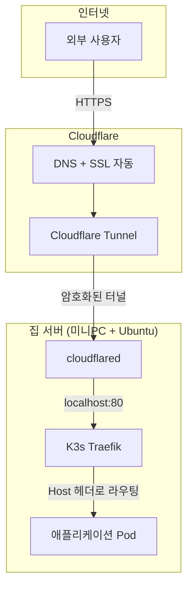

사이드 프로젝트를 외부에 공개하고 싶었다. AWS나 GCP를 쓰면 간단하지만, 학습 목적도 있고 비용도 절약하고 싶어서 집에 직접 서버를 구축하기로 했다.

처음에는 Tailscale로 내부 접근을 해결했다. 내 맥북에서 서버로 SSH 접속하거나 웹 앱을 테스트하는 데는 문제가 없었다. 그런데 면접관이나 외부 사용자가 접속하려면 그들도 Tailscale을 설치해야 한다는 문제가 있었다. "이 앱 한번 써보세요"라고 하면서 "아, 먼저 Tailscale 설치하시고..."라고 할 수는 없지 않은가.

Cloudflare Tunnel을 발견하고 나서야 포트 개방 없이 안전하게 외부 공개가 가능하다는 걸 알게 됐다. 이 글에서는 DNS 기초 개념부터 시작해서 Cloudflare Tunnel 설정, K3s Ingress 라우팅, 그리고 트러블슈팅까지 전체 과정을 정리한다.

---

## 전체 구조

최종 목표는 이렇다. 누구나 `https://example.com`으로 접속하면 집에 있는 서버의 애플리케이션에 연결되는 것이다.



데이터 흐름을 좀 더 자세히 보면 이렇다.

```
1. 사용자가 https://example.com 입력
   ↓
2. DNS 조회 → Cloudflare가 응답
   ↓
3. Cloudflare가 SSL/TLS 처리 + DDoS 필터링
   ↓
4. Cloudflare Tunnel을 통해 내 서버로 전달
   ↓
5. cloudflared가 요청을 받아 localhost:80으로 전달
   ↓
6. K3s Traefik이 Host 헤더 확인
   ↓
7. Ingress 규칙에 따라 적절한 Pod로 라우팅
   ↓
8. Pod가 응답 반환 → 역순으로 사용자에게 전달
```

---

## Cloudflare Tunnel이 필요한 이유

### 처음 시도: 포트포워딩

처음에는 전통적인 방식으로 해결하려 했다. 공유기에서 80, 443 포트를 열고 DDNS를 설정하면 될 것 같았다. 하지만 몇 가지 문제가 있었다.

**ISP 포트 차단**: 국내 대부분의 ISP는 가정용 인터넷에서 80/443 포트를 막아놓는다. 웹 서버 운영을 기업용 회선으로 유도하기 위해서다.

**공인 IP 변동**: 가정용 인터넷은 대부분 유동 IP다. IP가 바뀌면 DDNS가 갱신될 때까지 접속이 불가능하다. 갱신 주기에 따라 몇 분에서 몇 시간까지 다운타임이 발생할 수 있다.

**보안 노출**: 포트를 열면 내 서버 IP가 직접 인터넷에 노출된다. DDoS 공격의 타겟이 될 수 있고, 알려진 취약점을 이용한 공격에도 취약해진다.

**SSL 인증서 관리**: Let's Encrypt로 인증서를 발급받아야 하고, 90일마다 갱신해야 한다. certbot 설정이 틀어지면 사이트가 안전하지 않다는 경고가 뜬다.

### Cloudflare Tunnel의 해결책

Cloudflare Tunnel은 이 모든 문제를 한 번에 해결한다. 핵심 아이디어는 **연결 방향의 역전**이다.

| 일반 방식 | Tunnel 방식 |
|----------|-------------|
| 외부 → 내 서버 (인바운드) | 내 서버 → Cloudflare (아웃바운드) |
| 포트 개방 필요 (80, 443) | 포트 개방 불필요 |
| 공인 IP 필요 | 불필요 (NAT 뒤에 있어도 OK) |
| 내 서버 IP 직접 노출 | Cloudflare 뒤에 숨음 |
| SSL 인증서 수동 관리 | 자동 발급/갱신 |

### 전화 비유로 이해하기

일반적인 웹 서버 운영은 집 문을 열어놓고 손님을 기다리는 것과 같다. 누구든지 문을 두드릴 수 있고, 원치 않는 방문자(해커)도 들어올 수 있다.

Cloudflare Tunnel은 다르다. 내가 먼저 Cloudflare에 전화를 건다.

```
1. 내 서버에서 cloudflared 실행
   ↓
2. "Cloudflare야, 나 터널 열었어. 연결 유지할게!"
   ↓
3. Cloudflare: "OK, 기록했어. example.com으로 손님 오면 이 전화로 연결해줄게"
   ↓
4. 전화 연결 유지 (터널)
   ↓
5. 손님이 example.com 방문
   ↓
6. Cloudflare가 내 터널로 요청 전달
   ↓
7. 내 집 문은 닫혀있지만 손님 응대 가능!
```

내가 먼저 밖으로 나가서 연결하기 때문에, 문을 열어둘 필요가 없다. 방화벽에서 아웃바운드(나가는) 연결은 기본적으로 허용되므로 특별한 설정 없이 작동한다.

---

## DNS 기초 개념

Cloudflare Tunnel을 제대로 이해하려면 DNS 레코드 개념을 먼저 알아야 한다. 많은 튜토리얼이 이 부분을 건너뛰는데, 나는 이걸 모르고 설정하다가 몇 시간을 헤맸다.

### 부동산 비유

DNS 시스템을 부동산에 비유하면 이해하기 쉽다.

| 역할           | 실제                 | 비유                |
| ------------ | ------------------ | ----------------- |
| **집 주인**     | Porkbun (도메인 등록업체) | 도메인 소유권 관리        |
| **전세 세입자**   | 나                  | 도메인 구매자 (돈 내고 사용) |
| **건물 안내데스크** | Cloudflare         | 방문객을 내 집으로 안내     |
| **안내데스크 명부** | DNS 레코드            | "이 사람은 몇 호에 있어요"  |

손님이 방문하는 과정을 따라가 보자.

```
[손님이 방문]
"example.com에 가고 싶어요"
     │
     ▼
[안내데스크 (Cloudflare)]
"example.com요? 잠시만요, 명부 확인할게요..."
"아, 그 분은 K3s 서버에 계시네요. 터널로 안내해드릴게요!"
     │
     ▼
[내 집 서버로 안내]
```

### 네임서버 (NS)

**"이 도메인은 어느 안내데스크에서 관리하나요?"**

네임서버는 다른 DNS 레코드들의 **상위 개념**이다. 손님이 example.com을 방문하려면 먼저 "example.com의 정보를 누가 알고 있지?"부터 확인해야 한다.

```
[손님이 example.com 방문]
     │
     ▼
[1단계] NS 확인: "누가 관리하지?" → Cloudflare
     │
     ▼
[2단계] Cloudflare에게 물어봄: "example.com 어디야?"
     │
     ▼
[3단계] A/CNAME 확인: "Tunnel로 연결됨" → 내 서버로 안내
```

처음에는 도메인을 구입한 곳(예: Porkbun)이 네임서버다. Cloudflare를 사용하려면 네임서버를 Cloudflare로 변경해야 한다. 비유하자면, **안내데스크를 Porkbun에서 Cloudflare로 바꾸는 것**이다.

```
[네임서버 변경 전]
example.com → Porkbun 안내데스크 → Porkbun이 관리

[네임서버 변경 후]
example.com → Cloudflare 안내데스크 → Cloudflare가 관리
```

도메인 소유권(집 주인)은 여전히 Porkbun에 있다. 관리(안내)만 Cloudflare에게 맡기는 것이다.

### A 레코드 (Address)

**도메인 → IP 주소**를 직접 연결한다.

```
example.com → 93.184.216.34
```

| 항목 | 값 |
|------|-----|
| 이름 | example.com |
| 타입 | A |
| 값 | 93.184.216.34 |

비유하자면 **"김철수 씨 집은 서울시 강남구 테헤란로 123번지입니다"**와 같다. IP 주소는 인터넷에서 컴퓨터의 실제 위치(번지수)다.

> A = **A**ddress(주소)의 첫 글자

### CNAME 레코드 (Canonical Name)

**도메인 → 다른 도메인**을 연결한다. (별명 → 본명)

```
www.example.com → example.com
```

| 항목 | 값 |
|------|-----|
| 이름 | www.example.com |
| 타입 | CNAME |
| 값 | example.com |

비유하자면 **"김철수 씨를 찾으세요? '철수'랑 같은 사람이에요"**와 같다. www 붙이든 안 붙이든 같은 곳으로 가게 해준다.

> CNAME = **C**anonical **NAME** (정식 이름)
> Canonical = 공식적인, 정식의

### A vs CNAME: 왜 CNAME을 쓰는가?

둘 다 결국 IP로 연결되는데 왜 CNAME을 쓸까?

```
[IP 변경 시 - A 레코드만 사용]
example.com → 93.184.216.34 (수정 필요)
www.example.com → 93.184.216.34 (수정 필요)
api.example.com → 93.184.216.34 (수정 필요)
→ 3개 다 수정해야 함

[IP 변경 시 - CNAME 사용]
example.com → 93.184.216.34 (수정 필요)
www.example.com → example.com (그대로)
api.example.com → example.com (그대로)
→ 1개만 수정하면 됨
```

CNAME의 장점은 **유지보수 용이성**이다. IP가 바뀌어도 루트 도메인의 A 레코드만 수정하면 CNAME으로 연결된 모든 서브도메인이 따라간다.

Cloudflare Tunnel은 이 원리를 이용한다. 도메인을 터널 주소(예: `<your-tunnel-id>.cfargotunnel.com`)에 CNAME으로 연결해서, 터널 설정만 바꾸면 모든 트래픽이 새 설정을 따른다.

### 레코드 타입 요약

| 타입 | 풀네임 | 의미 | 질문 | 답변 형태 |
|------|--------|------|------|----------|
| **A** | Address | 주소 | 어디로 가? | IP 주소 (93.184.216.34) |
| **CNAME** | Canonical Name | 정식 이름 | 어디로 가? | 다른 도메인 (example.com) |
| **NS** | Name Server | 네임 서버 | 누가 관리해? | 네임서버 주소 (cloudflare.com) |
| **MX** | Mail Exchange | 메일 교환 | 메일은 어디로? | 메일 서버 주소 |
| **TXT** | Text | 텍스트 | 추가 정보? | 임의의 텍스트 (인증 등) |

---

## Step 1: Cloudflare에 도메인 추가

### 1.1 사이트 추가

1. [Cloudflare](https://cloudflare.com) 가입
2. 대시보드에서 **Add a site** 클릭
3. 도메인 입력 (예: `example.com`)
4. **Free 플랜** 선택 (무제한 대역폭 포함)
5. Cloudflare가 기존 DNS 레코드를 스캔함
6. 기존 A, CNAME 레코드 **삭제** (나중에 Tunnel이 새로 만듦)
7. **활성화로 계속** 클릭

> 기존 레코드를 삭제하는 이유: Tunnel을 설정하면 Cloudflare가 자동으로 CNAME 레코드를 생성한다. 기존 A 레코드가 남아있으면 충돌이 발생한다.
{: .prompt-info }

### 1.2 네임서버 확인

Cloudflare가 제공하는 네임서버 주소를 메모한다. 보통 두 개가 주어진다.

```
bryce.ns.cloudflare.com
ines.ns.cloudflare.com
```

네임서버 이름은 사람 이름처럼 생겼는데, Cloudflare가 이런 식으로 명명한다. 어떤 이름이든 상관없이 주어진 대로 사용하면 된다.

---

## Step 2: 네임서버 변경 (도메인 등록처)

도메인을 구입한 곳(Porkbun, 가비아, Namecheap 등)에서 네임서버를 변경한다.

### Porkbun 예시

Porkbun의 도메인 관리 페이지에서 DNS 설정으로 이동한다.

**삭제할 네임서버 (Porkbun 기본값)**

```
curitiba.ns.porkbun.com
fortaleza.ns.porkbun.com
maceio.ns.porkbun.com
salvador.ns.porkbun.com
```

**추가할 네임서버 (Cloudflare)**

```
bryce.ns.cloudflare.com
ines.ns.cloudflare.com
```

### 왜 기존 네임서버를 전부 삭제하는가?

네임서버는 "이 도메인의 정보를 어디서 찾아야 하는지" 알려주는 역할이다. 두 곳의 네임서버가 혼재하면 일부 사용자는 Porkbun을, 일부는 Cloudflare를 참조하게 된다. 이러면 DNS 레코드가 일관되지 않아 접속 문제가 발생한다.

### 전파 시간

네임서버 변경은 전 세계 DNS 서버에 전파되어야 한다.

- **보통**: 30분 이내
- **최대**: 24~48시간

전파가 완료되기 전에는 Cloudflare 기능이 작동하지 않는다. 조급해하지 말고 기다리자.

전파 상태는 다음 명령어로 확인할 수 있다.

```bash
dig NS example.com
```

Cloudflare 네임서버가 보이면 전파 완료다.

```
example.com.  3600  IN  NS  bryce.ns.cloudflare.com.
example.com.  3600  IN  NS  ines.ns.cloudflare.com.
```

---

## Step 3: cloudflared 설치

이제 서버 작업이다. 서버에 SSH로 접속해서 진행한다.

### 3.1 cloudflared 다운로드 및 설치

```bash
# cloudflared 다운로드 (Ubuntu/Debian용)
curl -L --output cloudflared.deb https://github.com/cloudflare/cloudflared/releases/latest/download/cloudflared-linux-amd64.deb

# 패키지 설치
sudo dpkg -i cloudflared.deb

# 설치 확인
cloudflared --version
```

`cloudflared version 2024.x.x` 같은 출력이 나오면 성공이다.

> ARM 아키텍처(라즈베리 파이 등)를 사용한다면 `cloudflared-linux-arm64.deb`를 다운로드해야 한다.
{: .prompt-tip }

### 3.2 Cloudflare 로그인

```bash
cloudflared tunnel login
```

이 명령어를 실행하면 URL이 출력된다.

```
Please open the following URL and log in with your Cloudflare account:

https://dash.cloudflare.com/argotunnel?callback=https%3A%2F%2Flogin...

Leave cloudflared running to download the cert automatically.
```

이 URL을 브라우저에서 열고 Cloudflare에 로그인한다. 로그인이 완료되면 인증 파일이 자동으로 다운로드되어 `~/.cloudflared/cert.pem`에 저장된다.

터미널에 다음 메시지가 나타나면 성공이다.

```
You have successfully logged in.
If you wish to copy your credentials to a server, they have been saved to:
/home/user/.cloudflared/cert.pem
```

### 3.3 터널 생성

```bash
cloudflared tunnel create my-tunnel
```

터널 이름은 자유롭게 지정한다. `my-tunnel`, `home-server`, `k3s-tunnel` 등 알아보기 쉬운 이름을 사용하자.

출력 예시:

```
Tunnel credentials written to /home/user/.cloudflared/<your-tunnel-id>.json
Created tunnel my-tunnel with id <your-tunnel-id>
```

**중요**: 터널 ID(예: `fe709f48-5f74-4e15-b9af-b3c3aaea69a7`)를 메모해둔다. 이후 설정에서 계속 사용한다.

> 터널 ID는 UUID 형식이다. 긴 문자열이지만 복사-붙여넣기로 사용하면 된다.
{: .prompt-warning }

### 3.4 터널 확인

```bash
cloudflared tunnel list
```

```
ID                                   NAME        CREATED
<your-tunnel-id>                     my-tunnel   2026-01-22T10:00:00Z
```

터널이 생성되었지만 아직 실행 중이지는 않다. 설정을 완료한 후 실행할 것이다.

---

## Step 4: 터널 설정

### 4.1 config.yml이란?

`config.yml`은 cloudflared에게 "어떤 요청을 어디로 보내라"라고 알려주는 작업 지시서다.

비유하자면 배달 기사에게 주는 배달 목록과 같다.

```
배달 목록:
- example.com으로 온 주문 → 80번 포트로 배달
- www.example.com으로 온 주문 → 80번 포트로 배달
- 그 외 주문 → "주소 없음" 반환
```

### 4.2 설정 파일 작성

```bash
nano ~/.cloudflared/config.yml
```

다음 내용을 입력한다. **터널 ID와 사용자명은 본인 것으로 교체**해야 한다.

```yaml
tunnel: <your-tunnel-id>
credentials-file: /home/user/.cloudflared/<your-tunnel-id>.json

ingress:
  - hostname: example.com
    service: http://localhost:80
  - hostname: www.example.com
    service: http://localhost:80
  - service: http_status:404
```
{: file="~/.cloudflared/config.yml" }

### 4.3 각 항목의 의미

#### `tunnel`

**내 터널 이름표**다.

```
Cloudflare: "야, 너 누구야?"
cloudflared: "나 터널 ID <your-tunnel-id>야!"
Cloudflare: "아 확인됐어, 연결 허용!"
```

터널을 생성할 때 받은 ID를 입력한다.

#### `credentials-file`

**신분증 파일 위치**다.

```
Cloudflare: "진짜 너 맞아? 신분증 보여줘"
cloudflared: "여기 있어!" (json 파일 제시)
Cloudflare: "OK, 인증 완료!"
```

터널 생성 시 자동으로 생성된 JSON 파일의 경로를 입력한다.

#### `ingress`

요청 배달 규칙이다. config.yml에서 가장 중요한 부분이다.

| 규칙 | 의미 |
|------|------|
| `hostname: example.com` → `localhost:80` | "example.com으로 온 요청은 내 서버 80번 포트로 보내" |
| `hostname: www.example.com` → `localhost:80` | "www.example.com도 마찬가지" |
| `service: http_status:404` | "그 외 요청은 404 에러 보여줘" |

**왜 localhost:80인가?**

```
localhost = 내 서버 자신
80 = 웹 서버 기본 포트 (HTTP)
```

K3s를 설치하면 Traefik이 기본 Ingress Controller로 설치되고, 80번 포트에서 대기한다. 모든 요청이 Traefik을 거쳐 적절한 Pod로 라우팅된다.

```
외부 요청 → Cloudflare → Tunnel → localhost:80 (Traefik) → 각 프로젝트 Pod
```

**마지막 규칙이 왜 필요한가?**

ingress 규칙은 위에서부터 순서대로 매칭된다. 마지막에 catch-all 규칙이 없으면 매칭되지 않는 요청이 들어왔을 때 에러가 발생한다. `http_status:404`는 "이 터널에서 처리할 수 없는 요청입니다"라고 명확하게 응답한다.

### 4.4 설정 검증

```bash
cloudflared tunnel ingress validate
```

정상이면 `Configuration is valid` 출력. YAML 문법 오류나 필수 필드 누락이 있으면 에러 메시지가 나온다.

흔한 실수:
- 탭 대신 스페이스 사용해야 함 (YAML은 탭을 허용하지 않음)
- 콜론(`:`) 뒤에 공백 필요
- 터널 ID 오타

---

## Step 5: DNS 연결

터널 설정을 완료했으니 이제 도메인을 터널에 연결한다.

```bash
cloudflared tunnel route dns my-tunnel example.com
cloudflared tunnel route dns my-tunnel www.example.com
```

이 명령어를 실행하면 Cloudflare DNS에 CNAME 레코드가 자동 생성된다.

Cloudflare 대시보드 → DNS → Records에서 확인할 수 있다.

```
Type    Name           Content
CNAME   example.com    <your-tunnel-id>.cfargotunnel.com
CNAME   www            <your-tunnel-id>.cfargotunnel.com
```

**cfargotunnel.com이 뭔가?**

Cloudflare가 운영하는 터널 전용 도메인이다. 각 터널에 고유한 서브도메인이 할당되고, 사용자의 도메인을 이 주소에 CNAME으로 연결한다. 사용자가 example.com에 접속하면 Cloudflare가 해당 터널 ID를 찾아서 내 서버로 연결해준다.

---

## Step 6: 시스템 서비스 등록

지금까지는 설정만 했다. 이제 cloudflared를 실제로 실행하고, 서버가 재부팅되어도 자동으로 시작되게 설정한다.

### 6.1 설정 파일을 시스템 경로로 복사

사용자 홈 디렉토리의 설정 파일을 시스템 경로로 복사한다. systemd 서비스는 root 권한으로 실행되므로 `/etc/cloudflared`에 설정 파일이 있어야 한다.

```bash
# 디렉토리 생성
sudo mkdir -p /etc/cloudflared

# 설정 파일 복사
sudo cp ~/.cloudflared/config.yml /etc/cloudflared/

# 인증 파일 복사 (터널 ID로 된 json 파일)
sudo cp ~/.cloudflared/<your-tunnel-id>.json /etc/cloudflared/
```

### 6.2 config.yml 경로 수정

시스템 경로로 복사했으니 `credentials-file` 경로도 수정해야 한다.

```bash
sudo nano /etc/cloudflared/config.yml
```

```yaml
tunnel: <your-tunnel-id>
credentials-file: /etc/cloudflared/<your-tunnel-id>.json

ingress:
  - hostname: example.com
    service: http://localhost:80
  - hostname: www.example.com
    service: http://localhost:80
  - service: http_status:404
```
{: file="/etc/cloudflared/config.yml" }

`/home/user/.cloudflared/` → `/etc/cloudflared/`로 변경했다.

### 6.3 서비스 설치 및 시작

```bash
# cloudflared를 systemd 서비스로 설치
sudo cloudflared service install

# 서비스 시작
sudo systemctl start cloudflared

# 부팅 시 자동 시작 활성화
sudo systemctl enable cloudflared
```

### 6.4 상태 확인

```bash
sudo systemctl status cloudflared
```

정상 작동 시 출력:

```
● cloudflared.service - cloudflared
     Loaded: loaded (/etc/systemd/system/cloudflared.service; enabled)
     Active: active (running) since Wed 2026-01-22 10:30:00 KST

     ...
     INF Starting tunnel tunnelID=<your-tunnel-id>
     INF Registered tunnel connection connIndex=0 connection=xxxxx location=icn06
     INF Registered tunnel connection connIndex=1 connection=yyyyy location=icn05
     INF Registered tunnel connection connIndex=2 connection=zzzzz location=icn05
     INF Registered tunnel connection connIndex=3 connection=wwwww location=icn06
```

**로그 해석:**

- `connIndex`: 연결 인덱스. 기본적으로 4개의 연결을 동시에 유지한다 (고가용성).
- `location`: Cloudflare 엣지 서버 위치. `icn`은 인천 데이터센터를 의미한다.
- 4개의 연결이 `icn05`, `icn06`에 분산되어 있으면 정상이다.

### 6.5 실시간 로그 확인

```bash
sudo journalctl -u cloudflared -f
```

`-f` 옵션은 실시간으로 새 로그를 출력한다. 문제가 생겼을 때 원인을 파악하는 데 유용하다.

---

## Step 7: K3s Ingress 설정

Cloudflare Tunnel이 `localhost:80`으로 요청을 보내면, K3s의 Traefik이 받아서 Host 헤더를 확인하고 적절한 Pod로 라우팅한다.

### 7.1 Traefik의 역할

Traefik은 K3s에 기본 설치된 Ingress Controller다. 쉽게 말해 똑똑한 교통 경찰이다.

브라우저가 요청할 때 "나 어느 도메인에 접속하려는 거야"라고 Host 헤더로 알려준다.

```
# example.com 접속 시
GET / HTTP/1.1
Host: example.com    ← Traefik이 이걸 확인

# myproject.dev 접속 시
GET / HTTP/1.1
Host: myproject.dev  ← 이것도 확인
```

Traefik은 이 Host 헤더를 보고 Ingress 규칙표를 조회한 다음, 알맞은 Service → Pod로 요청을 전달한다.

```
[요청: example.com]        [요청: myproject.dev]
         │                          │
         ▼                          ▼
    ┌─────────────── Traefik (localhost:80) ───────────────┐
    │                                                      │
    │  "Host 헤더 확인해볼게..."                             │
    │                                                      │
    │  example.com?    → Ingress 규칙 확인 → app-a-svc     │
    │  myproject.dev?  → Ingress 규칙 확인 → app-b-svc     │
    └──────────────────────────────────────────────────────┘
         │                          │
         ▼                          ▼
      [App A Pod]              [App B Pod]
```

### 7.2 호텔 프론트 데스크 비유

```
[손님 1] "저 김철수 예약했어요" (Host: example.com)
    │
    ▼
[프론트 (Traefik)] "예약 명부(Ingress) 확인... 김철수님은 101호네요!"
    │
    ▼
[101호 (App A Pod)]

───

[손님 2] "저 이영희 예약했어요" (Host: myproject.dev)
    │
    ▼
[프론트 (Traefik)] "예약 명부(Ingress) 확인... 이영희님은 202호네요!"
    │
    ▼
[202호 (App B Pod)]
```

### 7.3 테스트 앱 배포

Tunnel이 작동하는지 확인하기 위한 간단한 테스트 앱을 배포한다.

```bash
# 네임스페이스 생성
kubectl create namespace portfolio

# nginx 디플로이먼트 생성
kubectl create deployment test-app --image=nginx --namespace=portfolio

# 서비스 노출
kubectl expose deployment test-app --port=80 --namespace=portfolio
```

### 7.4 Ingress 생성

Ingress는 "이 도메인 → 이 서비스" 매핑 규칙이다.

```bash
cat << 'EOF' | kubectl apply -f -
apiVersion: networking.k8s.io/v1
kind: Ingress
metadata:
  name: test-app
  namespace: portfolio
spec:
  rules:
  - host: example.com
    http:
      paths:
      - path: /
        pathType: Prefix
        backend:
          service:
            name: test-app
            port:
              number: 80
  - host: www.example.com
    http:
      paths:
      - path: /
        pathType: Prefix
        backend:
          service:
            name: test-app
            port:
              number: 80
EOF
```

각 필드 설명:

| 필드 | 설명 |
|------|------|
| `host` | 이 도메인으로 오면 |
| `path` | 이 경로에 해당하면 |
| `pathType: Prefix` | 경로가 `/`로 시작하면 모두 매칭 |
| `backend.service.name` | 이 서비스로 보내 |
| `backend.service.port.number` | 이 포트로 |

### 7.5 확인

```bash
# Pod 상태 확인
kubectl get pods -n portfolio

# Service 확인
kubectl get svc -n portfolio

# Ingress 확인
kubectl get ingress -n portfolio
```

정상 출력 예시:

```
NAME       CLASS    HOSTS                          ADDRESS         PORTS
test-app   <none>   example.com,www.example.com    192.168.1.100   80
```

ADDRESS에 IP가 보이면 Traefik이 Ingress를 인식한 것이다.

### 7.6 접속 테스트

브라우저에서 `https://example.com` 접속.

- HTTPS가 자동으로 적용되고 (Cloudflare 인증서)
- nginx 기본 페이지가 보이면 성공!

---

## 여러 도메인 추가하기

하나의 터널로 여러 도메인을 연결할 수 있다. 새 프로젝트마다 터널을 만들 필요가 없다.

```
example.com     ──┐
                  ├──→ Cloudflare Tunnel → K3s 서버 → 각 프로젝트 Pod
myproject.dev   ──┘
```

### 새 도메인 추가 절차

**1. 도메인 구입 및 Cloudflare에 추가**

1. 도메인 구입 (Porkbun, 가비아 등)
2. Cloudflare → **Add a site** → `myproject.dev` 입력
3. Free 플랜 선택
4. 기존 A/CNAME 레코드 삭제
5. 네임서버를 Cloudflare로 변경 (도메인 구입처에서)

**2. Tunnel에 새 도메인 연결**

```bash
cloudflared tunnel route dns my-tunnel myproject.dev
cloudflared tunnel route dns my-tunnel www.myproject.dev
```

**3. config.yml 수정**

```bash
sudo nano /etc/cloudflared/config.yml
```

```yaml
tunnel: <your-tunnel-id>
credentials-file: /etc/cloudflared/<your-tunnel-id>.json

ingress:
  # 기존 도메인
  - hostname: example.com
    service: http://localhost:80
  - hostname: www.example.com
    service: http://localhost:80
  # 새 도메인 추가
  - hostname: myproject.dev
    service: http://localhost:80
  - hostname: www.myproject.dev
    service: http://localhost:80
  - service: http_status:404
```
{: file="/etc/cloudflared/config.yml" }

**4. 서비스 재시작**

```bash
sudo systemctl restart cloudflared
```

**5. 상태 확인**

```bash
sudo systemctl status cloudflared
```

**6. K3s Ingress 생성**

```yaml
apiVersion: networking.k8s.io/v1
kind: Ingress
metadata:
  name: myproject
  namespace: projects
spec:
  rules:
  - host: myproject.dev
    http:
      paths:
      - path: /
        pathType: Prefix
        backend:
          service:
            name: myproject-svc
            port:
              number: 80
  - host: www.myproject.dev
    http:
      paths:
      - path: /
        pathType: Prefix
        backend:
          service:
            name: myproject-svc
            port:
              number: 80
```

```bash
kubectl apply -f myproject-ingress.yaml
```

### Path 기반 라우팅 (선택)

같은 도메인 내에서 경로별로 다른 서비스로 보낼 수도 있다.

```yaml
apiVersion: networking.k8s.io/v1
kind: Ingress
metadata:
  name: multi-path
  namespace: default
spec:
  rules:
  - host: myapp.dev
    http:
      paths:
      - path: /api          # myapp.dev/api → api-service
        pathType: Prefix
        backend:
          service:
            name: api-service
            port:
              number: 8080
      - path: /             # myapp.dev/ → frontend-service
        pathType: Prefix
        backend:
          service:
            name: frontend-service
            port:
              number: 3000
```

> path 규칙은 위에서부터 순서대로 매칭된다. `/api`를 `/`보다 먼저 적어야 `/api/users` 같은 요청이 api-service로 간다.
{: .prompt-tip }

---
## 마무리

Cloudflare Tunnel을 사용하면 포트 개방 없이 안전하게 홈 서버를 외부에 공개할 수 있다. 무료 플랜으로도 SSL 자동 발급, DDoS 보호, CDN 캐싱까지 제공되니 홈랩 환경에서는 최고의 선택이라고 생각한다.

실제로 설정하면서 가장 헷갈렸던 부분은 "누가 어디를 관리하는가"였다.

- 도메인 등록업체(Porkbun, 가비아)는 소유권만 관리한다
- 네임서버를 Cloudflare로 변경하면 DNS 레코드 관리는 Cloudflare가 한다
- Cloudflare Tunnel은 DNS 레코드를 자동으로 생성해서 트래픽을 내 서버로 보낸다

이 관계를 이해하고 나니 전체 흐름이 명확해졌다.

K3s와 Traefik의 조합도 훌륭했다. 여러 도메인을 Host 헤더로 구분해서 각각 다른 Pod로 라우팅하는 구조가 직관적이고, Ingress YAML 하나로 새 서비스를 쉽게 추가할 수 있었다.

성능 측면에서는 추가 지연이 약 10~50ms 정도 발생하지만, 개인 프로젝트에서는 체감하기 어려운 수준이다. 대역폭도 Free 플랜에서 무제한이라 비용 걱정 없이 사용할 수 있다.

---

## 참고 자료

- [Cloudflare Tunnel 공식 문서](https://developers.cloudflare.com/cloudflare-one/connections/connect-apps/)
- [K3s 공식 문서](https://docs.k3s.io/)
- [Traefik 공식 문서](https://doc.traefik.io/traefik/)
