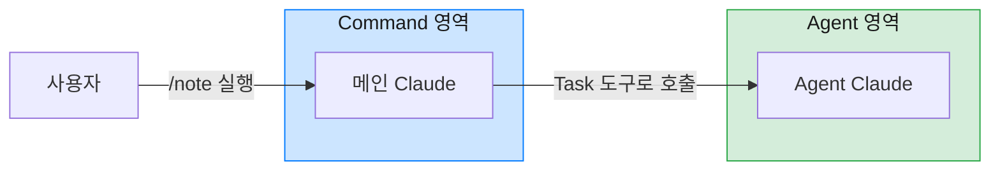
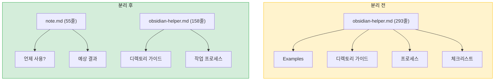

Claude Code를 사용하면서 Obsidian vault에 노트를 저장하는 Agent를 만들었다. 문제는 매번 호출하는 방식이었다.

```
// 분리 전: Agent 직접 호출
"obsidian-helper agent를 활용해서 이 내용을 vault에 저장해줘"

// 분리 후: 슬래시 명령어
/note 이 내용을 vault에 저장해줘
```

[everything-claude-code](https://github.com/affaan-m/everything-claude-code)를 알게 된 후 `/resume`, `/clear`처럼 슬래시 명령어를 직접 만들 수 있다는 걸 알게 됐다. 그래서 `/note`라는 명령어를 만들어봤다.

그런데 기존 Agent 파일을 그대로 Command로 옮기려니 구조가 어색했다. 사용 예시, 디렉토리 분류 가이드, Frontmatter 형식, 체크리스트까지 293줄이나 되는 파일이었기 때문이다. everything-claude-code의 `commands/`와 `agents/` 폴더를 비교해보니 둘의 역할이 다르다는 걸 깨달았고, 결국 하나의 파일을 Command와 Agent로 분리하기로 했다.

---

## Command와 Agent의 차이

Command와 Agent는 비슷해 보이지만 목적이 다르다.



### Command: 무엇을, 언제, 왜

Command는 `/note` 같은 슬래시 명령어를 정의한다. 명령어가 무엇을 하는지, 언제 사용해야 하는지, 어떤 결과를 기대할 수 있는지를 담는다.

### Agent: 어떻게

Agent는 실제 작업을 수행하는 별도의 Claude 인스턴스다. Task 도구를 통해 호출되며, 구체적인 작업 절차와 참고 문서, 체크리스트를 포함한다.

---

## 분리 전: 모든 것이 한 파일에

분리 전 `obsidian-helper.md`는 293줄이었다. 파일 구조를 보면 문제점이 보인다.

```yaml
---
name: obsidian-helper
description: "Use this agent when you need to create..."

Examples:
<example>
Context: User provides content to save in the vault
user: "Save this JPA N+1 problem explanation to my vault"
assistant: "I'll use the Task tool to launch the obsidian-helper agent..."
</example>
---

# Claude Obsidian Helper

당신은 사용자의 Obsidian vault를 관리하는 전문 어시스턴트입니다...

## 디렉토리 분류 가이드
...

## 문서 생성 프로세스
...

## 체크리스트
...
```

한 파일에 서로 다른 성격의 내용이 섞여 있었다. description의 Examples는 "언제 호출할지"를 판단하는 데 쓰이고, 본문의 디렉토리 가이드와 프로세스는 "어떻게 작업할지"를 정의한다. 이미 호출된 Agent에게 "언제 호출해야 하는지" 설명하는 건 불필요한 정보다.

---

## 분리 후: 역할에 따른 분리

### Command 파일 (55줄)

```markdown
---
description: Obsidian vault에 노트를 저장합니다. 내용 분석, 디렉토리 결정, Frontmatter/태그 설정까지 자동 처리.
---

# Note Command

이 명령어는 **obsidian-helper** agent를 호출하여 Obsidian vault에 노트를 생성합니다.

## What This Command Does

1. 내용 분석 및 주제/성격 파악
2. MOC 기반 적절한 디렉토리 결정
3. 태그 가이드에 따른 태그 선정
4. Frontmatter 작성 (builds on, relates to 포함)
5. 마크다운 파일 생성

## When to Use

Use `/note` when:
- 학습 내용을 vault에 저장할 때
- 기술 면접 질문/답변을 정리할 때
- 인용구를 기록할 때
- 코딩테스트 풀이를 저장할 때

## Example Usage

User: /note JPA N+1 문제가 무엇이고 어떻게 해결하나요?

Agent (obsidian-helper):
📁 저장 완료
- 경로: 50. Resources/공부/코딩/CS/.../JPA N+1 문제가 무엇이고 어떻게 해결하나요?.md
- 태그: #주제/백엔드/JPA #종류/질문 #상태/완료
```
{: file="~/.claude/commands/note.md" }

Command 파일은 명령어의 개요를 담는다. 무엇을 하는지, 언제 사용하는지, 어떤 결과가 나오는지를 간결하게 정리한다.

### Agent 파일 (158줄)

```markdown
---
name: obsidian-helper
description: Obsidian vault에 노트를 생성하는 전문 에이전트. 디렉토리 분류, Frontmatter, 태그, 문서 관계 설정을 담당.
tools: Read, Write, Glob, Grep
model: opus
---

# Obsidian Helper Agent

당신은 Obsidian vault를 관리하는 전문 어시스턴트입니다.

## 참고 문서

작업 전 반드시 다음 문서들을 참고하세요:
- **[[CLAUDE]]**: 볼트 구조, 메타데이터 형식, 태그 시스템
- **[[🏷️ 태그 가이드 (Tag Guide)]]**: 태그 사용 규칙 및 카테고리
- **[[MOC]]**: Vault의 상세한 디렉토리 구조와 문서 배치 가이드

## 디렉토리 분류 가이드

| 콘텐츠 유형       | 경로                                               |
| ----------------- | -------------------------------------------------- |
| 기술 면접/CS 지식 | `50. Resources/공부/코딩/CS/`                      |
| 코딩테스트 개념   | `50. Resources/공부/코딩테스트/01. 알고리즘 유형/` |
| 인용구            | `50. Resources/인용/`                              |

## 문서 생성 프로세스

1. **내용 분석**: 문서의 주제, 성격, 출처 파악
2. **참고 문서 확인**: CLAUDE.md, 태그 가이드, MOC 확인
3. **디렉토리 결정**: MOC 참고하여 적절한 디렉토리 선택
...

## 체크리스트

파일 생성 전 확인:
- 300줄 이상이면 분할 검토했는가?
- 새 디렉토리에 같은 이름의 노트를 생성했는가?
- `builds on`과 `relates to`를 올바르게 구분했는가?
```
{: file="~/.claude/agents/obsidian-helper.md" }

Agent 파일은 실제 작업 수행에 필요한 모든 것을 담는다. 사용 가능한 도구, 작업 절차, 실수 방지를 위한 체크리스트까지.

---

## 분리의 효과

### 1. 파일 크기 변화

| 구분 | 분리 전 | 분리 후 |
|------|---------|---------|
| 전체 | 293줄 (1개 파일) | 213줄 (2개 파일) |
| Command | - | 55줄 |
| Agent | - | 158줄 |

전체 줄 수도 줄었다. description에 넣었던 긴 Examples가 Command 파일의 간결한 예시로 대체됐기 때문이다.

### 2. 역할 분리로 인한 명확성

분리 후에는 각 파일의 목적이 명확해졌다.



### 3. 유지보수 용이성

변경이 필요할 때 어디를 수정해야 하는지 바로 알 수 있다.

- 사용 예시나 설명 수정 → Command 파일
- 디렉토리 구조나 태그 규칙 변경 → Agent 파일
- 새로운 콘텐츠 유형 추가 → Agent 파일

### 4. 재사용성

Agent는 여러 Command에서 호출할 수 있다. 예를 들어 나중에 `/quick-note` 같은 간소화된 명령어를 만들어도 같은 `obsidian-helper` Agent를 재사용할 수 있다.

```markdown
---
description: 빠르게 메모를 저장합니다. 태그와 관계 설정을 최소화.
---

# Quick Note Command

이 명령어는 **obsidian-helper** agent를 간소화 모드로 호출합니다.
```

---

## 분리 기준 정리

언제 Command와 Agent를 분리해야 할까? 다음 기준으로 판단하면 된다.

### 분리가 필요한 경우

- Agent 파일에 "언제 호출해야 하는지" 설명이 있다
- description이 여러 줄의 Examples를 포함한다
- 호출 조건 설명과 작업 지시가 한 파일에 섞여 있다

### 분리하지 않아도 되는 경우

- 단순한 작업을 수행하는 Agent
- 특정 상황에서만 사용되는 일회성 Agent
- description이 한두 줄로 충분한 경우

---

## 마무리

Command와 Agent를 분리하면서 각 파일의 목적이 명확해졌다. Command는 "무엇을, 언제, 왜"를, Agent는 "어떻게"를 담당한다.

처음에는 한 파일에 모든 것을 넣는 게 간단해 보였다. 하지만 문서가 길어지면서 수정할 때마다 전체를 훑어봐야 했다. 분리 후에는 수정이 필요한 파일이 바로 보인다. 사용 예시를 바꾸고 싶으면 Command, 작업 규칙을 바꾸고 싶으면 Agent. 전체 구조가 단순해지고 유지보수도 쉬워졌다.

Claude Code에서 Agent를 만들어 사용하고 있다면 Command/Agent 분리를 고려해볼 만하다.
