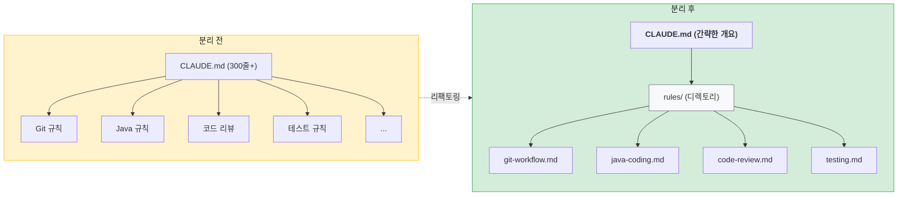

Claude Code를 사용하면서 개인 코딩 규칙을 `CLAUDE.md`에 정리해왔다. Git 브랜치 네이밍, Java 코딩 스타일, 코드 리뷰 체크리스트, 테스트 작성 규칙 등. 처음에는 한 파일에 모아두는 게 편했는데, 어느새 300줄이 넘어가더니 수정할 때마다 스크롤을 왔다갔다해야 했다.

"Java 규칙만 잠깐 비활성화하고 싶은데..."라는 생각이 들 때마다 난감했다. 파일 전체를 주석 처리할 수도 없고, 특정 섹션만 빼기도 어색했다. 그러다 Claude Code의 `rules/` 기능을 발견했고, 결국 모든 규칙을 주제별로 분리하기로 했다.

---

## rules란 무엇인가

`rules`는 `~/.claude/rules/` 디렉토리에 있는 `.md` 파일들이다. 각 파일이 하나의 규칙 세트로 작동하며, Claude Code가 세션을 시작할 때 자동으로 읽어들인다.

```
~/.claude/
├── CLAUDE.md           # 간소화된 메인 설정
└── rules/              # 주제별 규칙 파일
    ├── git-workflow.md
    ├── java-coding.md
    ├── code-review.md
    └── ...
```

### 기존 방식의 문제

모든 규칙이 `CLAUDE.md` 한 파일에 있으니 몇 가지 불편함이 있었다.

| 상황 | 문제 |
|------|------|
| 특정 규칙 수정 | 300줄 넘는 파일에서 해당 섹션 찾기 |
| 규칙 비활성화 | 섹션 전체를 주석 처리해야 함 |
| 새 규칙 추가 | 어디에 넣을지 고민, 파일이 계속 길어짐 |
| 가독성 | 스크롤이 너무 길어서 전체 구조 파악이 어려움 |

### rules로 분리하면



- 각 규칙 파일이 독립적으로 관리됨
- 파일명만 변경하면 규칙 비활성화 가능
- 수정할 때 해당 파일만 열면 됨

---

## 분리한 규칙 파일들

기존 `CLAUDE.md`에 있던 내용을 7개 파일로 나눴다.

| 파일                | 내용                                   |
| ----------------- | ------------------------------------ |
| `git-workflow.md` | 브랜치 네이밍, 커밋/푸시 규칙                    |
| `java-coding.md`  | Lombok 사용, Record, 생성자 주입, 트랜잭션 등    |
| `code-review.md`  | Java 코드 리뷰 체크리스트                     |
| `plan-mode.md`    | Plan 모드 작업 프로세스 (교차검증 → 체크리스트 → 승인)  |
| `testing.md`      | 테스트 케이스 유형 및 제안 형식                   |
| `decisions.md`    | DECISIONS.md 기록 규칙                   |
| `obsidian.md`     | Obsidian 문서 작성 규칙 (체크박스, relates to) |

각 파일의 상세 내용은 프로젝트 성격에 맞게 작성하면 된다. 핵심은 "한 파일 = 한 주제"로 분리하는 것이다.

---

## CLAUDE.md 변경 사항

세부 규칙을 모두 옮기고 나니 `CLAUDE.md`가 간결해졌다.

### 변경 전 (300줄+)

```markdown
# 개인 코딩 규칙

## Git 규칙

### 브랜치 네이밍
{type}-{description}-{author}-{yyyymmdd}
Type: feature, bugfix, hotfix...

### 커밋/푸시 규칙
- 커밋: 자유롭게
- 푸시: 명시적 요청 시만
...

## Java 코딩 규칙

### Lombok
...
(수십 줄 계속)
```

### 변경 후 (20줄)

```markdown
# 개인 코딩 규칙

이 파일은 모든 프로젝트에 적용되는 개인 코딩 규칙입니다.

세부 규칙은 ~/.claude/rules/ 디렉토리의 파일들을 참조하세요:
- git-workflow.md: Git 브랜치/커밋/푸시 규칙
- java-coding.md: Lombok, Record, DTO 등 Java 코딩 규칙
- code-review.md: 코드 리뷰 체크리스트
- plan-mode.md: Plan Mode 작업 프로세스
- testing.md: 테스트 케이스 유형 및 제안 형식
- decisions.md: DECISIONS.md 기록 방법
- obsidian.md: Obsidian 문서 작성 규칙
```
{: file="~/.claude/CLAUDE.md" }

이제 `CLAUDE.md`는 목차 역할만 하고, 실제 규칙은 각 파일에서 관리한다.

---

## Dropbox와 심볼릭 링크로 여러 기기 동기화

규칙을 분리하고 나니 "다른 맥북에서도 같은 규칙을 쓰고 싶다"는 생각이 들었다. Dropbox와 심볼릭 링크를 조합하면 가능하다.

### 구조

```
[원본: Dropbox에 저장]
~/Dropbox/dev/dotfiles/claude/
├── CLAUDE.md
├── rules/
│   ├── git-workflow.md
│   ├── java-coding.md
│   └── ...
├── settings.json
├── commands/
└── skills/

[심볼릭 링크: 실제 사용 위치]
~/.claude/CLAUDE.md → ~/Dropbox/dev/dotfiles/claude/CLAUDE.md
~/.claude/rules/ → ~/Dropbox/dev/dotfiles/claude/rules/
~/.claude/settings.json → ~/Dropbox/dev/dotfiles/claude/settings.json
```

### 심볼릭 링크 생성

```bash
# CLAUDE.md
ln -s "$HOME/Dropbox/dev/dotfiles/claude/CLAUDE.md" ~/.claude/CLAUDE.md

# rules 디렉토리
ln -s "$HOME/Dropbox/dev/dotfiles/claude/rules" ~/.claude/rules

# settings.json
ln -s "$HOME/Dropbox/dev/dotfiles/claude/settings.json" ~/.claude/settings.json

# commands, skills 등
ln -s "$HOME/Dropbox/dev/dotfiles/claude/commands" ~/.claude/commands
ln -s "$HOME/Dropbox/dev/dotfiles/claude/skills" ~/.claude/skills
```

### 왜 이렇게 하는가

| 장점 | 설명 |
|------|------|
| 여러 기기 동기화 | Dropbox가 자동으로 동기화. 회사 맥북, 집 데스크톱 모두 같은 규칙 사용 |
| 버전 관리 | Dropbox 파일 히스토리로 이전 버전 복구 가능. 실수로 규칙 삭제해도 복원 |
| 백업 | 클라우드 백업으로 설정 손실 방지. 새 기기에서 심볼릭 링크만 다시 생성하면 됨 |

새 맥북을 세팅할 때는 Dropbox 설치 후 심볼릭 링크만 생성하면 기존 규칙이 그대로 적용된다.

---

## 규칙 활성화/비활성화

분리된 규칙의 가장 큰 장점은 선택적 활성화다.

### 확장자 변경 방식

```bash
# 비활성화: .md → .md.disabled
mv ~/.claude/rules/java-coding.md ~/.claude/rules/java-coding.md.disabled

# 다시 활성화
mv ~/.claude/rules/java-coding.md.disabled ~/.claude/rules/java-coding.md
```

Claude Code는 `.md` 확장자만 인식하므로, 확장자를 바꾸면 해당 규칙이 무시된다.

### 언더스코어 방식

```bash
# 임시 비활성화
mv ~/.claude/rules/obsidian.md ~/.claude/rules/_obsidian.md

# 다시 활성화
mv ~/.claude/rules/_obsidian.md ~/.claude/rules/obsidian.md
```

파일명 앞에 `_`를 붙이는 방식도 동작한다. 확장자는 그대로 유지되므로 에디터에서 내용 확인이 편하다.

---

## 규칙 파일 작성 팁

### 파일명은 명확하게

파일명만 봐도 어떤 규칙인지 알 수 있어야 한다.

```
# 좋은 예
git-workflow.md
java-coding.md
typescript-style.md

# 애매한 예
rules1.md
my-rules.md
misc.md
```

### 섹션 구분을 명확히

한 파일 안에서도 `##`, `###`로 계층 구조를 만들면 Claude가 맥락을 더 잘 이해한다.

```markdown
# Java Coding Rules

## Lombok 사용
(내용)

## 도메인 모델
(내용)

## DTO/Form
(내용)
```

### 예시를 포함

규칙만 나열하면 Claude가 적용 방법을 헷갈릴 수 있다. 잘못된 예시와 올바른 예시를 함께 제공하면 정확도가 올라간다.

```markdown
## 에러 메시지 규칙

// 잘못된 예
throw new RuntimeException("입력값이 올바르지 않습니다.");

// 올바른 예
throw new BusinessException(ErrorMessages.INVALID_INPUT);
```

---

## 분리 기준

어떤 규칙을 하나의 파일로 묶을지 고민된다면 다음 기준을 참고하자.

### 독립성

다른 규칙과 독립적으로 활성화/비활성화할 수 있는 단위로 분리한다.

```
git-workflow.md ← Git 안 쓰는 프로젝트에서 비활성화
java-coding.md  ← Python 프로젝트에서 비활성화
obsidian.md     ← Obsidian 안 쓸 때 비활성화
```

### 관련성

하나의 주제로 묶을 수 있으면 같은 파일에 둔다.

```markdown
# java-coding.md
- Lombok 규칙
- Record 규칙
- DTO/Form 규칙
- 트랜잭션 규칙
→ 전부 Java 관련이므로 한 파일에
```

### 수정 빈도

자주 수정하는 규칙은 별도 파일로 분리하면 관리가 편하다. 프로젝트마다 달라지는 테스트 규칙 같은 경우가 좋은 예시다.

---

## 프로젝트별 rules 적용

`~/.claude/rules/`는 모든 프로젝트에 적용되는 글로벌 규칙이다. 그런데 특정 프로젝트에만 적용되는 규칙도 있다. 예를 들어 회사 프로젝트의 아키텍처 규칙, 특정 프레임워크 사용법 등은 다른 프로젝트에서는 필요 없다.

이런 경우 프로젝트 루트에 `rules/` 디렉토리를 만들면 된다.

### 프로젝트 rules 디렉토리 구조

```
my-project/
├── CLAUDE.md           # 프로젝트 개요
├── rules/              # 프로젝트 전용 규칙
│   ├── architecture.md
│   ├── rendering.md
│   └── ...
└── src/
```

### 실제 적용 사례

회사 프로젝트 중 하나는 380줄이던 `CLAUDE.md`를 7개의 규칙 파일로 분리했다.

| 파일 | 내용 |
|------|------|
| `architecture.md` | 모듈 역할 분리, URL 설계 규칙 |
| `rendering.md` | 타임리프 렌더링, 프론트엔드 규칙, Toast Grid |
| `soft-delete.md` | Soft Delete 규칙 |
| `coding-convention.md` | ErrorMessages, 암호화, Enum, 날짜 포맷, 클래스 명명 |
| `permission.md` | 예외 처리, 메뉴 권한 등록 |
| `dev-caution.md` | 개발 시 주의사항 (멀티 테넌트, 파일 업로드 등) |
| `pr-message.md` | PR 메시지 형식 |

글로벌 규칙과 마찬가지로 파일명만 변경하면 비활성화할 수 있고, 수정할 때 해당 파일만 열면 된다.

### 글로벌 vs 프로젝트 rules

| 구분   | 위치                 | 적용 범위    |
| ---- | ------------------ | -------- |
| 글로벌  | `~/.claude/rules/` | 모든 프로젝트  |
| 프로젝트 | `프로젝트/rules/`      | 해당 프로젝트만 |

두 위치에 같은 이름의 규칙이 있으면 둘 다 적용된다. 충돌이 걱정되면 파일명을 다르게 하거나 프로젝트 규칙에서 글로벌 규칙을 덮어쓰는 내용을 명시하면 된다.

---

## 마무리

`rules/` 디렉토리로 규칙을 분리하고 나니 몇 가지가 달라졌다.

첫째, 수정이 빨라졌다. Java 규칙을 고치려면 `java-coding.md`만 열면 된다. 300줄짜리 파일에서 해당 섹션을 찾을 필요가 없다.

둘째, 선택적 적용이 가능해졌다. Python 프로젝트에서는 `java-coding.md`를 비활성화하고, 개인 프로젝트에서는 엄격한 `code-review.md`를 끌 수 있다.

셋째, 여러 기기에서 같은 규칙을 쓸 수 있게 됐다. Dropbox 동기화로 회사 맥북과 집 맥북 모두 동일한 설정이 적용된다.

처음에는 "파일이 여러 개로 나뉘면 관리가 더 복잡해지지 않을까?" 걱정했는데, 오히려 반대였다. 각 파일의 목적이 명확해지니 어디를 수정해야 할지 바로 보인다.

Claude Code를 자주 사용하면서 `CLAUDE.md`가 점점 길어지고 있다면, `rules/` 분리를 고려해볼 만하다.