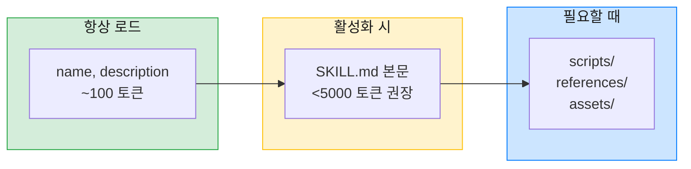

Claude Code에서 `/commit`, `/review` 같은 슬래시 명령어를 만들어 쓰다 보면 `commands/` 폴더에 `.md` 파일을 넣는 방식에 익숙해진다. 그런데 공식 문서를 다시 확인해보니 이런 문장이 있었다.

> "Claude Code의 이전 버전에서는 슬래시 명령어 호출이 별도의 `SlashCommand` 도구에서 제공되었습니다. 이는 `Skill` 도구로 병합되었습니다."
> — [Claude Code 공식 문서](https://code.claude.com/docs/ko/slash-commands)

SlashCommand 도구가 Skill 도구로 병합되었다고 한다. 그래서 Skill이 뭔지, 왜 권장되는지 공식 문서를 기반으로 정리해봤다.

---

## Skill이란?

> "Skills are folders of instructions, scripts, and resources that Claude loads dynamically to improve performance on specialized tasks."
> — [Anthropic Skills Repository](https://github.com/anthropics/skills)

Skill은 Claude가 **특화된 작업의 성능을 향상시키기 위해 동적으로 로드하는 지침, 스크립트, 리소스의 폴더**다. 단순히 프롬프트를 확장하는 것을 넘어서, 필요한 스크립트와 참고 자료까지 포함할 수 있는 패키지 형태다.

### Skill로 할 수 있는 것들

- 회사의 브랜드 가이드라인을 따르는 문서 작성
- 조직의 특정 워크플로우를 사용한 데이터 분석
- PDF 생성, 편집, 병합 등 문서 작업
- 반복적인 개인 작업 자동화

Anthropic이 공식 제공하는 [Skills Repository](https://github.com/anthropics/skills)에는 PDF, Excel, PowerPoint 등 문서 작업을 위한 Skill들이 있다.

---

## Command와 Skill의 관계

공식 문서의 정확한 표현은 이렇다.

> "`.claude/commands/review.md`의 파일과 `.claude/skills/review/SKILL.md`의 기술 모두 `/review`를 생성하고 동일한 방식으로 작동합니다."
> — [Claude Code 공식 문서](https://code.claude.com/docs/ko/skills)

**둘 다 `/review`를 만들고 동일하게 작동한다.** 기존 Command 파일은 계속 작동하지만, 새로 만든다면 Skill이 권장된다.

### 차이점

| | Command | Skill |
|---|---------|-------|
| 형태 | 단일 `.md` 파일 | 폴더 패키지 |
| 위치 | `commands/review.md` | `skills/review/SKILL.md` |
| 추가 파일 | 불가 | scripts/, references/, assets/ |
| Progressive Disclosure | X | O |
| 공식 권장 | 레거시 | **권장** |

가장 큰 차이는 **추가 파일 지원**과 **Progressive Disclosure**다.

---

## Skill의 폴더 구조

[Agent Skills Specification](https://agentskills.io/specification)에 정의된 공식 구조를 따른다.

```
my-skill/
├── SKILL.md           ← 필수: 지침
├── scripts/           ← 선택: 실행 가능한 스크립트
├── references/        ← 선택: 추가 문서
└── assets/            ← 선택: 템플릿, 이미지, 데이터 파일
```

### 최소 구조

```
my-skill/
└── SKILL.md
```

SKILL.md 하나만 있어도 된다. 이 경우 Command와 사실상 같다. 추가 파일이 필요할 때 폴더 구조의 장점이 드러난다.

### 각 폴더의 역할

**scripts/**: 실행 가능한 코드. Python, Bash, JavaScript 등.

```
scripts/
├── extract.py         # PDF에서 텍스트 추출
└── merge.py           # 여러 PDF 병합
```

**references/**: 추가 문서. 상세한 레퍼런스, 양식 정의 등.

```
references/
├── REFERENCE.md       # 상세 기술 문서
└── FORMS.md           # 양식 정의
```

**assets/**: 정적 리소스. 템플릿, 이미지, 데이터 파일 등.

```
assets/
├── template.docx      # 문서 템플릿
└── schema.json        # 데이터 스키마
```

---

## SKILL.md 구조

SKILL.md는 YAML frontmatter와 마크다운 본문으로 구성된다.

```yaml
---
name: pdf-processing
description: Extract text and tables from PDF files, fill PDF forms, merge documents. Use when working with PDF documents.
license: Apache-2.0
compatibility: Requires poppler-utils for PDF operations
allowed-tools: Bash Read Write
metadata:
  author: my-org
  version: "1.0"
---

# PDF Processing

[마크다운 지침 내용]

## Quick Start
...

## Common Tasks
...
```

### Frontmatter 필드

| 필드 | 필수 | 제약 | 설명 |
|------|:----:|------|------|
| `name` | O | 1-64자, 소문자+하이픈 | 폴더명과 일치해야 함 |
| `description` | O | 1-1024자 | 기능과 사용 시점 설명 |
| `license` | - | - | 라이선스 명시 |
| `compatibility` | - | 1-500자 | 환경 요구사항 |
| `allowed-tools` | - | 공백 구분 | 사전 승인 도구 목록 |
| `metadata` | - | key-value | 추가 메타데이터 |

### name 필드 규칙

- 소문자, 숫자, 하이픈만 허용
- 하이픈으로 시작/끝 불가
- 연속 하이픈 불가
- **폴더명과 일치해야 함**

```yaml
# 올바른 예
name: pdf-processing      # skills/pdf-processing/
name: code-review         # skills/code-review/

# 잘못된 예
name: PDF-Processing      # 대문자 불가
name: -pdf                # 하이픈으로 시작 불가
name: pdf--processing     # 연속 하이픈 불가
```

### description 필드 작성법

**잘 쓴 예:**

```yaml
description: Extract text and tables from PDF files, fill PDF forms, merge documents. Use when working with PDF documents or when the user mentions PDFs, forms, or document extraction.
```

기능(무엇을 하는지)과 트리거(언제 사용하는지)를 모두 포함한다.

**못 쓴 예:**

```yaml
description: Helps with PDFs.
```

이러면 Claude가 언제 이 Skill을 활성화해야 하는지 판단하기 어렵다.

---

## Progressive Disclosure

Skill의 가장 큰 장점은 **컨텍스트를 효율적으로 사용**한다는 점이다.



| 단계 | 로딩 시점 | 내용 | 권장 크기 |
|------|----------|------|----------|
| 1 | 항상 | `name`, `description` | ~100 토큰 |
| 2 | Skill 활성화 시 | SKILL.md 본문 | <5000 토큰 |
| 3 | 필요할 때 | scripts/, references/, assets/ | 가변 |

Claude는 모든 Skill의 메타데이터를 읽어서 어떤 Skill이 있는지 파악한다. 사용자가 `/skill-name`을 호출하거나 관련 작업을 요청하면 그때 본문을 로드한다. 작업 중 추가 자료가 필요하면 그때 해당 파일만 읽는다.

### 권장 사항

- **SKILL.md는 500줄 이하**로 유지
- 상세한 내용은 `references/`로 분리
- 파일 참조는 한 단계만 (깊은 체이닝 피하기)

```markdown
<!-- 좋은 예: 한 단계 참조 -->
상세 내용은 [레퍼런스](references/REFERENCE.md)를 참고하세요.

<!-- 피해야 할 예: 깊은 체이닝 -->
references/REFERENCE.md → references/details/more.md → ...
```

---

## Skill 활용 예시

### 예시 1: PDF 처리 Skill

Anthropic 공식 레포의 PDF Skill 구조:

```
skills/pdf/
├── SKILL.md           # 기본 지침, 빠른 시작
├── references/
│   ├── REFERENCE.md   # 상세 기술 문서
│   └── FORMS.md       # PDF 폼 작업 가이드
└── LICENSE.txt
```

SKILL.md에는 자주 쓰는 작업의 빠른 가이드가 있고, 복잡한 작업은 references/로 분리되어 있다.

### 예시 2: 코딩 표준 Skill

```
skills/coding-standards/
├── SKILL.md           # TypeScript/React 기본 규칙
└── references/
    ├── typescript.md  # TS 상세 규칙
    └── react.md       # React 패턴
```

기본 규칙은 SKILL.md에, 언어별 상세 규칙은 references/에 분리.

---

## Skill vs Agent

Skill과 Agent는 다른 개념이다.

| | Skill | Agent |
|---|-------|-------|
| 호출 방식 | `/skill-name` 또는 자동 활성화 | Task tool로 호출 |
| 실행 주체 | 메인 Claude | 별도 Claude 인스턴스 |
| 역할 | 워크플로우 트리거, 지침 제공 | 독립적인 작업 수행 |
| 형태 | 폴더 패키지 | 단일 `.md` 파일 |

Skill은 "무엇을, 언제, 왜" 하는지를 정의하고, Agent는 "어떻게" 하는지를 정의한다. 복잡한 작업에서는 Skill이 Agent를 호출하는 구조도 가능하다.

```
/note 실행
    ↓
commands/note.md (또는 skills/note/SKILL.md) 로드
    ↓
"obsidian-helper agent를 호출하라" 지시 확인
    ↓
Task tool로 agents/obsidian-helper.md 호출
```

---

## 실제로 Skill 만들기

### 1. 폴더 생성

```bash
mkdir -p ~/.claude/skills/my-skill
```

### 2. SKILL.md 작성

```yaml
---
name: my-skill
description: 내 작업을 자동화합니다. 특정 상황에서 사용하세요.
---

# My Skill

## 개요
...

## 사용법
...
```

### 3. 추가 파일 (필요시)

```bash
mkdir -p ~/.claude/skills/my-skill/scripts
mkdir -p ~/.claude/skills/my-skill/references
```

### 4. 테스트

```
/my-skill
```

---

## Context Budget 주의

Skill의 description은 항상 컨텍스트에 로드된다. Skill이 많으면 컨텍스트를 초과할 수 있다.

```bash
# 현재 상태 확인
/context
```

기본 한도는 15,000자다. 초과하면 일부 Skill이 제외된다. 환경변수로 조정 가능:

```bash
export SLASH_COMMAND_TOOL_CHAR_BUDGET=20000
```

---

## 마무리

정리하면:

- **Command = Skill** (기능적으로 동일, Skill이 권장)
- **Skill의 장점**: 추가 파일 지원, Progressive Disclosure
- **폴더 구조**: SKILL.md 필수, scripts/references/assets/ 선택
- **SKILL.md**: name과 description 필수, 본문은 500줄 이하 권장

기존 Command 파일은 그대로 써도 되지만, 새로 만들거나 추가 파일이 필요하다면 Skill 형식을 고려해볼 만하다.

---

## 참고 자료

- [Agent Skills Specification](https://agentskills.io/specification) - 공식 스펙
- [Anthropic Skills Repository](https://github.com/anthropics/skills) - 공식 Skill 예제
- [Claude Code 슬래시 명령어](https://code.claude.com/docs/ko/slash-commands) - Claude Code 슬래시 명령어 문서
- [Claude Code 기술](https://code.claude.com/docs/ko/skills) - Claude Code Skills 문서
