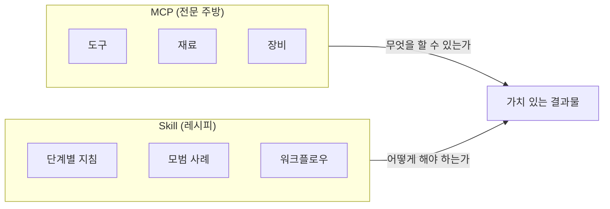

Anthropic에서 Claude Skill에 대한 공식 가이드 문서를 [공개](https://claude.com/blog/complete-guide-to-building-skills-for-claude)했습니다. 이 글에서는 해당 문서의 핵심 내용을 정리하여 Skill의 개념부터 제작, 테스트, 트러블슈팅까지 다루고자 합니다.

### 1. Skill이란 무엇인가 (p.3, p.5)

#### [ Skill의 정의 ]

**Skill**은 Claude에게 특정 작업이나 워크플로우를 처리하는 방법을 알려주는 지침 세트로, 간단한 폴더 형태로 패키징됩니다.

매 대화마다 선호 사항, 프로세스, 도메인 전문 지식을 다시 설명하는 대신, Skill을 통해 Claude를 한 번만 가르치면 매번 그 혜택을 누릴 수 있습니다. Skill은 다음과 같은 반복적인 워크플로우가 있을 때 특히 강력합니다:

- 사양서(spec)를 바탕으로 프론트엔드 디자인 생성
- 일관된 방법론에 따른 리서치 수행
- 팀의 스타일 가이드를 따르는 문서 작성
- 다단계 프로세스 조율

#### [ 핵심 설계 원칙 ] (p.5)

Skill은 세 가지 핵심 설계 원칙을 따릅니다.

**점진적 공개(Progressive Disclosure)**

Skill은 3단계 시스템을 사용합니다:

| 단계 | 로드 시점 | 내용 |
|------|----------|------|
| 1단계 (YAML 프런트매터) | 항상 시스템 프롬프트에 로드 | Claude가 언제 사용할지 판단할 정보 |
| 2단계 (SKILL.md 본문) | 관련 있다고 판단할 때 | 전체 지침과 가이드 |
| 3단계 (연결된 파일) | 필요할 때만 선택적으로 | 추가 문서, 스크립트, 템플릿 |

이러한 점진적 공개 방식은 전문적인 지식을 유지하면서도 토큰 사용량을 최소화합니다.

**결합성(Composability)**

Claude는 여러 Skill을 동시에 로드할 수 있습니다. Skill은 자신이 유일하게 사용 가능한 기능이라고 가정하지 말고, 다른 Skill들과 함께 잘 작동하도록 설계되어야 합니다.

**이식성(Portability)**

Skill은 Claude.ai, Claude Code, API에서 동일하게 작동합니다. 한 번 만든 Skill은 환경이 필요한 의존성을 지원하는 한 모든 곳에서 사용할 수 있습니다.

#### [ MCP와의 관계 - 주방 비유 ] (p.5)

MCP(Model Context Protocol)와 Skill의 관계를 주방에 비유하면 이해하기 쉽습니다:



| 구분 | MCP (연결성) | Skill (지식) |
|------|-------------------|-------------------|
| 역할 | Claude를 서비스에 연결 | Claude가 서비스를 효과적으로 사용하도록 교육 |
| 제공 | 실시간 데이터 접근과 도구 호출 | 워크플로우와 모범 사례 |
| 관점 | Claude가 무엇을 할 수 있는가 | Claude가 어떻게 해야 하는가 |

Skill이 없으면 사용자가 MCP를 연결해도 다음 단계를 모르고, 매 대화가 처음부터 시작되며, 사용자마다 다른 프롬프트로 일관성 없는 결과가 나옵니다. Skill이 있으면 사전 구축된 워크플로우가 자동으로 활성화되고, 일관되고 신뢰할 수 있는 도구 사용이 가능하며, 모범 사례가 모든 상호작용에 내장됩니다.

### 2. Skill의 기술적 구조 (p.10-11)

#### [ 파일 구조 ] (p.10)

Skill은 다음과 같은 폴더 구조를 가집니다:

```
스킬-이름/
├── SKILL.md             # 필수: 메인 스킬 파일
├── scripts/             # 선택: 실행 가능한 코드
│   ├── process_data.py
│   └── validate.sh
├── references/          # 선택: 문서
│   ├── api-guide.md
│   └── examples/
└── assets/              # 선택: 템플릿 등
    └── report-template.md
```

**필수 규칙:**

| 항목 | 규칙 |
|------|------|
| SKILL.md 파일명 | 정확히 `SKILL.md` (대소문자 구분) |
| 폴더 이름 | kebab-case 사용 (`notion-project-setup`) |
| README.md | 스킬 폴더 안에 포함 금지 |

> 스킬 폴더 이름에 공백, 언더스코어, 대문자는 사용할 수 없습니다.
{: .prompt-warning }

#### [ YAML 프런트매터 ] (p.10-11)

YAML 프런트매터는 Claude가 Skill 로드 여부를 결정하는 기준입니다. 최소 필수 형식은 다음과 같습니다:

```yaml
---
name: 스킬-이름
description: 스킬이 하는 일. 사용자가 [특정 문구]를 요청할 때 사용하세요.
---
```

**필드 요구 사항:**

| 필드 | 필수 여부 | 규칙 |
|------|----------|------|
| `name` | 필수 | kebab-case, 폴더 이름과 일치 |
| `description` | 필수 | 무엇을 하는지 + 언제 사용하는지, 1024자 미만 |
| `license` | 선택 | 오픈 소스 시 사용 (MIT, Apache-2.0 등) |
| `compatibility` | 선택 | 환경 요구 사항 (1-500자) |
| `metadata` | 선택 | author, version, mcp-server 등 |

**보안 제한 사항:**

프런트매터에서 다음은 금지됩니다:

- XML 꺾쇠 괄호 (`<`, `>`)
- 이름에 "claude" 또는 "anthropic" 포함 (예약어)

프런트매터는 Claude의 시스템 프롬프트에 나타나기 때문에, 악의적인 콘텐츠가 지침을 주입할 수 있어 이러한 제한이 있습니다.

#### [ description 필드 작성법 ] (p.11-12)

`description` 필드는 Skill이 로드될지 결정하는 가장 중요한 부분입니다. 구조는 다음과 같습니다:

```
[무엇을 하는지] + [언제 사용하는지] + [핵심 기능]
```

**좋은 예시:**

```yaml
# 구체적이고 실행 가능
description: Figma 디자인 파일을 분석하고 개발자 핸드오프 문서를 생성합니다.
사용자가 .fig 파일을 업로드하거나 "디자인 사양", "컴포넌트 문서",
"디자인-코드 핸드오프"를 요청할 때 사용하세요.

# 트리거 문구 포함
description: 스프린트 계획, 작업 생성, 상태 추적을 포함한 Linear 프로젝트
워크플로우를 관리합니다. 사용자가 "스프린트", "Linear 작업", "프로젝트 계획"을
언급하거나 "티켓 생성"을 요청할 때 사용하세요.
```

**나쁜 예시:**

```yaml
# 너무 모호함
description: 프로젝트를 도와줍니다.

# 트리거 누락
description: 정교한 다중 페이지 문서 시스템을 생성합니다.

# 너무 기술적이며 사용자 트리거 없음
description: 계층적 관계를 가진 프로젝트 엔티티 모델을 구현합니다.
```

### 3. Skill 설계와 개발 (p.8, p.13)

#### [ 사용 사례 정의하기 ] (p.8)

코드를 작성하기 전에 2-3가지 구체적인 사용 사례를 정의해야 합니다:

```
사용 사례: 프로젝트 스프린트 계획
트리거: 사용자가 "이번 스프린트 계획 도와줘" 또는 "스프린트 작업 생성해줘"라고 말할 때
단계:
  1. Linear에서 현재 프로젝트 상태 가져오기 (MCP 통해)
  2. 팀 속도(velocity) 및 가용 용량(capacity) 분석
  3. 작업 우선순위 제안
  4. 적절한 라벨과 추정치를 포함하여 Linear에 작업 생성
결과: 작업 생성이 완료된, 완전히 계획된 스프린트
```

스스로에게 물어볼 질문들:

- 사용자가 달성하고자 하는 것은 무엇인가?
- 이를 위해 어떤 다단계 워크플로우가 필요한가?
- 어떤 도구가 필요한가? (내장 기능 또는 MCP?)
- 어떤 도메인 지식이나 모범 사례가 내장되어야 하는가?

**일반적인 Skill 사용 사례 카테고리:**

| 카테고리 | 용도 | 예시 |
|---------|------|------|
| 문서 및 자산 생성 | 일관된 고품질 산출물 생성 | frontend-design, docx, pptx 스킬 |
| 워크플로우 자동화 | 일관된 방법론의 다단계 프로세스 | skill-creator 스킬 |
| MCP 강화 | MCP가 제공하는 도구 접근에 워크플로우 안내 추가 | sentry-code-review 스킬 |

#### [ 지침 작성 모범 사례 ] (p.13)

**구체적이고 실행 가능하게:**

```markdown
# 좋음
`python scripts/validate.py --input {filename}`을 실행하여 데이터 형식을 확인하세요.
검증 실패 시 일반적인 문제:
- 필수 필드 누락 (CSV에 추가하세요)
- 잘못된 날짜 형식 (YYYY-MM-DD 사용)

# 나쁨
진행하기 전에 데이터를 검증하세요.
```

**번들 리소스를 명확히 참조:**

```markdown
쿼리를 작성하기 전에 `references/api-patterns.md`를 참고하세요:
- 속도 제한(Rate limiting) 가이드
- 페이지네이션 패턴
- 에러 코드 및 처리
```

**점진적 공개 활용:**

SKILL.md는 핵심 지침에 집중하고, 상세 문서는 `references/`로 이동하여 링크합니다.

#### [ 일반적인 스킬 패턴 ] (p.22-23)

**패턴 1: 순차적 워크플로우 오케스트레이션**

사용자가 특정 순서의 다단계 프로세스가 필요할 때 사용합니다:

```markdown
## 워크플로우: 신규 고객 온보딩

### 1단계: 계정 생성
MCP 도구 호출: `create_customer`
파라미터: name, email, company

### 2단계: 결제 설정
MCP 도구 호출: `setup_payment_method`
대기: 결제 수단 검증

### 3단계: 구독 생성
MCP 도구 호출: `create_subscription`
파라미터: plan_id, customer_id (1단계에서)

### 4단계: 환영 이메일 발송
MCP 도구 호출: `send_email`
템플릿: welcome_email_template
```

핵심 기법: 명시적 단계 순서, 단계 간 의존성, 각 단계별 검증, 실패 시 롤백 지침

**패턴 2: 다중 MCP 조율**

워크플로우가 여러 서비스에 걸쳐 있을 때 사용합니다. 예를 들어 디자인-개발 핸드오프에서 Figma MCP → Drive MCP → Linear MCP → Slack MCP 순으로 조율합니다.

**패턴 3: 반복적 개선**

출력 품질이 반복을 통해 향상될 때 사용합니다. 초안 생성 → 품질 검사 → 개선 루프 → 최종화 단계를 거칩니다.

### 4. 테스트와 반복 (p.15-17)

#### [ 테스트 접근법 ] (p.15-16)

Skill 테스트는 세 가지 영역을 다룹니다:

**1. 트리거 테스트**

Skill이 적절한 때에 로드되는지 확인합니다:

```
트리거 되어야 함:
- "새 ProjectHub 워크스페이스 설정 도와줘"
- "ProjectHub에 프로젝트 만들어야 해"
- "4분기 계획을 위한 ProjectHub 프로젝트 초기화해줘"

트리거 되면 안 됨:
- "서울 날씨 어때?"
- "Python 코드 작성 도와줘"
```

**2. 기능 테스트**

Skill이 올바른 출력을 생성하는지 검증합니다:

```
테스트: 작업 5개가 포함된 프로젝트 생성
조건: 프로젝트명 "4분기 계획", 작업 설명 5개
실행: 스킬이 워크플로우 실행
기대 결과:
  - ProjectHub에 프로젝트 생성됨
  - 올바른 속성으로 작업 5개 생성됨
  - 모든 작업이 프로젝트에 연결됨
  - API 에러 없음
```

**3. 성능 비교**

Skill이 기준선 대비 결과를 개선하는지 확인합니다:

| 지표 | Skill 없이 | Skill 있음 |
|------|-----------|-----------|
| 메시지 수 | 15번 주고받음 | 2번 질문만 |
| API 실패 | 3번 재시도 필요 | 0번 |
| 토큰 소비 | 12,000 | 6,000 |

> 가장 효과적인 Skill 제작자는 Claude가 성공할 때까지 하나의 까다로운 작업을 반복해서 테스트한 다음, 성공한 접근 방식을 Skill로 추출합니다.
{: .prompt-tip }

#### [ skill-creator 활용 ] (p.16-17)

`skill-creator` 스킬은 Claude.ai 플러그인 디렉토리 또는 Claude Code에서 사용할 수 있습니다. MCP 서버가 있고 상위 2-3개 워크플로우를 알고 있다면, 15-30분 내에 기능적인 Skill을 구축하고 테스트할 수 있습니다.

**주요 기능:**

- 자연어 설명으로 Skill 생성
- 일반적인 문제 플래그 지정 (모호한 설명, 트리거 누락, 구조적 문제)
- 잠재적인 과다/과소 트리거링 위험 식별
- Skill의 목적에 기반한 테스트 케이스 제안

사용법:

```
"skill-creator 스킬을 사용해서 [사용 사례]를 위한 스킬 만드는 걸 도와줘"
```

#### [ 피드백 기반 개선 ] (p.17)

Skill은 살아있는 문서입니다. 다음 신호에 따라 반복 개선합니다:

**과소 트리거 신호:**
- Skill이 필요할 때 로드되지 않음
- 사용자가 수동으로 활성화함
- 언제 사용해야 하는지 문의가 들어옴

→ **해결:** description에 더 많은 세부 사항과 키워드 추가

**과다 트리거 신호:**
- 관련 없는 쿼리에 Skill이 로드됨
- 사용자가 비활성화함
- 목적에 대한 혼란

→ **해결:** 부정 트리거 추가, 더 구체적으로 작성

### 5. 트러블슈팅 (p.25-27)

#### [ 스킬이 트리거되지 않을 때 ] (p.25)

**증상:** Skill이 자동으로 로드되지 않음

**퀵 체크리스트:**
- 너무 포괄적인가? ("프로젝트를 도와줌"은 작동하지 않음)
- 사용자가 실제로 말할 법한 트리거 문구가 포함되어 있는가?
- 해당되는 경우 관련 파일 유형을 언급했는가?

**디버깅 방법:**

Claude에게 물어보세요: "[스킬 이름] 스킬을 언제 사용할 거야?"

Claude가 description을 다시 인용할 것입니다. 누락된 내용을 바탕으로 조정하세요.

#### [ 스킬이 너무 자주 트리거될 때 ] (p.25-26)

**증상:** 관련 없는 쿼리에 Skill이 로드됨

**해결 방법:**

1. **부정 트리거 추가:**

```yaml
description: CSV 파일을 위한 고급 데이터 분석. 통계 모델링, 회귀,
클러스터링에 사용하세요. 단순 데이터 탐색에는 사용하지 마십시오
(대신 data-viz 스킬 사용).
```

2. **더 구체적으로 작성:**

```yaml
# 너무 광범위
description: 문서를 처리합니다.

# 더 구체적
description: 계약 검토를 위해 PDF 법률 문서를 처리합니다.
```

3. **범위 명확화:**

```yaml
description: 이커머스를 위한 PayFlow 결제 처리.
온라인 결제 워크플로우에만 구체적으로 사용하고,
일반적인 금융 문의에는 사용하지 마세요.
```

#### [ 지침을 따르지 않을 때 ] (p.26)

**증상:** Skill은 로드되지만 Claude가 지침을 따르지 않음

**일반적인 원인과 해결:**

| 원인 | 해결 |
|------|------|
| 지침이 너무 장황함 | 간결하게, 불릿 포인트와 번호 매기기 사용. 상세 참조는 별도 파일로 |
| 중요 지침이 파묻힘 | 중요한 지침은 맨 위에. `## 중요` 헤더 사용 |
| 모호한 언어 | 구체적인 체크리스트 형태로 작성 |

**모호한 언어 개선 예시:**

```markdown
# 나쁨
제대로 검증하는지 확인해.

# 좋음
필수: create_project를 호출하기 전에 반드시 다음을 확인:
- 프로젝트 이름이 비어있지 않음
- 최소 한 명의 팀원이 할당됨
- 시작 날짜가 과거가 아님
```

> 중요한 검증의 경우, 언어 지침에 의존하기보다 검사를 프로그래밍 방식으로 수행하는 스크립트를 번들로 포함하는 것을 고려하세요. 코드는 결정적(deterministic)이지만 언어 해석은 그렇지 않습니다.
{: .prompt-tip }

**대용량 컨텍스트 문제:** (p.27)

Skill이 느리거나 응답 품질이 저하되면:

1. SKILL.md 크기 최적화 (5,000단어 미만 유지)
2. 상세 문서는 `references/`로 이동
3. 동시에 20-50개 이상의 Skill이 활성화되어 있다면 선택적 활성화 권장

### 참고 자료 (p.29)

- [Claude를 위한 스킬 제작 완벽 가이드 (PDF)](https://www.anthropic.com) - Anthropic 공식 가이드
- [GitHub: anthropics/skills](https://github.com/anthropics/skills) - 공식 스킬 예제 저장소
- [MCP 문서](https://modelcontextprotocol.io) - Model Context Protocol 문서
