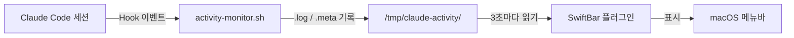

Claude Code를 쓰다 보면 자연스럽게 여러 터미널에서 동시에 세션을 띄우게 된다. 한쪽에서는 API를 만들고, 다른 쪽에서는 테스트를 돌리고, 또 다른 곳에서는 문서를 정리하는 식이다.

문제는 각 세션이 지금 뭘 하고 있는지 파악하려면 터미널을 하나하나 전환해야 한다는 것이었다. 특히 서브에이전트가 돌아가는 동안에는 화면에 아무것도 안 보이기 때문에, 끝났는지 아직 진행 중인지조차 알기 어렵다.

그래서 macOS 메뉴바에서 모든 세션의 활동을 한눈에 볼 수 있는 [모니터](https://github.com/Epikoding/claude-activity-monitor)를 만들었다.


## 전체 구조

두 개의 셸 스크립트로 구성된다.



| 파일 | 역할 |
|------|------|
| `activity-monitor.sh` | Claude Code Hook - 세션/도구 이벤트를 로그 파일에 기록 |
| `claude-activity.3s.sh` | SwiftBar 플러그인 - 로그를 읽어서 메뉴바에 시각화 |

## 1단계: Hook으로 활동 로그 수집

Claude Code에는 [Hook 시스템](https://code.claude.com/docs/ko/hooks)이 있다. 도구 사용, 세션 시작/종료 같은 이벤트가 발생할 때마다 셸 스크립트를 실행할 수 있다.

이걸 이용해서 `activity-monitor.sh`를 만들었다. 이 스크립트는 이벤트가 발생할 때마다 `/tmp/claude-activity/`에 세션별 로그를 기록한다.

### 감지하는 이벤트

| 이벤트 | 설명 |
|--------|------|
| `SessionStart` | 세션 시작 - `.meta`와 `.log` 파일 생성 |
| `PreToolUse` | 도구 사용 전 - Read, Write, Bash 등 기록 |
| `SubagentStart` | 서브에이전트 시작 |
| `SubagentStop` | 서브에이전트 완료 |
| `Stop` | 세션 종료 - `.meta` 파일 삭제 |

### 로그에 기록되는 정보

```
11:22:42 🟢 세션 시작
11:23:30 📂 [Read] ~/src/Main.java
11:23:31 🔍 [Grep] "findAll" in ~/src/
11:23:35 ✏️  [Edit] ~/src/Main.java
11:23:40 🤖 [Agent:Explore|sonnet] "기존 코드 패턴 파악"
11:23:41 🚀 [Agent:Explore] started
11:24:10 ✅ [Agent:Explore] completed
11:24:15 ⚡ [Bash] gradle build
```

### 핵심 코드

세션이 시작되면 메타 정보를 별도 파일에 저장한다. 이 메타 파일이 있으면 "활성 세션"으로 판단하고, 세션이 종료되면 삭제해서 자동으로 정리된다.

```bash
case "$EVENT" in
  "SessionStart")
    MODEL=$(echo "$INPUT" | jq -r '.model // "unknown"')
    DIR=$(get_dir_label "$CWD")
    # 세션 메타 정보 저장 (SwiftBar에서 헤더로 사용)
    echo "$TS|$MODEL|$DIR|$SID" > "$LOG_DIR/${SID}.meta"
    echo "$TS 🟢 세션 시작" >> "$LOG"
    ;;

  "Stop")
    echo "$TS 🔴 세션 종료" >> "$LOG"
    rm -f "$LOG_DIR/${SID}.meta"
    ;;
esac
```
{: file="hooks/activity-monitor.sh" }

도구 사용 이벤트는 도구 종류별로 분기하여 필요한 정보를 추출한다.

```bash
"PreToolUse")
  TOOL=$(echo "$INPUT" | jq -r '.tool_name')
  case "$TOOL" in
    "Read")
      FILE=$(echo "$INPUT" | jq -r '.tool_input.file_path' | sed "s|$HOME|~|")
      echo "$TS 📂 [Read] $FILE" >> "$LOG"
      ;;
    "Bash")
      CMD=$(echo "$INPUT" | jq -r '.tool_input.command' | head -c 60)
      echo "$TS ⚡ [Bash] $CMD" >> "$LOG"
      ;;
    # ... 나머지 도구들
  esac
```
{: file="hooks/activity-monitor.sh" }

### Hook 등록

`~/.claude/settings.json`{: .filepath}에 다음과 같이 등록한다.

```json
{
  "hooks": {
    "PreToolUse": [
      { "matcher": "", "hooks": [{ "type": "command", "command": "~/.claude/hooks/activity-monitor.sh" }] }
    ],
    "SubagentStart": [
      { "matcher": "", "hooks": [{ "type": "command", "command": "~/.claude/hooks/activity-monitor.sh" }] }
    ],
    "SubagentStop": [
      { "matcher": "", "hooks": [{ "type": "command", "command": "~/.claude/hooks/activity-monitor.sh" }] }
    ],
    "SessionStart": [
      { "matcher": "", "hooks": [{ "type": "command", "command": "~/.claude/hooks/activity-monitor.sh" }] }
    ],
    "Stop": [
      { "matcher": "", "hooks": [{ "type": "command", "command": "~/.claude/hooks/activity-monitor.sh" }] }
    ]
  }
}
```
{: file="~/.claude/settings.json" }

## 2단계: SwiftBar로 메뉴바에 표시

로그가 쌓이고 있으니, 이제 이걸 보여줄 UI가 필요했다. [SwiftBar](https://github.com/swiftbar/SwiftBar)는 셸 스크립트의 `stdout` 출력을 macOS 메뉴바 아이템으로 변환해주는 앱이다. 스크립트가 출력하는 텍스트가 곧 메뉴의 내용이 된다.

### 메뉴 구조

```
✦ (sparkles 아이콘)
├── ~/project-a
│   └── [opus] 11:22~ (35분)
│       ├── 11:22  🟢 세션 시작
│       ├── 11:23  📂 [Read] ~/src/Main.java
│       ├── 11:24  ✏️  [Edit] ~/src/Main.java
│       ├── 터미널에서 보기
│       └── 로그 경로 복사
├── ~/project-b
│   └── [sonnet] 11:30~ (12분)
│       └── ...
└── 로그 초기화
```

디렉토리별로 세션을 그룹핑하고, 각 세션 아래에 최근 40줄의 활동 로그를 보여준다. 모델명과 경과 시간도 함께 표시된다. 서브에이전트의 `🚀 started` 로그는 숨기고, `✅ completed`만 연한 색으로 표시해서 노이즈를 줄였다.

### 핵심 코드

SwiftBar에서 서브메뉴는 `--` 접두사로 깊이를 표현한다. `--`는 1단계, `----`는 2단계 서브메뉴가 된다.

```bash
# 디렉토리 헤더 (메인 메뉴)
echo "$DIR | size=12 font=MesloLGS-NF-Regular color=#999999"

# 세션 정보 (1단계 서브메뉴)
echo "--[$SHORT_MODEL] $TIME~ (${ELAPSED}분) | size=12 color=#999999"

# 로그 항목 (2단계 서브메뉴)
echo "----$ENTRY_TIME  $ENTRY_CONTENT | size=11 font=MesloLGS-NF-Regular trim=false"
```
{: file="swiftbar/claude-activity.3s.sh" }

## 삽질 기록

### macOS 기본 bash는 3.2다

처음에는 `declare -A`로 연관 배열을 써서 디렉토리별 세션을 그룹핑하려고 했다. 그런데 macOS에 기본 설치된 bash는 3.2 버전이라 연관 배열을 지원하지 않았다.

```bash
# 이렇게 하면 macOS에서 에러가 난다
declare -A DIR_SESSIONS
```

결국 문자열 패턴 매칭으로 우회했다. 고유 디렉토리 목록을 구분자(`|||`)를 사용해서 관리하는 방식이다.

```bash
DIRS=""
for meta in "$LOG_DIR"/*.meta; do
  DIR=$(cut -d'|' -f3 < "$meta")
  case "$DIRS" in
    *"|||$DIR|||"*) ;;  # 이미 있으면 건너뜀
    *) DIRS="${DIRS}|||${DIR}|||"$'\n' ;;
  esac
done
```
{: file="swiftbar/claude-activity.3s.sh" }

### SwiftBar가 `|`를 파라미터로 해석한다

로그에 `[Agent:Explore|sonnet]`처럼 `|`가 포함되면, SwiftBar가 이걸 파라미터 구분자로 해석해서 `|` 이후 내용이 잘려버렸다. 로그 내용을 출력하기 전에 `|`를 `/`로 치환해서 해결했다.

```bash
ENTRY_CONTENT=$(echo "$line" | cut -c10- | tr '|' '/')
```
{: file="swiftbar/claude-activity.3s.sh" }

### 서브에이전트 로그를 그룹핑할 수 없다

서브에이전트가 어떤 도구를 사용했는지 묶어서 보고 싶었지만, `PreToolUse` 이벤트에 `agent_id` 같은 필드가 없었다. `transcript_path`도 메인과 서브에이전트가 동일한 경로를 사용한다.

`SubagentStart`/`SubagentStop` 이벤트에는 `agent_id`가 있어서 에이전트의 시작/완료 시점은 알 수 있다. 하지만 그 사이에 발생하는 도구 사용(`PreToolUse`)에는 `agent_id`가 없기 때문에, 어떤 도구 사용이 어떤 에이전트의 것인지 귀속시킬 수 없다. 에이전트가 1개일 때는 추론 가능하지만, 병렬로 여러 개 돌리면 섞여서 구분 불가다.

```
🤖 [Agent:general-purpose]  ← PreToolUse(Task): agent_id 없음
🚀 [Agent:general-purpose]  ← SubagentStart: agent_id 있음
🔎 [WebSearch] "..."         ← PreToolUse: agent_id 없음
✅ [Agent:a6f0927]           ← SubagentStop: agent_id 있음
```

결국 `🚀 started`는 숨기고 `✅ completed`만 연한 색으로 표시하는 방식으로 타협했다.

### SwiftBar의 bash 파라미터 전달 문제

"터미널에서 보기" 기능을 만들 때, 처음에는 `bash -c "cat file && tail -f file"`로 전체 로그를 출력한 뒤 실시간 추적하려 했다. 하지만 SwiftBar가 `param1`, `param2`를 전달하는 과정에서 `bash -c`의 인자가 분리되는 문제가 있었다.

```bash
# 이렇게 하면 인자가 제대로 전달되지 않는다
bash=/bin/bash param1=-c param2='cat $LOG && tail -f $LOG'
```

`tail -n +1 -f`로 해결했다. 이 명령은 파일 처음부터 전체를 출력하면서 동시에 새 내용을 추적한다. 단일 명령이라 파라미터 분리 문제가 없다.

```bash
echo "----터미널에서 보기 | bash=/usr/bin/tail param1=-n param2=+1 param3=-f param4=$LOG terminal=true"
```
{: file="swiftbar/claude-activity.3s.sh" }

## 설치

### 요구사항

- macOS
- [SwiftBar](https://github.com/swiftbar/SwiftBar)
- [jq](https://jqlang.github.io/jq/) (`brew install jq`)
- [Claude Code](https://docs.anthropic.com/en/docs/claude-code)

### 설치 방법

```bash
# 1. 저장소 클론
git clone https://github.com/Epikoding/claude-activity-monitor.git
cd claude-activity-monitor

# 2. Hook 설치
cp hooks/activity-monitor.sh ~/.claude/hooks/
chmod +x ~/.claude/hooks/activity-monitor.sh

# 3. SwiftBar 플러그인 설치
cp swiftbar/claude-activity.3s.sh ~/.swiftbar/
chmod +x ~/.swiftbar/claude-activity.3s.sh
```
{: .nolineno }

그리고 `~/.claude/settings.json`{: .filepath}에 위에서 설명한 hooks 설정을 추가하면 된다.

> 파일명의 `.3s.`는 SwiftBar 갱신 주기(3초)를 의미한다. `.5s.`, `.1m.` 등으로 변경할 수 있다.
{: .prompt-tip }

## 마무리

Claude Code가 뭘 하고 있는지 알 수 없다는 건 생각보다 스트레스였다. 특히 서브에이전트가 조용히 돌아가고 있을 때, 끝난 건지 아직 하고 있는 건지 모르는 상황이 답답했다.

메뉴바에서 실시간으로 볼 수 있게 되니 훨씬 편해졌다. Hook 시스템이 꽤 유연해서, 로그 수집 외에도 다양한 자동화에 활용할 수 있을 것 같다.
