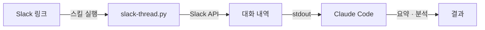

Claude Code로 작업하다 보면 Slack 대화의 맥락이 필요한 경우가 있습니다. 채널에서 논의된 내용을 기반으로 코드를 수정하거나, 긴 쓰레드를 요약 정리해야 할 때인데요, 이때마다 Slack에서 대화를 복사해 붙여넣는 것은 꽤 번거로운 작업입니다.

특히 수십 개의 reply가 달린 쓰레드를 통째로 옮기는 경우, 단순 복사로는 발신자 정보나 이모지 리액션 같은 맥락이 유실되기 쉽습니다.

**Slack Thread Reader**는 이 문제를 해결하기 위해 만든 Claude Code 스킬입니다. openclaw을 Slack으로 사용하면서, Slack 대화를 Claude Code에서도 바로 읽을 수 있으면 좋겠다는 생각에서 시작했습니다. Slack 링크 하나만 넘기면 채널 히스토리와 쓰레드 reply를 자동으로 가져와 Claude Code가 읽을 수 있는 형태로 출력합니다.



### 1. 주요 기능

#### [ 기능 요약 ]

| 기능 | 설명 |
|------|------|
| 쓰레드 읽기 | 특정 쓰레드의 전체 reply를 가져옵니다 |
| 채널 히스토리 | 채널의 최근 메시지를 가져옵니다 |
| 쓰레드 인라인 포함 | 채널 히스토리에 각 메시지의 쓰레드 reply를 트리 구조로 포함합니다 |
| 사용자 ID 변환 | `<@U1234>` 같은 ID를 실명으로 변환합니다 |
| 부가 정보 표시 | 이모지 리액션, 첨부 파일 정보도 함께 출력합니다 |

### 2. 사용 방법

#### [ 자연어로 요청하기 ]

스킬이 설치되어 있으면 Slack 링크를 붙여넣고 자연어로 요청하면 됩니다. Claude Code가 링크를 인식하고 스킬을 자동으로 실행합니다.

```
https://workspace.slack.com/archives/C0123456789/p1234567890123456
이 쓰레드 요약해줘
```

```
https://workspace.slack.com/archives/C0123456789
최근 대화 30개를 가져와줘
```

```
https://workspace.slack.com/archives/C0123456789
배포 관련 대화만 가져와줘
```

#### [ 대화형 옵션 확인 ]

채널 링크를 넘기면 Claude Code가 옵션을 먼저 확인합니다.

```
사용자: https://workspace.slack.com/archives/C0123456789
        이 채널 최근 대화 요약해줘

Claude: 쓰레드 reply도 같이 가져올까요?

사용자: 응, 쓰레드당 5개씩만

Claude: (--with-threads --thread-limit 5 로 실행)
```

스킬 내부에 이런 확인 절차가 정의되어 있어서, 쓰레드 포함 여부나 메시지 수 같은 옵션을 대화를 통해 자연스럽게 결정할 수 있습니다.

#### [ 옵션 정리 ]

내부적으로 사용되는 옵션은 다음과 같습니다.

| 옵션 | 설명 | 기본값 |
|------|------|--------|
| `--limit N` | 채널 히스토리 메시지 수 | 50 |
| `--with-threads` | 쓰레드 reply 인라인 포함 | off |
| `--thread-limit N` | 쓰레드당 최대 reply 수 (0=전체) | 0 |

### 3. 출력 형식

#### [ 쓰레드 모드 ]

쓰레드를 가져오면 원본 메시지를 상단에 고정하고, 이하 reply를 시간순으로 출력합니다.

```
📌 [2026-02-11T17:45:56] 홍길동: API 응답 시간이 3초 이상 걸리는 건 확인해봤나요?
   (13 replies)
---
[2026-02-11T17:46:30] 김민수: 로그 확인해봤는데 DB 쿼리가 느린 것 같습니다 📎 query-log.txt (text/plain)
[2026-02-11T17:47:15] 이지은: @홍길동 인덱스 추가하면 해결될 것 같아요 [:thumbsup: 홍길동,김민수]
```

사용자 ID는 Slack API를 통해 실명으로 변환되며, 멘션(`<@U1234>`)도 `@이름` 형태로 치환됩니다.

#### [ 채널 히스토리 모드 ]

**--with-threads**를 사용하면 각 메시지 아래에 쓰레드 reply가 트리 구조로 표시됩니다.

```
[2026-02-11T17:45:56] 홍길동: API 응답 시간이 3초 이상 걸리는 건 확인해봤나요? 💬13
  ├ [2026-02-11T17:46:30] 김민수: 로그 확인해봤는데 DB 쿼리가 느린 것 같습니다
  └ [2026-02-11T17:47:15] 이지은: 인덱스 추가하면 해결될 것 같아요
```

> **--with-threads** 없이 채널 히스토리만 가져오면 쓰레드 내부 대화는 포함되지 않습니다. 채널 요약이 목적이라면 이 옵션을 사용하는 걸 권장합니다.
{: .prompt-tip }

### 4. 구조와 설치

#### [ 스킬 구조 ]

```
slack-thread/
├── SKILL.md                  ← 스킬 정의
└── scripts/
    ├── slack-thread.sh       ← Bash 진입점
    └── slack-thread.py       ← Slack API 호출 (Python)
```

`slack-thread.sh`{: .filepath}는 Python 스크립트를 실행하는 래퍼이고, 실제 Slack API 호출은 `slack-thread.py`{: .filepath}에서 처리합니다. Python 표준 라이브러리의 `urllib`만 사용하기 때문에 별도 패키지 설치가 필요 없습니다.

#### [ 사전 조건 ]

openclaw을 Slack으로 사용하고 있다면 Bot Token이 이미 설정되어 있습니다.

```json
{
  "channels": {
    "slack": {
      "botToken": "xoxb-..."
    }
  }
}
```
{: file="~/.openclaw/openclaw.json" }

봇이 대상 채널에 멤버로 초대되어 있어야 합니다. `channel_not_found` 에러가 발생하면 해당 채널에서 `/invite @botname`을 실행해주세요.

#### [ 설치 ]

clawhub에 공개되어 있습니다.

> [Slack Thread Reader - clawhub.ai](https://clawhub.ai/Epikoding/slack-thread-reader)
{: .prompt-info }

### 참고 자료

- [clawhub - Slack Thread Reader](https://clawhub.ai/Epikoding/slack-thread-reader)
- [Slack API - conversations.replies](https://api.slack.com/methods/conversations.replies)
- [Slack API - conversations.history](https://api.slack.com/methods/conversations.history)

---

Slack 대화를 Claude Code로 가져오는 과정을 자동화하는 스킬을 소개했습니다. 링크 하나로 채널 히스토리와 쓰레드를 가져올 수 있어서, 복사-붙여넣기 없이도 Claude Code가 대화 맥락을 파악할 수 있습니다.

openclaw을 Slack으로 사용하고 있다면 Bot Token이 이미 준비되어 있습니다. 필요 시 clawhub에서 설치해서 활용해보시길 바랍니다.
