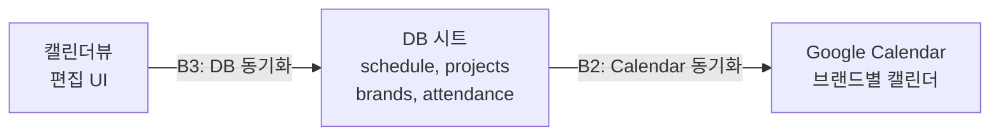
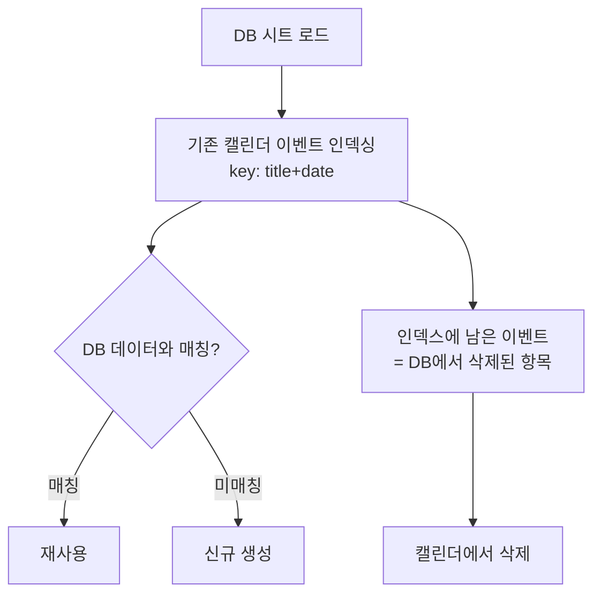

친구가 운영하는 디자인 스튜디오에서 프로젝트 일정을 Google Sheets로 관리하고 있었습니다. 브랜드별 프로젝트, 주간 스케줄, 담당자 배정까지 하나의 시트에 수동으로 기록하는 방식이었습니다. 매주 날짜 열을 직접 추가하고, 프로젝트가 늘어나면 행을 수동으로 삽입하고, Google Calendar에는 다시 하나하나 옮겨 적는 작업을 반복하고 있었습니다.

20개 가까운 브랜드, 60개 이상의 프로젝트, 300건이 넘는 스케줄이 쌓이면서 수동 관리의 한계가 분명해졌습니다. 스프레드시트에서 편집하면 Google Calendar에도 자동으로 반영되는 시스템이 필요했습니다.

이 글에서는 수동 캘린더 시트를 DB로 재설계하고, Apps Script를 백엔드(Backend)로, Google Calendar를 외부 뷰어(Viewer)로 연동하는 과정을 다룹니다.

### 1. 시스템 구조

#### [ 전체 아키텍처 ]

시스템의 데이터 흐름은 단방향(Unidirectional)으로 설계되어 있습니다. 캘린더뷰에서 편집한 내용을 DB 시트에 동기화하고, DB 시트를 기준으로 Google Calendar에 반영하는 구조입니다.



캘린더뷰는 Google Sheets의 시트 하나이며, 사용자가 직접 편집하는 유일한 인터페이스입니다. B3 체크박스를 클릭하면 편집 내용이 DB 시트에 반영되고, B2 체크박스를 클릭하면 DB 기준으로 Google Calendar가 갱신됩니다.

#### [ DB 시트 설계 ]

스프레드시트 내부에 RDB와 유사한 구조로 시트를 분리하여 설계합니다.

| 시트 | 역할 | 주요 컬럼 |
|------|------|----------|
| brands | 브랜드 마스터 | name, color, sort_order, calendar_id |
| projects | 프로젝트 목록 | brand_id, parent_id, name, date_start, date_end |
| schedule | 일정 항목 | project_id, date, content, assignee |
| attendance | 출근 기록 | date, location, members |
| members | 멤버 정보 | name_short, email |

`projects`의 **parent_id**를 통해 상위/하위 프로젝트 관계를 표현하며, `brands`의 **calendar_id**에 Google Calendar ID를 저장하여 한 번 생성한 캘린더를 재사용합니다.

#### [ 캘린더뷰 레이아웃 ]

캘린더뷰는 6행부터 프로젝트 정보(A~G열)와 스케줄 그리드(H열~, 70일분)로 구성됩니다.

| 열 | 내용 | 편집 가능 |
|----|------|-----------|
| A | project_id | X |
| B | brand_id (배경색 적용) | X |
| C | 프로젝트명 | O |
| D | 기간 (yy-MM-dd~yy-MM-dd) | O |
| E~G | 상태, 디자이너, PM | O |
| H~ | 스케줄 (날짜별 내용) | O |

D3 셀에 기준 날짜를 입력하면 3주 전부터 6주 후까지의 프로젝트가 필터링되어 표시됩니다. 브랜드 그룹 경계에는 굵은 하단 border가 적용되고, B열에는 `brands.color`에 따른 배경색이 표시됩니다.

### 2. 정렬 로직

#### [ parent-child 자동 그룹핑 ]

프로젝트 목록의 정렬은 4단계 기준으로 동작합니다.

| 우선순위 | 기준 | 설명 |
|---------|------|------|
| 1순위 | 브랜드 sort_order | brands 시트의 정렬 순서 |
| 2순위 | parent 그룹핑 | child는 parent의 위치를 기준으로 묶임 |
| 3순위 | parent/child 구분 | parent가 먼저, child가 바로 아래 |
| 4순위 | 시트 행 순서 | child끼리는 projects 시트 원래 순서 유지 |

핵심은 child 프로젝트의 정렬 키를 자기 자신이 아닌 parent의 위치로 설정하는 것입니다.

```javascript
var groupA = a.parentId && parentOrigIdx[a.parentId] !== undefined
  ? parentOrigIdx[a.parentId]  // child → parent의 위치 사용
  : a._origIdx;                // parent → 자기 위치 사용

var isChildA = a.parentId ? 1 : 0;
var isChildB = b.parentId ? 1 : 0;
if (isChildA !== isChildB) return isChildA - isChildB;
```

이 방식을 사용하면 projects 시트에서 하위 프로젝트를 어느 행에 추가하더라도 캘린더뷰에서는 parent 바로 아래에 자동 배치됩니다.

### 3. DB 동기화 (B3)

#### [ 역반영 대상 ]

캘린더뷰에서 편집한 내용을 DB 시트에 역반영하는 과정입니다. C~G열 변경은 projects 시트에, H열~ 변경은 schedule 시트에 반영됩니다.

| 캘린더뷰 열 | 반영 대상 | 비고 |
|------------|----------|------|
| C열 | projects.name | "ㄴ " prefix 자동 제거 |
| D열 | projects.date_start, date_end | yy → yyyy 자동 변환 |
| E열 | projects.status | - |
| F열 | projects.designer | - |
| G열 | projects.pm | - |
| H열~ | schedule.content | 추가/수정/삭제 |

#### [ 변경 감지 방식 ]

각 컬럼별로 old 값과 new 값을 비교하여 실제로 변경된 항목만 반영합니다. 이는 불필요한 쓰기 작업을 방지하기 위함입니다.

```javascript
var oldStart = formatDateSafe_(projData[rowIdx][dsIdx]);
var oldEnd = formatDateSafe_(projData[rowIdx][deIdx]);
if (resolvedStart !== oldStart || resolvedEnd !== oldEnd) {
  startCol[rowIdx] = [resolvedStart];
  endCol[rowIdx] = [resolvedEnd];
  projModified = true;
}
```

> 날짜 비교 시 `formatDateSafe_`로 통일된 형식(yyyy-MM-dd)으로 변환한 후 비교해야 합니다. Google Sheets는 날짜를 Date 객체로 자동 변환하는 경우가 있어, 문자열 직접 비교 시 불일치가 발생할 수 있습니다.
{: .prompt-tip }

#### [ 결과 표시 ]

동기화 완료 후 팝업(`ui.alert`)으로 변경 상세를 표시합니다.

```
schedule: 3개 수정, 1개 추가, 0개 삭제

projects: 2건 변경
  P001 디자이너: A → B
  P002 기간: 2026-03-01~ → 2026-03-01~2026-03-15
```

### 4. Google Calendar 동기화 (B2)

#### [ 동기화 전략 선택 ]

Calendar 동기화 방식으로 두 가지 전략을 검토할 수 있습니다.

| 전략 | 장점 | 단점 |
|------|------|------|
| Clear & Recreate | 구현이 단순하고 event ID 추적이 불필요 | 매번 전체 삭제 후 재생성, API 호출이 많음 |
| Diff & Patch | 변경분만 처리하여 API 호출이 효율적 | 매칭 로직이 복잡 |

데이터 규모(schedule 329건, attendance 283건)를 고려하면 Clear & Recreate 방식은 매번 600건 이상의 이벤트를 삭제하고 다시 생성해야 하므로 rate limit에 걸릴 가능성이 높습니다. 따라서 **Diff & Patch** 전략을 채택하는 것이 적합합니다.

#### [ Diff & Patch 동작 방식 ]



기존 캘린더 이벤트를 `title|date` 형태의 키로 인덱싱합니다. DB 데이터를 순회하면서 매칭되는 이벤트가 있으면 재사용(skip)하고, 없으면 새로 생성합니다. 순회가 완료된 후 인덱스에 남아있는 이벤트는 DB에서 삭제된 항목이므로 캘린더에서도 제거합니다.

```javascript
function claimExistingEvent_(eventIndex, title, dateISO, endDateISO) {
  var key = title + '|' + dateISO;
  if (!eventIndex[key] || eventIndex[key].length === 0) return null;

  var ev = eventIndex[key].shift();
  if (eventIndex[key].length === 0) delete eventIndex[key];
  return ev;  // CalendarEvent 객체를 반환하여 후속 처리에 활용
}
```

이 방식의 장점은 **calendar_id나 event_id를 별도 컬럼으로 관리할 필요가 없다**는 점입니다. title과 date만으로 매칭이 가능하므로 DB 스키마를 변경하지 않아도 됩니다.

#### [ Guests 동기화 ]

schedule의 **assignee** 필드를 Google Calendar 이벤트의 guests로 추가하는 기능입니다. members 시트의 `name_short → email` 매핑을 활용합니다.

```javascript
// assignee: "A, B" → email 목록 변환
var names = assignee.split(', ');
for (var n = 0; n < names.length; n++) {
  var email = data.memberEmailMap[names[n].trim()];
  if (email) guestEmails.push(email);
}
```

몇 가지 주의할 점이 있습니다.

| 항목 | 처리 방식 |
|------|----------|
| 초대 메일 | `sendInvites: false`로 미발송 |
| members에 없는 이름 (tbd 등) | 자동 무시 (email 매핑 실패 시 skip) |
| 캘린더 소유자 | `getGuestList(false)`로 소유자 제외 |

### 5. API 호출 최적화

#### [ 문제: 재사용 이벤트의 불필요한 API 호출 ]

초기 구현에서는 재사용되는 이벤트마다 `getGuestList()`를 호출하여 guests 변경 여부를 확인했습니다. 아무것도 변경하지 않은 상태에서 동기화를 실행해도 schedule 행 수만큼 Calendar API가 호출되는 문제가 있었습니다.

```
최적화 전: Calendar API 총 371회
  getCalendarById: 21, getEvents: 21, getGuestList: 329
```

#### [ 해결: description 비교를 통한 변경 감지 ]

이벤트 생성 시 description에 `담당: A, B` 형태로 assignee 정보를 저장하고 있었습니다. 이 값과 현재 assignee를 비교하면 guests 변경 여부를 `getGuestList()` 호출 없이 판단할 수 있습니다.

```javascript
var expectedDesc = assignee ? '담당: ' + assignee : '';
var currentDesc = existing.getDescription() || '';

if (expectedDesc !== currentDesc) {
  // assignee가 변경된 경우에만 getGuestList 호출 + guests 동기화
  existing.setDescription(expectedDesc);
  var currentGuests = existing.getGuestList(false)
    .map(function(g) { return g.getEmail(); });
  // addGuest / removeGuest 처리...
}
```

> `getDescription()`은 `getEvents()` 호출 시 이미 로드된 이벤트 데이터에 포함되어 있어 추가 API 호출이 발생하지 않습니다. 반면 `getGuestList()`는 별도의 API 호출이 필요합니다.
{: .prompt-info }

```
최적화 후: Calendar API 총 42회
  getCalendarById: 21, getEvents: 21
  getGuestList: 0 (변경 없으면 호출하지 않음)
```

변경이 없는 경우 **329회의 불필요한 API 호출이 제거**됩니다.

#### [ Rate Limit 대응 ]

Google Calendar API는 짧은 시간에 많은 이벤트를 생성하거나 삭제하면 rate limit 에러를 반환합니다.

```
You have been creating or deleting too many calendars or calendar events
in a short time. Please try again later.
```

이벤트 생성/삭제 시 10건마다 1초의 대기 시간을 추가하여 대응합니다.

```javascript
cal.createAllDayEvent(title, eventDate, options);
createdCount++;
if (createdCount % 10 === 0) Utilities.sleep(1000);
```

또한 전체 동기화에 4분 타임아웃 보호를 적용하여, 시간 초과 시 부분 완료 상태를 toast로 알리고 재실행을 안내합니다.

### 6. 실행 로그

#### [ Calendar API 호출 추적 ]

모든 Calendar API 호출을 추적하는 로깅 시스템을 구현하여, 어떤 API가 몇 번째 호출인지 실시간으로 확인할 수 있습니다.

```javascript
var _calApi = {};
function _logApi(type) {
  if (!_calApi[type]) _calApi[type] = 0;
  _calApi[type]++;
  var total = 0;
  for (var k in _calApi) total += _calApi[k];
  Logger.log('  [API #' + total + '] ' + type + ' (' + _calApi[type] + '번째)');
}
```

실행 로그 예시:

```
[API #1] getCalendarById (1번째)
[API #2] getCalendarById (2번째)
...
[API #22] getEvents (1번째)
...
기존 캘린더 이벤트 590개 인덱싱 완료
schedule 이벤트 처리 중...
  schedule 진행: 100/329 (생성 0, 재사용 99)
  schedule 진행: 200/329 (생성 0, 재사용 199)
...
Calendar API 총 42회 (getCalendarById: 21, getEvents: 21)
```

실행 완료 시 `_apiSummary()` 함수가 종류별 호출 합계를 출력하므로, 최적화 효과를 즉시 확인할 수 있습니다.

### 참고 자료

- [Google Apps Script CalendarApp 문서](https://developers.google.com/apps-script/reference/calendar/calendar-app)
- [Google Apps Script SpreadsheetApp 문서](https://developers.google.com/apps-script/reference/spreadsheet/spreadsheet-app)
- [Google Calendar API Quota](https://developers.google.com/calendar/api/guides/quota)

---

Google Sheets를 DB로 활용하는 것이 처음에는 어색할 수 있지만, Apps Script와 결합하면 별도의 서버 없이도 실용적인 자동화 시스템을 구축할 수 있습니다. 특히 Diff & Patch 전략은 event_id를 별도로 관리하지 않아도 title과 date만으로 매칭이 가능하여 구조가 단순하게 유지된다는 장점이 있습니다. description 필드를 활용한 API 최적화처럼, 이미 존재하는 데이터를 다른 목적으로 재활용하는 접근 방식도 참고해볼 만합니다.

비슷한 규모의 팀 일정 관리 자동화가 필요하다면 Google Sheets + Apps Script 조합을 검토해보시길 바랍니다.
