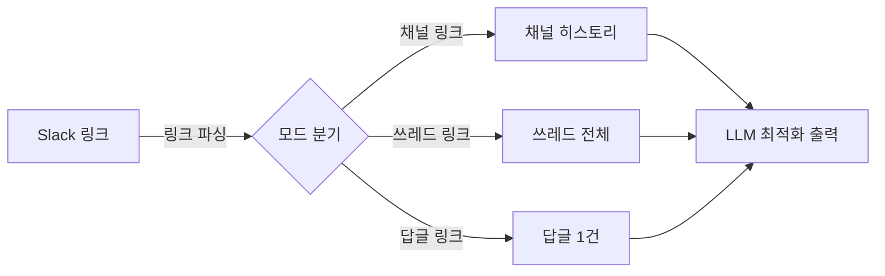

[이전 포스팅](https://epikoding.github.io/posts/slack-thread-reader-skill/)에서 Slack Thread Reader 스킬을 소개한 적이 있습니다. Slack 링크를 Claude Code에 넘기면 대화를 가져와 요약하는 도구였는데요, 실제로 업무에 써보니 몇 가지 문제가 드러났습니다.

쓰레드 안의 답글 링크를 복사해서 넘기면 엉뚱한 결과가 나오고, 채널 이름 대신 ID만 보여서 헷갈리며, 출력 형식도 LLM이 읽기에 적합하지 않았습니다. 이번에 이 문제들을 하나씩 해결하면서 스크립트를 꽤 많이 손봤습니다.



### 1. Slack 링크의 구조를 이해하기

#### [ 채널, 쓰레드, 답글 - 세 가지 링크 ]

Slack에서 메시지 링크를 복사하면 세 가지 형태가 나옵니다.

```text
채널:    https://workspace.slack.com/archives/C07G23FAJS3
쓰레드:  https://workspace.slack.com/archives/C07G23FAJS3/p1770775935866499
답글:    https://workspace.slack.com/archives/C07G23FAJS3/p1770776063826049?thread_ts=1770775935.866499&cid=C07G23FAJS3
```

채널 링크는 `/archives/채널ID`까지만 있고, 쓰레드 링크는 뒤에 `pTS`가 붙습니다. 답글 링크에는 여기에 `?thread_ts=...&cid=...` 쿼리 파라미터까지 추가되는데, 이 구분이 왜 중요한지는 뒤에서 살펴보겠습니다.

#### [ pTS와 ts의 관계 ]

URL에 보이는 `p1770775935866499`과 API에서 사용하는 `1770775935.866499`는 같은 값입니다. 표기 방식만 다릅니다.

| 위치 | 형식 | 예시 |
|------|------|------|
| URL path | `p` + 숫자 연결 | `p1770775935866499` |
| API / query string | 초.마이크로초 | `1770775935.866499` |

`p` 접두사를 떼고 앞 10자리와 뒤 6자리 사이에 `.`을 넣으면 API에서 쓰는 ts 형식이 됩니다. Slack은 이 ts를 메시지의 고유 ID로 사용하기 때문에, 채널 내에서 ts만 알면 특정 메시지를 정확히 식별할 수 있습니다.

```python
raw_ts = "1770775935866499"
ts = f"{raw_ts[:10]}.{raw_ts[10:]}"  # "1770775935.866499"
```

#### [ thread_ts와 cid ]

답글 링크에 붙는 `thread_ts`는 "이 답글이 속한 쓰레드의 부모 메시지 ts"를 가리킵니다. `cid`는 채널 ID의 중복인데, Slack 네이티브 앱이 딥링크를 처리할 때 query string만 읽어도 채널+부모+답글 세 가지를 모두 알 수 있도록 넣어둔 값이라 스크립트에서는 무시해도 됩니다.

### 2. 답글 링크 파싱 버그

#### [ 무엇이 문제였나 ]

링크 구조를 살펴봤으니, 기존 코드가 어디서 문제를 일으켰는지 짚어보겠습니다. `parse_slack_link` 함수가 URL path만 파싱하고 query string은 아예 무시하고 있었습니다.

```python
# 기존 코드
def parse_slack_link(link):
    m = re.search(r'/archives/([^/]+)/p(\d+)', link)
    if m:
        raw_ts = m.group(2)
        return m.group(1), f"{raw_ts[:10]}.{raw_ts[10:]}"
```

이 코드에 답글 링크를 넘기면 path의 `p1770776063826049`(답글의 ts)를 쓰레드 루트로 사용해버립니다. 실제 부모인 `thread_ts=1770775935.866499`는 무시되기 때문에 `conversations.replies` API에 잘못된 ts가 들어가고, 결국 쓰레드 전체를 가져오지 못하는 거였습니다.

#### [ 어떻게 수정했나 ]

query string에서 `thread_ts`를 추출하는 로직을 추가했습니다. `thread_ts`가 있으면 답글 링크로 판단하고, 없으면 기존처럼 쓰레드 링크로 처리하면 됩니다.

```python
def parse_slack_link(link):
    # query string에서 thread_ts 추출
    thread_ts = None
    qs = re.search(r'[?&]thread_ts=([^&]+)', link)
    if qs:
        thread_ts = qs.group(1)

    m = re.search(r'/archives/([^/]+)/p(\d+)', link)
    if m:
        raw_ts = m.group(2)
        return m.group(1), f"{raw_ts[:10]}.{raw_ts[10:]}", thread_ts
    # ...
```

반환값이 `(channel, ts, thread_ts)` 튜플로 바뀌면서, `main()`에서 세 가지 모드로 분기할 수 있게 됩니다.

```python
if ts and thread_ts:
    # 답글 모드: 해당 답글 1건만 조회
elif ts:
    # Thread 모드: 전체 쓰레드 조회
else:
    # Channel 모드: 채널 히스토리 조회
```

### 3. 3가지 모드와 사용법

#### [ 채널 모드 ]

파싱 버그를 잡으면서 자연스럽게 세 가지 모드가 정리되었습니다. 채널 링크를 넘기면 히스토리를 가져오는데, 기본값은 전체 수집이고 `--limit`으로 제한할 수 있습니다.

```bash
scripts/slack-thread.sh https://workspace.slack.com/archives/CHANNEL
scripts/slack-thread.sh CHANNEL_ID --limit 100
```

`--from`과 `--to`로 기간 지정도 가능합니다. 내부적으로는 Slack API의 `oldest`/`latest` 파라미터로 변환됩니다.

```bash
scripts/slack-thread.sh CHANNEL_ID --from 2026-03-01 --to 2026-03-04
```

`--with-threads`를 붙이면 쓰레드가 있는 메시지의 답글을 인라인으로 포함합니다.

#### [ 쓰레드 모드 ]

쓰레드 링크를 넘기면 부모 메시지 포함 전체 답글을 가져옵니다. `--limit`은 적용되지 않고, 페이지네이션으로 모든 답글을 빠짐없이 수집합니다.

```bash
scripts/slack-thread.sh https://workspace.slack.com/archives/CHANNEL/pTIMESTAMP
```

#### [ 답글 모드 ]

답글 링크를 넘기면 해당 답글 1건만 가져옵니다. `conversations.replies` API에 `oldest`와 `latest`를 모두 `reply_ts`로 설정하고 `inclusive=true`, `limit=1`을 붙여서 해당 답글만 조회하는 방식입니다.

```bash
scripts/slack-thread.sh "https://workspace.slack.com/archives/CHANNEL/pTS?thread_ts=...&cid=..."
```

#### [ 전체 옵션 ]

| 옵션 | 설명 | 기본값 |
|------|------|--------|
| `--limit N` | 채널 모드 히스토리 메시지 수 (0=전체) | 0 |
| `--from YYYY-MM-DD` | 이 날짜 이후 메시지만 | 없음 |
| `--to YYYY-MM-DD` | 이 날짜까지 메시지만 | 없음 |
| `--with-threads` | 쓰레드 답글 인라인 포함 | off |
| `--thread-limit N` | 쓰레드당 최대 답글 수 (0=전체) | 0 |
| `--desc` | 내림차순 정렬 (최신 먼저) | off |

### 4. LLM을 위한 출력 설계

#### [ 기본 오름차순 정렬 ]

모드 구분이 끝나고 나서 신경 쓴 건 출력 형식이었습니다. 기존에는 내림차순(최신 먼저)이 기본이었는데, 오름차순(과거부터 최신)으로 바꿨습니다. 질문 다음에 답변이 오고, 피드백 뒤에 수정본이 오는 순차적 흐름을 그대로 읽을 수 있어 LLM이 대화를 이해하기에도 더 자연스럽습니다. 긴 입력의 중간부를 놓치기 쉽다는 경향(lost in the middle)을 고려해도 최신 내용이 입력의 끝에 오는 오름차순이 유리하고요.

#### [ 메시지 포맷 ]

도입부에서 언급한 "채널 이름 대신 ID만 보이는" 문제도 여기서 해결했습니다. `conversations.info` API로 채널 이름을 조회해서, 헤더에 ID와 함께 `#product-design`처럼 표시하도록 변경했습니다. 각 메시지에는 ISO 타임스탬프와 Slack ts(메시지 고유 ID)가 포함되고, 참여자 목록도 헤더에 표시됩니다.

```text
[thread] ch:C01ABC2DEF3(#product-design) parent:1770775935.866499 replies:23 range:2026-02-10~2026-03-04
[participants] 김수진, 이정호, 박민지 (3명)
[2026-02-10T10:15:35|1770775935.866499] 김수진: *[모바일 앱 리뉴얼]*
[2026-02-10T10:16:02|1770776063.826049] 김수진: 시안 링크 <https://figma.com/file/...>
```

채널 모드에서는 쓰레드가 있는 메시지에 답글 수와 최신 답글 시간이 태그로 붙습니다.

```text
[2026-03-04T14:32:28|1772601524.234679] 이정호: QA 이슈 정리 [thread replies:5 latest:2026-03-04T16:00:12]
```

> 채널 이름 조회(`conversations.info`)와 메시지 fetch를 `ThreadPoolExecutor`로 병렬 실행하여 응답 대기 시간을 단축했습니다.
{: .prompt-tip }

#### [ 토큰 절약 - permalink 축약 ]

출력 형식을 다듬다 보니, 첨부파일의 Slack permalink URL이 의외로 토큰을 많이 잡아먹고 있었습니다. 실제 채널 출력에서 파일 하나당 80자 이상이 URL에 사용되는 경우가 흔했습니다.

```text
# 변경 전
📎스크린샷.png https://workspace.slack.com/files/U07A1B2C3D4/F08E5F6G7H8/_______2026-02-09______4.12.03.png

# 변경 후
📎스크린샷.png U07A1B2C3D4/F08E5F6G7H8
```

`https://{workspace}.slack.com/files/` 접두사는 워크스페이스 내에서 상수이므로 제거했고, URL 인코딩된 파일명도 `📎` 뒤에 이미 표시되니 중복 제거했습니다. `USER_ID/FILE_ID`만 있으면 전체 URL을 복원할 수 있습니다.

디자인 팀 채널처럼 스크린샷과 시안 파일이 대량으로 공유되는 곳에서는, 이 축약만으로도 상당한 토큰 절약 효과가 있습니다.

### 5. 안정성과 병렬 처리

#### [ Rate limit 경합 방지 ]

출력을 최적화한 뒤에는 안정성 쪽을 손봤습니다. `--with-threads`를 사용하면 최대 8개 워커가 동시에 Slack API를 호출하는데, 여러 워커가 동시에 429(Rate Limit)를 받으면 각각 `Retry-After`만큼 대기한 뒤 또 동시에 요청하는 thundering herd 문제가 생길 수 있습니다.

이를 방지하기 위해 `SlackClient`에 `threading.Lock`과 `_rate_wait_until` 타임스탬프를 공유하도록 했습니다. 한 워커가 429를 받으면 대기 시점을 갱신하고, 다른 워커들은 요청 전에 이 값을 확인해서 불필요한 요청을 보내지 않는 구조입니다.

```python
class SlackClient:
    def __init__(self, token):
        self.token = token
        self._rate_lock = threading.Lock()       # 워커 간 동기화용 Lock
        self._rate_wait_until = 0.0              # 이 시각까지 요청 금지

    def api(self, method, params):
        with self._rate_lock:
            wait = self._rate_wait_until - time.time()  # 남은 대기 시간 계산
        if wait > 0:
            time.sleep(wait)                     # 아직 대기 중이면 sleep
        try:
            # ... API 호출 ...
        except urllib.error.HTTPError as e:
            if e.code == 429:                    # Rate Limit 초과
                retry_after = int(e.headers.get("Retry-After", "5"))
                with self._rate_lock:
                    self._rate_wait_until = time.time() + retry_after  # 대기 시점 갱신
```

#### [ 에러 격리 ]

쓰레드 답글을 병렬로 가져올 때 한 쓰레드의 API 에러가 전체를 crash시키면 곤란합니다.

기존에는 `except Exception`으로 에러를 잡았는데, 여기에 함정이 있었습니다. `fetch_thread` 내부의 `sys.exit(1)`이 발생시키는 `SystemExit`은 Python에서 `BaseException`의 자식이라 `except Exception`에 잡히지 않습니다. `ThreadPoolExecutor`가 이걸 캡처했다가 `future.result()` 호출 시 메인 스레드에서 재발생시키면서 프로그램이 통째로 종료되어 버렸습니다.

`except BaseException`으로 변경하여 개별 쓰레드 실패 시 해당 쓰레드만 스킵하고 나머지는 계속 진행하도록 수정했습니다. 실패한 쓰레드는 stderr에 요약 출력됩니다.

```text
[warn] 2/15 threads failed: 1770775935.866499, 1770776063.826049
```

#### [ 유저 캐시 ]

사용자 ID를 실명으로 변환하기 위해 `users.info` API를 호출하는데, 매번 호출하면 느려서 `~/.cache/slack-reader/users.json`에 유저 맵을 캐싱했습니다. TTL 24시간 이내면 캐시에서 읽습니다.

캐시를 구현하면서 한 가지 실수가 있었는데, `_ts`(타임스탬프)를 매번 현재 시간으로 갱신하다 보니 새 유저가 한 명이라도 추가될 때마다 기존 유저 전체의 TTL이 리셋되는 문제가 생겼습니다. 기존 `_ts`를 유지하고 만료 시에만 새로 설정하도록 고쳐서 해결했습니다.

### 6. 봇 메시지 처리

유저 캐시까지 정리하고 나니, 테스트 중에 발신자가 `?`로 표시되는 메시지가 눈에 띄었습니다. 알고 보니 봇 메시지였습니다.

Slack의 봇 메시지는 일반 사용자와 달리 `user` 필드가 없는 경우가 있습니다. 대신 `username`이나 `bot_profile.name`에 봇 이름이 들어가는데, 기존 코드는 `user` 필드만 확인했기 때문에 봇의 발신자가 `?`로 표시되었고 참여자 목록에서도 누락되었습니다.

```python
# 변경 후: 봇도 fallback으로 처리
user = (user_map.get(msg.get("user", ""))
        or msg.get("username")
        or msg.get("bot_profile", {}).get("name")
        or "bot")
```

참여자 목록(`fmt_participants`)에도 동일한 fallback을 적용하여 봇도 포함되도록 했습니다.

### 참고 자료

- [이전 포스팅: Slack Thread Reader 소개](/posts/slack-thread-reader-skill/)
- [Slack API - conversations.replies](https://api.slack.com/methods/conversations.replies)
- [Slack API - conversations.history](https://api.slack.com/methods/conversations.history)
- [Slack API - conversations.info](https://api.slack.com/methods/conversations.info)

---

Slack Thread Reader를 실제로 쓰면서 발견한 문제들을 하나씩 개선한 과정을 정리했습니다. 답글 링크 파싱 버그처럼 직접 써보지 않으면 모르는 문제도 있었고, LLM에 출력을 넘기다 보니 토큰 관점에서 설계를 다시 생각하게 되는 부분도 있었습니다.

아직 적용하지 않은 최적화도 남아 있습니다. 한 달치 채널을 수집했더니 메시지가 수백 건이었는데, 날짜별 구분 없이 쭉 이어지니 어디서 맥락이 바뀌는지 파악하기 어려웠고, 봇이 남긴 입퇴장/알림 메시지가 전체의 상당 부분을 차지하고 있었습니다. 날짜별 그룹핑이나 시스템 메시지 필터링, 긴 메시지 truncate 같은 것들을 필요해지면 추가할 계획입니다.
