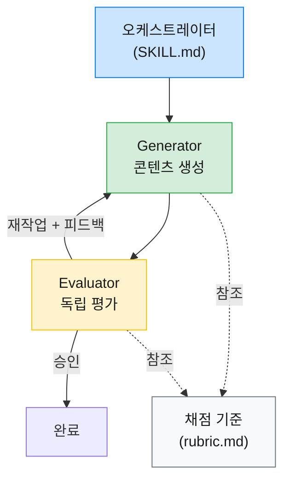
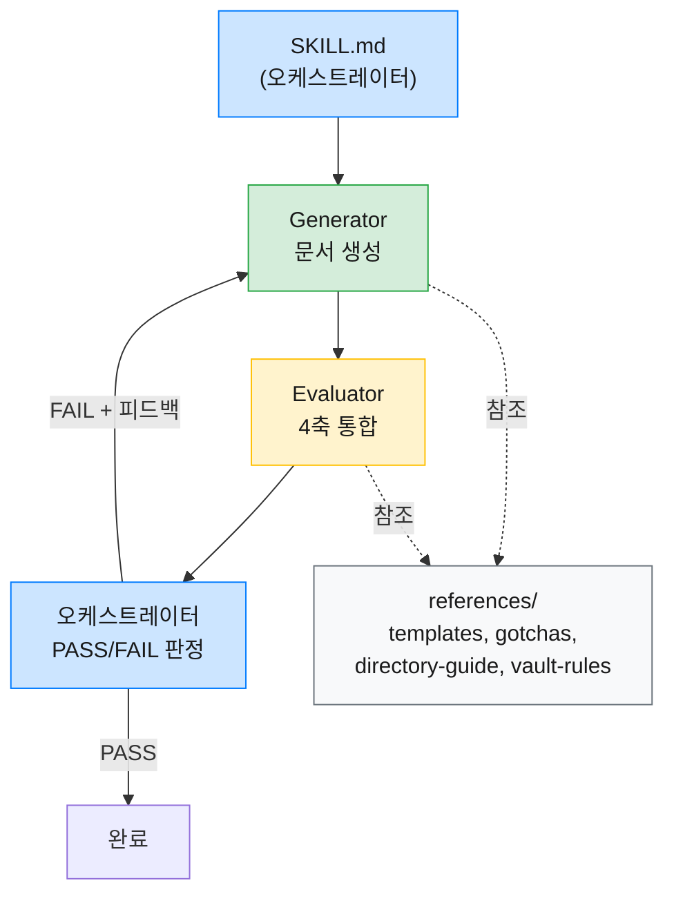
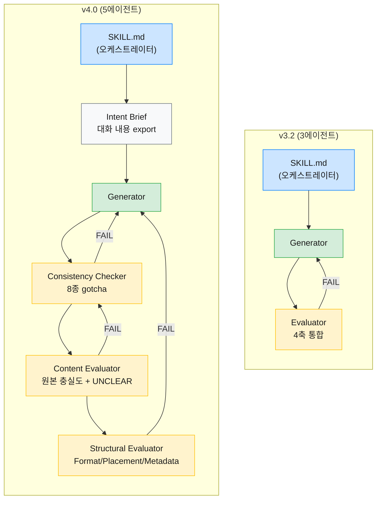
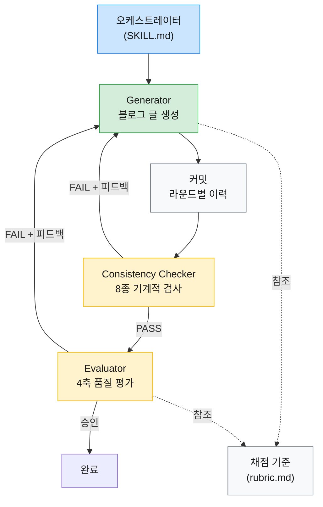
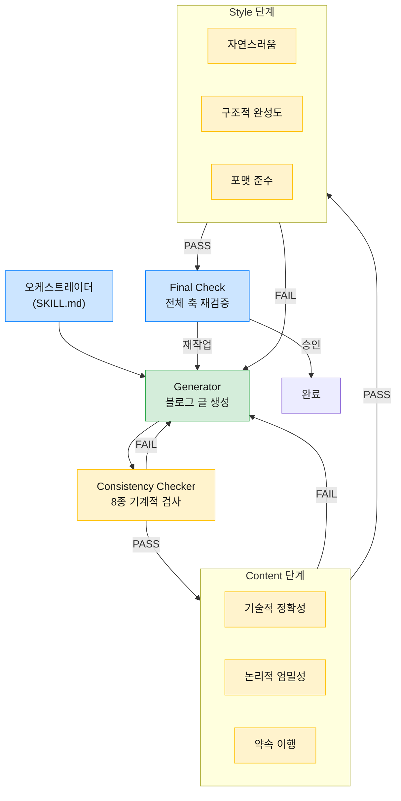
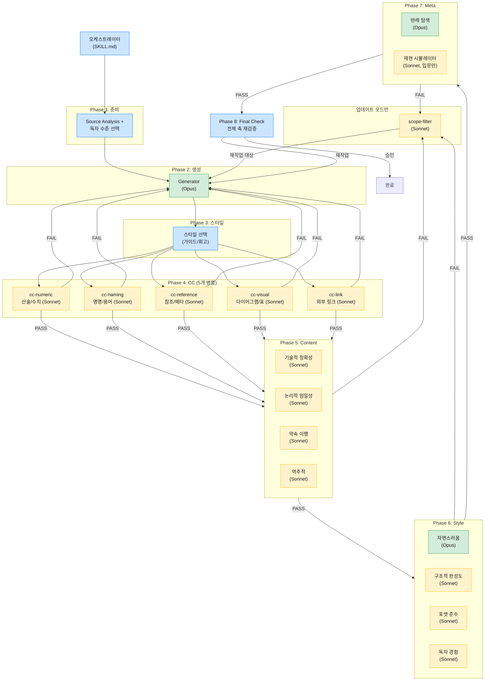

Claude Code의 스킬(Skill)을 단일 패스 방식으로 구현하면 생성과 검증이 하나의 흐름에서 동시에 일어나면서 품질이 들쭉날쭉해진다. 하네스 패턴(Harness Pattern)은 생성과 평가를 분리하는 접근인데 두 스킬에 적용하면서 설계 원칙부터 Evaluator 전문화까지 꽤 많은 시행착오를 거쳤다.

| 스킬                | 역할                                                          |
| ----------------- | ----------------------------------------------------------- |
| `document`        | Obsidian vault에 마크다운 문서를 생성하는 스킬                            |
| `document-export` | 마크다운 문서를 기술 블로그 포스트로 변환하는 스킬                                |

`document`는 60개 문서 실험으로 규칙을 경량화한 뒤 재시도 루프의 절차적 제어와 Evaluator 3분할을 거쳐 v4.0에서 Content 신뢰 문제를 개선했다. `document-export`는 4축 채점에서 10축 평가로 확장하면서 Opus/Sonnet 모델 라우팅과 14에이전트 실험을 통한 Evaluator 다양성 발견까지 이르렀다.

### 1. 왜 하네스 패턴이 필요한가

#### [ 단일 패스 스킬의 한계 ]

두 스킬 모두 처음에는 단일 패스 방식이었다. 하나의 프롬프트가 글을 생성하고 같은 프롬프트 안에서 품질까지 점검하는 구조다. `document`에서는 Generator가 형식, 배치, 메타데이터, 내용을 모두 직접 판단했고 결과물의 문서 형식은 늘 제각각이었다. `document-export`에서도 Quality Check가 형식적으로 흘러가면서 "괜찮지만 뛰어나지 않은" 수준의 품질 천장에 부딪혔다.

생성과 평가가 하나의 프롬프트에 섞여 있으면 한쪽을 건드릴 때 다른 쪽이 깨지는 악순환도 문제였다. 두 사례에서는 생성과 평가를 분리한 뒤에야 각 역할의 집중도가 높아졌다.

### 2. 하네스 패턴이란

#### [ Generator/Evaluator 분리 ]

위 문제를 겪으면서 찾은 해법이 하네스 패턴(Harness Pattern)이다. 생성 에이전트(Generator)와 평가 에이전트(Evaluator)의 컨텍스트를 완전히 분리하여 Evaluator는 Generator의 프롬프트를 모르는 상태에서 결과물과 평가 기준만으로 판단한다. 이 독립성이 자기 평가 편향을 줄이는 구조적 조건이 되지만 독립된 Evaluator도 관대하게 채점하는 경향이 있어 회의적 튜닝이 함께 필요하다(4절에서 다룬다).

#### [ 핵심 구성 요소 ]

실제로 구현해보니, 최소 네 가지 구성 요소가 갖춰져야 루프가 돌아갔다.

| 구성 요소 | 역할 |
|-----------|------|
| 오케스트레이터 | Generator와 Evaluator를 조율하고 루프 상태를 추적 |
| Generator | 콘텐츠를 생성하고 Evaluator 피드백에 따라 수정 |
| Evaluator | 채점 기준에 따라 독립 평가하여 승인 또는 재작업 판정 |
| 채점 기준(`rubric.md`) | Generator와 Evaluator 양쪽이 참조하는 공유 평가 기준 문서 |

오케스트레이터가 Evaluator의 판정을 읽고 재작업이 필요하면 피드백과 함께 Generator를 다시 호출하는 구조다. 채점 기준을 양쪽이 공유하므로 기대치 불일치가 줄어든다.



실제 적용에서는 각 스킬의 특성에 맞는 조정이 필요했다.

### 3. 사례 1: `document` 스킬 리팩터링

#### [ 문제 - 5가지 품질 문제 ]

v1은 단일 패스 방식이었고 사용하면서 다섯 가지 문제가 드러났다.

- 문서 형식 불일치: 같은 유형의 문서임에도 요약 형식, frontmatter 필드, 원문 링크 형식이 제각각이었다
- 트리거 범위 부족: `document`를 명시적으로 호출할 때만 동작했고 vault 경로에 자동 연결되지 않았다
- 시나리오별 형식 부재: 크롤링, 대화 정리, 코드 정리, 일반 노트를 구분하는 형식이 없음
- 디렉토리 판단 오류와 Obsidian 문법 오류: 세부 경로 선택이 부적절하거나 frontmatter 태그 형식 같은 Obsidian 고유 문법을 일관되게 틀림

이 중 문서 형식 불일치, 디렉토리 판단 오류, Obsidian 문법 오류는 단일 패스의 한계에서 비롯되었고 트리거 범위 부족과 시나리오별 형식 부재는 규칙 설계의 부재로 별도 보완이 필요했다.

#### [ 설계와 구현 ]

SKILL.md를 오케스트레이터로 전환하고 세부 규칙을 정본 파일(references)로 분리하여 Generator와 Evaluator가 동일한 기준을 참조하도록 구조를 잡았다.

```plaintext
skills/document/
├── SKILL.md              (185행, 오케스트레이터)
├── prompts/
│   ├── generate.md       (Generator subagent)
│   └── evaluate.md       (Evaluator 4축 평가)
└── references/
    ├── obsidian-gotchas.md (211행, LLM gotchas)
    ├── templates.md       (시나리오별 정본)
    ├── directory-guide.md (배치 규칙)
    └── vault-rules.md    (볼트 규칙)
```
{: .nolineno }

Evaluator에는 Format, Placement, Metadata, Content의 4축 평가를 도입했다. 여기서 가장 중요했던 건 Evaluator의 독립성을 지키는 것이다.

> Evaluator가 Generator의 프롬프트를 알게 되면 결과물의 품질이 아니라 프롬프트 준수도를 평가할 위험이 있다. 생성과 평가의 관심사가 다시 결합되는 셈이다.
{: .prompt-warning }

다만 완전한 독립성에는 오탐 위험이 따른다. Generator가 의도적으로 생략한 항목을 Evaluator가 "누락"으로 잡을 수 있는데 v4.0에서 도입한 UNCLEAR 메커니즘(판단 불가 항목을 사용자에게 확인 요청하는 장치)이 이 문제를 부분적으로 보완한다.

정본 파일 공유 구조 덕분에 규칙 변경 시 `references/` 한 곳만 수정하면 양쪽에 반영되고 트리거 범위도 vault 경로에 MD를 생성하는 모든 상황으로 확장했다.



스모크 테스트(크롤링, 대화 정리 두 시나리오) 결과 전 항목 PASS로 해당 시나리오에서의 기본 품질을 확인했다.

#### [ 60개 문서 실험으로 규칙 경량화 ]

obsidian-gotchas.md가 664행에 달해서 매번 읽어야 하는 토큰이 문제였다. obsidian-gotchas.md를 참조하지 않은 상태에서 LLM이 Obsidian 마크다운을 생성하게 한 뒤 각 규칙의 위반 여부를 자동 검사했다. Opus 10개 + Sonnet 50개, 총 60개 문서를 생성했다(Opus 표본이 적으므로 Opus 위반율은 참고값).

| 규칙                     | Opus 위반율 | Sonnet 위반율 | 전체 위반율 |
| ---------------------- | -------- | ---------- | ------ |
| 태그 `"#태그명"` 형식         | 90%      | 100%       | 98%    |
| wikilink `"[[문서]]"` 형식 | 30%      | 72%        | 65%    |
| Callout 문법             | 0%       | 0%         | 0%     |
| 수평선, 체크박스, 하이라이트 등     | 0%       | 0%         | 0%     |

LLM이 실제로 틀리는 규칙(태그 따옴표 98%, wikilink 65%)에만 상세 예시를 유지하고 위반율 0% 항목(표에 나온 2종 포함, 총 9개)은 하단 "참고" 섹션으로 축소했다. Generator/Evaluator가 알아야 할 것은 "이 규칙을 지켜라"이지 "왜 이 규칙이 존재하는지"가 아니므로 메타 정보(위반율 수치 등)도 제거했다.

> 위반율이 0%라도 위반 시 데이터 손실 등 치명적 결과를 초래하는 규칙은 상세 예시를 유지하는 편이 안전하다.
{: .prompt-info }

최종 결과: 664행에서 211행으로 68% 감소. 다만 이 최적화는 모델 버전에 의존하므로, 주기적 재실험이 필요하다.

#### [ v3.2 - 재시도 루프가 동작하지 않는 문제 ]

규칙 경량화 후 v3.1에서 Generator/Evaluator 패턴을 도입했지만 Evaluator가 FAIL 판정을 내려도 Generator가 재시도하지 않거나 FAIL 항목이 수정되지 않은 채 넘어가는 현상이 나타났다.

가장 가능성 높은 원인은 SKILL.md의 재생성 루프 기술 방식이다. 기존 Step 4는 "Evaluator 피드백을 Generator에 전달한다"는 선언적 기술만 있었고 모델이 "피드백을 전달했으니 됐다"고 해석하고 다음 단계로 넘어가 버렸다.

수정은 SKILL.md, evaluate.md, generate.md 세 파일에 걸쳐 이루어졌다.

| 파일 | 변경 내용 |
|------|-----------|
| SKILL.md | 기존에는 4단계(Step 1~4)였던 실행 순서를 6단계로 세분화하여, Step 4에서 오케스트레이터가 직접 PASS/FAIL을 판정하고 Step 5에 while 루프 의사코드를 명시 |
| evaluate.md | "수정 지시" 1단계 구조를 "감점 항목" + "전략 지시" 2단계 구조로 변경 |
| generate.md | `{evaluator_feedback}` 플레이스홀더 추가. 재시도 모드에서는 Read-Edit 증분 수정(기존 파일을 읽고 문제 부분만 교체하는 방식)만 허용하고 Write(전체 재작성)를 금지 |

```python
# SKILL.md Step 5 (while 루프 의사코드)
while evaluation.result == "FAIL" and retry_count < 3:
    Generator에 evaluator_feedback 전달 → 증분 수정
    Evaluator 재평가
    retry_count += 1
```
{: .nolineno }

수정 후 첫 실행에서 전 항목 PASS를 기록했다. 세 변경을 한 번에 적용했으므로 각각의 기여를 분리 증명할 수는 없지만 이 조합(절차적 제어 + Evaluator 피드백 구체화 + Generator 재시도 모드 분리)에서 루프가 수렴한 것은 확인할 수 있었다. 선언적 지시만으로는 LLM이 루프를 건너뛸 수 있다는 점은 분명하다.

#### [ v4.0 - Evaluator 분리와 Content 신뢰 문제 ]

재시도 루프를 고치고 나서도 **사용자가 생성된 노트의 내용을 신뢰할 수 없다**는 문제가 남았다. Evaluator가 PASS를 줘도 원본의 핵심 내용이 빠져 있거나 Generator가 의도를 제멋대로 추측해서 채운 부분이 있었다. 세 가지 문제가 겹쳐 있었다.

- **정보 누락/왜곡**: Generator가 원본을 충실히 반영하지 못하는데 Evaluator도 이를 잡지 못했다
- **의도 불일치**: Generator가 사용자의 의도를 추측해서 작성하면서도 확인 메커니즘이 없음
- **Content 채점 관대**: 5점 만점 중 최소 3점이면 PASS여서 세부사항이 빠져도 통과할 수 있는 구조였다

**정보 누락/왜곡**은 통합 Evaluator 구조에서 Content 검증의 깊이가 얕아진 것, **Content 채점 관대**는 5점 중 3점이면 PASS인 낮은 임계값, **의도 불일치**는 Generator에 전달되는 입력 자체에 의도 정보가 부족한 문제다.

이 시점에 `document-export` v2의 6축 전문 Evaluator 구조(4절에서 다룬다)를 `document`에 선별 적용하기로 했다.

| 적용한 패턴 | 적용하지 않은 패턴 |
| --------- | ------------- |
| CC 사전 검사, 2단계 평가(CC -> Content -> Structural), UNCLEAR 메커니즘 | 6축 Evaluator 전체 분리(Content만 분리), Final Check(Structural이 Content를 훼손할 위험 낮음) |

`document`의 Format/Placement/Metadata는 기계적 검증이 가능한 항목이라 6축 전체를 분리할 필요는 없었다. 핵심 설계 결정은 세 가지다.

**Evaluator 분리 구조**: CC(8종 Obsidian gotcha) + Content Evaluator(원본 충실도 + UNCLEAR 메커니즘) + Structural Evaluator(Format/Placement/Metadata)로 분리했다. UNCLEAR 메커니즘은 "의도적 추가인지 누락인지 판단 불가"한 항목을 삼키지 않고 사용자에게 확인을 요청하는 장치다.

**Intent Brief 도입**: 오케스트레이터가 대화 내용을 export하여 파일로 만든 뒤 Generator에 첨부하는 단계를 추가했다. 소스를 vault의 `10. Fleeting Notes/`에 물리 파일로 남기므로 세션이 끊겨도 이어갈 수 있다.

**승인 기준 강화**: Content와 Placement의 최소 점수를 3점에서 4점으로 올렸다. 루프는 CC + Content 최대 5회, Structural 최대 3회로 제한하되, Content FAIL 시에는 CC부터 재시작한다.

v3.2에서 v4.0으로의 아키텍처 변경을 시각화하면 다음과 같다.



평가 순서는 CC -> Content -> Structural이다. Content가 Structural보다 앞서는 이유는 Content FAIL 시 재생성하면 Structural 평가가 낭비되기 때문이다. `document`에서는 Final Check를 두지 않았는데(반면 `document-export` v2 이후에서는 도입한다), Structural 수정이 태그 교체나 디렉토리 이동 등 비파괴적 변경에 한정되면 Content 훼손 위험이 낮기 때문이다(의미에 영향을 줄 수 있는 수정이 포함되면 Final Check가 필요하다).

### 4. 사례 2: `document-export` 스킬

#### [ 문제 - 자기 평가 편향과 품질 천장 ]

두 스킬은 거의 같은 시기에 하네스 패턴을 도입하면서 서로 영향을 주고받았다. `document-export`도 기존에는 자기 평가 편향(품질 점검이 형식적으로 흘러감)과 품질 천장("괜찮지만 뛰어나지 않은" 수준에서 정체) 문제를 안고 있었다.

#### [ 설계 - 4축 채점 기준과 회의적 튜닝 ]

4-에이전트 아키텍처로 오케스트레이터, Generator, CC, Evaluator를 분리하고 채점 기준(`rubric.md`)을 Generator와 Evaluator가 공유하도록 설계했다.



CC는 8종의 기계적 검사(산술 검증, 명명 일관성, 수치 교차 검증, stale 참조 스캔, frontmatter-본문 정합성, 코드 블록 구문 검사, 표기 일관성, 보안 처리 확인)를 수행하고 FAIL이면 Evaluator를 건너뛰고 Generator에 바로 피드백을 보낸다. 기계적 오류가 남은 상태에서 품질 평가를 돌려봤자 토큰만 낭비된다는 걸 몇 번 겪고 나서 이 순서로 고정했다.

가장 많이 고민한 부분은 **4축 채점 기준**이다.

| 축 | 가중치 | 역할 |
|----|--------|------|
| 자연스러움 | 높음 | 사람이 직접 쓴 글처럼 읽히는가 |
| 구조적 완성도 | 중간 | 논리적 흐름과 섹션 구성이 적절한가 |
| 기술적 정확성 | 높음 | 원본 내용을 정확하게 전달하는가 |
| 포맷 준수 | 낮음 | Chirpy 테마 규칙을 따르는가 |

가중치는 종합 점수 계산이 아니라 승인 임계값에서 차등 적용하는 방식이다. `rubric.md`에는 각 축의 이름, 가중치, 점수대별 기준(예: 자연스러움 1-3점 "동일 종결어미 5회 이상 연속", 8-9점 "사람이 쓴 것과 구별하기 어려움"), 그리고 승인 임계값을 정의한다. 9점 기준은 경험적으로 도출했는데 8점 산출물은 추가 다듬기가 필요한 수준이었고 9점부터 별도 수정 없이 발행할 수 있었기 때문이다.

| 조건 | 기준 | 동작 |
|------|------|------|
| 기본 승인 | 모든 축 9점 이상 | 승인 |
| 높은 가중치 축 안전장치 | 자연스러움 또는 기술적 정확성이 8점 이하 | 다른 축과 무관하게 즉시 재작업 |
| 중간/낮음 가중치 축 | 기본 임계값(9점)만 적용 | 추가 제약 없음 |
| 최저 점수 보호 | 어떤 축이든 4점 이하 | 가중치와 무관하게 무조건 재작업 |

**Evaluator 회의적 튜닝**도 핵심 설계 결정이다. LLM은 기본적으로 관대하게 채점하므로, 다음과 같은 보정 지침을 넣었다.

- 합리화 금지: "하지만 전체적으로는 괜찮다"고 스스로 합리화하지 않는다
- 문장 인용 지적: 라인 번호는 수정 후 밀리므로 문장 인용으로 지적
- 점수 기준 교정: "8점은 괜찮음이지 좋음이 아니다"
- 원본 대조 필수: 기술적 정확성은 원본 문서와의 비교로 판단
- 첫 라운드 재대조: 모든 축 9점 이상이면 `rubric.md`를 하나씩 다시 대조

루프는 매 라운드마다 커밋하여 `git diff`로 변경사항을 추적하고 최대 5회 반복하되 2회 연속 점수 정체 시 사용자에게 확인한다.

#### [ v1 결과 - 이 글이 결과물 ]

이 블로그 글 자체가 `document-export` 하네스 패턴의 결과물이다. 라운드별 점수 추이는 다음과 같다.

| 라운드 | 자연스러움 | 구조 | 정확성 | 포맷 | 판정 |
|--------|-----------|------|--------|------|------|
| 1 | 6 | 8 | 8 | 8 | 재작업 |
| 2 | 7 (+1) | 8 | 9 (+1) | 9 (+1) | 재작업 |
| 3 | 8 (+1) | 9 (+1) | 9 | 9 | 재작업 |
| 4 | 9 (+1) | 9 | 9 | 9 | 승인 |

자연스러움이 6점에서 9점까지 올라가는 과정이 핵심이다. Evaluator가 종결어미 반복, 백과사전 톤 등을 문장 인용으로 지적하면 Generator가 해당 부분만 수정하는 루프가 4회 반복되면서 승인 기준에 도달했다. 하네스 패턴의 핵심 가치는 이 피드백-재시도 루프의 자동화에 있다.

#### [ v2 - 6축 전문 Evaluator 분리 ]

`document` v4.0에서와 마찬가지로 4축 통합 Evaluator의 검증 깊이가 얕아지는 한계가 드러났다. v2에서는 4축을 6축으로 확장하면서 각 축에 전문 Evaluator를 할당했다. 추가된 축은 논리적 엄밀성(비유와 수치 해석의 타당성)과 약속 이행(제목/description이 약속한 것을 본문이 이행하는지)이다. 2단계 평가(Content -> Style)로 토큰 낭비를 방지하고 Final Check로 각 단계의 수정이 다른 쪽을 훼손하지 않았는지 확인하는 구조를 갖추었다.



#### [ 14에이전트 실험 - Evaluator 다양성의 발견 ]

6축 모두 9점을 달성한 글을 14개 서브에이전트(Opus 1개 + Sonnet 13개: 동일 프롬프트 5개, 역할 부여 5개, 추가 관점 3개)로 별도 리뷰한 결과, 수십 개의 이슈가 쏟아져 나왔다. 세 가지 발견이 있었다.

| 발견 | 근거 |
|------|------|
| 동일 프롬프트 Sonnet 5개는 같은 것을 잡고 같은 것을 놓침 | 5/5 합의 항목과 0/5 미검출 항목이 명확히 분리 |
| 역할이 다른 Sonnet 5개는 각각 다른 것을 잡음 | 역할 부여 후 +11개 신규 이슈 발견 |
| Opus 1개가 놓친 것을 역할 부여 Sonnet이 잡음 | 논리적 엄밀성에 예시까지 있는 이슈에 Opus가 9점을 부여 |

이번 실험에서는 역할이 다른 Sonnet N개가 Opus 1개보다 더 많은 이슈를 잡았다. 단일 실험이므로 일반화에는 추가 검증이 필요하고 생성과 주관적 판단(자연스러움, 반례 탐색)에는 Opus의 깊은 추론이 여전히 필요하므로 이 원칙은 "평가 단계"에 한정된다. v2가 커버하지 못하는 영역도 드러났다.

| 커버되지 않은 영역 | 실험에서 발견한 에이전트 역할 |
|------|------|
| 다이어그램-본문 불일치 | 시각 자료 검증자 |
| 교훈의 근거 강도 | 역추적자 |
| 주장의 반례/한계 | 반례 탐색자 |
| 독자 수준별 접근성 | 초보/실무/전문가 렌즈 |
| 절차 재현 가능성 | 재현 시뮬레이터 |
| 외부 링크 유효성 | 인용 검증자 |

#### [ v3 설계 원칙 - 양 x 다양성 > 깊이 x 1 ]

14에이전트 실험에서 도출한 v3의 설계 원칙이다.

| 원칙 | 설명 |
|------|------|
| 양 x 다양성 > 깊이 x 1 | 평가 단계에서 이슈 발견 recall을 높이는 전략. 다만 상충 피드백이나 오탐이 늘어나 Generator의 조정 비용이 높아질 수 있으므로, precision이 중요하거나 축 간 일관성이 필수인 경우에는 소수의 강한 Evaluator가 유리할 수 있다 |
| Opus는 만드는 쪽, Sonnet은 보는 쪽 | Generator + 주관적 판단(자연스러움, 반례 탐색) = Opus, 나머지 평가 = Sonnet |
| 독자 수준이 전체 파이프라인에 영향 | Generator의 톤, Evaluator의 채점 기준, 활성화 축이 독자 수준에 따라 변화 |

Opus는 Generator, 자연스러움, 반례 탐색 3개 에이전트에만 사용하고 나머지 평가는 Sonnet이 각자 다른 관점에서 검증한다. 독자 수준(입문/중급/고급)은 파이프라인 첫 단계에서 선택하면 Generator 톤부터 Evaluator 채점 렌즈까지 전체에 전파된다.

| 항목 | 입문 | 중급 | 고급 |
|------|------|------|------|
| Generator | 개념 풀어쓰기, 비유 적극 | 기본 개념 생략, 패턴 중심 | 배경 최소, 트레이드오프 중심 |
| 독자 경험 Evaluator | 초보 독자 렌즈 | 실무 적용자 렌즈 | 회의적 전문가 렌즈 |
| 재현 시뮬레이터 | 활성화 | 비활성 | 비활성 |
| 자연스러움 Evaluator | 친절한 톤 허용 | 기본 채점 기준(`rubric.md`) | 간결함 가산 |

#### [ v3 구현 - 10축 확장과 4단계 파이프라인 ]

v3.1에서 서브에이전트 수는 15~17개(Opus 3 + Sonnet 12~14, 오케스트레이터 제외)가 되었다. scope-filter(Evaluator 피드백 중 변경 범위 밖의 항목을 걸러내는 필터, 업데이트 모드만)와 재현 시뮬레이터(입문만)의 활성화 여부에 따라 변동된다. 신규 모드에서는 가이드/회고 두 스타일로 병렬 생성 후 사용자가 선택하는 Phase 3을 거치고 업데이트 모드에서는 이 단계를 건너뛴다.



> 위 다이어그램은 v3.1 기준이다. scope-filter는 Evaluator 전 단계에서 평가 대상 축을 걸러주는 필터인데 v3.2에서 오탐률이 높아 Generator 조정 비용이 컸기 때문에 제거되었으며 변경된 아키텍처는 다음 편에서 다룬다. 업데이트 모드에서는 Phase 3(스타일 선택)을 건너뛰고 Generator 출력이 바로 CC로 향한다.
{: .prompt-info }

채점 기준도 6축에서 10축으로 확장했다. 14에이전트 실험에서 발견한 4개 영역을 추가한 것이다.

| 신규 축 | 가중치 | 단계 | 역할 |
|---------|:------:|:-----:|------|
| 역추적 | 중간 | Content | 결론/교훈이 본문 사례에서 실제로 도출되는지 역방향 검증 |
| 독자 경험 | 중간 | Style | 독자 수준별 접근성 평가 (입문/중급/고급 렌즈) |
| 반례 탐색 | 높음 | Meta | 핵심 주장의 반례/한계를 인지하고 다루는지 적대적 추론 |
| 재현 시뮬레이터 | 중간 | Meta | 글의 절차를 독자가 따라할 수 있는지 (입문만 활성화) |

Meta 단계가 추가되어 평가 파이프라인이 Content -> Style -> Meta -> Final Check(CC 이후 품질 평가 기준)로 확장되었다. 반례 탐색과 재현 시뮬레이터는 Content와 Style이 확정된 뒤에야 의미 있는 평가가 가능하기 때문이다.

| 단계 | 대상 축 | 에이전트 수 |
|------|---------|:---------:|
| Content | 기술적 정확성 + 논리적 엄밀성 + 약속 이행 + 역추적 | 4 |
| Style | 자연스러움 + 구조적 완성도 + 포맷 준수 + 독자 경험 | 4 |
| Meta | 반례 탐색 + 재현 시뮬레이터(입문만) | 1~2 |
| Final Check | 활성화된 전체 축 | 9~10 |

CC도 8종에서 11종으로 확장했다.

| 신규 CC | 검사 내용 |
|---------|----------|
| 시각 자료-본문 정합성 | mermaid 다이어그램의 노드/화살표가 본문 설명과 일치하는지 |
| 표-본문 수치 강화 검증 | 표의 수치를 본문에서 인용할 때 일치하는지, 표 간 동일 항목 수치의 일관성 |
| 외부 링크 검증 | 참고 자료 링크의 유효성(404 탐지), 링크 텍스트와 실제 페이지 제목 일치 여부 |

#### [ v3 결과 - 비용 절감과 관점 확대 ]

Opus를 3개에만 쓰고 나머지를 Sonnet에 맡기는 구조여서 라운드당 비용이 줄어들 것으로 기대된다. 다만 10축으로 확장하면서 재작업이 발동하는 축이 늘어나 라운드 수가 증가할 수 있으므로 전체 비용 절감으로 직결된다고 단정하기는 어렵다. 축 간 피드백 충돌은 Content -> Style -> Meta 순서로 단계를 나눠 완화했다.

### 마무리

두 스킬을 거치면서 가장 크게 와닿은 건 Generator/Evaluator를 분리하는 것만으로는 부족하다는 점이다. 문제가 드러난 축부터 하나씩 떼어내면서 검증 깊이가 확보되었다. 루프 제어도 선언적 지시 대신 절차적 제어(while 의사코드)로 바꿔야 했고 평가 단계에서는 동일 모델 N개보다 역할이 다른 모델 N개가 더 많은 이슈를 잡아냈다.

직접 시도해볼 때 우선 도입할 수 있는 시작점은 Generator/Evaluator 분리와 `rubric.md` 공유다. 축 분리와 CC 추가는 실제 품질 문제가 드러나는 지점에 맞춰 점진적으로 도입하면 된다. 다음 편에서는 CC를 Claude Code 스크립트로 전환하여 토큰 효율을 최적화하고 Evaluator를 GPT-5.4(Codex exec)로 전환하여 cross-model review까지 다룬다.

> [2편: CC 진화, 토큰 최적화, Cross-model Review](/posts/claude-code-harness-pattern-guide-part2/)
