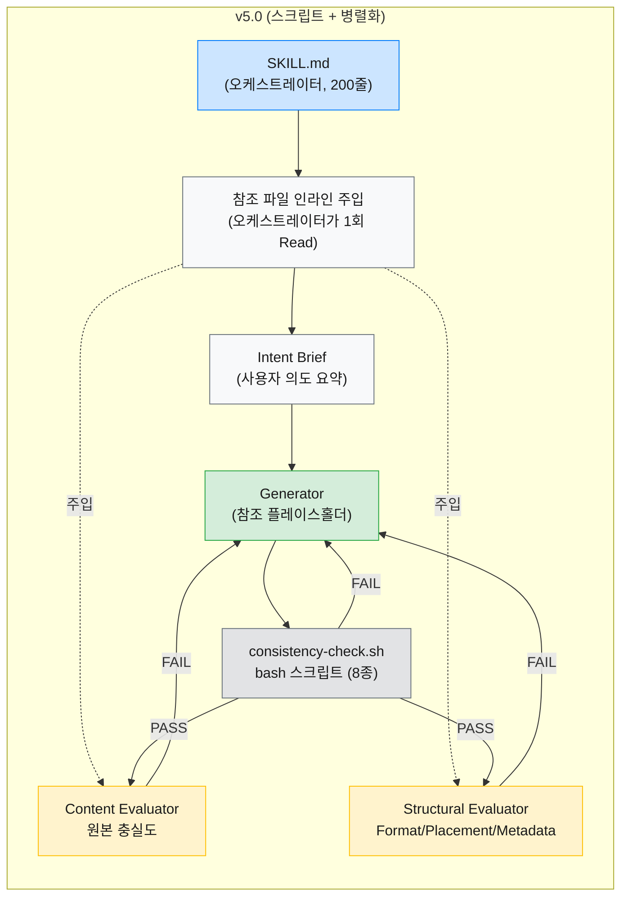
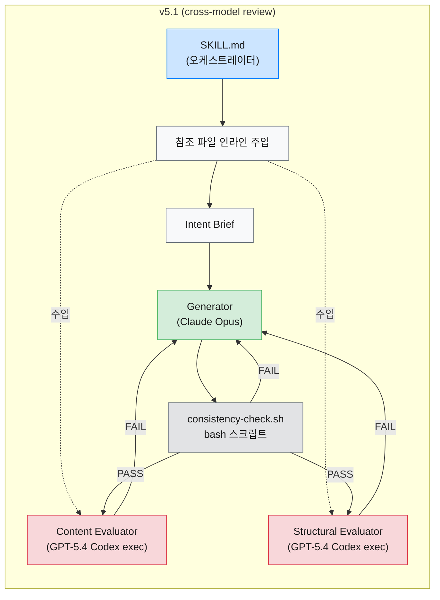
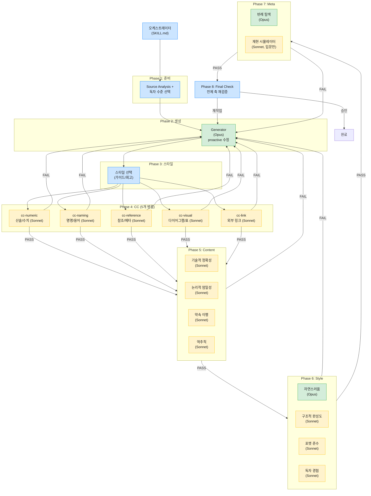
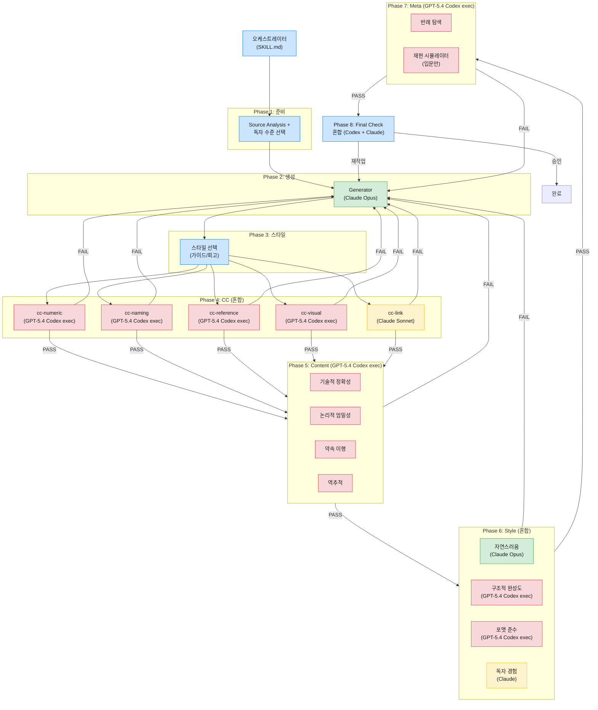

> [1편: Generator/Evaluator 분리와 Evaluator 전문화](/posts/claude-code-harness-pattern-guide-part1/)에서는 하네스 패턴의 핵심 개념, Generator/Evaluator 분리, Evaluator 전문화(축 분리), 10축 평가 확장까지를 다뤘다. 이번 편에서는 그 기반 위에서 CC(Consistency Checker) 스크립트 전환, 토큰 효율 최적화, 그리고 Evaluator를 GPT-5.4(Codex exec)로 전환하여 같은 모델의 blind spot을 회피하는 cross-model review까지 다룬다.

2편에서 사용하는 주요 약어: CC(Consistency Checker, 기계적 검사), Content Evaluator(원본 충실도 평가), Structural Evaluator(포맷/배치 평가). 모두 1편에서 도입한 개념이다.

1편의 섹션 2까지는 `document`와 `document-export` 두 스킬에 하네스 패턴을 도입하고, Evaluator를 전문화하는 과정을 다뤘다. 이 편에서는 그 이후의 이야기다.

### 3. 사례 1: `document` 스킬 리팩터링 (계속)

#### [ v5.0 - CC 스크립트 전환과 효율 최적화 ]

v4.0에서 품질 문제는 해결했지만 세 가지 비효율이 남아 있었다. CC가 sonnet급 LLM으로 8종 기계적 검사를 수행하고 있었고 서브에이전트들이 참조 파일을 개별 Read하는데다 Content와 Structural Evaluator까지 순차 실행되는 구조였다. prompt-optimizer로 분석해보니 총 5가지 최적화 전략이 나왔다.

**1. CC를 bash 스크립트로 전환**

v4.0 CC의 8종 검사(태그 형식, wikilink 따옴표, model 필드, 필드 순서, 체크박스, 수평선, 요약 형식, 빈 필드)는 전부 패턴 매칭으로 확인 가능한 기계적 검증이다. v5.0에서는 `scripts/consistency-check.sh`로 대체하여 awk와 grep으로 deterministic하게 실행하도록 바꿨는데 sonnet 호출 1회가 통째로 사라진 셈이다.

macOS bash 3.2에서 `declare -A`를 사용할 수 없어 POSIX 호환 패턴으로 작성했다. check #7에서 `integer expression expected` 에러가 발생했는데 `grep -c`가 매칭 없을 때 exit 1 + stdout "0"을 반환하고 `|| echo 0`에서 "0"이 중복 캡처되어 "0\n0"이 변수에 들어가는 것이 원인이었다.

```bash
# 문제: grep -c가 exit 1 + stdout "0"을 반환하면 || echo 0이 중복 실행
HAS_SUMMARY=$(grep -c '^## 요약' "$BODY_TMP" 2>/dev/null || echo 0)
# → HAS_SUMMARY에 "0\n0" 저장 → integer expression expected

# 해결: grep -q + && 패턴
HAS_SUMMARY=0
grep -q '^## 요약' "$BODY_TMP" 2>/dev/null && HAS_SUMMARY=1
```
{: .nolineno }

> deterministic 검증은 LLM보다 스크립트가 적합하다. 결과가 매번 동일하고, 토큰 비용이 0이며, 실행 시간이 즉시다. CC의 8종 검사처럼 패턴 매칭으로 판단 가능한 항목이라면 LLM 서브에이전트를 스크립트로 대체하는 것만으로 의미 있는 최적화가 된다.
{: .prompt-tip }

**2. 참조 파일 인라인 주입**

v4.0에서는 서브에이전트가 매 라운드 참조 파일을 직접 Read했다(Generator 4개, Structural 3개). v5.0에서는 오케스트레이터가 한 번만 읽고 플레이스홀더(`{common_rules}`, `{scenario_template}` 등)에 주입하는 구조로 바꿨는데 정본(single source of truth)은 유지되므로 규칙 변경 시 파일 한 곳만 수정하면 된다. Read 호출 7회 이상이 사라진 것이다.

**3. Content + Structural Evaluator 병렬화**

두 Evaluator 모두 파일을 읽기만 하므로 병렬 실행이 안전하다. v5.0에서는 동시에 디스패치한 뒤 결과 조합에 따라 다음 행동을 결정하는 방식이다.

| Content | Structural | 다음 행동 |
|---------|------------|-----------|
| PASS | PASS | 완료 |
| FAIL | PASS/FAIL | Content 피드백으로 Generator 재디스패치 (Structural 피드백도 함께 전달) |
| PASS | FAIL | Structural 피드백만으로 Generator 재디스패치 |
| UNCLEAR 포함 | - | UNCLEAR 항목을 사용자에게 확인 요청 후, 응답을 반영하여 재평가 |

Content FAIL이 Structural보다 우선하는 이유는 간단한데 Content 재생성 시 Structural 수정이 덮어씌워지기 때문이다.

**4. SKILL.md 경량화** -- 280줄에서 200줄로. CC 프롬프트 대신 bash 스크립트 경로를 명시하고 allowed-tools에 Bash를 추가하는 등의 조정이 포함된다.

**5. Update 흐름 추가** -- v4.0까지는 Create만 정의되어 있었다. v5.0에서는 "기존 문서 수정(UPDATE)" 흐름(Read → 정리 → Generator 재시도 → CC/평가)을 명시했다.



다이어그램의 "Intent Brief"는 오케스트레이터가 사용자 요청을 분석하여 생성 방향(주제, 톤, 범위 등)을 요약한 중간 산출물이다. Generator는 이를 받아 글을 작성한다.

#### [ v5.1 - Evaluator를 Codex exec로 전환 (cross-model review) ]

> Codex exec를 사용하려면 Codex CLI 설치와 ChatGPT 구독(OAuth 인증)이 필요하다.
{: .prompt-info }

Generator도 Claude, Evaluator도 Claude라면 동일한 blind spot을 공유할 수 있다. 실제로 생성 시 놓친 문제를 평가에서도 놓치는 현상이 관찰되었는데 v5.1에서는 이를 해결하기 위해 Content/Structural Evaluator를 `codex exec --output-schema`로 전환하여 GPT-5.4가 평가를 담당하도록 변경했다.

**프롬프트 인라인 조립 패턴**

Codex exec는 stdin으로 프롬프트를 받는다. "인라인 조립"이란 오케스트레이터가 평가 프롬프트(eval-*.md)와 노트 원문을 Read한 뒤 하나의 텍스트 파일로 합치는 과정이다. 구체적으로는 eval-*.md + 노트 내용을 Read → `/tmp/note-eval-*-prompt.txt`에 Write → `codex exec -m gpt-5.4 --output-schema eval-content-schema.json -o eval-content-result.json --ephemeral --skip-git-repo-check -`로 파이프 실행 → 결과 JSON 파싱 순서로 진행한다. `--skip-git-repo-check`는 non-git 환경용, `--ephemeral`은 세션 파일 방지용이다.

**JSON Schema 설계와 structured output 제약**

| 스키마 | 필드 구성 |
|--------|-----------|
| `eval-content-schema.json` | verdict, score, rationale, deductions, unclear, strategy |
| `eval-structural-schema.json` | verdict, format_score, placement_score, metadata_score, deductions, strategy |

여기서 배운 제약이 하나 있는데 **OpenAI structured output에서는** JSON Schema의 모든 properties가 required 배열에 포함되어야 한다. JSON Schema 일반 규칙이 아니라 OpenAI의 고유 제약이다. `source_reference` 필드가 required에 빠져 있어 400 에러가 발생했고 추가하자 해결됐다.

**프롬프트에 요약만 넣으면 오판이 발생한다**

노트 전문 대신 2~3줄 요약을 넣어봤더니 Content Evaluator가 정상 노트를 FAIL(3점)로 판정하는 것이다. 요약 입력이 오판에 기여했을 가능성이 높아서 "요약/축약 금지" 경고를 추가하여 해결했다.

> cross-model review에서 프롬프트 조립은 핵심 공정이다. Evaluator에게 전달하는 컨텍스트가 불충분하면 모델 전환의 이점과 무관하게 오판이 발생한다.
{: .prompt-warning }

**검증 결과**

| 항목 | 결과 |
|------|------|
| Content Evaluator | 첫 실행 FAIL(score 3) → Generator 재시도 → PASS(score 4) |
| Structural Evaluator | PASS(5/5/5) |
| cross-model 효과 | Claude가 놓친 이슈를 GPT-5.4가 검출 |

Claude가 놓친 "장단점 누락"과 "근거 없는 일반화"를 GPT-5.4가 잡아낸 것이 인상적이었다. Codex exec 실패 시에는 Claude Agent fallback 로직을 유지했다.



`document` 스킬은 v1에서 v5.1까지 하네스 패턴의 핵심 요소들을 하나씩 쌓아 올렸다. 이 경험이 `document-export` 스킬에도 직접 반영되었는데 `document-export`는 다른 방향으로 하네스를 확장한 사례다.

### 4. 사례 2: `document-export` 스킬 (계속)

#### [ v3.1 - CC 5분할과 scope-filter ]

`document-export`에서는 CC 자체의 구조가 문제였다. v3로 업데이트 모드를 돌렸을 때 10라운드에 걸쳐 50개 이상의 서브에이전트가 디스패치되면서, 근본 원인이 두 가지로 수렴했다. **CC의 주의력 분산**(Sonnet 1개가 11종 검사를 순차 수행하다 보니 뒤쪽 검사 품질이 저하)과 **업데이트 모드의 범위 미정의**(기존 이슈까지 재작업 발동)였다.

**CC 5분할**은 첫 번째 문제의 해법이다.

| 에이전트 | 검사 항목 | 특화 |
|----------|----------|------|
| cc-numeric | 산술, 수치 교차, 표-본문 수치 | 숫자 계산/대조 |
| cc-naming | 명명 일관성, 용어 통일 | 이름/용어 |
| cc-reference | Stale 참조, frontmatter, 전방참조 | 참조/순서/메타 |
| cc-visual | 시각요소 균일, 시각-본문 정합성 | 다이어그램/표 |
| cc-link | 외부 링크 | 네트워크 I/O |

각 에이전트가 1~3개 검사에만 집중하므로 주의력 분산이 줄고 병렬 실행이라 시간도 크게 늘지 않는다. 프롬프트에 규칙이 늘어날수록 각 규칙에 대한 모델의 주의력이 분산되는 현상을 "프롬프트 주의력 경제"라 부르는데 에이전트 분리가 이를 구조적으로 회피하는 방법이다.

**scope-filter 에이전트**는 두 번째 문제의 해법이다. Evaluator 결과를 받아 "재작업 대상"과 "기존 섹션 참고"로 분류하는 전용 에이전트다.

| 선택지 | 장점 | 단점 |
|--------|------|------|
| A. 오케스트레이터가 필터링 | 추가 에이전트 없음 | 오케스트레이터 역할 비대 |
| B. Evaluator가 분류 | Evaluator 내에서 처리 | 10개 파일에 동일 지침 중복 |
| C. 전용 에이전트 | 양쪽 모두 변경 없음 | Sonnet 1회 추가 비용 |

C안을 채택했다. Sonnet 1회 추가 비용만으로 오케스트레이터와 Evaluator 양쪽 모두 건드리지 않는 해법인 데다 관심사 분리 원칙도 유지되기 때문이다.

이 외에도 **Generator의 수치 창작**과 **스킬 내부 용어 미설명** 문제가 발견되어 Generator에 "독자 관점 원칙"/"수치 창작 금지"를, Evaluator에 "소스 내부 용어 확인"/"행 번호 명시"를 각각 추가했다.

| 구분 | v3 | v3.1 | v3.2 | v3→v3.1 | v3.1→v3.2 |
|------|:---:|:----:|:----:|:-------:|:---------:|
| 오케스트레이터 | 1 | 1 | 1 | -- | -- |
| Generator (Opus) | 1 | 1 | 1 | -- | -- |
| CC (Sonnet) | 1 | 5 | 5 | +4 | -- |
| scope-filter (Sonnet) | -- | 1 | -- | +1 | -1 |
| Content Evaluators (Sonnet) | 4 | 4 | 4 | -- | -- |
| Style Evaluators (혼합) | 4 | 4 | 4 | -- | -- |
| Meta Evaluators (혼합) | 1~2 | 1~2 | 1~2 | -- | -- |
| **합계** | **12~13** | **16~18** | **16~17** | **+4~5** | **-1** |

> 합계가 범위인 이유: Meta Evaluators 수가 1~2개이고 scope-filter는 업데이트 모드에서만 호출된다. 신규 모드 기준 v3.1은 16~17, 업데이트 모드 기준으로는 17~18이다.
{: .prompt-info }

이번 사례에서 확인한 교훈은 프롬프트 주의력 경제가 CC에도 적용될 수 있다는 점이다. 분리는 독립적으로 검증 가능하고 병합 비용이 낮은 축에 한해 효과적인데 과도하면 조정 비용 증가와 범위 불일치를 낳는다. 바로 다음 절의 scope-filter 실패가 그 한계를 보여준다.

#### [ v3.2 - scope-filter 제거와 proactive 전환 ]

CC 5분할은 효과적이었지만 scope-filter는 기대한 대로 동작하지 않았다. 50개 이상의 서브에이전트를 실행했는데도 점수가 거의 개선되지 않은 것이다.

| 축 | 1라운드 → 5라운드 |
|----|:-----------------:|
| 기술적 정확성 | 7 → 7 |
| 논리적 엄밀성 | 7 → 7 |
| 자연스러움 | 8 → 8 |

가장 유력한 원인은 **평가 범위와 수정 범위의 불일치**였다. scope-filter의 분류 정확도나 Generator 자체의 수정 성능도 기여했을 수 있지만 범위 불일치가 가장 직접적인 설명이다. Evaluator는 글 전체를 보고 7점을 매기는데 scope-filter가 "범위 밖"이라고 분류한 항목은 Generator에 전달되지 않는다. v3는 양쪽 모두 전체를 다뤄서 무한 재작업이 발생했고 scope-filter는 수정 범위만 축소해서 정반대 증상(점수 정체)이 나타난 셈이다. 결국 두 경우 모두 평가 범위와 수정 범위를 정렬하는 것이 과제였다.

해법은 접근 방식의 전환이었다. Generator가 처음부터 proactively 기존 이슈까지 수정하면 Evaluator가 발견할 이슈의 상당수가 첫 패스에서 해소되기 때문이다. 다만 범위를 한정한 업데이트에서는 회귀를 일으킬 위험이 있으므로 사용자가 전체 정리를 허용했거나 회귀 검증이 있을 때 유효하다.

| 변경 | 내용 |
|------|------|
| scope-filter 제거 | `agents/scope-filter.md` 삭제, SKILL.md의 Phase 5/6/7/8에서 scope-filter 디스패치 4건 제거 |
| Generator 업데이트 모드 지침 | 업데이트 모드에서도 요청된 변경과 함께 기존 이슈(코드 오류, 깨진 frontmatter, 코드 블록 언어 미지정, 표기 불일치 등)를 첫 패스에서 proactively 수정 |
| 반복 수정 방지 규칙 | 같은 행에 대해 표현만 바꾸는 수정이 2회 이상 반복되면, 표현 교체가 아닌 주장 축소 또는 삭제를 검토 |

세 번째 규칙은 당시 원고의 "행 166 토끼굴"에서 비롯되었는데 하나의 행을 5번 수정해도 매번 Evaluator가 새 각도에서 지적하는 것이다. 결국 표현이 아니라 주장 자체의 근거가 약했던 것이다.



> 업데이트 모드에서는 Phase 3(스타일 선택)을 건너뛰고, Generator 출력이 바로 CC로 향한다.
{: .prompt-info }

가장 큰 교훈은 **에이전트를 추가하는 것이 항상 답은 아니라**는 점이다. scope-filter는 관심사 분리 원칙에 따른 깔끔한 설계였지만 근본 원인을 해결하지 못했다. Generator의 동작 방식을 reactive에서 proactive로 전환하는 쪽이 더 효과적이었고 아키텍처도 오히려 줄었다(16~18 → 16~17).

#### [ v4 - 토큰 효율 최적화 ]

아키텍처는 안정됐는데 토큰 사용 패턴을 들여다보니 생각보다 비효율이 많았다. prompt-optimizer로 분석해보니 네 가지 최적화 지점이 드러났다.

**진단: 어디서 토큰이 새고 있었나**

업데이트 모드 세션(4라운드)을 돌려보니 Generator Opus가 매번 5개 참조 파일(~953줄)을 Read하여 합산 ~3,812줄을 읽고 있었는데 R2~R4의 실제 수정량은 각각 4~9줄에 불과했다.

| 이슈 | 규모 |
|------|------|
| 10개 eval 파일에 동일한 naturalness few-shot 예시 복사 | ~300줄 중복 |
| 15개 파일(eval 10 + cc 5)의 "이전 라운드" 보일러플레이트 | ~105줄 중복 |
| SKILL.md의 Graphviz dot 다이어그램 | 92줄 (텍스트 설명과 중복) |
| cc-link.md의 Exa 도구명 `crawling_exa` | 실제 MCP 도구명과 불일치 |

**Phase 1: few-shot 축별 특화와 보일러플레이트 압축**

10개 eval 파일 모두에 동일한 naturalness 예시가 복사되어 있었는데 기술적 정확성 evaluator에게 종결어미 예시를 보여줘야 할 이유가 없다. 나머지 9개를 각 축의 전용 예시로 교체했다.

| 축 | 나쁜 예시 포커스 | 좋은 예시 포커스 |
|---|---|---|
| technical-accuracy | 원본 대조 없이 "대체로 정확" | 수치 왜곡 + hallucination 식별 |
| logical-rigor | 인과 관계 미검증 | 교란 변수 지적 + 표본 크기 문제 |
| promise-fulfillment | 키워드 미체크 | 글 유형("적용하기") 이행 여부 |
| backtrack | 근거 역추적 안 함 | 근거 강도 "약" 판정 + 과일반화 |
| structural-completeness | 깊이 불균형 무시 | 섹션별 줄 수 비교 + 전환 인용 |
| format-compliance | Chirpy 기능 미확인 | mermaid 누락 + 코드 블록 언어 미지정 |
| reader-experience | 독자 수준 무시 | 전문 용어 미설명 + 내부 용어 |
| counterexample | 반례 탐색 안 함 | 조건 반례 + 역효과 반례 |
| reproduce | 시뮬레이션 안 함 | 설정값 누락 + 성공 기준 부재 |

보일러플레이트도 함께 압축했다. eval 10개의 "이전 라운드 컨텍스트" 8줄→3줄, cc 5개의 "이전 라운드 결과" 16줄→5줄로 줄였는데 합산 ~105줄이 절감된 셈이다.

**Phase 2: SKILL.md 경량화**

92줄짜리 Graphviz dot 다이어그램과 Retry 로직 11줄을 MAINTENANCE.md로 이동하고 3줄 요약으로 대체. SKILL.md는 324줄→~224줄, ~100줄 절감.

**Phase 3: Generator 조건부 Read**

이번 최적화 중 가장 고민이 됐던 변경인데 R1(초기 생성)에서는 5개 참조 파일 전체를 읽어야 하지만 R2 이후에는 피드백 유형에 따라 필요한 파일이 다르기 때문이다.

| 라운드 | Read 대상 | 줄 수 |
|:---:|---|:---:|
| R1 (초기 생성) | 5개 전체 | ~953 |
| R2+ (CC 피드백) | generator.md + rubric.md + chirpy-reference.md | ~332 |
| R2+ (Content 피드백) | generator.md + rubric.md + korean-writing.md | ~565 |
| R2+ (Style 피드백) | generator.md + rubric.md + korean-writing.md + guide-style.md | ~859 |

동일 소스(`document` v5.0 문서)로 A/B 테스트를 실행했다.

| 항목 | A (전체 Read) | B (조건부 Read) |
|---|---|---|
| 라운드 | 4 | 6 |
| CC | 2라운드 | 3라운드 |
| Content | 1라운드 | 2라운드 |
| Style | 1라운드 | 1라운드 |
| Generator 총 Read | ~3,812줄 | ~3,606줄 |

A/B 산출물을 별도 세션에서 5개 모델에 블라인드로 비교 요청한 결과 **5개 모델 전원이 B를 선택**했다.

- **문체**: 1인칭 실무 경험담 톤이 살아 있었다. A는 보고서 톤에 가까웠다
- **인식론적 정직성**: 인과 주장에서 교란변수를 명시하고 일반화 한계를 표기했다. A는 단정적이었다
- **섹션 구조**: 6절의 서브섹션을 2개에서 4개로 분리하여 교훈 가시성을 높였다
- **description**: 장문 나열에서 1문장 요약으로 변경하여 SEO/가독성이 개선됐다
- **섹션 전환**: 브릿지 문장이 삽입됐다

다만 A가 더 나은 점(type/instance 구분, 루프 종료 조건, 파일 구조 다이어그램 정보량)도 있었다. 참조를 줄인 쪽이 선호된 이유는 컨텍스트 집중도 향상과 추가 라운드 효과가 모두 기여했을 가능성이 있는 만큼 단일 A/B 테스트라는 점에서 일반화에는 한계가 있다.

**Phase 4: cc-link 도구명 버그 수정**

cc-link.md의 Exa 도구명이 `crawling_exa`(존재하지 않는 이름)로 되어 있어 실제 도구명 `mcp__plugin_everything-claude-code_exa__web_fetch_exa`로 3곳 수정.

**총 절감 효과**

| 항목 | 절감량 |
|------|--------|
| SKILL.md | ~100줄 (324 → ~224) |
| eval/cc 보일러플레이트 | ~105줄 |
| Few-shot 예시 | 줄 수 변화 없음, 축별 적합도 향상 |
| Generator R2+ Read | 피드백 유형에 따라 ~94줄~621줄 절감 |
| 수정 파일 수 | 18개 (eval 10 + cc 5 + SKILL.md + MAINTENANCE.md + cc-link.md) |

v4는 아키텍처를 건드리지 않고 토큰 낭비만 줄인 최적화인 셈이다.

토큰 효율을 잡았으니, 이제 남은 과제는 평가 모델의 다양성이었다.

#### [ v5 - Codex + Claude 혼합 아키텍처 (cross-model review) ]

`document` v5.1에서 검증한 cross-model review 패턴을 `document-export`의 16~17개 에이전트에 확장 적용했다. 전환 기준은 두 가지인데 도구 불필요한 순수 검증 태스크는 Codex로, 한국어 뉘앙스 판단이나 MCP 도구 의존은 Claude로 유지하는 것이다.

| 에이전트 | 이전 모델 | 전환 결과 | 전환 이유 |
|---------|----------|----------|----------|
| eval-technical-accuracy | Sonnet | Codex | 검증 태스크, 도구 불필요 |
| eval-logical-rigor | Sonnet | Codex | 검증 태스크, 도구 불필요 |
| eval-promise-fulfillment | Sonnet | Codex | 검증 태스크, 도구 불필요 |
| eval-backtrack | Sonnet | Codex | 검증 태스크, 도구 불필요 |
| eval-format-compliance | Sonnet | Codex | 기계적 포맷 검증 |
| eval-structural-completeness | Sonnet | Codex | 구조 검증 |
| eval-counterexample | Opus | Codex | 적대적 검증, cross-model 효과 최대 |
| eval-reproduce | Sonnet | Codex | 독립 시뮬레이션 |
| eval-naturalness | Opus | Claude 유지 | 한국어 미묘한 뉘앙스 판단 |
| eval-reader-experience | Opus/Sonnet | Claude 유지 | 독자 공감 판단, 조건부 Opus |
| Generator | Opus | Claude 유지 | 생성 = Claude 강점 |
| cc-numeric | Sonnet | Codex | 숫자 정합성 검증, 도구 불필요 |
| cc-naming | Sonnet | Codex | 용어 일관성 검증, 도구 불필요 |
| cc-reference | Sonnet | Codex | 참조 정합성 검증, 도구 불필요 |
| cc-visual | Sonnet | Codex | 시각 요소 검증, 도구 불필요 |
| cc-link | Sonnet | Claude 유지 | web_fetch_exa MCP 도구 사용, 외부 URL 검증 필요 |

eval-counterexample은 기존 Opus였는데 [1편](/posts/claude-code-harness-pattern-guide-part1/)에서 "주관적 판단"으로 분류했던 것과 달리 실질적으로는 적대적 검증 역할이라 cross-model 효과가 가장 클 것으로 판단하여 Codex로 전환했다.

**JSON Schema 설계 (6개 공유 스키마)**

출력 형식이 동일한 evaluator끼리는 공유 스키마를 사용하는 방식이다.

| 스키마 | 사용 evaluator | 특수 필드 |
|--------|---------------|----------|
| `eval-content-common-schema.json` | technical-accuracy, logical-rigor, promise-fulfillment | `unclear[]` |
| `eval-backtrack-schema.json` | backtrack | `unclear[]` + `backtrack_mapping[]` |
| `eval-style-common-schema.json` | format-compliance, structural-completeness | (UNCLEAR 미지원) |
| `eval-counterexample-schema.json` | counterexample | `unclear[]` + `counterexample_mapping[]` |
| `eval-reproduce-schema.json` | reproduce | `simulation_log[]` |
| `cc-common-schema.json` | cc-numeric, cc-naming, cc-reference, cc-visual | `checks[]` (항목별 검증 결과 배열) |

**Phase별 변경** (프롬프트 조립 패턴은 `document` v5.1과 동일)

| Phase | 변경 내용 |
|-------|----------|
| Phase 4 (CC) | 4개 Codex exec + cc-link Claude Agent(MCP 도구 필요) |
| Phase 5 (Content) | 4개 전부 Codex exec |
| Phase 6 (Style) | 혼합: Codex 2개(format, structural) + Claude Agent 2개(naturalness, reader-experience) |
| Phase 7 (Meta) | 1~2개 전부 Codex exec |
| Phase 8 (Final Check) | 혼합 (Codex + Claude Agent) |

**트러블슈팅**

| 문제 | 원인 | 해결 |
|------|------|------|
| evaluator.md 모델 테이블이 Sonnet/Opus로 표기 | SKILL.md Phase 수정 시 모델 참조 테이블 누락 | GPT-5.4 Codex exec로 일괄 업데이트 |
| Phase 8에 Codex fallback 누락 | Phase 5에만 fallback 작성, Phase 8 미반영 | "Phase 5와 동일 fallback" 명시 추가 |
| Phase 6/7의 fallback 설명 불충분 | 각 Phase별 독립 작성 시 일관성 미확인 | "Phase 5와 동일" 참조 문구 추가 |
| MAINTENANCE.md Phase 8 노드에 실행 방식 레이블 없음 | 다이어그램 업데이트 시 누락 | "(혼합 Codex + Claude Agent)" 레이블 추가 |

모든 Codex 호출에는 Claude Agent fallback을 포함해두었는데 Codex 장애 시에도 평가가 중단되지 않도록 하기 위해서다.

**최종 아키텍처**



> 업데이트 모드에서는 Phase 3(스타일 선택)을 건너뛰고, Generator 출력이 바로 CC로 향한다.
{: .prompt-info }

색상만으로도 모델 배치가 한눈에 보인다. CC 4개와 Content 전체가 Codex exec, Style은 자연스러움과 독자 경험만 Claude로 유지하는 혼합 구조다.

`document`와 `document-export` 두 스킬의 하네스가 여기까지 왔다. 경로는 달랐지만 반복적으로 나타난 공통점이 있는데 이를 정리해보자.

### 5. 두 사례에서 배운 것

#### [ 공통 패턴: 분리, 정본, 얇은 오케스트레이터 ]

두 스킬에 반복적으로 확인된 세 가지 패턴이 있다.

**독립적 프롬프트 개선.** 분리 후에는 Generator 톤을 바꿔도 Evaluator가 멀쩡하다는 게 생각보다 큰 안도감이었다.

**정본 파일(references).** `document`에서 obsidian-gotchas.md를 664행→211행으로 줄일 때나 `document-export`에서 rubric.md를 4축→10축으로 확장할 때나 references 한 곳만 수정하면 양쪽 에이전트에 즉시 반영되었다.

**얇은 오케스트레이터.** `document`의 CC→bash 교체, `document-export`의 rubric 10축 확장 모두 오케스트레이터를 건드릴 필요가 없었는데 두 스킬 모두 같은 원칙으로 만들었으므로 일반화에 한계가 있다. 참고로 `document`는 5점 만점, `document-export`는 10점 만점으로 채점 스케일도 달라서 오케스트레이터가 얇다는 것이 반드시 모든 구조에서 재현되리라고 단정하긴 어렵다.

#### [ Cross-model review ]

**같은 모델이 생성과 평가를 하면 blind spot을 공유할 수 있다.** `document` v5.1에서 실제로 Claude가 놓친 "장단점 누락"과 "근거 없는 일반화"를 GPT-5.4가 발견했다. [1편](/posts/claude-code-harness-pattern-guide-part1/)의 "양 x 다양성 > 깊이 x 1" 원칙을 역할 수준에서 모델 계열 수준으로 한 단계 더 확장한 셈이다. 단일 실전 테스트의 관찰이므로 일반화에 한계가 있다. 전환 기준은 실용적이었다. 도구 불필요한 순수 검증은 Codex exec로, 한국어 뉘앙스나 MCP 도구 의존은 Claude로 유지.

#### [ 같은 원칙, 다른 구현 ]

**"주의력은 유한하다"는 원칙.** `document`는 60개 문서 실험으로 프롬프트를 가볍게 유지하는 쪽을 택했고 `document-export`는 에이전트 수를 늘려 각각 자기 축만 보도록 분리하는 쪽을 택했다. 같은 원칙인데 규칙 증가 속도와 실행 빈도에 따라 해법이 갈린 것이다.

**Evaluator 분리의 깊이.** `document-export`의 14에이전트 실험에서 Opus 1개보다 역할이 다른 Sonnet N개가 더 효과적이었다. 모델의 능력 차이보다 관점의 차이가 검출력에 더 큰 영향을 미친 셈인데 이것이 10축 분리의 근거가 되었다. 반면 `document`는 기계적 검증 항목이 대부분이라 Content만 독립시키고 나머지는 하나로 묶는 것으로 충분했다.

**재시도 루프 제어.** `document`에서는 선언적 지시로는 LLM이 루프를 건너뛰어서 while 루프 의사코드로 해결했고 `document-export`에서는 처음부터 Phase 기반 절차적 제어를 내장하는 방식을 선택했다.

그렇다면 하네스 패턴에 정답 구조가 있을까? 도구는 동일하지만 스킬의 실행 맥락(유인/무인, 주관적/기계적, 단발/반복)이 적용 강도를 결정하거든.

### 6. 내 스킬에 하네스 패턴 도입하기

여기까지가 두 스킬의 시행착오인데, 그렇다면 내 스킬에는 어디서부터 시작하면 될까?

#### [ 스킬 특성별 설계 선택 ]

| 특성 | 선택지 A | 선택지 B | 판단 기준 |
|------|----------|----------|-----------|
| 실행 주체 | 유인 (사용자가 지켜봄) | 무인 (cron, 자동화) | 무인일수록 절차적 제어와 이력 축적을 강하게 설계 |
| 평가 성격 | 기계적 (형식, 문법, 수치) | 주관적 (자연스러움, 논리) | 각 축을 독립적으로 판단해도 의미가 유지될 때 분리를 늘림. 전체 맥락과 톤을 함께 봐야 하는 축은 과도한 분리가 holistic judgment를 약화시킬 수 있다 |
| 실행 빈도 | 단발 / 저빈도 | 반복 / 고빈도 | 고빈도일수록 실행 간 학습 메커니즘을 고려 |
| 규칙 증가 속도 | 안정적 | 계속 추가됨 | 규칙이 빠르게 늘면 에이전트 분리로 주의력 분산을 선제 방어 |

다만 이번 두 사례는 모두 마크다운 생성이라는 공통점이 있고 다른 유형의 스킬에서는 검증하지 않았다. 코드 포맷팅이나 단순 변환처럼 평가 기준이 전적으로 기계적이고 deterministic 스크립트로 100% 커버되는 스킬이라면 단일 패스 + 엄격한 규칙이 더 효율적일 수 있다.

#### [ 도입 체크리스트 ]

1. **채점 기준부터 작성한다.** 최소한 채점 축과 승인 임계값을 정의하면 된다. 이 글의 두 스킬에서는 초기 임계값을 낮게 잡고(예: `document` 4/5, `document-export` 초기 축별 8~9) 3회 이상 실행해서 절반 이상 FAIL이 나오면 임계값을 한 단계 올리는 식으로 점진 조정했다. 최소 파일 구조:

   ```plaintext
   skills/my-skill/
   ├── SKILL.md          (오케스트레이터)
   ├── agents/
   │   ├── generator.md  (Generator)
   │   └── evaluator.md  (Evaluator)
   └── references/
       └── rubric.md     (채점 기준)
   ```
   {: .nolineno }
2. **단일 Evaluator에서 출발하는 것이 좋다.** 처음부터 축을 세분화하면 오버엔지니어링이 되기 쉽다.
3. **CC는 Evaluator 앞에 배치한다.** 형식 오류가 남은 상태에서 품질 평가를 돌려봐야 토큰만 낭비되기 때문이다.
4. **품질 천장에 부딪히면 축을 분리한다.** 단일 Evaluator로 점수가 정체하기 시작하면 축별 전문 Evaluator를 검토하면 된다. `document-export`에서는 단일 Opus Evaluator의 점수가 올라가지 않아 축 분리로 전환했다.
5. **회의적 튜닝을 적용한다.** 합리화 금지, 문장 인용 의무, 점수 기준 교정 지침을 넣지 않으면 독립된 Evaluator도 관대해지기 쉽다. 다만 과도하면 사소한 항목에도 FAIL을 반복하므로 초기 몇 회 실행에서 강도를 조정하는 것이 좋다.
6. **에이전트 추가 전에 자문한다.** "근본 원인을 해결하는가, 증상만 우회하는가?"
7. **같은 모델이면 cross-model review를 검토한다.** 도구 불필요한 순수 검증 태스크부터 다른 모델로 전환하는 것이 가장 안전한 출발점인데 한국어 뉘앙스나 MCP 도구 의존이 있는 에이전트는 기존 모델을 유지하면 된다. 자기 스킬에서 소규모로 먼저 검증한 뒤 전체 전환을 판단하는 것이 좋다.

---

Evaluator를 만들었다고 끝이 아니다. 회의적 튜닝을 적용한 뒤에야 `document-export`의 자연스러움 점수가 유의미하게 올라갔다. 동시에 scope-filter 제거에서 배운 것도 있다. 근본 원인을 짚지 않은 채 에이전트를 늘리면 복잡도만 올라간다. A/B 테스트에서 참조를 줄인 쪽이 오히려 선호되었는데 참조 축소 외에도 추가 라운드 등 여러 변수가 함께 작용했으므로 어떤 요인이 주효했는지는 분리되지 않았다.

자기 스킬에 처음 적용한다면 단일 Evaluator → 축 분리 → 토큰 효율 → cross-model review 순서가 자연스럽다. 내 다음 과제는 코드 생성 스킬처럼 마크다운이 아닌 도메인에서도 같은 패턴이 유효한지 확인하는 것인데 아직 손대지 못했다.

### 참고 자료

- [Anthropic - Harness design for long-running application development](https://www.anthropic.com/engineering/harness-design-long-running-apps)
- [Anthropic - Effective harnesses for long-running agents](https://www.anthropic.com/engineering/effective-harnesses-for-long-running-agents)
- [Extend Claude with skills - Claude Code 공식 문서](https://code.claude.com/docs/en/skills)
- [OpenAI - Harness engineering](https://openai.com/index/harness-engineering/)
