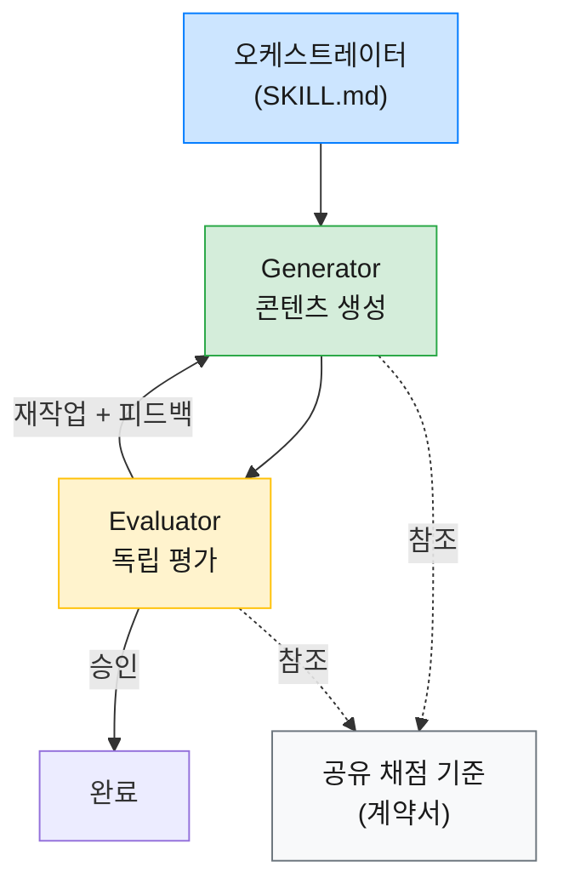
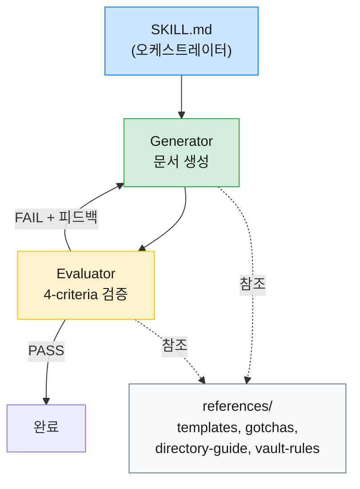
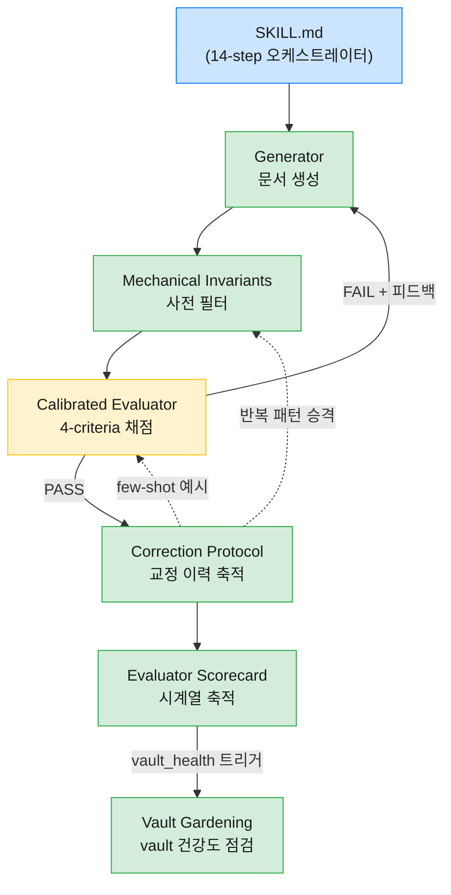

Claude Code의 스킬(Skill)은 반복 작업을 자동화하는 강력한 도구지만, 단일 패스 방식으로 구현하면 품질이 들쭉날쭉해지는 문제가 있다. 생성과 검증이 하나의 흐름 안에서 동시에 일어나면 어느 쪽도 제대로 하기 어렵기 때문이다. 이 글에서는 그 해법으로 하네스 패턴(Harness Pattern)을 세 스킬에 적용한 과정을 정리한다.

| 스킬                      | 역할                                                          |
| ----------------------- | ----------------------------------------------------------- |
| `note`                  | Obsidian vault에 마크다운 문서를 생성하는 스킬                            |
| `tech-blog-transformer` | 마크다운 문서를 기술 블로그 포스트로 변환하는 스킬                                |
| `vault-sync`            | 외부 데이터(캘린더, Slack)를 수집하여 Obsidian vault 문서를 자동 생성하는 cron 스킬 |

`note` 스킬의 리팩터링과 60개 문서 실험, `tech-blog-transformer`의 4축 채점 기준과 Consistency Checker 사전 필터, 그리고 `vault-sync`의 5레이어 아키텍처와 4버전에 걸친 진화 과정까지 함께 살펴본다.

### 1. 왜 하네스 패턴이 필요한가

#### [ 단일 패스 스킬의 한계 ]

세 스킬 모두 처음에는 단일 패스 방식이었다. 하나의 프롬프트가 글을 생성하고, 같은 프롬프트 안에서 품질까지 점검하는 구조로, 이 방식을 써보면서 가장 크게 부딪힌 문제가 자기 평가 편향이다.

글을 쓴 에이전트가 스스로 품질을 점검하면 관대해지는 경향이 있다. `note` 스킬에서는 Evaluator 없이 Generator가 형식, 배치, 메타데이터, 내용을 모두 스스로 판단했고, 결과물의 문서 형식은 늘 제각각이었다. `tech-blog-transformer`에서도 사정은 비슷해서, 마지막 단계인 Quality Check가 형식적으로 흘러가면서 "괜찮지만 뛰어나지 않은" 수준의 품질 천장에 부딪혔다.

거기에 더해 개선 자체도 어려웠다. 생성과 평가가 하나의 프롬프트에 섞여 있으면, 생성 품질을 높이려고 프롬프트를 수정할 때 평가 기준까지 흔들린다. 반대도 마찬가지여서, 한쪽을 건드리면 다른 쪽이 깨지는 악순환이 되기 쉬웠다.

결국 두 문제의 근본 원인은 같았다. 생성과 평가를 분리하지 않는 한 각 역할에 집중할 수가 없다.

### 2. 하네스 패턴이란

#### [ Generator/Evaluator 분리 ]

위 문제를 겪으면서 찾은 해법이 하네스 패턴(Harness Pattern)이다. 에이전트가 자유롭게 생성하되 별도의 평가 단계에서 독립적으로 검증하는 구조로, OpenAI의 "Harness engineering"과 Anthropic의 "Harness design" 문서에서 소개한 개념이기도 하고, GAN(Generative Adversarial Network)에서 영감을 받은 접근이기도 하다.

이걸 실제로 적용해보면, 글을 쓰는 에이전트(Generator)와 글을 평가하는 에이전트(Evaluator)의 컨텍스트를 완전히 분리하게 된다. Evaluator는 Generator가 어떤 프롬프트를 받았는지 모르는 상태에서 오직 결과물과 평가 기준만으로 판단하고, 이 독립성이 자기 평가 편향을 차단하는 핵심 메커니즘이 된다.

#### [ 핵심 구성 요소 ]

하네스 패턴을 실제로 구현하면 네 가지 구성 요소가 필요하다.

| 구성 요소 | 역할 |
|-----------|------|
| 오케스트레이터 | Generator와 Evaluator를 조율하고 루프 상태를 추적하는 역할 |
| Generator | 콘텐츠를 생성하고, Evaluator 피드백을 받으면 해당 부분을 수정 |
| Evaluator | 채점 기준에 따라 독립적으로 평가하여 승인 또는 재작업 판정을 내림 |
| 공유 채점 기준 | Generator와 Evaluator 양쪽이 참조하는 "계약서" 역할의 문서 |

오케스트레이터가 Evaluator의 판정을 읽고, 재작업이 필요하면 피드백과 함께 Generator를 다시 호출하는 루프 구조가 된다. 공유 채점 기준은 Anthropic의 하네스 문서에서 말하는 "sprint contract"에 해당하고, Generator는 자기가 어떤 기준으로 평가받는지 미리 알 수 있으며, Evaluator는 같은 기준으로 채점하게 되어 기대치 불일치가 줄어든다.



이제 이 패턴을 세 개의 스킬에 어떻게 적용했는지 살펴보자.

### 3. 사례 1: note 스킬 리팩터링

#### [ 문제 - 5가지 품질 문제 ]

`note` 스킬은 Obsidian vault에 마크다운 문서를 생성하는 도구다. v1은 하나의 프롬프트로 문서를 한 번에 생성하는 단일 패스 방식이었고, 사용하면서 다섯 가지 문제가 드러났다.

- 문서 형식 불일치: 같은 유형의 문서임에도 요약 형식(Callout vs 헤딩), frontmatter 필드, 원문 링크 형식이 제각각
- 트리거 범위 부족: `note`를 명시적으로 호출할 때만 동작하고, 크롤링이나 대화 정리 등 다른 상황에서는 규칙이 적용되지 않음
- 시나리오별 형식 부재: 크롤링, 대화 정리, 코드 정리, 일반 노트의 형식 구분이 없음
- 디렉토리 판단 오류: 세부 경로 선택이 부적절하거나, 새 폴더가 필요한 상황에서 기존 폴더에 억지로 배치
- Obsidian 문법 오류: LLM이 frontmatter 태그 형식이나 wikilink 따옴표 같은 Obsidian 고유 문법을 일관되게 틀림

다섯 가지가 별개의 문제처럼 보이지만, 근본 원인은 하나다. 단일 패스에서 생성과 검증이 동시에 일어나기 때문에 어느 쪽도 충분히 할 수 없었던 것이다.

#### [ 설계와 구현 ]

Generator/Evaluator 분리 패턴을 채택하면서 가장 먼저 한 일은 SKILL.md를 오케스트레이터로 전환하는 것이었다. 세부 규칙을 모두 정본 파일(references)로 분리하고, Generator와 Evaluator가 동일한 기준을 참조하도록 구조를 잡았다.

```
skills/note/
├── SKILL.md              (185행, 오케스트레이터)
├── prompts/
│   ├── generate.md       (Generator subagent)
│   └── evaluate.md       (Evaluator 4-criteria)
└── references/
    ├── obsidian-gotchas.md (211행, LLM gotchas)
    ├── templates.md       (시나리오별 정본)
    ├── directory-guide.md (배치 규칙)
    └── vault-rules.md    (볼트 규칙)
```
{: .nolineno }

Evaluator에는 4가지 평가 기준을 도입했다: Format(형식), Placement(배치), Metadata(메타데이터), Content(내용). 여기서 중요한 설계 결정이 하나 있었다. Evaluator의 독립성이다. Evaluator는 Generator의 프롬프트를 모르는 상태에서 결과물만 보고 판단해야 하고, 이 독립성이 무너지면 평가가 "프롬프트를 잘 따랐는가"로 변질될 수 있기 때문이다.

> Evaluator가 Generator의 프롬프트를 알게 되면, 결과물의 품질이 아니라 프롬프트 준수도를 평가하게 된다. 생성과 평가의 관심사가 다시 결합되는 셈이다.
{: .prompt-tip }

정본 파일을 공유하는 구조의 효과도 컸다. 규칙이 변경되면 `references/` 아래 파일 한 곳만 수정하면 Generator와 Evaluator 모두에 반영되기 때문에, 한쪽을 수정할 때 다른 쪽이 깨지는 걱정 없이 독립적으로 개선할 수 있게 됐다.

트리거 범위도 확장했다. `note` 명시 호출뿐 아니라 vault 경로에 MD를 생성하는 모든 상황에서 자동 적용되도록 변경했고, 크롤링이나 대화 정리에서도 일관된 형식이 나오게 됐다.



리팩터링 후 크롤링과 대화 정리 시나리오로 스모크 테스트를 진행했다.

| 시나리오 | Format | Placement | Metadata | Content | 판정 |
|----------|--------|-----------|----------|---------|------|
| 크롤링 | 5 | 3 | 5 | 4 | PASS |
| 대화 정리 | 5 | 4 | 5 | 5 | PASS |

전 항목 PASS로 기본적인 품질이 확보된 것을 확인했다.

#### [ 60개 문서 실험으로 규칙 경량화 ]

구현을 마치고 보니 obsidian-gotchas.md가 664행에 달해서 매번 읽어야 하는 토큰이 문제였다. 여기서 "모든 규칙이 정말 필요한가?"라는 의문이 생겼고, 실험으로 검증하기로 했다.

실험 설계는 단순했다. obsidian-gotchas.md를 참조하지 않은 상태에서 LLM이 순수 지식만으로 Obsidian 마크다운을 생성하게 한 뒤, 각 규칙의 위반 여부를 자동 검사하는 것이다. Opus 에이전트 10개, Sonnet 에이전트 50개를 돌려서 총 60개 문서를 생성했다.

| 규칙                     | Opus 위반율 | Sonnet 위반율 | 전체 위반율 |
| ---------------------- | -------- | ---------- | ------ |
| 태그 `"#태그명"` 형식         | 89%      | 100%       | 98%    |
| wikilink `"[[문서]]"` 형식 | 33%      | 72%        | 66%    |
| Callout 문법             | 0%       | 0%         | 0%     |
| 수평선, 체크박스, 하이라이트 등     | 0%       | 0%         | 0%     |

결과가 명확했다. LLM은 Obsidian frontmatter에서 태그에 따옴표를 붙이는 규칙을 거의 100% 틀리고, wikilink에 따옴표를 붙이는 것도 66%의 확률로 틀렸지만, Callout이나 수평선 같은 표준 마크다운 문법은 전혀 틀리지 않았다.

> LLM이 실제로 틀리는 규칙(태그 따옴표 98%, wikilink 66%)에만 상세 예시를 유지하고, 위반율 0%인 규칙은 참고 수준으로 축소하는 것이 토큰 효율의 핵심이다.
{: .prompt-info }

이 결과를 바탕으로 위반율 0% 항목 9개를 하단 "참고" 섹션으로 이동시키고 상세 예시를 제거했다. 실험 과정에서 사용한 메타 정보(위반율 수치, 60개 문서 등)도 함께 빼냈다. Generator와 Evaluator가 알아야 할 것은 "이 규칙을 지켜라"이지 "왜 이 규칙이 존재하는지"가 아니기 때문이다.

최종 결과: 664행에서 211행으로 68% 감소.

### 4. 사례 2: tech-blog-transformer 스킬

#### [ 문제 - 자기 평가 편향과 품질 천장 ]

`note`에서 60개 문서 실험 기반 경량화까지 마치고 나니, 같은 패턴이 `tech-blog-transformer` 스킬에도 필요하다는 걸 느꼈다. 마크다운 문서를 기술 블로그 포스트로 변환하는 이 스킬도 기존에는 최종 점검 단계에서 글을 쓴 에이전트가 자기 작업을 스스로 점검하는 방식이었고, Anthropic의 하네스 설계 문서에서 지적한 "자기 평가 편향"이 그대로 나타나는 구조였다.

문제는 두 가지로 요약된다. 하나는 자기 평가 편향으로, 품질 점검이 형식적으로 흘러가는 것이고, 다른 하나는 품질 천장으로, 한 번에 생성하면 "괜찮지만 뛰어나지 않은" 수준에서 멈추는 것이다.

#### [ 설계 - 4축 채점 기준과 회의적 튜닝 ]

이 스킬에서는 `note`보다 한 단계 더 정교한 설계를 적용했다. 4-에이전트 아키텍처로 오케스트레이터(SKILL.md), Generator(`agents/generator.md`), Consistency Checker(`agents/consistency-checker.md`), Evaluator(`agents/evaluator.md`)를 분리하고, 채점 기준(`references/rubric.md`)을 Generator-Evaluator 공유 계약서로 설계했다.

Consistency Checker(이하 CC)는 Generator 출력의 기계적 정합성을 사전 검사하는 역할이다. 산술 검증, 명명 일관성, 수치 교차 검증, stale 참조 스캔, frontmatter-본문 정합성 등 5종의 기계적 검사를 수행하고, 하나라도 FAIL이면 Evaluator를 건너뛰고 Generator에 바로 피드백을 보낸다. vault-sync에서 Mechanical Invariants가 Evaluator의 부담을 줄이기 위한 사전 필터였던 것과 같은 맥락으로, CC는 기계적 오류가 있는 상태에서 품질 평가를 돌리는 토큰 낭비를 방지한다.

**4축 채점 기준**이 이 스킬의 핵심 설계 요소다. 블로그 글의 품질을 네 가지 축으로 분해하고, 각 축에 가중치를 부여했다.

| 축 | 가중치 | 역할 |
|----|--------|------|
| 자연스러움 | 높음 | 사람이 직접 쓴 글처럼 읽히는가 |
| 구조적 완성도 | 중간 | 논리적 흐름과 섹션 구성이 적절한가 |
| 기술적 정확성 | 높음 | 원본 내용을 정확하게 전달하는가 |
| 포맷 준수 | 낮음 | Chirpy 테마 규칙을 따르는가 |

가중치는 종합 점수 계산에 쓰는 게 아니라, 승인 임계값에서 차등 적용하는 방식이다. 가중치가 높은 축(자연스러움, 기술적 정확성)은 8점 이하면 무조건 재작업이 발동되고, 나머지 축은 기본 임계값(모든 축 9점 이상)만 적용된다. 어떤 축이든 4점 이하면 가중치와 무관하게 무조건 재작업이다.

여기서 흥미로운 설계 결정은 **Evaluator 회의적 튜닝**이다. 독립된 Evaluator를 두더라도 LLM은 기본적으로 관대하게 채점하는 경향이 있기 때문에, 이를 보정하기 위해 Evaluator에 다음과 같은 지침을 넣었다.

- 합리화 금지: 문제를 발견한 뒤 "하지만 전체적으로는 괜찮다"고 스스로 합리화하지 않는다
- 문장 인용 지적: 문제를 지적할 때 반드시 해당 문장을 인용해야 한다. 라인 번호는 수정 후 밀리므로 문장 인용이 더 신뢰성이 높다
- 점수 기준 교정: "8점은 괜찮음이지 좋음이 아니다. 9점 이상을 쉽게 주지 않는다"
- 원본 대조 필수: 기술적 정확성은 추측이 아닌 원본 문서와의 비교로 판단해야 한다
- 첫 라운드 재대조: 첫 라운드에서 모든 축이 9점 이상이 나오면, rubric 기준을 하나씩 다시 대조한다. 대조 후에도 9점 이상이면 그대로 승인하되, 점수를 의도적으로 낮추지는 않는다

루프 구조도 `note`와 다르다. Generator가 파일을 생성하면 먼저 커밋을 남기고 CC를 거친 뒤, CC가 PASS일 때만 Evaluator로 넘어간다. CC가 FAIL이면 피드백과 함께 Generator를 바로 재디스패치하고, 이때도 라운드 카운트에 포함된다. 라운드 간 변경사항을 `git diff`로 추적할 수 있게 매 라운드마다 커밋하는 구조여서, 어떤 피드백이 어떤 변경을 이끌어냈는지 이력이 남는다.

전체 루프는 최대 5회 반복하되, 2회 연속 점수가 정체하면 사용자에게 알리고 계속할지 확인한다. 무의미한 반복을 방지하면서도 필요하면 충분히 개선할 여지를 남긴 구조다.

#### [ 결과 - 이 글이 결과물 ]

사실 이 블로그 글 자체가 `tech-blog-transformer` 하네스 패턴의 결과물이다. 원본 Obsidian 문서와 설계 문서를 입력으로 넣고, Generator-CC-Evaluator 루프를 돌린 결과가 지금 읽고 있는 이 글이다.

라운드별 점수 추이는 다음과 같았다.

| 라운드 | 자연스러움 | 구조 | 정확성 | 포맷 | 판정 |
|--------|-----------|------|--------|------|------|
| 1 | 6 | 8 | 8 | 8 | 재작업 |
| 2 | 7 (+1) | 8 | 9 (+1) | 9 (+1) | 재작업 |
| 3 | 8 (+1) | 9 (+1) | 9 | 9 | 재작업 |
| 4 | 9 (+1) | 9 | 9 | 9 | 승인 |

1라운드에서 자연스러움이 6점으로 나왔는데, Evaluator가 종결어미 반복, 백과사전 톤, 섹션 전환 단절 등을 문장을 인용하면서 지적했다. 2라운드에서 해당 부분을 수정했지만 "~인데" 접속 패턴 과다 사용이 새로 지적되어 7점에 머물렀고, 정확성과 포맷은 9점으로 올랐다. 3라운드에서 연결 전략을 다양화하면서 자연스러움이 8점까지 올랐지만 여전히 승인 기준(9점)에는 못 미쳤다. 4라운드에서 남은 AI 전형 패턴을 제거하고 나서야 9점에 도달하면서 승인을 받았다. 단일 패스였다면 1라운드의 6점 수준에서 멈췄을 것이다.

### 5. 사례 3: vault-sync 스킬

#### [ vault-sync란 ]

`vault-sync`는 앞의 두 스킬과 성격이 다르다. `note`와 `tech-blog-transformer`는 사용자가 호출할 때 한 번 실행되는 도구인 반면, `vault-sync`는 매일 03:30에 cron으로 자동 실행되는 오케스트레이터 스킬이다. BX Calendar(Supabase)와 Slack(SQLite)에서 데이터를 수집하여 Obsidian vault의 Members, Projects, Daily, Weekly 문서를 자동 생성한다.

사람이 직접 트리거하지 않고 매일 무인 실행되기 때문에, vault의 모든 쓰기를 LLM이 담당하게 되는데, 이는 Evaluator가 유일한 품질 방어선이 된다는 뜻이기도 하다. 나쁜 패턴이 한 번 들어가면 다음 sync에서 자기 복제할 위험도 있어서 하네스의 필요성이 앞의 두 스킬보다 더 절실했다.

#### [ v1의 4가지 문제 ]

v1은 기본 오케스트레이션으로 데이터 수집과 문서 생성은 동작했지만, 운영하면서 네 가지 문제가 드러났다.

| 문제               | 설명                                  |
| ---------------- | ----------------------------------- |
| Hallucination/누락 | 원본에 없는 내용이 추가되거나, 있는 내용이 누락         |
| 형식 드리프트          | 시간이 지나면서 헤더 변형, callout 타입 오류 등이 축적 |
| 교정 덮어쓰기          | 수동으로 교정한 내용이 다음 sync에서 덮어씌워짐        |
| 블랙박스             | 하네스가 잘 작동하는지 판단할 데이터 자체가 없음         |

`note`의 5가지 문제, `tech-blog-transformer`의 자기 평가 편향과 근본 원인은 같다. 생성자가 자기 작업을 검토하는 체크리스트 방식(self-review)이었기 때문에 정당한 이슈를 발견하고도 "대수롭지 않다"고 스스로 합리화하는 패턴이 반복된 것이다.

#### [ 5레이어 아키텍처 ]

vault-sync에서는 단순한 Generator/Evaluator 분리를 넘어서, Evaluator를 시스템의 중심축으로 놓는 5레이어 아키텍처를 설계했다. Anthropic의 하네스 문서에서 "독립된 Evaluator를 회의적으로 튜닝하는 것이, Generator를 자기 작업에 비판적으로 만드는 것보다 훨씬 다루기 쉽다"는 원칙에 영감을 받은 구조다.

| 레이어 | 역할 |
|--------|------|
| Calibrated Evaluator | 4-criteria 채점(Fidelity, Completeness, Craft, Coherence) + few-shot 보정 + 반복 루프 |
| Correction Protocol | 교정 이력을 cross-run으로 축적하여 evaluator/generator에 환류 |
| Vault Gardening | vault 전체 건강도를 정기 점검하고 자동 수정 |
| Mechanical Invariants | evaluator 부담을 경감하는 기계적 사전 필터(v2에서 7종으로 시작, v3~v4에서 10종으로 확장) |
| Evaluator Scorecard | 채점 결과를 시계열로 축적하여 자동 트리거 발동 |

다섯 레이어가 독립적으로 보이지만 실제로는 서로 연결되어 있다. Correction Protocol의 반복 패턴은 Mechanical Invariants로 승격되고, Evaluator Scorecard의 vault_health 점수가 떨어지면 Vault Gardening의 실행 빈도가 자동으로 올라간다. 결국 모든 레이어가 Evaluator를 더 잘 작동하게 하거나, Evaluator의 산출물을 활용하는 구조인 셈이다.



Fidelity(원본 충실도)와 Completeness(완전성)에 가중치를 둔 설계도 의도적이다. Anthropic이 "Claude는 기본적으로 기술 완성도와 기능성에서 이미 좋은 점수를 받았다"고 언급한 것처럼, 형식(Craft)은 모델이 비교적 잘 지키는 반면 진짜 문제는 hallucination과 누락이었기 때문이다. Fidelity가 5점 미만이면 무조건 FAIL로 처리하는 규칙이 이를 반영한다.

#### [ v2에서 v3로 - 예상 밖 퇴보 ]

5레이어를 도입한 v2는 설계대로 동작했다. Evaluator Scorecard 3일 평균이 19.0/20에 도달했고, 3일간 교정 15건이 축적되면서 하네스 시스템 자체의 유효성은 확인됐다.

여기서 자기 학습 루프를 추가하는 v3가 자연스러운 다음 단계처럼 보였다. Correction Promotion(반복되는 교정 패턴을 자동으로 Mechanical Invariants에 승격하는 에이전트)을 추가하고, Invariants를 7종에서 10종으로 확장하면서 generate-files.md도 대폭 보강했다.

그런데 3일 동일 조건 비교 테스트에서 예상 밖의 결과가 나왔다. Projects 파일이 v2의 28개에서 **12개로 57% 감소**한 것이다.

| 항목 | v2 | v3 |
|------|----|----|
| Projects 파일 수 | 28 | 12 |
| generate-files.md 길이 | ~93줄 | ~155줄 (+67%) |
| Corrections 3일 합산 | 15 | 5 |

원인을 추적해보니, generate-files.md의 프롬프트 길이가 v2의 약 93줄에서 v3의 약 155줄로 67% 증가한 것이 핵심이었다. 슬랙 링크 조합 규칙, 재실행 처리, 실패 처리, Wikilink 경로 검증 등 새 규칙이 추가되면서 Generator가 본래 해야 할 파일 생성에 충분한 주의를 기울이지 못한 것이다.

흥미로운 점은 교정 건수는 오히려 67% 감소했다는 것인데(v2 15건에서 v3 5건), 이는 규칙 보강이 Generator의 초기 품질을 끌어올린 증거이기도 하다. "규칙을 추가하는 것과 규칙이 따라지는 것은 다르다"는, 프롬프트 엔지니어링에서 자주 간과되는 교훈이 여기서 드러났다.

> 프롬프트 길이가 늘면 각 규칙에 대한 모델의 주의력이 분산된다. 규칙의 물리적 위치도 준수율에 영향을 미치는데, 파일 생성 지시와 멀리 떨어진 별도 섹션에 배치된 규칙은 무시될 확률이 높다.
{: .prompt-warning }

#### [ v4의 해법 - v1 프롬프트 복원 ]

v3의 퇴보를 해결하기 위해 선택한 전략은 의외로 단순했다. v3에서 새로 만든 generate-files.md 대신, 실제로 잘 동작했던 v1의 원본을 그대로 복원한 것이다.

v1의 generate-files.md(148줄)는 v3(155줄)과 비슷한 길이지만, 구조가 결정적으로 달랐다. v1은 파일 생성 지시 직후에 Wikilink 규칙이 오고 그 앞에 잡다한 규칙이 없는 반면, v3는 생성 섹션 앞뒤로 새 규칙이 샌드위치되어 주의력이 분산되는 구조였다. 그리고 v3에서 "새로 추가했다"고 생각한 규칙 대부분이 사실 v1에 이미 있었다는 것도 발견했다. 슬랙 링크 조합, 재실행 처리, 실패 처리, Wikilink 경로 검증 모두 v1 원본에 포함되어 있었다.

v1 프롬프트를 복원하면서 하네스 레이어(Correction Promotion, Invariants 10종 확장)는 그대로 유지하고, `{recent_corrections}` 플레이스홀더만 추가해서 하네스 피드백 연동을 살렸다. Generator 품질만 v1 수준으로 되돌리고 나머지는 건드리지 않는 최소 변경 전략이다.

#### [ 정량 테스트 결과 ]

3일(3/24~26) 동일 조건 비교 테스트 결과, v4에서 v3의 퇴보가 해결되었음을 확인했다.

| 항목 | v1 | v2 | v3 | v4 |
|------|----|----|-----|-----|
| 생성 파일 수 | 44 | 49 | 33 | 49 |
| Projects 파일 수 | 23 | 28 | 12 | 28 |
| Invariants 검사 수 | N/A | 12~14 | 9~10 | 10 (3일 모두) |
| Evaluator 3일 평균 | N/A | 19.0/20 | 19.0/20 | 18.7/20 |
| Corrections 3일 합산 | N/A | 15 | 5 | 7 (5, 2, 0) |

Projects 28개가 복원되고, Invariants 10종이 3일 모두 안정적으로 동작했으며, 교정 건수는 3일차에 0건으로 수렴했다. Evaluator 점수가 v2/v3의 19.0보다 약간 낮은 18.7인데, 이는 v1 프롬프트 복원 직후 초기 조정 과정에서 나타난 차이로 보인다.

한 가지 미해결 이슈가 있다. v1에서는 Daily 문서에 프로젝트 위키링크가 18건 생성되었지만, v4에서는 동일한 generate-files.md를 쓰는데도 0건이다. 동일 프롬프트라도 오케스트레이터가 subagent를 호출할 때 함께 전달하는 컨텍스트 양이 다르면 Generator의 행동이 달라진다는 뜻인데, 단순한 오케스트레이션이던 v1과 하네스 데이터가 추가된 v2~v4 사이에서 이 차이가 발생한 것으로 추정된다.

### 6. 세 사례에서 배운 것

#### [ 공통 패턴 ]

`note`의 4-criteria 검증, `tech-blog-transformer`의 4축 채점 기준, `vault-sync`의 5레이어 아키텍처까지, 세 스킬의 구현을 마치고 돌아보니 몇 가지 공통적인 패턴이 눈에 들어왔다.

가장 큰 효과는 프롬프트를 독립적으로 개선할 수 있게 된 점이다. Generator의 프롬프트를 바꿔도 Evaluator의 기준은 그대로이고, 반대도 마찬가지여서, 한쪽을 수정할 때 다른 쪽이 깨질 걱정이 없어졌다. vault-sync에서는 이 독립성이 특히 빛을 발했는데, v4에서 Generator 프롬프트만 v1으로 롤백하면서 하네스 레이어는 그대로 유지할 수 있었던 것이 바로 이 분리 덕분이다.

공유 채점 기준(references)을 "계약서"로 설계하는 것도 세 사례 모두에서 잘 먹혔다. `note`에서는 templates, gotchas, directory-guide가, `tech-blog-transformer`에서는 rubric.md가, `vault-sync`에서는 evaluation-examples.md와 templates.md가 이 역할을 맡았고, 규칙이 변경되면 정본 한 곳만 수정하면 양쪽 에이전트 모두에 반영된다.

오케스트레이터를 얇게 유지하는 것도 공통된 교훈이었다. 세부 규칙은 references에, 에이전트별 지침은 prompts나 agents에 분리하고 나니, 오케스트레이터에는 흐름 제어만 남게 되어 유지보수가 훨씬 수월해진 것이다.

#### [ 각 사례의 고유 교훈 ]

`note` 스킬에서 가장 의미 있었던 발견은 60개 문서 실험이다. "LLM이 실제로 무엇을 틀리는가"를 감이 아니라 데이터로 확인하고 나니, 프롬프트에 남겨야 할 규칙과 빼도 되는 규칙을 구분하는 기준이 생겼다. 규칙이 많다고 좋은 게 아니라 정말 틀리는 규칙에 토큰을 집중시키는 것이 효과적이라는 걸 실감했다.

`tech-blog-transformer`에서 고유하게 배운 것은 두 가지다. 첫째는 Evaluator 회의적 튜닝의 중요성이다. 독립된 Evaluator를 두더라도 LLM의 기본 채점 성향은 관대한 편이어서, 합리화 금지, 문장 인용 강제, 점수 기준 교정 같은 구체적인 지침이 없으면 Evaluator가 Generator에게 너무 쉽게 합격점을 준다. 4축 채점 기준에 가중치를 부여해서 승인 임계값을 차등 적용한 것도 "모든 품질 요소가 동일하게 중요하지는 않다"는 현실을 반영한 설계였다.

둘째는 CC와 Evaluator의 관심사 분리다. CC는 "글이 자기 자신과 모순되지 않는가"를 검사하고, Evaluator는 "글의 품질이 좋은가"를 평가한다. 기계적 정합성과 품질 평가를 하나의 에이전트에 맡기면 둘 다 중간에 머물기 쉬운데, vault-sync의 Mechanical Invariants에서 영감을 받아 이를 별도 에이전트로 분리한 것이 효과적이었다.

`vault-sync`에서 가장 뚜렷한 교훈은 **프롬프트 주의력 경제**다. 규칙을 추가하면 각 규칙에 대한 모델의 주의력이 분산되어 오히려 전체 품질이 떨어질 수 있다. 여기에 더해, 하네스 레이어는 품질을 "검증"하지만 "생성"하지는 않는다는 비대칭도 드러났다. Invariants에 dangling link 검사를 추가해도 Generator가 위키링크를 만들지 않으면 검사할 대상 자체가 없는데, 이는 하네스를 설계할 때 흔히 간과되는 부분이다. 그리고 v1과 v4의 위키링크 차이에서 확인한 것처럼, 동일한 프롬프트라도 오케스트레이터가 subagent에 전달하는 추가 컨텍스트(corrections, 수집 데이터 등)에 따라 Generator의 행동이 달라진다.

---

세 스킬에 하네스 패턴을 적용한 과정을 정리했다. 돌이켜보면, 생성과 평가를 한 프롬프트에 섞어놓았던 것이 근본 원인이었고, 이 둘을 분리하는 것만으로도 품질 개선과 유지보수가 훨씬 수월해졌다.

하네스 패턴 자체는 아래 참고 자료의 Anthropic과 OpenAI 문서에서 이미 잘 설명하고 있으니, 적용을 고려한다면 해당 문서부터 살펴보면 된다. 다만 세 사례를 거치면서 세 가지를 더 실감했다. 하나는 Evaluator를 만들었다고 끝이 아니라는 것으로, 회의적 튜닝 없이는 독립된 Evaluator라도 관대해지기 쉽다. 또 하나는 기계적 검증과 품질 평가를 분리하는 것의 효과인데, vault-sync의 Mechanical Invariants든 tech-blog-transformer의 CC든, Evaluator가 진짜 품질 판단에 집중할 수 있도록 기계적 오류를 사전에 걸러내는 계층이 있으면 전체 루프의 효율이 올라간다. 마지막은 vault-sync에서 배운 프롬프트 주의력 경제로, 하네스 레이어를 추가하는 것보다 기존 Generator 프롬프트를 최적화하는 것이 더 효과적일 수 있고, 문제가 생겼을 때 과거에 잘 동작하던 프롬프트로 되돌리는 것이 가장 빠르고 안전한 해결책이 되기도 한다.

### 참고 자료

- [Anthropic - Harness design for long-running application development](https://www.anthropic.com/engineering/harness-design-long-running-apps)
- [Anthropic - Effective harnesses for long-running agents](https://www.anthropic.com/engineering/effective-harnesses-for-long-running-agents)
- [OpenAI - Harness engineering](https://cookbook.openai.com/examples/o1/using_chained_calls_for_o1)
- [Claude Code - Skills 공식 문서](https://docs.anthropic.com/en/docs/claude-code/skills)
