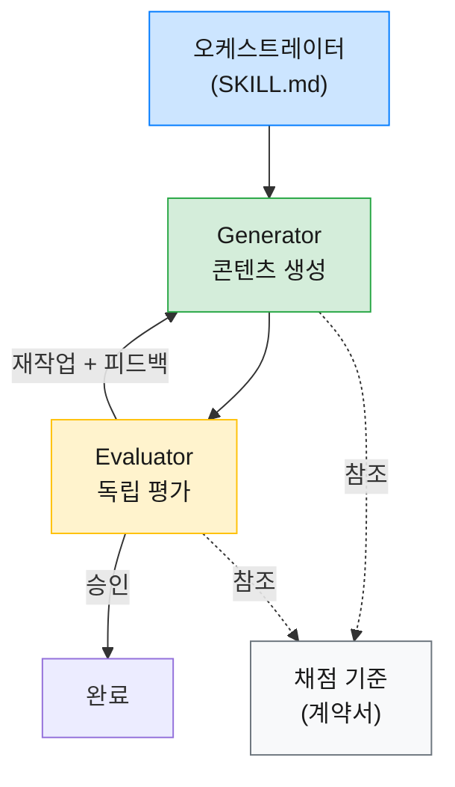
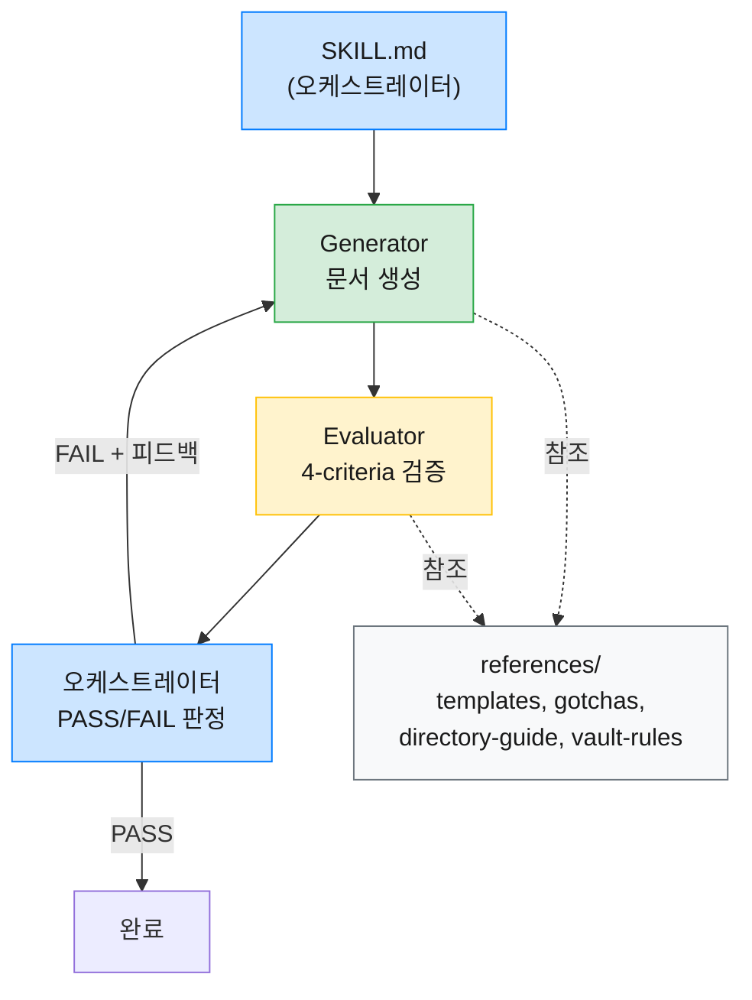
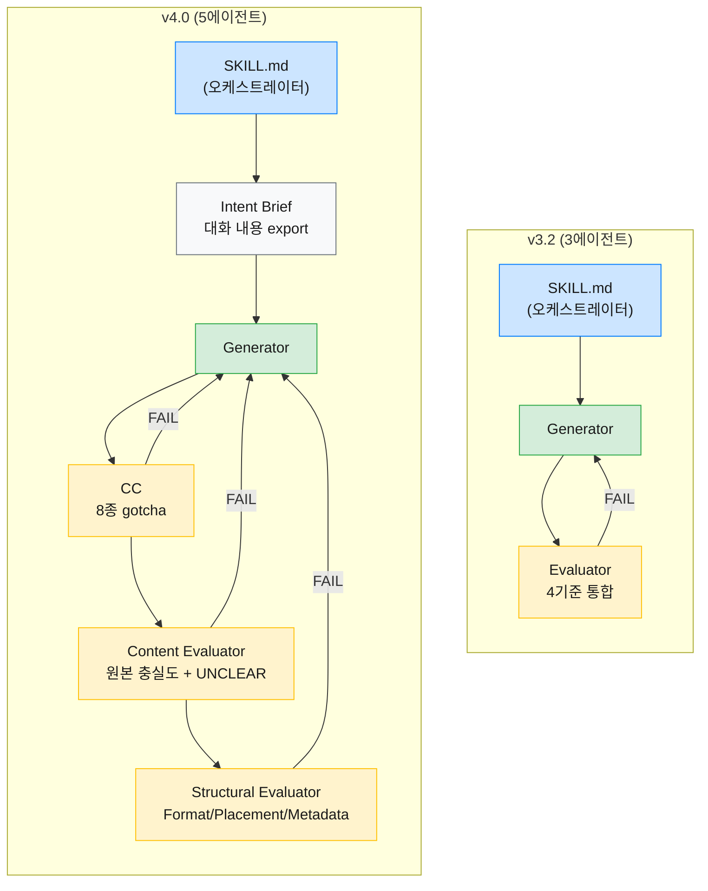
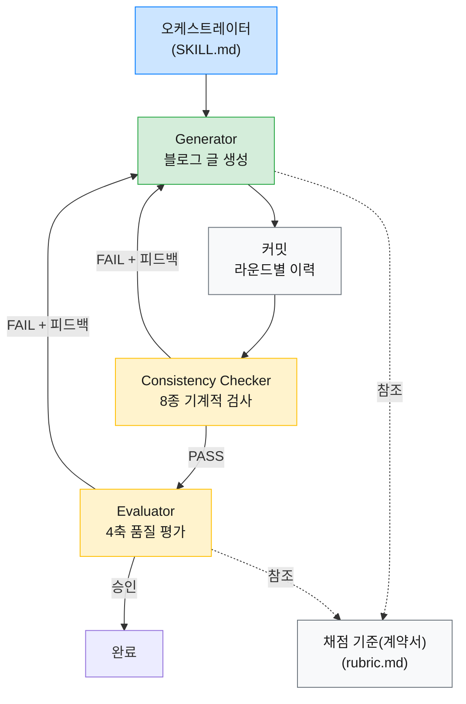
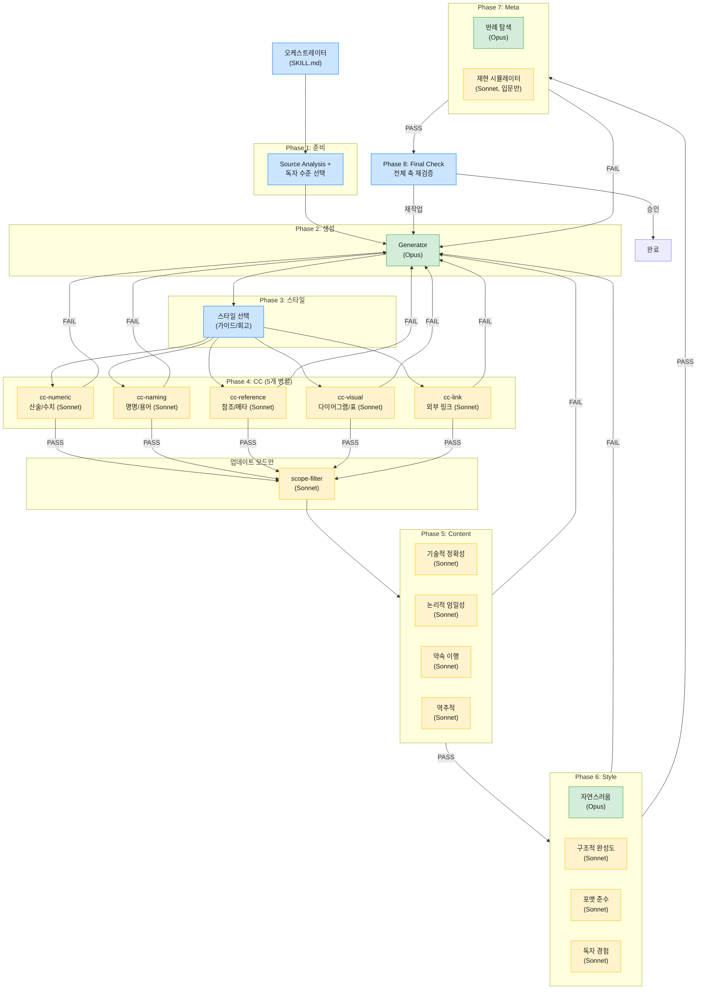
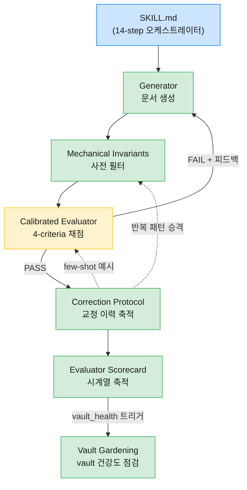

Claude Code의 스킬(Skill)은 반복 작업을 자동화하는 강력한 도구지만, 단일 패스 방식으로 구현하면 품질이 들쭉날쭉해지는 문제가 있다. 생성과 검증이 하나의 흐름 안에서 동시에 일어나면 어느 쪽도 제대로 하기 어렵기 때문이다. 이 글에서는 그 해법으로 하네스 패턴(Harness Pattern)을 세 스킬에 적용한 과정을 정리한다.

| 스킬                      | 역할                                                          |
| ----------------------- | ----------------------------------------------------------- |
| `note`                  | Obsidian vault에 마크다운 문서를 생성하는 스킬                            |
| `tech-blog-transformer` | 마크다운 문서를 기술 블로그 포스트로 변환하는 스킬                                |
| `vault-sync`            | 외부 데이터(캘린더, Slack)를 수집하여 Obsidian vault 문서를 자동 생성하는 cron 스킬 |

`note` 스킬의 리팩터링과 60개 문서 실험, v3.2 재시도 루프에서의 선언적 vs 절차적 제어 전환, v4.0에서 Evaluator를 CC/Content/Structural 세 에이전트로 분리한 과정, `tech-blog-transformer`의 4축 채점에서 v3의 10축 평가 확장과 Opus/Sonnet 모델 라우팅, v3.1의 CC 5분할 병렬화와 scope-filter 에이전트 신설, 그리고 `vault-sync`의 5레이어 아키텍처와 4버전에 걸친 진화 과정까지 함께 살펴본다.

### 1. 왜 하네스 패턴이 필요한가

#### [ 단일 패스 스킬의 한계 ]

세 스킬 모두 처음에는 단일 패스 방식이었다. 하나의 프롬프트가 글을 생성하고, 같은 프롬프트 안에서 품질까지 점검하는 구조로, 이 방식을 써보면서 가장 크게 부딪힌 문제가 자기 평가 편향이다.

글을 쓴 에이전트가 스스로 품질을 점검하면 관대해지는 경향이 있다. `note` 스킬에서는 Evaluator 없이 Generator가 형식, 배치, 메타데이터, 내용을 모두 스스로 판단했고, 결과물의 문서 형식은 늘 제각각이었다. `tech-blog-transformer`에서도 사정은 비슷해서, 마지막 단계인 Quality Check가 형식적으로 흘러가면서 "괜찮지만 뛰어나지 않은" 수준의 품질 천장에 부딪혔다.

거기에 더해 개선 자체도 어려웠다. 생성과 평가가 하나의 프롬프트에 섞여 있으면, 생성 품질을 높이려고 프롬프트를 수정할 때 평가 기준까지 흔들린다. 반대도 마찬가지여서, 한쪽을 건드리면 다른 쪽이 깨지는 악순환이 되기 쉬웠다.

결국 두 문제의 근본 원인은 같았다. 생성과 평가를 분리하지 않는 한 각 역할에 집중할 수가 없다.

### 2. 하네스 패턴이란

#### [ Generator/Evaluator 분리 ]

위 문제를 겪으면서 찾은 해법이 하네스 패턴(Harness Pattern)이다. 에이전트가 자유롭게 생성하되 별도의 평가 단계에서 독립적으로 검증하는 구조로, OpenAI의 "Harness engineering"과 Anthropic의 "Harness design" 문서에서 소개한 개념이기도 하다.

이걸 실제로 적용해보면, 글을 쓰는 에이전트(Generator)와 글을 평가하는 에이전트(Evaluator)의 컨텍스트를 완전히 분리하게 된다. Evaluator는 Generator가 어떤 프롬프트를 받았는지 모르는 상태에서 오직 결과물과 평가 기준만으로 판단하고, 이 독립성이 자기 평가 편향을 차단하는 핵심 메커니즘이 된다.

#### [ 핵심 구성 요소 ]

하네스 패턴을 실제로 구현하면 네 가지 구성 요소가 필요하다.

| 구성 요소 | 역할 |
|-----------|------|
| 오케스트레이터 | Generator와 Evaluator를 조율하고 루프 상태를 추적하는 역할 |
| Generator | 콘텐츠를 생성하고, Evaluator 피드백을 받으면 해당 부분을 수정 |
| Evaluator | 채점 기준에 따라 독립적으로 평가하여 승인 또는 재작업 판정을 내림 |
| 채점 기준(계약서) | Generator와 Evaluator 양쪽이 참조하는 평가 기준 문서 |

오케스트레이터가 Evaluator의 판정을 읽고, 재작업이 필요하면 피드백과 함께 Generator를 다시 호출하는 루프 구조가 된다. 채점 기준(계약서)은 Generator가 자기가 어떤 기준으로 평가받는지 미리 알 수 있게 하고, Evaluator는 같은 기준으로 채점하게 되어 기대치 불일치가 줄어든다.



이론은 단순하지만, 실제 적용에서는 각 스킬의 특성에 맞는 조정이 필요했다.

### 3. 사례 1: note 스킬 리팩터링

#### [ 문제 - 5가지 품질 문제 ]

`note` 스킬은 Obsidian vault에 마크다운 문서를 생성하는 도구다. v1은 하나의 프롬프트로 문서를 한 번에 생성하는 단일 패스 방식이었고, 사용하면서 다섯 가지 문제가 드러났다.

- 문서 형식 불일치: 같은 유형의 문서임에도 요약 형식(Callout vs 헤딩), frontmatter 필드, 원문 링크 형식이 제각각
- 트리거 범위 부족: `note`를 명시적으로 호출할 때만 동작하고, 크롤링이나 대화 정리 등 다른 상황에서는 규칙이 적용되지 않음
- 시나리오별 형식 부재: 크롤링, 대화 정리, 코드 정리, 일반 노트의 형식 구분이 없음
- 디렉토리 판단 오류: 세부 경로 선택이 부적절하거나, 새 폴더가 필요한 상황에서 기존 폴더에 억지로 배치
- Obsidian 문법 오류: LLM이 frontmatter 태그 형식이나 wikilink 따옴표 같은 Obsidian 고유 문법을 일관되게 틀림

다섯 가지가 별개의 문제처럼 보이지만, 근본 원인은 하나다. 단일 패스에서 생성과 검증이 동시에 일어나기 때문에 어느 쪽도 충분히 할 수 없었던 것이다.

#### [ 설계와 구현 ]

Generator/Evaluator 분리 패턴을 채택하면서 가장 먼저 한 일은 SKILL.md를 오케스트레이터로 전환하는 것이었다. 세부 규칙을 모두 정본 파일(references)로 분리하고, Generator와 Evaluator가 동일한 기준을 참조하도록 구조를 잡았다.

```plaintext
skills/note/
├── SKILL.md              (185행, 오케스트레이터)
├── prompts/
│   ├── generate.md       (Generator subagent)
│   └── evaluate.md       (Evaluator 4-criteria)
└── references/
    ├── obsidian-gotchas.md (211행, LLM gotchas)
    ├── templates.md       (시나리오별 정본)
    ├── directory-guide.md (배치 규칙)
    └── vault-rules.md    (볼트 규칙)
```
{: .nolineno }

Evaluator에는 4가지 평가 기준을 도입했다: Format(형식), Placement(배치), Metadata(메타데이터), Content(내용). 여기서 중요한 설계 결정이 하나 있었다. Evaluator의 독립성이다. Evaluator는 Generator의 프롬프트를 모르는 상태에서 결과물만 보고 판단해야 하고, 이 독립성이 무너지면 평가가 "프롬프트를 잘 따랐는가"로 변질될 수 있기 때문이다.

> Evaluator가 Generator의 프롬프트를 알게 되면, 결과물의 품질이 아니라 프롬프트 준수도를 평가하게 된다. 생성과 평가의 관심사가 다시 결합되는 셈이다.
{: .prompt-tip }

정본 파일을 공유하는 구조의 효과도 컸다. 규칙이 변경되면 `references/` 아래 파일 한 곳만 수정하면 Generator와 Evaluator 모두에 반영되기 때문에, 한쪽을 수정할 때 다른 쪽이 깨지는 걱정 없이 독립적으로 개선할 수 있게 됐다.

트리거 범위도 확장했다. `note` 명시 호출뿐 아니라 vault 경로에 MD를 생성하는 모든 상황에서 자동 적용되도록 변경했고, 크롤링이나 대화 정리에서도 일관된 형식이 나오게 됐다.



리팩터링 후 크롤링과 대화 정리 시나리오로 스모크 테스트를 진행했다.

| 시나리오 | Format | Placement | Metadata | Content | 판정 |
|----------|--------|-----------|----------|---------|------|
| 크롤링 | 5 | 3 | 5 | 4 | PASS |
| 대화 정리 | 5 | 4 | 5 | 5 | PASS |

전 항목 PASS로 기본적인 품질이 확보된 것을 확인했다.

#### [ 60개 문서 실험으로 규칙 경량화 ]

구현을 마치고 보니 obsidian-gotchas.md가 664행에 달해서 매번 읽어야 하는 토큰이 문제였다. 여기서 "모든 규칙이 정말 필요한가?"라는 의문이 생겼고, 실험으로 검증하기로 했다.

실험 설계는 단순했다. obsidian-gotchas.md를 참조하지 않은 상태에서 LLM이 순수 지식만으로 Obsidian 마크다운을 생성하게 한 뒤, 각 규칙의 위반 여부를 자동 검사하는 것이다. Opus 에이전트 10개, Sonnet 에이전트 50개를 돌려서 총 60개 문서를 생성했다.

| 규칙                     | Opus 위반율 | Sonnet 위반율 | 전체 위반율 |
| ---------------------- | -------- | ---------- | ------ |
| 태그 `"#태그명"` 형식         | 89%      | 100%       | 98%    |
| wikilink `"[[문서]]"` 형식 | 33%      | 72%        | 66%    |
| Callout 문법             | 0%       | 0%         | 0%     |
| 수평선, 체크박스, 하이라이트 등     | 0%       | 0%         | 0%     |

결과가 명확했다. LLM은 Obsidian frontmatter에서 태그에 따옴표를 붙이는 규칙을 거의 100% 틀리고, wikilink에 따옴표를 붙이는 것도 66%의 확률로 틀렸지만, Callout이나 수평선 같은 표준 마크다운 문법은 전혀 틀리지 않았다.

> LLM이 실제로 틀리는 규칙(태그 따옴표 98%, wikilink 66%)에만 상세 예시를 유지하고, 위반율 0%인 규칙은 참고 수준으로 축소하는 것이 토큰 효율의 핵심이다.
{: .prompt-info }

이 결과를 바탕으로 위반율 0% 항목 9개를 하단 "참고" 섹션으로 이동시키고 상세 예시를 제거했다. 실험 과정에서 사용한 메타 정보(위반율 수치, 60개 문서 등)도 함께 빼냈다. Generator와 Evaluator가 알아야 할 것은 "이 규칙을 지켜라"이지 "왜 이 규칙이 존재하는지"가 아니기 때문이다.

최종 결과: 664행에서 211행으로 68% 감소. 다만 이 최적화는 실험 시점의 모델 버전에 의존하므로, 모델이 업데이트되면 위반율이 바뀔 수 있다. 주기적으로 재실험하여 규칙 경량화를 갱신할 필요가 있다.

#### [ v3.2 - 재시도 루프가 동작하지 않는 문제 ]

60개 문서 실험으로 규칙을 경량화한 뒤 v3.1에서 Generator-Evaluator 패턴을 도입했지만, 실제 운용하다 보니 이상한 현상이 나타났다. Evaluator가 FAIL 판정을 내리는데도 Generator가 재시도하지 않거나, 재시도하더라도 FAIL 항목이 수정되지 않은 채 그대로 넘어가는 것이다.

원인을 파고 들어가 보면 SKILL.md의 재생성 루프 기술 방식에 닿는다. 기존 Step 4 "재생성 루프"는 "Evaluator 피드백을 Generator에 전달한다"는 선언적 기술만 있었고, 오케스트레이터(Claude)가 이를 실제 루프로 실행할지 여부는 모델의 재량에 맡겨진 상태였다. 선언적 지시만으로는 LLM이 루프를 한 번 돌아야 하는지, 건너뛰어도 되는지 판단하기 어렵기 때문에, 모델이 "피드백을 전달했으니 됐다"고 해석하고 다음 단계로 넘어가 버리는 경우가 발생한 것이다.

vault-sync의 구현과 비교해보면 차이가 뚜렷하다. 차이는 세 군데에서 나타났다. vault-sync에서는 오케스트레이터가 Step 6에서 Evaluator 결과를 직접 읽고 FAIL/PASS를 판정한 뒤 FAIL이면 Step 4(Generator)를 명시적으로 재호출하는 구조인 반면, note에는 이런 절차적 흐름이 없었다. Evaluator의 피드백 구체성도 문제였다. vault-sync의 Evaluator는 감점 항목마다 구체적인 수정 전략을 반환하는 데 비해 note의 "수정 지시"는 추상적인 수준에 머물러 있었다. 거기에 더해 Generator 쪽에도 재시도 모드라는 개념 자체가 없었다. vault-sync의 Generator는 `{recent_corrections}` 입력을 받아서 증분 수정을 수행하는 경로가 명확한 반면, note의 Generator는 최초 생성과 재시도를 구분하지 않았던 것이다.

수정은 SKILL.md, evaluate.md, generate.md 세 파일에 걸쳐 이루어졌다.

| 파일 | 변경 내용 |
|------|-----------|
| SKILL.md | 기존 Step 3-4를 Step 3/4/5/6으로 분리. Step 4에서 오케스트레이터가 직접 PASS/FAIL을 판정하고, Step 5에 while 루프 의사코드를 명시 |
| evaluate.md | "수정 지시" 1단계 구조를 "감점 항목" + "전략 지시" 2단계 구조로 변경 |
| generate.md | `{evaluator_feedback}` 플레이스홀더 추가. 재시도 모드에서는 Read-Edit 증분 수정만 허용하고 Write(전체 재작성)를 금지 |

```python
# SKILL.md Step 5 (while 루프 의사코드)
while evaluation.result == "FAIL" and retry_count < 3:
    Generator에 evaluator_feedback 전달 → 증분 수정
    Evaluator 재평가
    retry_count += 1
```
{: .nolineno }

vault-sync에 있는 나머지 레이어(invariants, promote-corrections, evaluation-examples 등)는 note에 도입하지 않았다. vault-sync는 매일 수십 개 파일을 무인 생성하는 cron이라 다층 방어가 필요하지만, note는 사용자가 호출할 때 1개 문서를 생성하는 도구여서 Evaluator 루프만으로 충분하다고 판단한 것이다. 다만 evaluation-examples.md는 실제 FAIL 패턴이 축적되면 추후 추가를 검토할 여지가 있다.

수정 후 첫 실행에서 전 항목 PASS를 기록했다. 가장 큰 교훈은 선언적 지시("피드백을 전달한다")만으로는 LLM이 루프를 건너뛸 수 있다는 것이다. while 루프 의사코드 같은 절차적 제어가 필요했고, 거기에 더해 Evaluator 피드백의 구체성과 Generator 재시도 모드 분리까지 갖춰져야 비로소 루프가 수렴했다.

#### [ v4.0 - Evaluator 분리와 Content 신뢰 문제 ]

v3.2에서 재시도 루프를 고치고 나서도 해결되지 않는 문제가 하나 있었다. **사용자가 생성된 노트의 내용을 신뢰할 수 없다**는 것이다. Evaluator가 PASS를 줘도 막상 문서를 열어보면 원본의 핵심 내용이 빠져 있거나, Generator가 사용자의 의도를 제멋대로 추측해서 채운 부분이 눈에 띄었다. 구체적으로는 세 가지 문제가 겹쳐 있었다.

- **정보 누락/왜곡**: Generator가 원본을 충실히 반영하지 못하는데, Evaluator도 이를 잡지 못함
- **의도 불일치**: Generator가 사용자의 의도를 추측해서 작성하고, 확인 메커니즘이 없음
- **Content 채점 관대**: 최소 3점이면 PASS여서, "핵심은 포함되었으나 세부사항 일부 누락"도 통과할 수 있었음

세 문제의 공통 원인은 하나의 Evaluator가 Format, Content, Placement, Metadata를 통합 평가하는 구조에 있었다. Content 평가에는 원본과의 대조가 필요한데, 다른 기준까지 함께 보다 보니 Content 검증의 깊이가 얕아진 것이다.

이 시점에 마침 `tech-blog-transformer`가 v1(4축 통합 Evaluator)에서 v2(6축 전문 Evaluator, 2단계 평가, CC 확장, UNCLEAR 메커니즘)로 리팩터링을 마친 상태였다. tech-blog에서 검증된 패턴 중 note에 적용 가능한 것을 분석했는데, 핵심 판단은 "6축 분리를 그대로 가져오지 않고 선별 적용한다"는 것이었다.

| 적용한 패턴 | 적용하지 않은 패턴 |
| --------- | ------------- |
| CC 사전 검사, 2단계 평가(CC -> Content -> Structural), UNCLEAR 메커니즘 | 6축 Evaluator 전체 분리(Content만 분리), Final Check(Structural이 Content를 훼손할 위험 낮음) |

tech-blog는 자연스러움, 논리적 엄밀성 같은 주관적 품질 축이 중요해서 6축 전문 Evaluator가 필요하지만, note의 Format/Placement/Metadata는 기계적 검증이 가능한 항목이라 하나로 묶어도 충분하기 때문이다.

이 분석을 바탕으로 내린 핵심 설계 결정은 다음과 같다.

**Evaluator 분리 구조**: 기존 하나의 Evaluator를 CC(Consistency Checker) + Content Evaluator + Structural Evaluator 세 개로 분리했다. CC가 8종 Obsidian gotcha를 기계적으로 걸러내면, Content Evaluator는 원본 대비 충실도에만 집중할 수 있게 된다. Content Evaluator에는 **UNCLEAR 메커니즘**도 탑재했는데, 원본과 대조하다가 "의도적 추가인지 누락인지 판단 불가"한 항목이 나오면 삼키지 않고 사용자에게 확인을 요청하는 장치다.

**Intent Brief 도입**: Generator의 의도 추측 문제를 해결하기 위해, 오케스트레이터가 대화 내용을 먼저 export하여 파일로 만든 뒤 Generator에 첨부하는 단계를 추가했다. 자명한 경우(1-2문장의 단순 요청)만 생략하고, 나머지는 필수로 거치도록 한 것인데, 소스를 vault의 `10. Fleeting Notes/`에 물리 파일로 남기기 때문에 세션이 끊겨도 새 세션에서 작업을 이어갈 수 있다는 부수 효과도 있다.

**승인 기준과 루프 규칙**: Content와 Placement의 최소 점수를 3점에서 4점으로 올린 것도 중요한 변경이다. 3점("핵심은 포함되었으나 세부사항 일부 누락")이면 사용자가 보완해야 할 양이 많아 스킬의 가치가 반감되기 때문이다. 루프는 CC + Content 최대 5회, Structural 최대 3회로 제한하되, Content FAIL 시에는 CC부터 재시작하도록 했다.

v3.2에서 v4.0으로의 아키텍처 변경을 시각화하면 다음과 같다.



평가 순서도 의도적으로 설계했다. CC가 먼저 기계적 오류를 걸러내고, Content Evaluator가 원본 충실도를 확인한 뒤, 마지막에 Structural Evaluator가 포맷과 배치를 검사한다. Content가 Structural보다 앞서는 이유는 Content FAIL 시 재생성하면 Structural 평가가 낭비되기 때문이다. Final Check(회귀 검사)는 두지 않았는데, Structural 수정(태그, 디렉토리 변경)이 본문 내용을 건드리지 않기 때문에 Content 훼손 위험이 낮다고 판단한 것이다.

### 4. 사례 2: tech-blog-transformer 스킬

#### [ 문제 - 자기 평가 편향과 품질 천장 ]

`note` 리팩터링과 병행해서 진행한 것이 `tech-blog-transformer` 스킬이다. 마크다운 문서를 기술 블로그 포스트로 변환하는 이 스킬도 기존에는 최종 점검 단계에서 글을 쓴 에이전트가 자기 작업을 스스로 점검하는 방식이었고, Anthropic의 하네스 설계 문서에서 지적한 "자기 평가 편향"이 그대로 나타나는 구조였다.

문제는 두 가지로 요약된다. 하나는 자기 평가 편향으로, 품질 점검이 형식적으로 흘러가는 것이고, 다른 하나는 품질 천장으로, 한 번에 생성하면 "괜찮지만 뛰어나지 않은" 수준에서 멈추는 것이다.

#### [ 설계 - 4축 채점 기준과 회의적 튜닝 ]

이 스킬에서는 `note`보다 한 단계 더 정교한 설계를 적용했다. 4-에이전트 아키텍처로 오케스트레이터(SKILL.md), Generator(`agents/generator.md`), Consistency Checker(`agents/consistency-checker.md`), Evaluator(`agents/evaluator.md`)를 분리하고, 채점 기준(`references/rubric.md`)을 Generator-Evaluator 채점 기준(계약서)으로 설계했다.



Consistency Checker(이하 CC)는 Generator 출력의 기계적 정합성을 사전 검사하는 역할이다. 산술 검증, 명명 일관성, 수치 교차 검증, stale 참조 스캔, frontmatter-본문 정합성 등 8종의 기계적 검사를 수행하고, 하나라도 FAIL이면 Evaluator를 건너뛰고 Generator에 바로 피드백을 보낸다. vault-sync에서 Mechanical Invariants가 Evaluator의 부담을 줄이기 위한 사전 필터였던 것과 같은 맥락으로, CC는 기계적 오류가 있는 상태에서 품질 평가를 돌리는 토큰 낭비를 방지한다.

**4축 채점 기준**이 이 스킬의 핵심 설계 요소다. 블로그 글의 품질을 네 가지 축으로 분해하고, 각 축에 가중치를 부여했다.

| 축 | 가중치 | 역할 |
|----|--------|------|
| 자연스러움 | 높음 | 사람이 직접 쓴 글처럼 읽히는가 |
| 구조적 완성도 | 중간 | 논리적 흐름과 섹션 구성이 적절한가 |
| 기술적 정확성 | 높음 | 원본 내용을 정확하게 전달하는가 |
| 포맷 준수 | 낮음 | Chirpy 테마 규칙을 따르는가 |

가중치는 종합 점수 계산에 쓰는 게 아니라, 승인 임계값에서 차등 적용하는 방식이다. 기본 승인 조건은 모든 축이 9점 이상이어야 한다. 9점 기준은 8점에서 반복 실험한 결과, 사용자가 추가 수정 없이 발행할 수 있는 최소 수준이 9점이었기 때문에 설정한 것이다. 가중치가 높은 축(자연스러움, 기술적 정확성)에는 추가 안전장치가 걸려 있어서 8점 이하면 다른 축 점수와 무관하게 즉시 재작업이 발동된다. 중간/낮음 가중치 축은 이 추가 제약 없이 기본 임계값(9점)만 적용되고, 어떤 축이든 4점 이하면 가중치와 무관하게 무조건 재작업이다.

여기서 흥미로운 설계 결정은 **Evaluator 회의적 튜닝**이다. 독립된 Evaluator를 두더라도 LLM은 기본적으로 관대하게 채점하는 경향이 있기 때문에, 이를 보정하기 위해 Evaluator에 다음과 같은 지침을 넣었다.

- 합리화 금지: 문제를 발견한 뒤 "하지만 전체적으로는 괜찮다"고 스스로 합리화하지 않는다
- 문장 인용 지적: 문제를 지적할 때 반드시 해당 문장을 인용해야 한다. 라인 번호는 수정 후 밀리므로 문장 인용이 더 신뢰성이 높다
- 점수 기준 교정: "8점은 괜찮음이지 좋음이 아니다. 9점 이상을 쉽게 주지 않는다"
- 원본 대조 필수: 기술적 정확성은 추측이 아닌 원본 문서와의 비교로 판단해야 한다
- 첫 라운드 재대조: 첫 라운드에서 모든 축이 9점 이상이 나오면, 채점 기준(rubric.md)을 하나씩 다시 대조한다. 대조 후에도 9점 이상이면 그대로 승인하되, 점수를 의도적으로 낮추지는 않는다

루프 구조도 `note`와 다르다. Generator가 파일을 생성하면 먼저 커밋을 남기고 CC를 거친 뒤, CC가 PASS일 때만 Evaluator로 넘어간다. CC가 FAIL이면 피드백과 함께 Generator를 바로 재디스패치하고, 이때도 라운드 카운트에 포함된다. 라운드 간 변경사항을 `git diff`로 추적할 수 있게 매 라운드마다 커밋하는 구조여서, 어떤 피드백이 어떤 변경을 이끌어냈는지 이력이 남는다.

전체 루프는 최대 5회 반복하되, 2회 연속 점수가 정체하면 사용자에게 알리고 계속할지 확인한다. 무의미한 반복을 방지하면서도 필요하면 충분히 개선할 여지를 남긴 구조다.

#### [ 결과 - 이 글이 결과물 ]

사실 이 블로그 글 자체가 `tech-blog-transformer` 하네스 패턴의 결과물이다. 원본 Obsidian 문서와 설계 문서를 입력으로 넣고, Generator-CC-Evaluator 루프를 돌린 결과가 지금 읽고 있는 이 글이다.

라운드별 점수 추이는 다음과 같았다.

| 라운드 | 자연스러움 | 구조 | 정확성 | 포맷 | 판정 |
|--------|-----------|------|--------|------|------|
| 1 | 6 | 8 | 8 | 8 | 재작업 |
| 2 | 7 (+1) | 8 | 9 (+1) | 9 (+1) | 재작업 |
| 3 | 8 (+1) | 9 (+1) | 9 | 9 | 재작업 |
| 4 | 9 (+1) | 9 | 9 | 9 | 승인 |

1라운드에서 자연스러움이 6점으로 나왔는데, Evaluator가 종결어미 반복, 백과사전 톤, 섹션 전환 단절 등을 문장을 인용하면서 지적했다. 2라운드에서 해당 부분을 수정했지만 "~인데" 접속 패턴 과다 사용이 새로 지적되어 7점에 머물렀고, 정확성과 포맷은 9점으로 올랐다. 3라운드에서 연결 전략을 다양화하면서 자연스러움이 8점까지 올랐지만 여전히 승인 기준(9점)에는 못 미쳤다. 4라운드에서 남은 AI 전형 패턴을 제거하고 나서야 9점에 도달하면서 승인을 받았다. 단일 패스였다면 1라운드의 6점 수준에서 멈췄을 것이다.

#### [ v2 - 6축 전문 Evaluator 분리 ]

v1이 이 블로그 글을 만들어내는 데 성공했지만, 4축 통합 Evaluator의 한계도 함께 드러났다. 하나의 Evaluator가 자연스러움, 구조적 완성도, 기술적 정확성, 포맷 준수를 한꺼번에 평가하다 보니, 각 축의 검증 깊이가 얕아지는 문제가 있었다. 이는 note v4.0에서 통합 Evaluator를 CC/Content/Structural로 분리한 것과 같은 맥락이다.

v2에서는 4축을 6축으로 확장하면서 각 축에 전문 Evaluator를 할당했다. 여기에 2단계 평가(Content 단계 → Style 단계)를 도입해서 기술적 정확성이 확보되지 않은 상태에서 자연스러움을 손보는 토큰 낭비를 방지했고, CC도 8종으로 확장했다. UNCLEAR 메커니즘은 Evaluator가 판단이 모호한 지점을 삼키지 않고 표면화하는 장치다. 마지막으로 Final Check 단계를 추가해서, Content와 Style 각각의 수정이 다른 쪽을 훼손하지 않았는지 전체 축을 한 번 더 확인하는 구조를 갖추었다.

#### [ 14에이전트 실험 - Evaluator 다양성의 발견 ]

v2로 이 블로그 글을 돌렸을 때 4라운드 만에 6축 모두 9점을 달성했다. 그런데 해당 글을 14개 서브에이전트(Opus 1개 + 역할이 다른 Sonnet 13개)로 별도 리뷰한 결과가 놀라웠다. 6축 9점이면 발행 가능한 수준이라 생각했는데, 수십 개의 이슈가 쏟아져 나온 것이다. v2 Evaluator가 잡아야 했지만 놓친 이슈도 있었고, 6축 어디에도 해당하지 않아서 애초에 커버할 수 없었던 이슈도 있었다.

이 실험에서 세 가지 발견이 나왔다.

| 발견 | 근거 |
|------|------|
| 동일 프롬프트 Sonnet 5개는 같은 것을 잡고 같은 것을 놓침 | 5/5 합의 항목과 0/5 미검출 항목이 명확히 분리 |
| 역할이 다른 Sonnet 5개는 각각 다른 것을 잡음 | 역할 부여 후 +11개 신규 이슈 발견 |
| Opus 1개가 놓친 것을 역할 부여 Sonnet이 잡음 | 논리적 엄밀성에 예시까지 있는 이슈에 Opus가 9점을 부여 |

Opus 1개가 깊이 있게 보는 것보다, 역할이 다른 Sonnet N개가 각자의 관점으로 보는 쪽이 확률적으로 더 많은 이슈를 잡았다. 확률 모델의 한계를 시행 횟수와 관점 다양성으로 보완한 결과다. 다만 이 관찰은 하나의 블로그 글에 대한 단일 실험이므로, 다른 유형의 콘텐츠에서도 동일한 결과가 나올지는 추가 검증이 필요하다. 또한 생성(Generator)과 주관적 판단(자연스러움 평가, 반례 탐색)에는 Opus의 깊은 추론이 여전히 필요했기 때문에, 이 원칙은 "평가 단계"에 한정된다.

이 실험은 v2가 커버하지 못하는 영역도 드러냈다.

| 커버되지 않은 영역 | 실험에서 발견한 에이전트 역할 |
|------|------|
| 다이어그램-본문 불일치 | 시각 자료 검증자 |
| 교훈의 근거 강도 | 역추적자 |
| 주장의 반례/한계 | 반례 탐색자 |
| 독자 수준별 접근성 | 초보/실무/전문가 렌즈 |
| 절차 재현 가능성 | 재현 시뮬레이터 |
| 외부 링크 유효성 | 인용 검증자 |

#### [ v3 설계 원칙 - 양 x 다양성 > 깊이 x 1 ]

14에이전트 실험의 결과를 바탕으로 v3의 설계 원칙을 정리했다.

| 원칙 | 설명 |
|------|------|
| 양 x 다양성 > 깊이 x 1 | 확률 모델의 한계를 시행 횟수와 관점 다양성으로 보완 |
| Opus는 만드는 쪽, Sonnet은 보는 쪽 | Generator + 주관적 판단(자연스러움, 반례 탐색) = Opus, 나머지 평가 = Sonnet |
| 독자 수준이 전체 파이프라인에 영향 | Generator의 톤, Evaluator의 채점 기준, 활성화 축이 독자 수준에 따라 변화 |

첫 번째 원칙이 v3의 핵심이다. v2에서는 Opus가 생성도 하고 평가도 했는데, 14에이전트 실험에서 확인한 것처럼 Opus 1개의 깊이보다 역할이 다른 Sonnet N개의 관점 다양성이 더 많은 이슈를 잡았다. 이를 모델 라우팅으로 구현한 것이 두 번째 원칙이다. Opus는 창작과 종합 판단이 필요한 3개 에이전트(Generator, 자연스러움 Evaluator, 반례 탐색 Evaluator)에만 사용하고, 나머지 8~9개 평가 에이전트는 Sonnet이 각자 다른 관점에서 검증한다.

세 번째 원칙은 v2에 없던 새 개념이다. 입문/중급/고급 독자 수준을 파이프라인 첫 단계에서 선택하면, 이후 Generator의 글쓰기 톤부터 Evaluator의 채점 렌즈까지 전체에 전파된다.

| 항목 | 입문 | 중급 | 고급 |
|------|------|------|------|
| Generator | 개념 풀어쓰기, 비유 적극 | 기본 개념 생략, 패턴 중심 | 배경 최소, 트레이드오프 중심 |
| 독자 경험 Evaluator | 초보 독자 렌즈 | 실무 적용자 렌즈 | 회의적 전문가 렌즈 |
| 재현 시뮬레이터 | 활성화 | 비활성 | 비활성 |
| 자연스러움 Evaluator | 친절한 톤 허용 | 기본 rubric | 간결함 가산 |

#### [ v3 구현 - 10축 확장과 4단계 파이프라인 ]

v3에서 오케스트레이터를 포함한 에이전트 수가 9개에서 12~13개로 늘어났고, v3.1에서 CC 5분할과 scope-filter 추가로 16~18개(신규 16~17, 업데이트 17~18)가 되었다. 아래 다이어그램은 v3.1 기준이다. 서브에이전트는 Opus 3개(Generator, 자연스러움, 반례 탐색)와 Sonnet 12~14개(CC 5개 + scope-filter + Content Evaluator 4개 + Style Evaluator 3개 + 재현 시뮬레이터)로 구성된다.



채점 기준도 6축에서 10축으로 확장했다. 기존 6축(자연스러움, 구조적 완성도, 기술적 정확성, 논리적 엄밀성, 약속 이행, 포맷 준수)에 14에이전트 실험에서 발견한 4개 영역을 추가한 것이다.

| 신규 축 | 가중치 | 단계 | 역할 |
|---------|:------:|:-----:|------|
| 역추적 | 중간 | Content | 결론/교훈이 본문 사례에서 실제로 도출되는지 역방향 검증 |
| 독자 경험 | 중간 | Style | 독자 수준별 접근성 평가 (입문/중급/고급 렌즈) |
| 반례 탐색 | 높음 | Meta | 핵심 주장의 반례/한계를 인지하고 다루는지 적대적 추론 |
| 재현 시뮬레이터 | 중간 | Meta | 글의 절차를 독자가 따라할 수 있는지 (입문만 활성화) |

평가 파이프라인도 기존 2단계(Content → Style) + Final Check에서 4단계로 재편했다. Content와 Style 사이에 Meta 단계가 추가되었는데, 반례 탐색과 재현 시뮬레이터는 Content(기술적 사실)와 Style(문체/포맷)이 확정된 뒤에야 의미 있는 평가가 가능하기 때문이다.

| 단계 | 대상 축 | 에이전트 수 |
|------|---------|:---------:|
| Content | 기술적 정확성 + 논리적 엄밀성 + 약속 이행 + 역추적 | 4 |
| Style | 자연스러움 + 구조적 완성도 + 포맷 준수 + 독자 경험 | 4 |
| Meta | 반례 탐색 + 재현 시뮬레이터(입문만) | 1~2 |
| Final Check | 활성화된 전체 축 | 9~10 |

CC도 8종에서 11종으로 확장했다. 14에이전트 실험에서 발견한 시각 자료 불일치, 표 수치 불일치, 외부 링크 유효성 검증이 새로 추가되었다.

| 신규 CC | 검사 내용 |
|---------|----------|
| 시각 자료-본문 정합성 | mermaid 다이어그램의 노드/화살표가 본문 설명과 일치하는지 |
| 표-본문 수치 강화 검증 | 표의 수치를 본문에서 인용할 때 일치하는지, 표 간 동일 항목 수치의 일관성 |
| 외부 링크 검증 | 참고 자료 링크의 유효성(404 탐지), 링크 텍스트와 실제 페이지 제목 일치 여부 |

#### [ v3 결과 - 비용 절감과 관점 확대 ]

v3는 라운드당 Opus 3개 + Sonnet 8~9개로 구성된다. Opus의 토큰당 단가가 Sonnet보다 수배 높으므로, v2(Opus 6개 + Sonnet 1개) 대비 Opus를 절반(6→3)으로 줄이고 Sonnet을 늘린 구성은 비용 효율적이다. 원본 문서 기준 약 35% 절감으로 추정된다. 평가 관점은 오히려 6개에서 10개로 67% 확대되었다. "양 x 다양성 > 깊이 x 1" 원칙이 비용과 품질 양쪽에서 효과를 보인 것이다.

다만 이 수치에는 주의가 필요하다. 35% 비용 절감은 에이전트 구성의 모델 단가 비교이고, 실제 비용은 입력 토큰 양과 라운드 횟수에 따라 달라진다. 10축으로 확장하면서 재작업이 발동하는 축이 늘어나 라운드 수가 증가할 가능성도 있기 때문에, 라운드당 비용 절감이 전체 비용 절감으로 직결된다고 단정하기는 어렵다.

#### [ v3.1 - CC 5분할과 scope-filter ]

v3로 이 블로그 글을 업데이트 모드로 돌렸을 때, 예상보다 훨씬 많은 자원이 소모되었다. 10라운드에 걸쳐 50개 이상의 서브에이전트가 디스패치되면서 8가지 구조적 문제가 드러났는데, 근본 원인을 추적해보니 두 가지로 수렴했다.

첫 번째는 CC의 주의력 분산이다. Sonnet 1개가 11종 검사를 순차 수행하다 보니 뒤쪽 검사(시각-본문 정합성 등)의 품질이 떨어지는 현상이 나타났다. vault-sync의 v3에서 프롬프트에 규칙을 추가할수록 Generator의 주의력이 분산되었던 것과 같은 문제가, 이번에는 CC 안에서 발생한 것이다.

두 번째는 업데이트 모드의 범위 미정의다. Evaluator들이 새로 추가된 섹션뿐 아니라 기존 글 전체를 평가하면서, 이전부터 존재하던 이슈가 재작업을 발동시키는 악순환이 벌어졌다. 예를 들어 논리적 엄밀성 Evaluator가 기존 vault-sync 섹션의 자기 모순을 발견하거나, 포맷 Evaluator가 기존 태그의 공백 형식을 지적하면서, 정작 새 섹션에 집중해야 할 라운드가 기존 이슈 수정에 소진된 것이다.

**CC 5분할**은 첫 번째 문제의 해법이다. 기존 `consistency-checker.md` 1개(11종 검사)를 5개 전문 에이전트로 분리했다.

| 에이전트 | 검사 항목 | 특화 |
|----------|----------|------|
| cc-numeric | 산술, 수치 교차, 표-본문 수치 | 숫자 계산/대조 |
| cc-naming | 명명 일관성, 용어 통일 | 이름/용어 |
| cc-reference | Stale 참조, frontmatter, 전방참조 | 참조/순서/메타 |
| cc-visual | 시각요소 균일, 시각-본문 정합성 | 다이어그램/표 |
| cc-link | 외부 링크 | 네트워크 I/O |

각 에이전트가 2~3개 검사에만 집중하므로 주의력 분산이 줄고, 5개가 병렬로 실행되기 때문에 시간은 1개일 때와 동일하다. 이 구조는 vault-sync의 Evaluator 분리, note v4.0의 CC/Content/Structural 분리와 같은 원칙의 재적용이다. "에이전트 분리가 주의력 경제를 구조적으로 회피한다"는 것인데, 5절 vault-sync에서 배운 프롬프트 주의력 경제가 하나의 에이전트 안에서 적용되는 원칙이었다면, 에이전트를 분리하면 그 제약을 넘어서는 셈이다.

**scope-filter 에이전트**는 두 번째 문제의 해법이다. 업데이트 모드에서 Evaluator 결과를 받아 "재작업 대상"(변경된 섹션과 그 영향 범위)과 "기존 섹션 참고"(별도 보고만 하고 재작업 판정에 포함하지 않는 항목)로 분류하는 전용 에이전트다. 신규 모드에서는 호출하지 않으며, CC는 scope-filter 대상이 아니다(전체 문서 맥락이 필요한 기계적 교차 검증이므로).

scope-filter를 설계할 때 세 가지 선택지를 검토했다.

| 선택지 | 장점 | 단점 |
|--------|------|------|
| A. 오케스트레이터가 필터링 | 추가 에이전트 없음 | 오케스트레이터 역할 비대 |
| B. Evaluator가 분류 | Evaluator 내에서 처리 | 10개 파일에 동일 지침 중복 |
| C. 전용 에이전트 | 양쪽 모두 변경 없음 | Sonnet 1회 추가 비용 |

C안을 채택했다. Sonnet 1회 추가 비용만으로 오케스트레이터와 Evaluator 양쪽 모두 건드리지 않는 해법이고, 관심사 분리 원칙도 유지된다.

v3 첫 실행에서 드러난 문제는 CC와 평가 범위만이 아니었다. **Generator가 원본에 없는 수치를 창작**하는 문제(예: 35% 비용 절감 보강 요청에 "약 5배"를 추가했다가 산술 불일치로 다시 삭제하는 악순환)와, **Evaluator가 스킬 내부 용어를 독자에게 설명 없이 사용하는 것을 잡지 못하는 문제**도 함께 발견되었다.

이를 해결하기 위해 Generator와 Evaluator 프롬프트를 보강했다. Generator에는 "독자 관점 원칙"(소스 내부 용어를 처음 사용할 때 최소한의 설명을 붙인다)과 "수치 창작 금지"(원본에 없는 수치 근거를 추가하지 않는다) 두 가지 원칙을 추가했다. Evaluator 쪽에서는 독자 경험 평가에 "소스 내부 용어 확인" 단계를 추가하고, 모든 Evaluator의 인용 규칙에 행 번호 명시를 의무화했다.

v3에서 v3.1로의 에이전트 수 변경은 다음과 같다.

| 구분 | v3 | v3.1 | 변경 |
|------|:---:|:----:|:----:|
| 오케스트레이터 | 1 | 1 | -- |
| Generator (Opus) | 1 | 1 | -- |
| CC (Sonnet) | 1 | 5 | +4 |
| scope-filter (Sonnet) | -- | 1 | +1 (업데이트만) |
| Content Evaluators (Sonnet) | 4 | 4 | -- |
| Style Evaluators (혼합) | 4 | 4 | -- |
| Meta Evaluators (혼합) | 1~2 | 1~2 | -- |
| **합계** | **12~13** | **16~18** | **+4~6** |

에이전트가 늘었지만 CC 5개는 병렬 실행이고 scope-filter는 업데이트 모드에서만 호출되므로, 실행 시간은 거의 변하지 않는다. 비용도 전부 Sonnet이라 Opus 대비 저렴하다.

v3.1에서 가장 의미 있는 교훈은, vault-sync 5절에서 배운 "프롬프트 주의력 경제"가 Evaluator뿐 아니라 CC에도 동일하게 적용된다는 발견이다. vault-sync v3에서 Generator 프롬프트에 규칙을 추가할수록 핵심 작업의 주의력이 분산되었듯이, CC 1개에 11종 검사를 몰아넣으면 뒤쪽 검사가 약해졌다. 해법도 동일한데, tech-blog v2에서 Evaluator를 축별로 분리하고 note v4.0에서 CC/Content/Structural로 분리했던 것처럼 CC를 5개로 분리한 것이다. 결국 에이전트를 분리하는 것은 프롬프트 주의력 경제를 구조적으로 회피하는 방법이고, 이 원칙은 Generator, Evaluator, CC를 가리지 않고 적용된다.

### 5. 사례 3: vault-sync 스킬

#### [ vault-sync란 ]

`vault-sync`는 앞의 두 스킬과 성격이 다르다. `note`와 `tech-blog-transformer`는 사용자가 호출할 때 한 번 실행되는 도구인 반면, `vault-sync`는 매일 03:30에 cron으로 자동 실행되는 오케스트레이터 스킬이다. 업무 캘린더(Supabase)와 Slack(SQLite)에서 데이터를 수집하여 Obsidian vault의 Members, Projects, Daily, Weekly 문서를 자동 생성한다.

사람이 직접 트리거하지 않고 매일 무인 실행되기 때문에, vault의 모든 쓰기를 LLM이 담당하게 되는데, 이는 Evaluator가 유일한 품질 방어선이 된다는 뜻이기도 하다. 나쁜 패턴이 한 번 들어가면 다음 sync에서 자기 복제할 위험도 있어서 하네스의 필요성이 앞의 두 스킬보다 더 절실했다.

#### [ v1의 4가지 문제 ]

v1은 기본 오케스트레이션으로 데이터 수집과 문서 생성은 동작했지만, 운영하면서 네 가지 문제가 드러났다.

| 문제               | 설명                                  |
| ---------------- | ----------------------------------- |
| Hallucination/누락 | 원본에 없는 내용이 추가되거나, 있는 내용이 누락         |
| 형식 드리프트          | 시간이 지나면서 헤더 변형, callout 타입 오류 등이 축적 |
| 교정 덮어쓰기          | 수동으로 교정한 내용이 다음 sync에서 덮어씌워짐        |
| 블랙박스             | 하네스가 잘 작동하는지 판단할 데이터 자체가 없음         |

`note`의 5가지 문제, `tech-blog-transformer`의 자기 평가 편향과 근본 원인은 같다. 생성자가 자기 작업을 검토하는 체크리스트 방식(self-review)이었기 때문에 정당한 이슈를 발견하고도 "대수롭지 않다"고 스스로 합리화하는 패턴이 반복된 것이다.

#### [ 5레이어 아키텍처 ]

vault-sync에서는 단순한 Generator/Evaluator 분리를 넘어서, Evaluator를 시스템의 중심축으로 놓는 5레이어 아키텍처를 설계했다. Anthropic의 하네스 문서에서 "독립된 Evaluator를 회의적으로 튜닝하는 것이, Generator를 자기 작업에 비판적으로 만드는 것보다 훨씬 다루기 쉽다"는 원칙에 영감을 받은 구조다.

| 레이어 | 역할 |
|--------|------|
| Calibrated Evaluator | 4-criteria 채점(Fidelity, Completeness, Craft, Coherence) + few-shot 보정 + 반복 루프 |
| Correction Protocol | 교정 이력을 cross-run으로 축적하여 evaluator/generator에 환류 |
| Vault Gardening | vault 전체 건강도를 정기 점검하고 자동 수정 |
| Mechanical Invariants | evaluator 부담을 경감하는 기계적 사전 필터(v2에서 7종으로 시작, v3~v4에서 10종으로 확장) |
| Evaluator Scorecard | 채점 결과를 시계열로 축적하여 자동 트리거 발동 |

다섯 레이어가 독립적으로 보이지만 실제로는 서로 연결되어 있다. Correction Protocol의 반복 패턴은 Mechanical Invariants로 승격되고, Evaluator Scorecard의 vault_health 점수가 떨어지면 Vault Gardening의 실행 빈도가 자동으로 올라간다. 결국 모든 레이어가 Evaluator를 더 잘 작동하게 하거나, Evaluator의 산출물을 활용하는 구조다.



Fidelity(원본 충실도)와 Completeness(완전성)에 가중치를 둔 설계도 의도적이다. Anthropic이 "Claude는 기본적으로 기술 완성도와 기능성에서 이미 좋은 점수를 받았다"고 언급한 것처럼, 형식(Craft)은 모델이 비교적 잘 지키는 반면 진짜 문제는 hallucination과 누락이었기 때문이다. Fidelity가 5점 미만이면 무조건 FAIL로 처리하는 규칙이 이를 반영한다.

#### [ v2에서 v3로 - 예상 밖 퇴보 ]

5레이어를 도입한 v2는 설계대로 동작했다. Evaluator Scorecard 3일 평균이 19.0/20에 도달했고, 3일간 교정 15건이 축적되면서 하네스 시스템 자체의 유효성은 확인됐다.

여기서 자기 학습 루프를 추가하는 v3가 자연스러운 다음 단계처럼 보였다. Correction Promotion(반복되는 교정 패턴을 자동으로 Mechanical Invariants에 승격하는 에이전트)을 추가하고, Invariants를 7종에서 10종으로 확장하면서 generate-files.md도 대폭 보강했다.

그런데 3일 동일 조건 비교 테스트에서 예상 밖의 결과가 나왔다. 자기 학습 루프를 추가했으니 당연히 품질이 올라갈 거라 생각했는데, 실제로는 정반대였다. Projects 파일이 v2의 28개에서 **12개로 57% 감소**한 것이다.

| 항목 | v2 | v3 |
|------|----|----|
| Projects 파일 수 | 28 | 12 |
| generate-files.md 길이 | ~93줄 | ~155줄 (+67%) |
| Corrections 3일 합산 | 15 | 5 |

원인을 추적해보니, generate-files.md의 프롬프트 구조 변경이 핵심이었고, 길이 증가도 배경 요인으로 작용했다. 프롬프트가 v2의 약 93줄에서 v3의 약 155줄로 67% 증가하면서, 슬랙 링크 조합 규칙, 재실행 처리, 실패 처리, Wikilink 경로 검증 등 새 규칙이 파일 생성 지시 앞뒤로 끼어들어 Generator가 본래 해야 할 파일 생성에 충분한 주의를 기울이지 못한 것이다.

흥미로운 점은 교정 건수가 오히려 67% 감소했다는 것이다(v2 15건에서 v3 5건). 파일 수가 줄었는데 교정도 줄었다면 모순처럼 보이지만, 두 현상은 프롬프트 주의력 트레이드오프의 양면이다. 규칙이 늘어나면서 Generator의 주의력이 "파일을 충분히 만드는 것"에서 "추가된 규칙을 지키는 것"으로 이동한 결과, 만들어진 파일의 품질은 올라갔지만(교정 감소) 만드는 파일 수 자체가 줄어든 것이다. 다만 교정 건수 감소에는 파일 수 자체가 줄어 검사 대상이 줄어든 효과도 영향을 미쳤을 가능성이 있다. v2가 28개 파일에서 15건 교정(교정률 54%)이었고 v3는 12개 파일에서 5건 교정(교정률 42%)이므로, 절대 건수 감소의 상당 부분은 표본 축소에서 비롯된 것이다. 다만 교정률 자체도 54%에서 42%로 감소했으므로, 표본 축소만이 원인이라 단정할 수 없고 파일당 품질 개선 효과도 일부 있었을 가능성이 있다. "규칙을 추가하는 것과 모든 규칙이 동시에 따라지는 것은 다르다"는, 프롬프트 엔지니어링에서 자주 간과되는 교훈이 여기서 드러났다.

> 프롬프트 길이가 늘면 각 규칙에 대한 모델의 주의력이 분산되지만, 길이보다 더 결정적인 것은 규칙의 물리적 위치(구조)다. 핵심 지시(파일 생성) 직후에 관련 규칙이 오는 구조와, 핵심 지시 앞뒤로 잡다한 규칙이 샌드위치되는 구조는 같은 길이라도 준수율이 크게 다르다.
{: .prompt-warning }

#### [ v4의 해법 - v1 프롬프트 복원 ]

v3의 퇴보를 해결하기 위해 선택한 전략은 의외로 단순했다. v3에서 새로 만든 generate-files.md 대신, 실제로 잘 동작했던 v1의 원본을 그대로 복원한 것이다.

v1의 generate-files.md(148줄)는 v3(155줄)과 비슷한 길이지만, 구조가 결정적으로 달랐다. v1은 파일 생성 지시 직후에 Wikilink 규칙이 오고 그 앞에 잡다한 규칙이 없는 반면, v3는 생성 섹션 앞뒤로 새 규칙이 샌드위치되어 주의력이 분산되는 구조였다. 그리고 v3에서 "새로 추가했다"고 생각한 규칙 대부분이 사실 v1에 이미 있었다는 것도 발견했다. 슬랙 링크 조합, 재실행 처리, 실패 처리, Wikilink 경로 검증 모두 v1 원본에 포함되어 있었다.

v1 프롬프트를 복원하면서 하네스 레이어(Correction Promotion, Invariants 10종 확장)는 그대로 유지하고, `{recent_corrections}` 플레이스홀더만 추가해서 하네스 피드백 연동을 살렸다. Generator 품질만 v1 수준으로 되돌리고 나머지는 건드리지 않는 최소 변경 전략이다.

#### [ 정량 테스트 결과 ]

3일(3/24~26) 동일 조건 비교 테스트 결과, v4에서 v3의 퇴보가 해결되었음을 확인했다.

| 항목 | v1 | v2 | v3 | v4 |
|------|----|----|-----|-----|
| 생성 파일 수 | 44 | 49 | 33 | 49 |
| Projects 파일 수 | 23 | 28 | 12 | 28 |
| Invariants 검사 수 | N/A | 12~14 | 9~10 | 10 (3일 모두) |
| Evaluator 3일 평균 | N/A | 19.0/20 | 19.0/20 | 18.7/20 |
| Corrections 3일 합산 | N/A | 15 | 5 | 7 (5, 2, 0) |

Projects 28개가 복원되고, Invariants 10종이 3일 모두 안정적으로 동작했으며, 교정 건수는 3일차에 0건으로 수렴했다. Evaluator 점수가 v2/v3의 19.0보다 약간 낮은 18.7인데, 초기 조정의 영향일 수도 있고, v1 프롬프트가 하네스 데이터를 반영하지 않은 구조여서 Evaluator 기준과의 부합도가 미세하게 떨어진 것일 수도 있다.

한 가지 미해결 이슈가 있다. v1에서는 Daily 문서에 프로젝트 위키링크가 18건 생성되었지만, v4에서는 동일한 generate-files.md를 쓰는데도 0건이다. 동일 프롬프트라도 오케스트레이터가 subagent를 호출할 때 함께 전달하는 컨텍스트 양이 다르면 Generator의 행동이 달라진다는 뜻인데, 단순한 오케스트레이션이던 v1과 하네스 데이터가 추가된 v2~v4 사이에서 이 차이가 발생한 것으로 추정된다.

### 6. 세 사례에서 배운 것

#### [ 공통 패턴 ]

`note`의 v4.0 Evaluator 분리, `tech-blog-transformer`의 v1 4축 채점에서 v3 10축 확장까지, `vault-sync`의 5레이어 아키텍처까지, 세 스킬의 구현을 마치고 돌아보니 몇 가지 공통적인 패턴이 눈에 들어왔다.

가장 큰 효과는 프롬프트를 독립적으로 개선할 수 있게 된 점이다. Generator의 프롬프트를 바꿔도 Evaluator의 기준은 그대로이고, 반대도 마찬가지여서, 한쪽을 수정할 때 다른 쪽이 깨질 걱정이 없어졌다. vault-sync에서는 이 독립성이 특히 빛을 발했는데, v4에서 Generator 프롬프트만 v1으로 롤백하면서 하네스 레이어는 그대로 유지할 수 있었던 것도 이 분리가 있었기에 가능했다.

채점 기준(계약서)을 정본 파일(references)로 설계하는 것도 세 사례 모두에서 잘 먹혔다. `note`에서는 templates, gotchas, directory-guide가, `tech-blog-transformer`에서는 rubric.md가, `vault-sync`에서는 evaluation-examples.md와 templates.md가 이 역할을 맡는다. 규칙이 변경되면 정본 한 곳만 수정하면 되는데, 이 단순함이 실제로 얼마나 효과적일까? 세 스킬 모두에서 규칙 변경 시 양쪽 에이전트가 즉시 동기화되는 경험을 해보니, 정본 분리의 가치를 실감하게 됐다.

오케스트레이터를 얇게 유지하는 것도 빼놓을 수 없는 교훈이다. 세부 규칙은 references에, 에이전트별 지침은 prompts나 agents에 분리하고 나면 오케스트레이터에는 흐름 제어만 남게 된다. vault-sync가 이를 가장 잘 보여주는 사례인데, SKILL.md의 14-step 흐름만 남기고 세부 규칙을 references로 분리해둔 덕분에 v4에서 Generator 프롬프트만 v1으로 롤백하면서 하네스 레이어는 손대지 않아도 됐다.

참고로 세 스킬의 채점 스케일은 서로 다르다. note는 5점 만점, tech-blog는 10점 만점, vault-sync는 20점 만점이다. 자기 스킬에 적용할 때는 스케일을 먼저 정한 뒤 임계값을 설정하는 것이 좋다.

#### [ 각 사례의 고유 교훈 ]

`note` 스킬에서 가장 의미 있었던 발견은 60개 문서 실험이다. 규칙이 많다고 좋은 게 아니라, 정말 틀리는 규칙에 토큰을 집중시키는 것이 효과적이라는 걸 실감했다. v3.2에서는 선언적 지시만으로 루프가 수렴하지 않는 문제를 절차적 제어로 해결했고, v4.0에서는 3절에서 다룬 것처럼 tech-blog의 6축 중 Content 분리만 가져오는 것이 핵심 판단이었다.

`tech-blog-transformer`에서 고유하게 배운 것은, 4절에서 다룬 개별 설계 결정들을 관통하는 하나의 원칙이다. Evaluator는 만드는 것보다 **튜닝하는 것**이 더 어렵다는 점이다. 회의적 튜닝 없이는 독립된 Evaluator도 관대해지고, CC와 관심사를 분리하지 않으면 기계적 검사와 품질 판단이 서로의 깊이를 깎아먹는다. 14에이전트 실험이 이를 가장 극적으로 보여줬는데, Opus 1개가 9점을 부여한 이슈를 역할이 다른 Sonnet이 정확히 잡아낸 것은 모델의 능력 차이가 아니라 관점의 차이가 검출력을 결정한다는 뜻이었다. 그래서 v3의 모델 라우팅(Opus 3개 + Sonnet 8~9개)은 비용 절감과 품질 향상을 동시에 달성할 수 있었고, 독자 수준이라는 단일 파라미터로 파이프라인 전체의 행동을 바꾸는 구조도 이 다양성 원칙의 연장선에 있다. v3.1에서는 이 원칙이 CC에도 확장되었는데, CC 1개가 11종 검사를 순차 수행하면서 뒤쪽 검사를 놓치는 문제를 5개 전문 에이전트로 분리하여 해결했다. vault-sync에서 배운 프롬프트 주의력 경제를 에이전트 분리로 구조적으로 회피한 사례다.

`vault-sync`에서 가장 뚜렷한 교훈은 **프롬프트 주의력 경제**다. 규칙을 추가하면 각 규칙에 대한 모델의 주의력이 분산되어 오히려 전체 품질이 떨어질 수 있다는 걸 v3 퇴보에서 뼈저리게 느꼈다. 흥미로운 점은, tech-blog v3에서 10축 10개 Evaluator로 확장하면서도 이 문제가 발생하지 않았다는 것인데, 각 Evaluator가 자기 축 하나만 보도록 에이전트를 분리했기 때문이다. 프롬프트 주의력 경제는 하나의 에이전트 안에서 적용되는 원칙이고, 에이전트를 분리하면 구조적으로 회피할 수 있다. 여기에 더해, 하네스 레이어의 구조적 한계도 드러났는데, v4에서 Invariants에 dangling link 검사를 추가했지만 정작 Generator가 위키링크를 만들지 않으면 어떻게 될까? 검사할 대상 자체가 없다. 하네스 레이어는 Generator가 만든 결과물의 품질을 "검증"하는 도구이지, Generator가 무엇을 만들어야 하는지를 "생성"하는 도구가 아니기 때문이다. Evaluator가 "위키링크가 없다"고 감점할 수는 있어도, 위키링크를 만들어주지는 못한다. 이 비대칭은 하네스를 설계할 때 흔히 간과되는 부분이다. 그리고 v1과 v4의 위키링크 차이에서 확인한 것처럼, 동일한 프롬프트라도 오케스트레이터가 subagent에 전달하는 추가 컨텍스트(corrections, 수집 데이터 등)에 따라 Generator의 행동이 달라진다. 5절에서 언급한 위키링크 차이의 정확한 원인은 아직 특정되지 않았고, 오케스트레이터 컨텍스트 전달량의 영향이라는 가설만 남아 있는 상태다.

---

세 스킬에 하네스 패턴을 적용한 과정을 정리했다. 돌이켜보면, 생성과 평가를 한 프롬프트에 섞어놓았던 것이 근본 원인이었고, 이 둘을 분리하는 것만으로도 품질 개선과 유지보수가 훨씬 수월해졌다.

하네스 패턴 자체는 아래 참고 자료의 Anthropic과 OpenAI 문서에서 이미 잘 설명하고 있으니, 적용을 고려한다면 해당 문서부터 살펴보면 된다. 자기 스킬에 처음 적용한다면 note처럼 단일 Evaluator 구조부터 시작하고, 품질 천장에 부딪히면 tech-blog처럼 축을 분리하는 순서가 자연스럽다. 다만 세 사례를 거치면서 가장 크게 실감한 것은, Evaluator를 만들었다고 끝이 아니라는 점이다. 회의적 튜닝 없이는 독립된 Evaluator라도 관대해지기 쉽고, 기계적 검증(CC, Mechanical Invariants)을 품질 평가 앞단에 배치해야 Evaluator가 진짜 판단에 집중할 수 있다. 패턴을 다른 스킬에 이전할 때도 "무엇을 가져올 것인가"보다 "무엇을 가져오지 않을 것인가"가 더 중요한 판단이었다. vault-sync의 v3 퇴보에서 배운 프롬프트 주의력 경제는 하네스 설계 전반에 걸쳐 유효한 교훈이고, tech-blog v3의 14에이전트 실험에서 배운 "양 x 다양성 > 깊이 x 1"은 Evaluator 설계의 핵심 원칙이 되었다. 여기에 v3.1에서 확인한 것이 하나 더 있는데, 에이전트 분리가 프롬프트 주의력 경제를 구조적으로 회피하는 방법이라는 점이다. CC 1개에 11종을 몰아넣으면 뒤쪽 검사가 약해지고, Evaluator 1개에 4축을 통합하면 깊이가 얕아지는데, 에이전트를 분리하면 각자의 프롬프트 안에서 주의력을 온전히 발휘할 수 있다. 이 원칙은 Generator, Evaluator, CC를 가리지 않고 적용되었고, 결국 하네스의 진화 방향은 레이어를 더 쌓는 것이 아니라 역할에 맞는 모델을 배치하고 각 에이전트의 관점을 다양화하는 쪽으로 수렴하고 있다는 것이, 세 스킬을 거치면서 얻은 가장 큰 감각이다. 다만 이 글의 사례는 모두 개인 프로젝트의 마크다운 생성 스킬이라는 점은 밝혀둔다. 팀 환경이나 실시간 응답이 필요한 스킬에서는 10개 이상의 Evaluator를 순차 실행하는 비용이 현실적으로 수용 불가능할 수 있으므로, 적용 범위를 판단할 때 이 맥락을 고려해야 한다.

### 참고 자료

- [Anthropic - Harness design for long-running application development](https://www.anthropic.com/engineering/harness-design-long-running-apps)
- [Anthropic - Effective harnesses for long-running agents](https://www.anthropic.com/engineering/effective-harnesses-for-long-running-agents)
- [Extend Claude with skills - Claude Code 공식 문서](https://code.claude.com/docs/en/skills)
