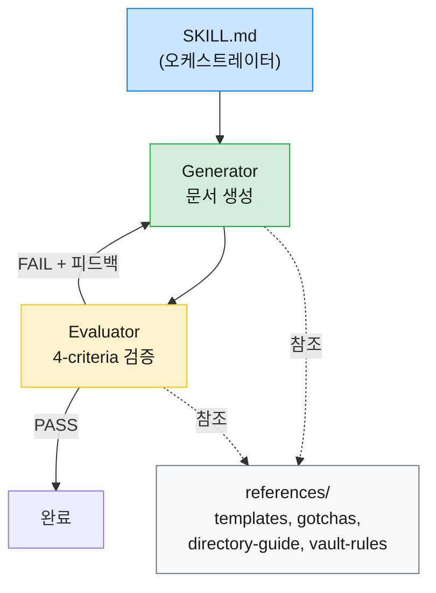

Claude Code의 스킬(Skill)은 반복 작업을 자동화하는 강력한 도구인데, 단일 패스 방식으로 구현하면 출력 품질이 들쭉날쭉해지는 문제가 있다. 이 글에서는 `/note` 스킬의 품질 문제를 하네스 패턴(Harness Pattern)으로 해결한 과정을 정리한다. 구체적으로는 Generator/Evaluator 분리, Evaluator 기준 설계, 그리고 59개 문서 실험을 통한 규칙 경량화까지 다룬다.

### 1. 문제 상황 - 단일 패스 스킬의 한계

#### [ 어떤 문제가 있었나 ]

`/note` 스킬은 Obsidian vault에 마크다운 문서를 생성하는 도구다. v1은 하나의 프롬프트로 문서를 한 번에 생성하는 단일 패스 방식이었는데, 사용하면서 다섯 가지 문제가 드러났다.

- **문서 형식 불일치**: 같은 유형의 문서인데 요약 형식(Callout vs 헤딩), frontmatter 필드, 원문 링크 형식이 제각각
- 트리거 범위 부족: `/note`를 명시적으로 호출할 때만 동작하고, 크롤링이나 대화 정리 등 다른 상황에서는 규칙이 적용되지 않음
- 시나리오별 형식 부재: 크롤링, 대화 정리, 코드 정리, 일반 노트의 형식 구분이 없음
- 디렉토리 판단 오류: 세부 경로 선택이 부적절하거나, 새 폴더가 필요한 상황에서 기존 폴더에 억지로 배치
- Obsidian 문법 오류: LLM이 frontmatter 태그 형식이나 wikilink 따옴표 같은 Obsidian 고유 문법을 일관되게 틀림

핵심은 단일 패스에서는 "생성"과 "검증"이 동시에 일어나기 때문에, 어느 쪽도 제대로 하기 어렵다는 점이었다.

### 2. 설계 - 하네스 패턴 채택

#### [ 하네스 패턴이란 ]

에이전트가 자유롭게 생성하되 별도의 평가 단계에서 검증하는 구조를 하네스 패턴(Harness Pattern)이라 부르는데, OpenAI의 "Harness engineering"과 Anthropic의 "Harness design" 문서에서 소개한 개념이다.

여러 방식 중 Generator/Evaluator 분리 패턴을 채택했다. 생성과 평가를 분리하면 각 역할에 집중할 수 있고, Evaluator의 기준을 독립적으로 발전시킬 수 있기 때문이다.

#### [ 설계 결과 ]

가장 큰 변화는 SKILL.md를 오케스트레이터로 전환한 것이다. Generator와 Evaluator를 조율하는 역할만 담당하게 하고, 정본 파일(templates, obsidian-gotchas, directory-guide)을 `references/` 디렉토리에 분리하면서 두 에이전트가 동일한 기준을 참조하도록 구조를 잡았다. 여기에 Evaluator의 4가지 평가 기준(Format, Placement, Metadata, Content)을 도입해서 검증의 구체성을 높였다.

트리거 범위도 확장했다. `/note` 명시 호출뿐 아니라 vault 경로에 MD를 생성하는 모든 상황에서 자동 적용되도록 변경했다.



### 3. 구현 - Chunk 단위로 나눠 진행

#### [ Chunk 1: References ]

가장 먼저 정본 파일 세 개를 분리하는 작업부터 시작했다.

| 파일 | 역할 |
|------|------|
| `references/obsidian-gotchas.md` | Obsidian 공식 문서 기반 LLM이 틀리기 쉬운 문법 정리 |
| `references/templates.md` | 시나리오 4종(크롤링, 대화, 코드, 일반)의 정본 + Evaluator 검증 기준 |
| `references/directory-guide.md` | 배치 규칙 + 세부 경로 로직 + vault 구조 반영 |

Generator와 Evaluator가 같은 정본을 참조하도록 하는 것이 핵심이다. 정본이 분리되어 있으면 규칙 변경 시 한 곳만 수정하면 되고, 두 에이전트 사이의 기준 불일치도 방지할 수 있다.

#### [ Chunk 2: Prompts ]

다음으로 Generator와 Evaluator의 프롬프트를 `prompts/` 디렉토리에 분리하는 작업이다.

| 파일 | 역할 |
|------|------|
| `prompts/generate.md` | Generator subagent 프롬프트 |
| `prompts/evaluate.md` | Evaluator 4-criteria 프롬프트, 독립성 원칙 적용 |

Evaluator의 독립성이 중요한데, Generator가 어떤 프롬프트를 받았는지 모르는 상태에서 오직 결과물과 평가 기준만으로 판단해야 한다. 그래야 Generator의 변명이 아니라 출력 품질 자체를 평가하게 된다.

> Evaluator는 Generator의 프롬프트를 모르는 상태에서 결과물만 보고 판단해야 한다. 이 독립성이 무너지면 평가가 "프롬프트를 잘 따랐는가"로 변질될 수 있다.
{: .prompt-tip }

#### [ Chunk 3: SKILL.md 리팩터링 ]

마지막으로 SKILL.md를 오케스트레이터로 전환하는 작업이다. 세부 규칙은 모두 `references/`와 `prompts/`로 옮기고 나면, SKILL.md에는 흐름 제어만 남게 된다.

### 4. 경량화 - 두 단계로 토큰 줄이기

구현을 마치고 보니 SKILL.md가 304행, obsidian-gotchas.md가 664행에 달해서 매번 읽어야 하는 토큰이 문제였다.

#### [ SKILL.md 경량화 ]

볼트 규칙(파일명 컨벤션, builds on 필드, 문서 길이 제한 등 약 120행)을 `references/vault-rules.md`로 추출했다. SKILL.md는 304행에서 185행으로 줄어들어 오케스트레이터 본연의 역할에 집중하게 됐다.

#### [ 59개 문서 실험으로 gotchas 경량화 ]

obsidian-gotchas.md의 경량화는 실험으로 접근했다. "LLM이 실제로 이 규칙을 틀리는가?"를 검증해서 불필요한 규칙을 제거하는 방식이다.

**실험 설계:**
- Opus 에이전트 10개, Sonnet 에이전트 50개로 총 59개 문서 생성
- obsidian-gotchas.md를 참조하지 않고 순수 LLM 지식만으로 Obsidian 마크다운 생성
- 각 문서의 gotchas 규칙 위반 여부를 자동 검사

**결과:**

| 규칙 | Opus 위반율 | Sonnet 위반율 | 전체 위반율 |
|------|------------|--------------|------------|
| 태그 `"#태그명"` 형식 | 89% | 100% | 98% |
| wikilink `"[[문서]]"` 형식 | 33% | 72% | 66% |
| Callout 문법 | 0% | 0% | 0% |
| 수평선, 체크박스, 하이라이트 등 | 0% | 0% | 0% |

결과가 명확했다. LLM은 Obsidian frontmatter에서 태그에 따옴표를 붙이는 규칙을 거의 100% 틀리고, wikilink에 따옴표를 붙이는 것도 66%의 확률로 틀린다. 반면 Callout이나 수평선 같은 표준 마크다운 문법은 전혀 틀리지 않았다.

> LLM이 실제로 틀리는 규칙(태그 따옴표 98%, wikilink 66%)에만 상세 예시를 유지하고, 위반율 0%인 규칙은 참고 수준으로 축소하는 것이 토큰 효율의 핵심이다.
{: .prompt-info }

이 결과를 바탕으로 위반율 0% 항목 9개를 하단 "참고" 섹션으로 이동시키고 상세 예시를 제거했다. 실험 과정에서 사용한 메타 정보(위반율 수치, 59개 문서 등)도 제거했다. Generator와 Evaluator가 알아야 할 것은 "이 규칙을 지켜라"이지, "왜 이 규칙이 존재하는지"가 아니기 때문이다.

최종 결과: 664행에서 211행으로 68% 감소.

### 5. 결과 - 최종 구조와 스모크 테스트

#### [ 최종 파일 구조 ]

```
skills/note/
├── SKILL.md              (185행, 오케스트레이터)
├── prompts/
│   ├── generate.md       (Generator subagent)
│   └── evaluate.md       (Evaluator 4-criteria)
└── references/
    ├── obsidian-gotchas.md (211행, LLM gotchas)
    ├── templates.md       (시나리오별 정본)
    ├── directory-guide.md (배치 규칙)
    └── vault-rules.md    (볼트 규칙)
```
{: .nolineno }

#### [ 스모크 테스트 ]

리팩터링 후 크롤링과 대화 정리 시나리오로 스모크 테스트를 진행했다.

| 시나리오 | Format | Placement | Metadata | Content | 판정 |
|----------|--------|-----------|----------|---------|------|
| 크롤링 | 5 | 3 | 5 | 4 | PASS |
| 대화 정리 | 5 | 4 | 5 | 5 | PASS |

전 항목 PASS로 기본적인 품질이 확보된 것을 확인했다.

### 6. 배운 점 - 실험 기반 경량화의 가치

#### [ LLM이 틀리는 것과 틀리지 않는 것 ]

이번 작업에서 가장 의미 있었던 발견은 "LLM이 실제로 무엇을 틀리는가"를 실험으로 확인한 부분이다. 태그 따옴표처럼 Obsidian 고유의 규칙은 거의 모든 모델이 틀리지만, Callout이나 수평선 같은 표준 마크다운 문법은 전혀 틀리지 않는다.

이 차이를 모른 채 모든 규칙을 동등하게 상세히 기술하면 토큰을 낭비하게 된다. 반대로 실험으로 검증해서 불필요한 규칙을 축소하면, 정말 중요한 규칙에 토큰을 집중시킬 수 있다.

#### [ Generator/Evaluator 분리의 효과 ]

생성과 평가를 분리하면 각 역할의 프롬프트를 독립적으로 개선할 수 있다. Generator의 프롬프트를 바꿔도 Evaluator의 기준은 그대로이고, 반대도 마찬가지다. 이 독립성 덕분에 한쪽을 수정할 때 다른 쪽이 깨지는 걱정 없이 반복 개선이 가능하다.

정본 파일(`references/`)을 공유하는 구조도 효과적이었다. 규칙이 변경되면 정본 한 곳만 수정하면 Generator와 Evaluator 모두에 반영된다.

---

단일 패스 스킬의 품질 문제를 Generator/Evaluator 분리와 실험 기반 경량화로 해결한 과정을 정리했다. 돌이켜보면, 생성과 평가를 한 프롬프트에 섞어놓았던 것이 근본 원인이었고, 이 둘을 분리하는 것만으로도 각 역할의 개선이 훨씬 수월해졌다.

59개 문서 실험은 예상보다 큰 수확이었다. "LLM이 실제로 뭘 틀리는가"를 감이 아니라 데이터로 확인하고 나니, 프롬프트에 남겨야 할 규칙과 빼도 되는 규칙을 구분하는 기준이 생겼다. 규칙이 많다고 좋은 게 아니라, 정말 틀리는 규칙에 토큰을 집중시키는 것이 효과적이라는 점을 실감했다.

하네스 패턴 자체는 아래 참고 자료의 OpenAI와 Anthropic 문서에서 이미 잘 설명하고 있으니, 자신의 스킬에 적용해보려는 분들은 해당 문서부터 읽어보길 권한다.

### 참고 자료

- [Anthropic - Harness design](https://docs.anthropic.com/en/docs/build-with-claude/prompt-engineering/harness-design)
- [OpenAI - Harness engineering](https://cookbook.openai.com/examples/o1/using_chained_calls_for_o1)
- [Claude Code - Skills 공식 문서](https://docs.anthropic.com/en/docs/claude-code/skills)
