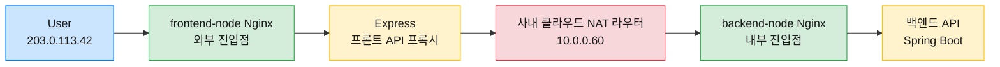
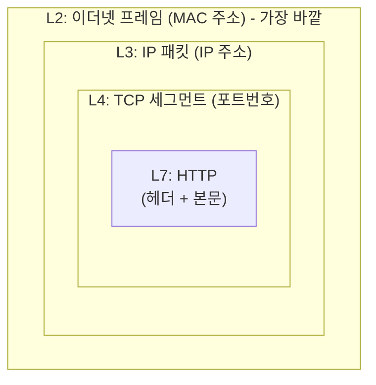

## 들어가며: 이 글은 디버깅 회고다

개발 환경에서 로그인할 때마다 휴대폰 인증이 반복해서 요구되는 버그가 있었다. DB에 찍힌 등록 IP를 열어보니 `10.0.0.60`. 공인 IP가 아닌 내부망 주소였다. 1차 수정을 했는데 배포 후에도 같은 증상이 나왔다. 원인은 나도 모르는 사이에 Spring이 이미 해놓은 일을 코드가 한 번 더 하려다 꼬였다는 것이었다.

이 글은 "해결했다"를 자랑하려는 글이 아니라 **그 자리에서 같이 디버깅하듯이 따라가는 회고**다. Nginx 리버스 프록시, `X-Forwarded-For` 헤더, 사내 클라우드 NAT 라우터, Spring `ForwardedHeaderFilter` 같은 개념이 버그를 풀어가는 흐름 속에서 자연스럽게 등장한다. 프록시 기본 개념은 알지만 NAT이 끼면 뭐가 달라지는지는 애매했던 독자를 염두에 두고 썼다.

> 예시용 IP와 서버 이름은 모두 일반화했다. 공인 IP는 RFC 5737의 문서용 블록(`203.0.113.0/24`), 사설 IP는 `10.0.0.0/8`을 사용한다.
{: .prompt-info }

---

## 1. 증상: DB에 이상한 IP가 찍힌다

### 무슨 일이 벌어졌나

서비스는 로그인 시 "예전에 쓰던 IP와 같으면 휴대폰 인증을 스킵"하는 정책을 가지고 있었는데 어느 순간부터 이 정책이 전혀 동작하지 않으면서 모든 로그인 시도에서 휴대폰 인증이 강제됐다.

조사해보니 `login_history.reg_ip` 컬럼에 `10.0.0.60`이 찍혀 있었다. 공인 IP(`203.0.113.42`)가 저장돼야 할 자리인데 내부망 IP가 들어앉아 있었고 등록 IP(`login_auth.auth_value`)와 매칭이 깨지니 인증을 스킵할 수 없었던 것이다.

### 인프라 구조부터 그려보기

버그를 이해하려면 요청이 어떤 경로로 들어오는지부터 봐야 한다. 구조는 이렇다.



사용자 요청이 프론트 Nginx를 거쳐 Express에 닿고 Express가 백엔드 API를 부를 때 내부망을 나와 공인망을 타고 다시 들어오는 구조다. 이 과정에서 **사내 클라우드 NAT 라우터**가 끼어 있고 이 라우터의 내부망 IP가 바로 `10.0.0.60`이었다.

즉 DB에는 **사용자의 IP가 아니라 사내 클라우드 NAT 라우터의 IP**가 저장되고 있었다. 누군가 어디선가 "직전 연결자의 IP"를 집어서 썼다는 뜻이다.

---

## 2. 왜 IP가 L3에서 사라지는가: 네트워크 계층 짚고 가기

### Nginx의 역할: 리버스 프록시

먼저 Nginx부터 짚고 가자. Nginx는 웹 서버로도 쓰이지만 이 맥락에서 핵심 역할은 **리버스 프록시(Reverse Proxy)**다.

```
[사용자] → [Nginx] → [실제 앱 서버]
```

사용자는 Nginx에게만 요청을 보내고 Nginx가 뒤에 있는 진짜 앱(Express, Spring Boot)에 요청을 전달한 뒤 응답을 받아 사용자에게 돌려준다. 사용자 입장에서는 Nginx가 곧 서버로 보인다.

리버스 프록시를 한 겹 끼우면 주소 통일(사용자는 `api.example.com:443` 하나만 기억), HTTPS(TLS) 종단 처리, 경로별 분배(`/api`는 Spring, `/static`은 파일 서버), 로드밸런싱, 무중단 배포용 에러 페이지 같은 일들이 한 자리에서 가능해진다. 이번 버그와 직결되는 건 이 중 두 번째인 **TLS 종단 처리**다. 뒷단에 평문 HTTP로 넘어가면서 원래 누가 연결했는지가 한 번 사라지는 지점이기 때문이다.

방향이 반대인 **Forward Proxy**와 헷갈릴 수 있는데 간단히 표로 정리하면 이렇다.

| 종류 | 누가 쓰나 | 목적 | 예시 |
| --- | --- | --- | --- |
| Forward Proxy | 클라이언트 측 | 외부에 나갈 때 내 정체 숨기기 | VPN, 사내 프록시 |
| Reverse Proxy | 서버 측 | 외부에서 들어올 때 뒷단 숨기기 | Nginx, AWS ALB |

이번 글의 주인공은 아래부분, 즉 리버스 프록시다.

### 이번 버그와 직결된 Nginx 설정

백엔드 앞단에 놓인 Nginx의 설정을 일반화해 옮기면 이런 모양이다.

```nginx
upstream backend_upstream {                  # ① 뒷단 풀 정의
    server 127.0.0.1:8091 backup;            #    예비 인스턴스
    server 127.0.0.1:8092 weight=5;          #    메인 인스턴스
}

server {
    listen 443 ssl;                          # ② 외부 443 포트에서 HTTPS 수신
    server_name api.example.com;             #    이 도메인 요청만 처리

    ssl_certificate     /etc/nginx/cert/...; # ③ SSL 인증서
    ssl_certificate_key /etc/nginx/cert/...;

    location / {                             # ④ 모든 경로를
        proxy_pass http://backend_upstream;  #    뒷단에 HTTP로 전달

        proxy_set_header Host              $host;                      # ⑤ 헤더 조작
        proxy_set_header X-Real-IP         $remote_addr;
        proxy_set_header X-Forwarded-For   $proxy_add_x_forwarded_for;
        proxy_set_header X-Forwarded-Proto $scheme;
    }
}
```

핵심은 ⑤번이다. 사용자가 보낸 HTTPS 요청은 Nginx에서 복호화되어 뒷단에 평문 HTTP로 넘어간다. 이 과정에서 뒷단 입장의 TCP 연결자는 `127.0.0.1`이 되어버리니까 **진짜 사용자 IP, 원래 HTTPS였다는 사실, 원래 호스트명이 모두 증발한다.** 그래서 Nginx가 "원본 정보를 헤더로 따로 적어 같이 넘겨주는" 관례를 만들었고 그게 `X-Real-IP`, `X-Forwarded-For`, `X-Forwarded-Proto` 같은 **X-Forwarded-\* 패밀리** 헤더다.

### 패킷의 겹 구조와 NAT이 건드리는 것

그런데 여기서 질문이 하나 생긴다. 왜 중간의 사내 클라우드 NAT 라우터는 IP만 건드리고 HTTP 헤더는 그대로 두는가? 이걸 이해해야 "왜 L7 헤더가 필요한가"가 납득된다.

네트워크를 떠다니는 패킷은 여러 겹의 봉투로 포장돼 있다.



- **L2 (데이터링크)**: 같은 네트워크 안에서 "이 케이블의 어느 컴퓨터"인지 식별하는 MAC 주소
- **L3 (네트워크)**: 인터넷 전체에서 "어느 컴퓨터"인지 식별하는 IP 주소
- **L4 (전송)**: 그 컴퓨터 내부의 "어느 프로세스"에 전달할지 결정하는 포트 번호
- **L7 (응용)**: 실제 알맹이. HTTP, DNS, SMTP 같은 애플리케이션 프로토콜

### NAT이 건드리는 계층

사내 클라우드 NAT 라우터 같은 장비는 L3 장비다. 하는 일은 **L3의 src IP를 바꿔 끼는 것뿐**이다.

| 계층 | 내용 | NAT이 건드리나? |
|------|------|-----------------|
| L3 | IP 주소 (src, dst) | 예 (src_ip를 바꿈) |
| L4 | 포트 번호 | 때로 (PAT) |
| L7 | HTTP 헤더와 본문 | 아니요 (절대 안 건드림) |

> PAT(Port Address Translation)은 같은 공인 IP를 여러 내부 호스트가 포트 번호로 구분해 공유하는 기법으로 사실상 우리가 흔히 말하는 "NAT"의 기본 동작이다.
{: .prompt-info }

굳이 L7을 안 건드리는 데는 두 가지 이유가 있다. 하나는 **"각 계층은 자기 일만 한다"는 설계 철학**이다. L3 장비인 라우터는 IP 수준의 경로 결정만 하고 HTTP 해석은 L7 장비(웹 서버, 프록시)의 몫이다.

다른 하나는 **성능**이다. L3 헤더 파싱은 고정 위치 4바이트만 읽으면 되지만 L7은 가변 길이 텍스트 파싱인 데다 HTTPS면 복호화까지 필요하다. 대형 라우터가 초당 수백만 패킷을 처리하는 상황에서 L7을 다 뜯어보면 인터넷 트래픽이 무너진다.

### SNAT vs DNAT: 이번 케이스는 SNAT

NAT은 방향에 따라 두 종류로 나뉘는데 이번 버그가 어느 쪽인지 분명히 해두는 게 좋다.

| 종류 | 조작 대상 | 언제 쓰이나 |
| --- | --- | --- |
| SNAT (Source NAT) | src_ip 변경 | 내부에서 외부로 나갈 때 |
| DNAT (Destination NAT) | dst_ip 변경 | 외부에서 내부로 들어올 때 (포트포워딩) |

이번 시나리오에서 문제가 된 건 SNAT이다. 내부의 프론트 노드가 공인 도메인을 향해 바깥으로 나갈 때 사내 클라우드 NAT 라우터가 src_ip를 공인 IP로 바꿔 끼면서 "진짜 사용자 IP" 정보가 L3에서 소실된다.

여기서 NAT의 양면성이 드러난다. **나쁜 소식**은 src_ip가 바뀌어서 진짜 사용자 IP가 L3에서 사라진다는 점이고 **좋은 소식**은 L7(HTTP 헤더)이 무사히 살아 있어서 앱끼리 약속한 우회로를 헤더에 만들 수 있다는 점이다.

그 우회로의 이름이 **`X-Forwarded-For`**다. NAT이 겉봉투의 발신 주소를 바꿔 써도 편지 안에 "진짜 발신자는 나야"라고 적어두면 수신자는 알 수 있다. 이게 XFF가 기대는 발상이다.

### 왜 사내 클라우드 NAT 라우터가 XFF를 직접 못 붙이는가

그럼 차라리 사내 클라우드 NAT 라우터가 XFF 헤더를 자기가 붙여주면 되지 않느냐는 의문이 생길 법한데 답은 단순하다. **L3 장비는 HTTP가 뭔지도 모른다.**

"HTTP 헤더를 추가한다"는 건 L7 작업이다. 라우터 수준에서 XFF를 붙이려면 Deep Packet Inspection(DPI, 패킷 내부 페이로드까지 해석하는 기법)이 필요한데 이건 대량의 CPU를 먹는 데다 HTTPS면 TLS 종료 지점이 아닌 이상 복호화도 못한다. 설상가상으로 "라우터가 앱 계층을 만진다"는 것 자체가 계층 분리 원칙을 어기는 일이다. 그래서 **L7 정보는 L7 장비(Nginx)나 앱(Express)이 알아서 넣는다**는 게 업계의 표준 관행이다.

---

## 3. `X-Forwarded-For` 체인은 어떻게 쌓이는가

### 이름부터 해석

`For` = "~를 대신하여". 그래서 `X-Forwarded-For: 203.0.113.42`을 직역하면 **"나(프록시)는 203.0.113.42를 대신해서 이 요청을 전달한다"**는 뜻이다. 앞에 붙은 `X-`는 RFC 표준이 아닌 **비공식 확장 헤더** 접두사로 업계 관례로 굳어진 헤더임을 뜻한다. 정리하면 "진짜 요청자는 따로 있고 나는 그 사람을 대신해 프록싱 중이다"라는 선언이다.

### `$proxy_add_x_forwarded_for`는 append 동작이다

Nginx 설정에서 이 한 줄이 마법처럼 보이지만 실제로는 단순하다.

```nginx
proxy_set_header X-Forwarded-For $proxy_add_x_forwarded_for;
```

Nginx 내장 변수 `$proxy_add_x_forwarded_for`의 로직은 이렇다.

```
if (들어온 요청에 X-Forwarded-For 헤더가 있다):
    값 = "기존 XFF 값, $remote_addr"
else:
    값 = "$remote_addr"
```

`$remote_addr`는 "방금 나한테 TCP 연결을 연 상대의 IP"다. 즉 기존 값 뒤에 내가 본 직전 연결자를 **붙인다**. 그래서 프록시를 여러 번 거치면 XFF는 계속 쌓이고 규칙은 **첫 번째 토큰이 진짜 사용자, 뒤로 갈수록 중간 프록시**다.

### `X-Real-IP`는 XFF와 뭐가 다른가

형제 헤더인 `X-Real-IP`도 짚고 가야 한다. 둘의 차이는 간결하다.

| 헤더 | 값 형식 | 특성 |
| --- | --- | --- |
| `X-Forwarded-For` | 체인 누적 (쉼표 구분) | 첫 번째 토큰이 진짜 사용자 |
| `X-Real-IP` | 단일 IP | Nginx가 "내가 본 직전 연결자 IP"를 박음 |

뒤에서 자세히 보겠지만 **NAT 환경에서는 `X-Real-IP`가 "사용자 IP"가 아니라 "프록시 직전 IP"**라 믿으면 안 된다. 이 사실이 이번 버그의 핵심 함정 중 하나였다.

### 이번 시나리오에서 체인이 변하는 순서

실제로 사용자가 로그인 한 번 할 때 XFF가 어떻게 변하는지 단계별로 따라가본다.

**단계 ⓪: 브라우저 최초 요청**

브라우저는 XFF 헤더를 붙이지 않는다. 그냥 `POST /login`.

**단계 ①: frontend-node Nginx 도착**

```
$remote_addr = 203.0.113.42
들어온 XFF = 없음
→ 새로 만든 XFF: "203.0.113.42"
```

Express에 전달되는 요청 헤더에 `X-Forwarded-For: 203.0.113.42`가 실린다.

**단계 ②: Express가 axios로 백엔드 API 호출**

Express는 axios 호출 시 받은 XFF를 그대로 실어 보낸다.

```javascript
axios.post('https://api.example.com/api/v1/auth/login', data, {
    headers: {
        'X-Forwarded-For': clientIp,
        'X-API-KEY': '...',
    }
});
```

**단계 ③: 사내 클라우드 NAT 라우터 경유**

Express의 axios는 공인 도메인으로 나가므로 VM 밖으로 튀어나간다. 사내 클라우드 NAT 라우터가 L3만 조작한다.

```
[L3] src=10.0.0.10 → 공인IP (SNAT)
[L4] 포트 그대로
[L7] HTTP 헤더 완전히 그대로 → XFF="203.0.113.42" 유지
```

**단계 ④: backend-node Nginx 도착**

```
$remote_addr = 10.0.0.60       ← 사내 클라우드 NAT 라우터가 바꿔낀 IP
들어온 XFF = "203.0.113.42"    ← Express가 실어 보낸 값
→ append → "203.0.113.42, 10.0.0.60"
```

**단계 ⑤: Spring Boot가 최종 수신하는 헤더**

```
X-Real-IP: 10.0.0.60                      ← $remote_addr 그대로
X-Forwarded-For: 203.0.113.42, 10.0.0.60  ← 체인 완성
```

"진짜 사용자는 누구?"의 답은 **XFF 맨 앞 토큰 = `203.0.113.42`**. 뒤의 `10.0.0.60`은 중간 프록시(사내 클라우드 NAT 라우터)일 뿐이다.

### 버그의 씨앗이 된 한 줄

처음 발견 당시 백엔드 코드에는 이런 줄이 있었다.

```java
user.setIp(request.getHeader("X-Forwarded-For"));
```

XFF 헤더를 **파싱 없이 통째로** IP 필드에 넣는 코드다. 그래서 저장된 값이 `"203.0.113.42, 10.0.0.60"` 문자열 전체였고 그걸 단일 IP와 `equals`로 비교하니 매칭이 깨진 것이다. 여기까지가 버그의 1차 원인이었다.

---

## 4. 1차 수정: XFF 첫 토큰을 직접 뽑자 (그리고 왜 망했나)

### 1차 수정안

1차 수정은 정석처럼 보이는 접근이었다. 유틸을 하나 만들어서 **우선순위대로 IP를 뽑자**.

```java
// 1차 PR
public static String extractClientIp(HttpServletRequest request) {
    // 1순위: XFF 첫 토큰
    String xff = request.getHeader("X-Forwarded-For");
    String fromXff = firstToken(xff);
    if (StringUtils.isNotBlank(fromXff)) return fromXff;

    // 2순위: X-Real-IP 폴백
    String realIp = request.getHeader("X-Real-IP");
    if (StringUtils.isNotBlank(realIp)) return realIp;

    // 3순위: TCP 레벨 주소
    return request.getRemoteAddr();
}
```

동시에 `application.yml`에 다음 한 줄을 추가했다.

```yaml
server:
  forward-headers-strategy: framework
```

이 옵션은 Spring Boot 2.2부터 제공된다. 프록시 뒤에 있는 앱이 `X-Forwarded-Host`, `X-Forwarded-Port`, `X-Forwarded-Proto`, `X-Forwarded-For` 같은 헤더를 **프레임워크 레벨에서 자동 반영**하도록 해준다. 값은 세 가지다.

| 값 | 처리 주체 |
|------|---------|
| `none` (기본) | 아무 처리 안 함 |
| `native` | 서블릿 컨테이너(Tomcat 등)에 위임 |
| `framework` | Spring이 `ForwardedHeaderFilter`를 자동 등록해서 직접 처리 |

`framework`로 켜두면 `request.xxx()` 계열 메서드가 **프록시 이전의 원래 값처럼** 동작한다. 말하자면 Spring이 프록시 헤더를 읽어서 요청 객체를 한 겹 감싸주고 개발자는 프록시의 존재를 의식하지 않고 서블릿 API만 호출하면 된다.

구체적으로 무엇이 바뀌는지 보면:

| 메서드                       | 기본 동작                                           | `framework` 적용 후                                  |
| ------------------------- | ----------------------------------------------- | ------------------------------------------------- |
| `request.getRemoteAddr()` | TCP 연결 상대방 IP: 같은 서버에서 프록시하는 Nginx면 `127.0.0.1` | `X-Forwarded-For` 첫 토큰: 진짜 사용자 IP(`203.0.113.42`) |
| `request.getScheme()`     | Tomcat이 받은 프로토콜: 보통 `http`                      | `X-Forwarded-Proto` 값: 사용자가 접속한 `https`           |
| `request.getServerName()` | Tomcat이 바인딩된 호스트명                               | `X-Forwarded-Host` 값: 사용자가 주소창에 친 원래 도메인          |

IP 로깅, HTTPS 리다이렉트 URL 생성, 접속자 도메인 추적 같은 일을 할 때 앱 코드가 "내가 인터넷에 직접 노출된 것처럼" 동작하게 해주는 옵션이라고 보면 된다. 같은 프로젝트의 다른 모듈은 이미 이 설정을 쓰고 있었고 이슈도 없었다. "이미 검증된 설정을 맞춘다"는 판단이었다.

그리고 나중에 이 한 줄이 함정이 될 줄은 그때는 몰랐다.

### 로컬에서는 잘 됐다

로컬 Docker로 Nginx를 띄우고 `X-Forwarded-For: 203.0.113.42, 10.0.0.60` 체인을 강제 주입해서 테스트해봤다. `login_history.reg_ip`가 `203.0.113.42`로 정상 저장됐다. 1차 PR 머지, 개발 서버 배포.

### 개발 서버에서는 여전히 실패

개발 서버 로그인에서는 여전히 휴대폰 인증이 강제됐다. DB에 찍힌 IP는 여전히 `10.0.0.60`. 분명히 첫 토큰을 뽑는 코드를 배포했는데 왜?

2차 디버깅에서는 네트워크와 배포 계층을 하나씩 배제해봤다.

- 프론트와 백엔드 Nginx 설정 확인 → 둘 다 정상 append
- 프론트 `apiService.js`도 XFF 정상 세팅
- WAS access_log(`%{X-Forwarded-For}i`): `203.0.113.42, 10.0.0.60` 같은 체인이 **정상 도달**하는 것 확인
- 배포된 jar에 `IpExtractUtil.class` 존재, 배포 시각도 맞음

네트워크와 배포는 결백한데 코드만 NAT IP를 저장하는 모순 상태였다. 이 지점에서 한참 막혔다.

---

## 5. 진짜 원인: `ForwardedHeaderFilter`가 먼저 일을 끝내놨다

### Spring이 아무에게도 말 안 하고 한 일

돌파구는 `application.yml`의 이 한 줄에 있었다.

```yaml
server:
  forward-headers-strategy: framework
```

이 옵션은 Spring이 `ForwardedHeaderFilter`를 **자동으로 등록**하게 한다. 그리고 이 필터는 요청이 컨트롤러에 닿기 전에 다음 두 가지를 한다.

1. `request.getRemoteAddr()`가 반환할 값을 **XFF 체인의 첫 토큰(`203.0.113.42`)으로 치환**
2. wrapped request에서 `X-Forwarded-*` 헤더들을 **제거** (이중 파싱 방지)

결정적인 부분은 2번이다. 필터가 **헤더 자체를 지워버린다.** 후속 코드가 한 번 더 파싱해서 꼬이지 말라는 배려인데 이 배려가 1차 수정과 정면으로 충돌했다.

### 우선순위별로 실제 반환값을 추적

| 단계 | 1차 수정 코드 | 필터 적용 후 실제 반환 |
|------|---------------|------------------------|
| `getHeader("X-Forwarded-For")` | 첫 토큰을 뽑으려고 시도 | **null** (필터가 제거) |
| `getHeader("X-Real-IP")` 폴백 | 이걸 쓰게 됨 | **`10.0.0.60`** (Nginx가 박은 NAT IP) |
| 저장 | NAT IP | 매칭 실패 |

1순위에서 null이 나오니 2순위 `X-Real-IP` 폴백으로 빠졌는데 **하필 `X-Real-IP`가 사내 클라우드 NAT 라우터 IP였다.** 결과적으로 저장된 값은 `10.0.0.60`. 버그 재현.

### access_log가 유발한 착시

개발 서버 WAS access_log에서 `%{X-Forwarded-For}i` 패턴이 체인 전체를 찍어주니까 "앱에 XFF가 잘 도달했다"고 판단했다. 그런데 access_log의 `%{...}i`는 **필터가 적용되기 전의 raw 헤더 값**이다. 필터 통과 후 앱 코드가 실제로 보는 값과는 다르다.

> raw 헤더는 프레임워크 이전이고 `getRemoteAddr()`는 프레임워크 이후다. 이 순서를 기억하지 않으면 디버깅 시 똑같은 착시에 걸린다.
{: .prompt-warning }

### `X-Real-IP`는 "사용자 IP"가 아니었다

여기서 `X-Real-IP`의 정체도 분명해졌다. 백엔드 Nginx 설정의 이 줄:

```nginx
proxy_set_header X-Real-IP $remote_addr;
```

`$remote_addr`는 "나한테 직접 TCP 연결한 IP"다. 백엔드 Nginx 입장에서 직접 연결한 건 사내 클라우드 NAT 라우터였으니 `X-Real-IP: 10.0.0.60`이 박힌다. **NAT 환경에서 `X-Real-IP`는 "사용자 IP"가 아니라 "프록시 직전 연결자 IP"**다. 신뢰 폴백이 아니었던 것이다.

---

## 6. 최종 수정: 프레임워크를 믿고 우선순위를 뒤집기

### 고친 코드

최종 PR에서 `IpExtractUtil`의 우선순위를 **뒤집고** `X-Real-IP` 폴백을 아예 제거했다.

```java
public static String extractClientIp(HttpServletRequest request) {
    // 1순위: getRemoteAddr
    // ForwardedHeaderFilter가 이미 XFF 첫 IP로 치환해둠
    String remoteAddr = request.getRemoteAddr();
    if (StringUtils.isNotBlank(remoteAddr)) {
        return normalize(remoteAddr.trim());  // IPv6 루프백(::1) → 127.0.0.1 같은 정규화
    }

    // 폴백: 필터가 없는 로컬/테스트 환경 대비
    String xff = request.getHeader("X-Forwarded-For");
    String fromXff = firstToken(xff);           // "a, b, c" → "a" (쉼표 기준 첫 토큰)
    if (StringUtils.isNotBlank(fromXff)) {
        return normalize(fromXff);
    }

    return null;
}
```

### 1차 vs 최종, 뭐가 달라졌나

| 항목 | 1차 PR | 최종 PR |
|------|-------------|--------------|
| 1순위 | XFF 헤더 직접 파싱 | `getRemoteAddr()` (필터 결과) |
| 2순위 | X-Real-IP 폴백 | XFF 파싱 (필터 없는 환경용) |
| X-Real-IP | 폴백에 포함 | **제거** |
| 실제 결과 | NAT IP 저장 (실패) | 공인 IP 저장 (성공) |

핵심은 **프레임워크가 이미 한 일을 다시 하지 않는 것**이다. `ForwardedHeaderFilter`가 XFF 체인 첫 토큰을 `getRemoteAddr()`에 밀어 넣었으니 코드는 그걸 그대로 쓰면 된다. 새로 파싱하려고 할수록 오히려 지워진 헤더를 만나 엉뚱한 폴백으로 빠진다.

### 검증 결과

- **UX**: 휴대폰 인증 없이 로그인 성공
- **`login_history.reg_ip`**: `203.0.113.42` (정상 공인 IP)
- **`login_auth.auth_value`**: `203.0.113.42` (매칭 성공)

### 전체 흐름 한 장 정리

```
사용자(203.0.113.42)
   │ HTTPS
   ▼
[frontend-node Nginx]
   │ $remote_addr = 203.0.113.42
   │ XFF = "203.0.113.42"
   ▼
[frontend-node Express]
   │ axios 헤더에 XFF 유지
   ▼
[사내 클라우드 NAT 라우터]  ← L3만 변환, HTTP 헤더는 무사
   │ src_ip: 10.0.0.10 → 공인IP
   ▼
[backend-node Nginx]
   │ $remote_addr = 10.0.0.60 (사내 클라우드 NAT 라우터)
   │ append → XFF = "203.0.113.42, 10.0.0.60"
   │ X-Real-IP = 10.0.0.60 ← 함정
   ▼
[백엔드 API + ForwardedHeaderFilter]
   ├─ getHeader("X-Forwarded-For") → null (필터가 제거)
   ├─ getHeader("X-Real-IP") → "10.0.0.60" (믿으면 안 됨)
   └─ getRemoteAddr() → "203.0.113.42" ← 정답
```

---

## 7. 배운 것들

이번 삽질에서 가장 크게 남은 건 **프레임워크가 이미 파싱한 값을 의심하지 않는 습관**이다. `server.forward-headers-strategy: framework` 한 줄을 켜면 `ForwardedHeaderFilter`가 요청 객체에 개입해서 `getRemoteAddr()`에 XFF 첫 토큰을 박아 넣고 대신 `X-Forwarded-*` 원본 헤더는 wrapped request에서 제거한다. 그 뒤에 코드가 다시 raw XFF를 파싱하려고 들면 제거된 빈 헤더를 만나 엉뚱한 폴백(이번 경우 `X-Real-IP`)으로 빠진다. "내가 한 번 더 처리해야 안전하다"는 직관이 오히려 독이었던 셈인데 Spring이 제공하는 표준 훅이 있을 땐 그 훅이 정확히 무엇을 했는지부터 확인하고 그 결과를 기준으로 코드를 붙이는 편이 훨씬 안전하다. 1차 수정이 개발 환경에서 실패한 이유도 이 순서를 반대로 밟았기 때문이다.

여기에 덧붙여 두 가지가 같이 배워졌다. `X-Real-IP`는 NAT 환경에서 신뢰할 수 있는 폴백이 아니다. 백엔드 Nginx 기준의 `$remote_addr`은 "나에게 직접 TCP 연결한 IP"이기 때문에 NAT 뒤에서는 사내 클라우드 NAT 라우터의 IP가 박힌다. 그리고 access_log의 `%{X-Forwarded-For}i`는 필터 **이전** 값이라 앱 코드가 실제로 보는 `getRemoteAddr()`와 어긋날 수 있다는 것. 디버깅하면서 이 둘을 헷갈리면 "로그엔 체인이 찍혔는데 왜 코드는 못 받지?"의 미궁에 빠진다.

### 프록시 뒷단 앱을 만질 때 실무 체크리스트

- 클라이언트 IP가 필요하다면 **`server.forward-headers-strategy: framework`를 먼저 검토**한다. 적용 후에는 `getRemoteAddr()`만 쓰면 된다.
- XFF는 **쉼표 구분 체인**이다. 첫 토큰만 진짜 사용자다. 체인 전체를 단일 IP 컬럼에 넣지 말 것.
- Nginx의 `$proxy_add_x_forwarded_for`는 **append**라는 점을 기억. 홉(hop, 프록시를 한 번 거치는 단위)마다 체인이 길어진다.
- **사내 클라우드 NAT 라우터는 L3 장비**라 HTTP 헤더를 못 붙인다. Express 같은 L7 구간에서 미리 XFF를 실어 보내야 NAT 너머에도 사용자 IP가 살아남는다.
- 디버깅할 땐 access_log의 raw 값과 앱 코드의 `getRemoteAddr()` 값을 **반드시 분리**해서 비교한다.

버그 자체는 결국 우선순위 몇 줄 뒤집는 걸로 끝났는데 거기까지 가는 데 한참 돌아왔다. "왜 로컬에서는 되고 개발 서버에서는 안 되지"를 붙잡고 있던 며칠 동안 Spring이 조용히 해주던 일을 내가 한 번 더 하려다 꼬였다는 걸 깨닫기까지 걸린 시간이기도 했다. 프레임워크를 믿는다는 건 생각보다 능동적인 결정이었다.
