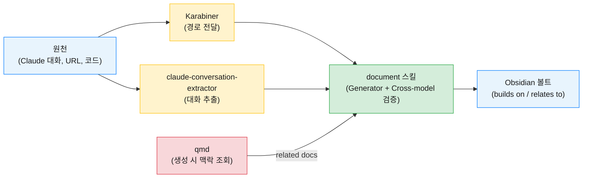
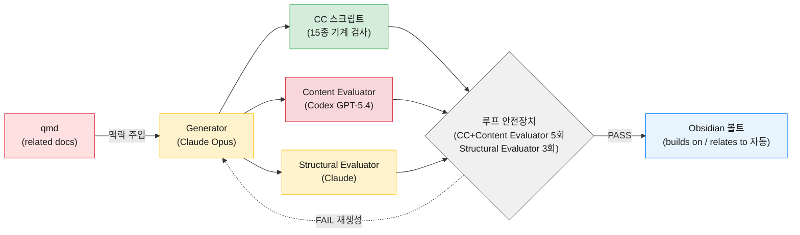

 
## 1. 여는 말

글을 쓰고 정리하는 일은 원래 어렵다. 솔직히 나도 그렇다. 머릿속에서는 제법 선명하던 생각이 빈 화면 앞에 앉는 순간 흐려지고, 반쯤 쓰다 보면 방향을 잃는다.

여기에 최근 한 가지 문제가 더 얹어졌다. "저번에도 이거 물어봤는데." Claude에게 질문을 입력하다 스스로 멈칫하는 순간이 많아졌다. 분명 해결했던 문제이고, 답에 가까웠던 대화도 있었다. 다만 그 대화는 터미널이 닫히는 순간 사람이 바로 읽을 수 있는 형태로는 남지 않는다.

"희미한 연필자국이 선명한 기억보다 낫다." 오래 전에 어디선가 주운 말인데 나는 이 말에 몹시 공감한다. 그래서 노션이 처음 나왔을 때부터 써왔고, 그 전에는 에버노트를 썼다. 이 년 전부터는 옵시디언(Obsidian)으로 옮겨왔다. 지금 내 볼트에는 오천 개가 넘는 노트가 쌓여 있다. 예전에는 그중에서 필요한 한 줄을 찾는 일이 가장 힘들었는데 qmd라는 로컬 검색 엔진을 쓰기 시작하면서부터 그 문제는 손이 닿는 거리로 돌아왔다.

그런데 찾을 수 있다는 것과 기록이 자산이 된다는 것은 다른 문제다. 쓰는 일 자체가 어렵다면 연필을 쥐는 일부터가 일이 되고, 쓴 것이 휘발된다면 연필자국은 처음부터 남지 않으며, 쌓인 자국이 서로 이어지지 않으면 찾을 수 있더라도 조각난 단편에 머문다. 이 글은 그 세 간극을 내가 어떻게 도구와 시스템으로 메워왔는지에 대한 기록이다.

## 2. 세 원칙과 시스템 한눈에 보기

세 간극은 곧 세 원칙이 된다. 첫째, 쓰는 일을 시스템이 돕게 한다. 둘째, 원본을 꺼내 두고 사람이 직접 검증할 수 있는 형태로 둔다. 셋째, 쌓인 기록이 서로 이어지도록 지식망에 편입시킨다. 네 개의 도구(Karabiner, claude-conversation-extractor, qmd, document 스킬)가 이 세 원칙을 어떻게 나누어 맡고 있는지를 먼저 한 장으로 조감하면 다음과 같다.



아래는 흐름을 따라가는 순서로, 네 도구를 하나씩 들여다본다.

## 3. Karabiner: 마찰을 지우는 것이 시작이다

가장 먼저 막히는 지점은 의외로 초입이다. macOS에서 AI에게 파일 하나를 던지려 할 때도 경로가 필요하고, 그 경로를 얻는 일부터 네 갈래로 갈라진다. Finder 하단 breadcrumb에서 오른쪽 클릭을 해 "Copy as Pathname"을 고르거나, `Cmd+I`로 정보창을 열어 "Where:" 값을 읽거나, 창에 파일을 드래그하거나, 그렇게 얻은 경로가 공백과 괄호 때문에 터미널에서 깨지는 것을 확인하는 순서다. 한두 번은 괜찮은데, 이게 하루에 열 번을 넘어가면 집중이 흩어지기 시작한다.

그래서 단축키 두 개를 Karabiner에 묶어 두었다. `Cmd+Shift+C`는 Finder에서 선택한 항목의 POSIX 경로를 그대로 복사하고, `Cmd+Option+Shift+C`는 같은 경로를 공백과 괄호가 백슬래시로 이스케이프된 터미널 안전 형태로 복사한다. 선택된 것이 없으면 현재 창의 경로를 대신 가져온다.

```json
[
{
  "description": "Cmd+Shift+C to copy selected file path in Finder",
  "manipulators": [
    {
      "conditions": [
        { "bundle_identifiers": ["^com\\.apple\\.finder$"], "type": "frontmost_application_if" }
      ],
      "from": {
        "key_code": "c",
        "modifiers": { "mandatory": ["command", "shift"] }
      },
      "to": [{ "shell_command": "osascript -e 'tell application \"Finder\"' -e 'set selectedItems to selection' -e 'if (count of selectedItems) > 0 then' -e 'set the clipboard to POSIX path of (item 1 of selectedItems as alias)' -e 'else' -e 'set the clipboard to POSIX path of (target of front window as alias)' -e 'end if' -e 'end tell'" }],
      "type": "basic"
    }
  ]
},
{
  "description": "Cmd+Option+Shift+C to copy quoted file path in Finder",
  "manipulators": [
    {
      "conditions": [
        { "bundle_identifiers": ["^com\\.apple\\.finder$"], "type": "frontmost_application_if" }
      ],
      "from": {
        "key_code": "c",
        "modifiers": { "mandatory": ["command", "option", "shift"] }
      },
      "to": [{ "shell_command": "export LC_ALL=en_US.UTF-8; osascript -e 'tell application \"Finder\"' -e 'set selectedItems to selection' -e 'if (count of selectedItems) > 0 then' -e 'POSIX path of (item 1 of selectedItems as alias)' -e 'else' -e 'POSIX path of (target of front window as alias)' -e 'end if' -e 'end tell' | tr -d '\\n' | perl -pe 's/([ ()])/\\\\$1/g' | pbcopy" }],
      "type": "basic"
    }
  ]
}
]
```
{: file="~/.config/karabiner/karabiner.json" }

사소해 보이는 개선이지만 체감은 의외로 크다. 사람이 도구의 동선에 맞추는 게 아니라 도구가 사람의 동선에 맞아야 한다고 생각하는데 이 한 키로 아낀 건 1초가 아니라 그 1초마다 흩어지던 주의력이다.

경로의 마찰이 사라진 자리에서야 다음 질문이 드러난다. 그 경로 위에서 벌어지는 대화는 정작 어디에 남는가.

## 4. claude-conversation-extractor: 대화를 자료로 길어 올린다

휘발 문제를 풀 때 처음 떠올리는 건 Claude 기본 export 기능이지만, 막상 열어 보면 마크다운이 아니어서 다시 읽기가 불편하다. 그 다음 유혹은 세션을 스킬에게 넘겨 요약을 맡기는 방법인데, 이 방식은 더 어려운 문제를 낳는다. 무엇이 살아남고 무엇이 버려졌는지 내가 확인할 길이 없기 때문이다. 잘 정리된 노트 한 장만 보고서는 빠진 대화가 있었는지조차 알기 어렵다.

그래서 내가 세운 원칙은 단순하다. **신뢰할 수 있는 가공의 출발점은 검증 가능한 원본이다.** Claude와 나누는 대화는 잠깐 쓰고 버리는 잔여물이 아니라 내 추론의 절반이 일어나는 자리에 가깝다. 그 원본을 잃는다는 건 결과물이 아니라 추론 자체를 잃는 일이다.

이 문제를 이미 풀어 둔 사람이 있었다. [ZeroSumQuant/claude-conversation-extractor](https://github.com/ZeroSumQuant/claude-conversation-extractor)는 `~/.claude/projects/*/chat_*.jsonl`에 잠들어 있는 세션들을 마크다운으로 뽑아내는 도구다. 다만 영어 UI였고, 한글 검색이 제대로 되지 않았으며, 저장할 때마다 경로를 다시 입력해야 했다. 모두 내 손에 어색하게 맞지 않는 부분이었기에, fork해서 v1.1.2-ko로 내 쪽에 맞게 고쳐 두었다.

고친 지점은 셋이다. 사용자 대면 메시지를 전부 한국어화했다. 검증 가능성이라는 원칙의 연장선에 있는데 내가 읽을 수 있어야 검증할 수 있기 때문이다. 한글 실시간 검색을 위해 UTF-8 멀티바이트 키보드 핸들러를 붙였고, 최근 저장 경로 세 개를 `~/.claude/conversation-extractor-config.json`에 기억하게 했다.

쓰는 모습은 이런 식이다. `claude-start`로 인터랙티브 메뉴를 띄우고, 남기고 싶은 대화를 고르면 마크다운이 떨어진다. 그 마크다운이 다음 단계인 document 스킬의 입력이 된다.

```bash
$ claude-start

📁 대화를 어디에 저장하시겠습니까?
  1. ~/Desktop/Claude Conversations
  2. ~/Documents/Claude Conversations
  3. ~/Downloads/Claude Conversations

최근 사용한 위치:
  5. ~/Obsidian/10. Fleeting Notes

옵션을 선택하세요: 3

🔍 대화를 검색하는 중...
✅ 15개의 대화를 찾았습니다!

   1. [2026-04-23 13:45] project-A           (502.6 KB)
   2. [2026-04-23 13:36] project-A           (2258.5 KB)
   3. [2026-04-23 12:29] project-B           (308.4 KB)
  ... 외 12개

선택: s
대화 번호: 1

📤 추출하는 중...
✅ claude-conversation-2026-04-23-ca6372c1.md (125 messages)
📁 저장: ~/Downloads/Claude Conversations
```

- 저장소: [github.com/Epikoding/claude-conversation-extractor](https://github.com/Epikoding/claude-conversation-extractor)

원본은 휘발되어선 안 되고, 보존된 원본은 사람이 직접 들여다볼 수 있어야 한다. 그래야 그 위에 올린 어떤 가공도 신뢰할 수 있다. 그러나 이렇게 길어 올린 자료가 또 다른 파일로 디스크 어딘가에 쌓이기만 한다면 의미가 없다. 어디로 가서 어떻게 다시 찾혀지는지가 다음 문제다.

## 5. qmd: 찾을 뿐 아니라, AI가 내 볼트를 알게 한다

예전에는 키워드를 바꿔가며 볼트 전체에 검색창을 두드리던 밤이 있었다. 지금은 "그때 메모해 둔 거 어디였더라"라고 자연어로 묻고 답이 돌아오는 일상에 가깝다. 이 변화는 qmd라는 로컬 검색 엔진 덕이다. qmd는 공개 프로젝트다([tobi/qmd](https://github.com/tobi/qmd)).

qmd는 같은 질문을 세 방식으로 훑는다. 단어가 그대로 맞는지 보는 키워드 검색, 뜻이 가까운지 보는 의미 검색, 그리고 둘의 결과를 작은 모델이 다시 한 번 정렬해 주는 재랭킹이다. 짧은 질문은 필요할 때 더 풍부한 형태로 한 번 늘려 준다. 덕분에 "JPA 지연 로딩"으로 적어 둔 노트를 "lazy loading"으로도 건질 수 있다.

내부에서는 세 모델이 자기 자리를 맡는다. `embeddinggemma-300M`은 Google이 2025년에 공개한 300M 파라미터 온디바이스 임베딩 모델로 문장을 숫자 벡터로 바꾸는 역할을 한다. `qwen3-reranker-0.6b`는 Alibaba Qwen3 계열의 작은 재랭커로 질문과 후보 문서를 한 쌍으로 함께 읽으며 관련성 점수를 매긴다. `qmd-query-expansion-1.7B`는 qmd가 파인튜닝한 전용 모델로 짧은 질문 하나를 키워드용·의미용·가상 답변 세 형태로 늘려 준다. 2.1.0부터는 코드 파일을 줄 수가 아니라 함수·클래스 단위로 쪼개 넣는다. 줄 수로 자르면 긴 함수가 청크 경계에 걸려 중간이 토막 나고, 그 토막은 어느 함수의 어느 부분인지 맥락을 잃기 때문이다.

한 가지 결정이 여기에 깔려 있다. 이 검색·인덱싱 계층의 모든 처리가 외부 API 호출 없이 내 맥 안에서만 돈다. 프라이버시 때문만은 아니다. 십 년 동안 쌓아온 자료를 누군가의 정책이 한 번 바뀌었다고 흔들리게 두고 싶지 않았고, 비용이 데이터 규모에 비례해 커지는 구조도 내키지 않았으며, 비행기 안에서 검색이 안 되는 것도 싫었다. 결국 데이터 주권과 자립의 문제다. 여기에 키워드와 벡터를 이중으로 두는 선택은 따로 설명하지 않아도 되는데 정확 매칭과 의미 매칭은 서로 다른 방식으로 실패하기 때문이다. 한쪽만으로는 다른 쪽의 사각지대를 볼 수 없다.

여기까지 오면 이 구조에 익숙한 이름이 붙는다. **RAG(Retrieval-Augmented Generation)**. 검색이 생성을 보강하는 방식이다. 내 볼트가 검색 인덱스고, Claude와 Codex가 생성기이며, 임베딩과 리랭커와 청커가 그 사이를 잇는다. 내가 이 구조를 고른 이유 중 하나는 검색·인덱싱 계층이 전부 로컬에서 돌아간다는 점이다. Pinecone도 OpenAI 임베딩도 없이 내 노트들 위에서만 작동하는 개인용 로컬 RAG인 셈이다. 규모로 보면 청크 10,816개, DB 73.1MB다. 모두 내 맥 위에서 돈다.

```bash
qmd query "작년 10월에 적어둔 Docker healthcheck 설정"
```

재인덱싱은 보이지 않게 돌아간다. launchd 잡 `com.user.qmd-reindex`가 한 시간에 한 번 새 문서를 잡아 넣는다. 한동안 인덱싱을 미뤄 뒀다 plist로 등록해 처음 돌렸을 땐 277개 문서와 1,324개 청크가 한꺼번에 들어가는 데 60초가 걸렸다. 감각적으로는 도구가 내 대신 꾸준히 일하고 있는 쪽에 가깝다.

찾는 쪽의 절반은 이렇게 봉합되었다. 다만 찾힌다고 해서 이어진 건 아니다. 노트가 서로 자기 이웃을 알고 있어야 진짜 그물이 된다.

## 6. document 스킬: 쓰는 일을 시스템이 돕게 한다

AI가 초안을 내주기 시작하면서 생긴 새 문제가 있다. 초안을 얻는 일은 전보다 쉬워졌는데 "이게 맞나"를 검증하는 일이 전보다 어려워졌다. 같은 모델에게 다시 물으면 같은 사각지대에서 같은 답을 돌려주기 때문이다. 생성자와 검증자가 같은 뇌를 공유하면 일어나는 일이다.

그래서 혼자 쓰는 대신 역할을 나눴다. 사람 팀에서 한 명이 쓰고 다른 사람이 리뷰하듯, document 스킬도 네 역할이 협업한다.

- **Generator**: Claude Opus. 노트 초안을 만들고, 피드백이 오면 다시 쓴다
- **CC 스크립트(Consistency Check)**: 결정적(deterministic) 15종 기계 검사. frontmatter, 태그, wikilink 문법
- **Content Evaluator**: Codex(GPT-5.4). 사실 정확성과 의도 반영을 본다
- **Structural Evaluator**: Claude. 템플릿 준수와 디렉토리 배치를 본다

이 설계 뒤에는 **Generator-Evaluator 하네스**(생성과 검증 역할을 묶어 자동 루프로 돌리는 틀)라는 패턴이 있다. document 스킬은 그 패턴을 "Obsidian 노트 생성"이라는 특정 문제에 맞춰 구현한 사례다. 같은 패턴을 document-export 스킬까지 적용하며 Evaluator를 전문화하고 평가 축을 10개로 확장했고, Evaluator를 Codex(GPT-5.4)로 돌려 cross-model review까지 넘긴 과정은 [Claude Code 하네스 패턴 가이드 Part 1](https://epikoding.github.io/posts/claude-code-harness-pattern-guide-part1/)에 따로 써 두었다.

핵심만 정리해서 말한다면 **Generator와 Evaluator의 역할을 분리한다**는 점이다. 한 역할이 쓰기와 검증을 동시에 맡으면 자기 사각지대를 볼 수 없다. 그 위에 두 역할을 가능한 한 다른 모델에 맡긴다. 같은 모델은 같은 자리에서 같은 실수를 하기 쉽기 때문이다. 완전히 다른 사각지대를 보장할 수는 없지만 적어도 한쪽이 놓친 것을 다른 쪽이 잡을 여지가 생기는 것이다.



LLM이 같은 실수를 반복하는 지점을 따로 문서화해 두고, Generator가 글을 쓰기 전에 그 문서를 먼저 읽게 했다. Obsidian wikilink 문법, `builds on`과 `relates to`의 오남용, mermaid의 작은 함정 같은 것들이다. 참조 파일은 다음 다섯 개다.

- `templates.md`: 노트 템플릿
- `obsidian-gotchas.md`: Obsidian 특화 실수 패턴
- `directory-guide.md`: 디렉토리 배치 규칙
- `vault-rules.md`: 볼트 전반의 컨벤션
- `mermaid-gotchas.md`: 다이어그램 렌더링 함정

자유도를 주기만 하면 LLM은 매번 비슷한 곳에서 넘어진다. 그래서 자유도 옆에 규칙을 같이 주입한다.

이 구조에는 또 하나 현실 인식이 들어 있다. LLM의 자체 평가는 수렴하지 않을 수 있다는 점이다. 그래서 루프에 안전장치를 뒀다. 각 범주에 독립적인 상한을 두는 방식이다. CC+Content Evaluator 라운드는 최대 5회, Structural Evaluator 라운드는 최대 3회로 한도를 두었다. 완벽한 노트가 아니라 도달 가능한 노트에서 끊는 쪽을 택한 것이다.

마지막으로 qmd가 여기서 한 번 더 등장한다. Generator가 초안을 쓰기 직전에 qmd로 볼트를 미리 뒤져, 같은 주제의 기존 노트를 `builds on`(토대가 된 노트)과 `relates to`(관련 노트) frontmatter 필드에 자동으로 채운다. 이 풀 파이프라인을 거친 노트는 처음부터 자기 이웃을 알고 있는 상태가 된다. 지식망 편입의 "잇는 쪽"이 여기서 봉합된다.

설계에서 하나 더 지키려 한 건 책임 분리다. 오케스트레이터는 흐름을 제어하고 변수를 주입할 뿐, 파일을 직접 쓰지 않는다. 생성 책임은 Generator에게만 있다. 오케스트레이션과 생성이 같은 손에서 일어나면 둘 다 흐려진다는 판단이었다.

이렇게 네 도구가 세 원칙을 나누어 작동시키는 상태에 도달했다. 그러나 도달했다는 말은 완성했다는 말과 다르다.

## 7. 아직 흐린 자국들

이 시스템은 매일 돌고 있지만 완성품은 아니다. 남아 있는 흐린 자국이 하나 있다.

Cross-model 파이프라인의 비용이다. document 스킬은 Codex API를 부르기 때문에 긴 노트 하나가 의미 있는 과금을 만든다. 그래서 모든 노트가 풀 파이프라인을 거치는 건 아니고, 짧은 메모는 경량 경로로 빼 두었다. 경량·풀의 경계를 어디에 그을지는 여전히 감으로 하고 있는데 이걸 규칙으로 굳히는 게 다음 과제다.

그리고 기술보다 조금 더 아래에 있는 질문이 하나 있다. 쓰는 일을 시스템이 점점 더 많이 돕게 되면 내가 직접 고민하는 시간은 어디로 가는가. 도구가 유능해질수록 의존도 깊어진다. 이 시스템의 진짜 목적은 더 많이 기록하는 것이 아니라 덜 고민해도 되는 것들을 시스템에 맡기고 내가 진짜로 고민해야 할 것에 더 깊이 들어가는 것이어야 한다고 생각한다. 그 경계선이 정확히 어디인지는 아직도 매일 다시 그린다.

그럼에도 시스템은 매일 조금씩 고쳐진다. 완성하자는 게 아니라 쓸만해지자는 쪽에 가깝다.

## 8. 맺는 말

Karabiner가 경로를 건네고, claude-conversation-extractor가 대화를 건져내고, qmd가 내 볼트를 AI에게 보여 주고, document 스킬이 그 위에서 쓰고 검증한다. 네 도구가 각자 한 자리를 맡고 있어서 세 간극이 완전히 지워지진 않아도 전보다 얕아졌다.

완성은 아니다. 고쳐야 할 것들이 아직 목록에 남아 있고, 그 목록도 매달 조금씩 바뀐다. 다만 지금의 내 기록은 예전보다 덜 잃어버린다. 찾을 수 있고, 이어지고, 다시 꺼낼 수 있다.

나는 이렇게 기록한다.
