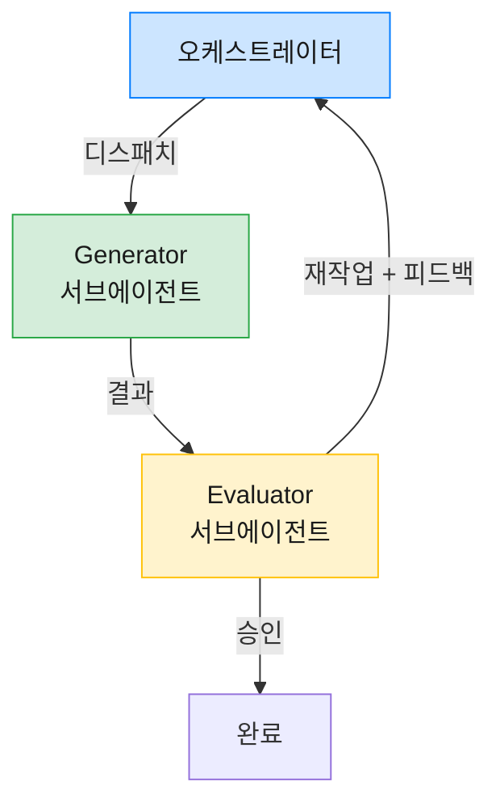

점심 먹고 자리에 돌아와 같은 세션의 대화를 이어가는데 토큰이 갑자기 확 빠지는 느낌을 받아본 적 있으신가요? 또는 여러 세션을 같이 띄워 두고 일하다가, 한참 뒤에 한 세션에 다시 프롬프트를 넣고 대화를 시작했는데 토큰이 갑자기 확 빠진 경험은요? 분명히 어제와 똑같은 시스템 프롬프트, 똑같은 도구 정의인데도 매번 처음 보는 것처럼 토큰이 소모됩니다. 한 세션에서는 절감액이 작아 보이지만, 여러 세션을 같이 돌리는 헤비 유저에게는 그 작은 누수가 하루 단위로 쌓입니다.

숫자로 한번 보면 감이 옵니다. Opus 4.7 기준으로 입력 토큰은 100만 개당 5달러, 50K짜리 시스템 프롬프트를 100번 호출하면 입력에만 25달러가 나갑니다. 같은 내용이 매번 그대로 들어가는데도요. 이걸 제대로 캐시하면 그 50K가 두 번째 호출부터는 90% 할인됩니다.

이 글은 캐시가 무엇이고, 캐시를 효율적으로 쓰기 위한 가이드 문서입니다. 먼저 캐시가 어떻게 동작하는지를 짧게 짚고, 5분과 1시간 중 어느 쪽을 골라야 하는지를 살펴본 뒤, 헤비 유저들이 자주 빠지는 함정인 하네스 패턴 안에서의 캐시 깨짐을 다룹니다. 마지막으로는 오늘 바로 워크플로에 적용해볼 수 있는 실천 원칙 7가지를 정리합니다.

### 1. 캐싱이란 무엇인가

#### [ 계산 결과의 보관함 ]

캐시는 한마디로 **계산 결과의 보관함**입니다. 같은 입력이 또 들어오면 다시 계산하지 않고 보관함에서 꺼내 쓰는 구조죠. Claude가 토큰을 처리할 때는 내부 계산 결과를 토큰마다 만들어내는데, 이 계산이 비용의 큰 부분입니다. 같은 시스템 프롬프트가 또 들어오면 같은 결과를 똑같이 다시 만드는 셈인데요, 그 결과를 서버에 잠깐 저장해두고 두 번째 호출부터는 바로 꺼내 쓰는 메커니즘이 키-값 캐시(Key-Value cache, 이하 캐시)입니다.

이 보관함의 효과가 얼마나 큰지는 가격으로 드러납니다. 첫 호출에서 캐시에 저장할 때는 평소보다 살짝 비싸지만, 두 번째 호출부터는 정가의 10% 수준입니다. 90% 할인이 매 회 자동으로 적용되는 셈입니다.

#### [ 책 갈피처럼 작동하는 앞부분 일치 ]

여기서 한 가지 까다로운 규칙이 있습니다. 캐시는 두 호출의 앞부분이 **처음부터 어디까지 똑같은지**를 봅니다. 책을 펼쳐 두 권을 처음 페이지부터 비교한다고 생각해보세요. 첫 글자부터 같은 만큼만 갈피가 작동하고, 한 글자라도 다른 순간 갈피는 거기서 끝납니다.

캐시도 똑같습니다. 두 호출의 앞부분이 같으면 그만큼은 보관함에서 꺼내 쓰지만, 한 글자라도 달라지는 순간부터는 다시 계산해야 합니다. 그 끊기는 지점을 캐시 경계(breakpoint)라고 부르는데요, API에서는 `cache_control` 마커로 명시하고, Claude Code 같은 환경에서는 시스템이 알아서 잡아줍니다.

이 규칙에서 자연스럽게 한 가지 원칙이 나옵니다. **변하지 않는 부분을 앞에 두고, 매번 달라지는 부분을 뒤에 두라**는 것입니다. 영어로는 static-first, dynamic-last라고 부릅니다. 이 글에서 가장 자주 등장할 표현이니 머릿속에 한 번만 새겨두면 됩니다.

### 2. 무엇이 캐시되는가

Claude API의 요청은 안에서 세 층으로 쌓여 있습니다. 도구 정의가 가장 안쪽에 있고, 그 위에 시스템 프롬프트, 그 위에 메시지가 올라갑니다. 캐시도 정확히 이 순서를 따라 동작합니다.

```
[tools] → [system] → [messages]
도구 정의   시스템 프롬프트   대화 이력
```

순서가 중요한 이유는, 가장 안쪽에 있는 도구 정의를 한 줄이라도 바꾸면 그 위에 있는 시스템 프롬프트와 메시지의 캐시가 한꺼번에 무효화되기 때문입니다. 매번 비싼 첫 호출을 새로 치르게 된다는 뜻입니다.

#### [ Claude Code가 자동으로 캐시하는 것들 ]

Claude Code 같은 호스트 환경을 쓰고 있다면, 사용자가 따로 손대지 않아도 다음 항목이 자동으로 캐시 대상이 됩니다.

- **시스템 프롬프트** — Claude Code 본체가 모델에게 주는 기본 지시 (약 4K 토큰)
- **도구 정의** — Read, Edit, Bash 같은 도구의 스키마 (5K~15K 토큰)
- **CLAUDE.md / AGENTS.md** — 프로젝트와 사용자 단위 지시문 파일
- **rules 디렉터리의 규칙 파일들** — `~/.claude/rules/*.md` 같이 항상 함께 로드되는 규칙들
- **대화 이력** — 이미 주고받은 메시지

반대로 **사용자가 새로 입력하는 메시지**는 캐시 대상이 아닙니다. 매 턴 새로 들어오는 부분이라 그 자체로 캐시 키가 될 수 없습니다. 다만 그 메시지가 한 번 처리되고 대화 이력에 들어가는 순간부터는, 다음 턴의 캐시에 함께 들어갑니다.

이 사실이 다음 항목으로 자연스럽게 이어집니다. 캐시는 한 번 만들어지고 끝이 아니라, 턴이 진행될수록 점점 길어지는 구조입니다.

#### [ 턴마다 캐시가 누적됩니다 ]

매 턴마다 메시지가 누적되고, 그 누적된 앞부분이 다음 턴의 캐시가 됩니다. 정확한 흐름은 이렇습니다.

```
Turn 1: A 질문
[system + tools + user(A)]
                          ↑ 캐시 경계 (자동 캐싱이 여기 찍음)
캐시 저장: system + tools + A 전체를 캐시에 저장
모델이 A-1 답변 생성

Turn 2: B 질문 (A-1 응답이 추가된 상태)
[system + tools + user(A) + assistant(A-1) + user(B)]
                                                   ↑ 새 캐시 경계
캐시 읽기: 처음부터 user(A)까지는 turn 1에서 저장된 캐시에서 (90% 할인)
새로 처리: assistant(A-1) + user(B) 부분만
캐시 저장: 이번 턴까지의 전체 앞부분을 다시 저장 (다음 턴 대비)
모델이 B-1 답변 생성

Turn 3: C 질문
[system + tools + user(A) + assistant(A-1) + user(B) + assistant(B-1) + user(C)]
                                                                              ↑ 새 캐시 경계
캐시 읽기: 처음부터 user(B)까지는 turn 2에서 저장된 캐시에서
새로 처리: assistant(B-1) + user(C) 부분만
캐시 저장: 이번 턴 전체를 다시 저장
```

핵심은 **앞 턴까지 누적된 앞부분이 다음 턴의 캐시 키가 된다**는 점입니다. 한 세션에서 대화가 길어질수록 앞부분이 두텁게 캐시되고, 매 턴 새로 처리해야 하는 부분은 직전 답변과 새로운 한 마디뿐입니다. 멀티턴 대화가 캐싱 효과를 가장 크게 보는 이유가 여기 있습니다.

다만 중간에 시스템 프롬프트나 도구 정의가 바뀌면 그 이후로 쌓아온 캐시가 모두 무효화됩니다. 그래서 다음 원칙이 중요해집니다.

#### [ 안정성 순서로 배치하기 ]

캐시는 자주 변하는 것을 뒤로 보내야 잘 작동합니다. Claude Code 환경에서는 다음 순서로 정리하면 됩니다.

```
거의 변하지 않는 것    → CLAUDE.md, AGENTS.md, rules/*.md (가장 앞)
세션마다 변하는 것     → 프로젝트 컨텍스트
턴마다 변하는 것       → 대화 메시지
매 요청 변하는 것       → 시간, 세션 ID 같은 동적 값 (메시지 쪽으로)
```

헤비 유저가 자주 빠지는 함정이 두 가지 있습니다.

**CLAUDE.md / AGENTS.md 첫머리에 매번 바뀌는 값을 두지 않기.** 예를 들어 CLAUDE.md 첫머리에 "오늘 날짜: 2026-04-28" 같은 줄을 두고 매일 업데이트하면, 날짜가 바뀌는 순간 캐시 앞부분이 깨집니다. 그날 첫 호출은 처음부터 캐시 저장 비용을 다시 치러야 합니다. 사용자 이름, 빌드 번호, 세션 ID처럼 매번 바뀌는 값을 앞쪽에 두면 같은 일이 일어납니다.

**Hook에서 시스템 영역에 동적 값을 주입하지 않기.** `UserPromptSubmit` hook으로 매번 다른 컨텍스트를 시스템 쪽에 끼워 넣는 패턴이 함정이 됩니다. 의도는 좋지만 그 결과로 시스템 프롬프트 앞부분이 매번 달라지면 캐시가 한 번도 적중하지 못합니다.

시간이나 세션 ID가 정말 필요하면 사용자 메시지 쪽에 넣으세요. 메시지는 어차피 매 턴 새로 들어오는 부분이라, 거기에 동적 값이 있어도 캐시 손해가 없습니다.

#### [ 두 가지 등록 방식 ]

캐시를 등록하는 방법에는 두 가지가 있는데요, 자동 캐싱은 최상위에 한 줄을 추가하면 시스템이 알아서 적당한 위치에 경계를 잡아줍니다. 명시적 캐싱은 블록마다 직접 마커를 다는 방식입니다.

실무에서는 보통 자동 캐싱부터 쓰면 됩니다. Claude Code 같은 호스트 환경에서는 자동 캐싱이 기본으로 적용되어서 사용자가 따로 신경 쓸 일이 거의 없습니다. 세밀한 제어가 필요해질 때만 명시적 방식으로 옮겨가면 됩니다.

### 3. 어떤 효과가 있나

캐시가 가져다주는 변화는 두 가지입니다. **비용**과 **응답 지연**입니다. 캐시 읽기는 정가의 10% 수준이고, 응답 지연도 최대 85%까지 줄어듭니다. 90% 할인을 그냥 받는 셈이라 일단 캐시가 작동하기만 하면 이득입니다.

#### [ Opus 4.7 가격으로 보는 손익 ]

토큰 100만 개당 가격을 정리하면 다음과 같습니다.

| 작업 | 가격 배수 | Opus 4.7 |
|------|----------|----------|
| 기본 입력 | 1.0배 | 5.00달러 |
| 5분 캐시 쓰기 | 1.25배 | 6.25달러 |
| 1시간 캐시 쓰기 | 2.0배 | 10.00달러 |
| 캐시 읽기 (히트) | 0.1배 | 0.50달러 |
| 출력 | 5.0배 | 25.00달러 |

캐시에 저장할 때는 정가보다 25%(5분) 또는 100%(1시간) 비쌉니다. 대신 두 번째 호출부터는 회당 90% 할인이 들어옵니다. 결국 **몇 번 재사용해야 본전이 나오는가**가 핵심 질문이 됩니다.

손익분기점은 단순한 공식으로 나옵니다.

```
본전 호출 수 = 캐시 쓰기 비용 / (정가 - 캐시 읽기 비용)
```

Opus 4.7로 계산하면 이렇습니다.

- **5분 캐시**: 6.25달러 / (5.00달러 − 0.50달러) = **약 1.4회**. 첫 캐시 만든 뒤 단 한 번만 재사용해도 본전을 넘깁니다.
- **1시간 캐시**: 10.00달러 / (5.00달러 − 0.50달러) = **약 2.2회**. 두 번에서 세 번 재사용하면 이득으로 넘어갑니다.

쓰기 비용이 두 배 비싸도 손익분기 자체는 둘 다 낮은 편입니다. 진짜 차이는 "5분 안에 다음 호출이 들어오는가" 같은 사용 패턴에서 나오는데, 그 부분은 이어서 살펴봅니다.

#### [ 50K 프롬프트를 4번 부르면 얼마가 빠질까 ]

50K 토큰짜리 프롬프트를 한 세션에서 4번 재사용한다고 가정해봅시다. 100만 토큰당 가격을 50K로 환산하면 한 번 호출의 단가는 이렇습니다.

- 정가 입력: **0.25달러** (50K × 5달러/M)
- 5분 캐시 쓰기: **약 0.31달러** (50K × 6.25달러/M)
- 캐시 읽기: **약 0.025달러** (50K × 0.50달러/M)

이 단가로 4회 호출 비용을 비교하면 다음과 같습니다.

| 호출 | 캐시 없음 | 5분 캐시 |
|------|---------|---------|
| 1차 | 0.25달러 | 0.31달러 (캐시 쓰기) |
| 2차 | 0.25달러 | 0.025달러 (캐시 읽기) |
| 3차 | 0.25달러 | 0.025달러 |
| 4차 | 0.25달러 | 0.025달러 |
| **합계** | **1.00달러** | **약 0.39달러** |

캐시를 쓰면 첫 호출만 살짝 비싸고, 그다음부터 90% 할인이 들어와 합이 1달러에서 0.39달러로 떨어집니다. 약 60% 절감입니다.

다만 이 절감은 5분 안에 다음 호출이 들어와야 받을 수 있습니다. 만료된 뒤에 부르면 첫 호출 비용을 다시 내야 합니다. 그래서 TTL을 어느 쪽으로 고를지가 헤비 유저에게 큰 결정이 됩니다.

### 4. 5분과 1시간, 헤비 유저는 1시간입니다

Claude의 캐시 보관 시간은 두 종류입니다. 기본값인 5분, 그리고 따로 켜야 쓰는 1시간. 어느 쪽이 더 유리한지는 한 가지 질문에 달려 있습니다. **다음 호출이 언제 들어오는가.**

#### [ 1시간 TTL은 어떻게 켜는가 ]

환경에 따라 기본값이 다릅니다. **Claude Max 플랜을 쓰는 유저라면 기본 TTL이 이미 1시간**으로 설정되어 있어 별도 작업 없이 1시간 캐시 효과를 받습니다.

일반 환경에서는 기본이 5분입니다. 1시간을 쓰고 싶다면 Claude Code의 환경변수에 다음 한 줄을 추가하면 됩니다.

```json
"ENABLE_PROMPT_CACHING_1H": "1"
```

다만 한 가지 예외가 있습니다. **서브에이전트 디스패치는 환경과 무관하게 5분 TTL로 처리**됩니다. 단발성 호출이라 1시간 쓰기 비용을 회수하기 어려운 패턴이라는 판단이 반영된 기본값입니다.

#### [ 손익분기점은 둘 다 낮습니다 ]

5분 TTL은 단 1.4번만 재사용해도 본전이고, 1시간 TTL도 약 2.2번이면 이득으로 넘어갑니다. 진입 장벽 자체는 둘 다 낮은 편입니다.

문제는 이게 끝이 아니라는 점입니다. 5분 TTL에는 강력한 장점이 하나 더 있는데요, **사용 시 무료로 자동 갱신된다**는 점입니다. 캐시는 읽힐 때마다 보관 시간이 다시 5분으로 리셋됩니다. 그래서 5분 안에 호출이 꾸준히 들어오기만 하면 캐시는 사실상 무한히 유지됩니다.

다만 이 자동 갱신은 **5분 TTL의 고유 특성**입니다. 1시간 TTL은 hit해도 시간이 늘어나지 않고, 첫 저장 시점부터 1시간 뒤에 그대로 만료됩니다. 두 TTL의 강점은 같은 자리에서 나오지 않는다는 뜻입니다.

매분 호출이 들어오는 활발한 챗봇이라면 5분 TTL의 자동 갱신이 결정적인 장점입니다. 처음 한 번만 비용을 내고, 그 뒤로는 호출할 때마다 90% 할인된 가격으로 같은 캐시를 쓰는 셈입니다.

#### [ 그런데 헤비 유저는 5분 안에 안 옵니다 ]

여기서 헤비 유저의 일상이 등장합니다. 활발한 챗봇과 헤비 유저의 사용 패턴은 모양이 꽤 다릅니다.

세션 A에서 작업하다가 Slack 메시지가 와서 잠깐 답을 합니다. 그 사이에 코드 리뷰 요청이 떠서 세션 B로 갑니다. 그러는 사이 세션 A의 캐시는 이미 5분이 지나 만료된 상태가 됩니다. 다시 세션 A로 돌아오면 첫 호출 비용을 처음부터 다시 내야 합니다.

이런 패턴에서는 5분 TTL이 오히려 손해입니다. 매 전환마다 0.31달러 정도의 캐시 저장 비용이 누적되고, 한 시간에 네 번만 전환해도 1.25달러가 그냥 사라집니다.

#### [ 1시간 TTL은 휴식 시간을 흡수합니다 ]

반면 1시간 TTL은 Slack 응답이나 컨텍스트 전환 시간을 그대로 흡수합니다. 처음에 두 배 비용을 내지만, 한 시간 안에 들어오는 호출은 모두 90% 할인됩니다. 손익분기인 2.2회는 헤비 유저의 사용 패턴에서 어렵지 않게 넘어갑니다. 1시간 TTL의 강점은 자동 갱신이 아니라 **평탄한 1시간 보장**에 있다는 점이 핵심입니다.

1시간 TTL에는 또 한 가지 강점이 있습니다. **rate limit 활용도**입니다. Claude API는 단위 시간당 처리할 수 있는 토큰에 한도가 있는데요, **캐시 hit한 부분은 이 한도에서 차감되지 않습니다**. 한 시간 동안 같은 캐시를 30번 hit시키면 첫 저장 한 번만 한도에 잡히고, 나머지 29번 × 50K = 약 150만 토큰은 한도 밖에서 처리되는 셈입니다. Claude Max 플랜이나 API 한도가 빡빡한 헤비 유저에게는 비용 절감을 넘어 **같은 한도로 더 많은 호출을 처리할 수 있는 처리량 효과**가 있습니다.

표로 정리하면 권장이 뚜렷이 갈립니다.

| 사용 패턴 | 권장 TTL | 이유 |
|----------|---------|------|
| 활발한 챗봇 (요청 5분 이내 간격) | 5분 | 자동 갱신으로 무한 유지 |
| 인터랙티브 코딩 세션 | **1시간** | 휴식 시간이 5분을 자주 넘김 |
| 여러 세션을 병행 운용 | **1시간** | 컨텍스트 전환에 강함 |
| 30분 간격 배치 잡 | 1시간 | 5분이면 만료, 1회 저장으로 충분 |
| 단발성 서브에이전트 | 5분 | 1시간 비용 회수 어려움 |
| 짧은 단일 요청 | 캐시 비활성 | 손익분기 미달 |

요약하면 한 줄입니다. **여러 세션을 동시에 돌리는 헤비 유저의 기본 선택은 1시간 TTL입니다.** 단발성 호출이나 활발한 챗봇 같은 일부 케이스에서만 5분으로 내려갑니다.

### 5. 하네스 패턴에서의 캐시

#### [ 하네스 패턴이란 ]

하네스 패턴(Harness Pattern)은 **오케스트레이터가 여러 서브에이전트를 부려서 결과를 만들고 평가하는 구조**를 말합니다. 가장 흔한 형태는 결과를 만드는 Generator와 그 결과를 평가하는 Evaluator를 따로 두고, 오케스트레이터가 두 에이전트 사이를 조율하는 방식입니다.



품질을 끌어올리는 데는 효과적인 구조인데요, 캐시 관점에서 보면 함정이 곳곳에 있습니다.

#### [ 같이 보기는 한 번에 한 명씩 ]

서브에이전트를 부르는 방식은 크게 세 가지입니다. 동시에 우르르 보내는 병렬 디스패치, 한 명씩 차례로 보내는 순차 디스패치, 그리고 부모 세션의 컨텍스트를 그대로 물려받는 fork입니다.

가장 함정이 많은 게 동시 디스패치입니다. 같은 시스템 프롬프트로 다섯 개의 서브에이전트를 한꺼번에 보내면 직관적으로는 첫 호출이 캐시를 만들고 나머지 네 개가 그걸 받아 쓸 것 같지만, 실제로는 그렇지 않습니다. **캐시는 첫 응답이 시작된 다음에야 다른 호출이 읽을 수 있는 상태가 됩니다.** 그래서 동시에 디스패치된 다섯 개는 모두 첫 호출 비용을 따로 따로 치릅니다.

이걸 피하는 가장 깔끔한 방법이 fork입니다. 책을 새로 한 권 인쇄하는 게 아니라 부모 책 한 권을 여러 명이 같이 보는 셈입니다. fork는 부모의 도구 정의와 시스템 프롬프트를 그대로 물려받기 때문에 앞부분이 자동으로 같아지고, 부모의 캐시를 그대로 재사용합니다. 다섯 개의 fork를 띄워도 첫 fork만 캐시 저장 비용을 부담하고 나머지 네 개는 모두 90% 할인입니다.

| 디스패치 방식 | 캐시 동작 |
|-------------|----------|
| 병렬 동시 디스패치 | 모두 첫 호출 비용 (캐시가 아직 준비 안 됨) |
| 순차 디스패치 | 두 번째부터 캐시 적중 가능 |
| Fork (부모 컨텍스트 상속) | 부모 캐시 재사용, 가장 효율적 |

NVIDIA Dynamo가 측정한 자료에서도 메인 에이전트는 캐시 적중률이 91%인데 같이 디스패치된 서브에이전트들은 79% 수준으로, 약 12%포인트 낮게 나옵니다. 이 차이는 거의 전부 첫 호출에서 캐시가 없는 상태로 시작하는 비용에서 옵니다.

#### [ 변수 치환의 함정: 통째 봉투 문제 ]

여기서 더 미묘한 문제가 등장합니다. 오케스트레이터가 서브에이전트에게 보낼 프롬프트를 어떻게 만드느냐의 문제입니다. 가장 흔한 패턴은 다음과 같습니다.

오케스트레이터가 generator 프롬프트 파일을 읽어서 메모리에 텍스트로 올립니다. 그 텍스트 안에 있는 `{공통_규칙}`, `{시나리오}`, `{피드백}` 같은 자리표시자를 실제 값으로 치환합니다. 그렇게 만들어진 결과를 서브에이전트에게 메시지로 던집니다.

여기서 함정은, **변수 치환의 결과가 하나로 합쳐진 큰 덩어리 텍스트가 된다**는 점입니다. 캐시는 이 덩어리를 통째로 봉투처럼 다룹니다. 봉투 안에서 한 글자만 달라져도 봉투 전체가 다른 봉투가 됩니다. 봉투를 부분적으로 비교해주지는 않습니다.

상상해봅시다. generator를 네 번 부르는 재시도 루프가 있고, 첫 호출과 두 번째 호출의 차이는 `{피드백}` 한 줄뿐입니다. 그런데 변수 치환 후에는 그게 한 봉투가 되어버려서, 그 한 줄 차이로 50K 전체가 새로 계산됩니다. 49,999 줄이 같아도 소용이 없는 거죠.

이게 바로 Anthropic 공식 가이드가 그토록 강하게 static-first, dynamic-last를 강조하는 이유입니다. 봉투를 명시적으로 여러 개로 쪼개서 가변 부분을 뒤로 보내라는 뜻입니다.

#### [ 해법: 동적 데이터를 도구 호출로 분리하기 ]

Claude Code 같은 호스트 환경에서는 사용자가 직접 캐시 경계를 박을 수가 없습니다. 그렇다면 어떻게 봉투를 쪼갤 수 있을까요? 답은 **변하는 데이터를 고정된 경로의 파일에 따로 두고, 서브에이전트가 도구 호출로 그 파일을 읽게 만드는 것**입니다.

먼저 변경 전의 모습입니다. 프롬프트 파일 안에 모든 변수가 같이 들어 있는 형태죠.

```markdown
# Generator 프롬프트 파일

## 참조 규칙
{공통_규칙}              ← 안정 (10K)
{시나리오_템플릿}         ← 안정 (3K)

## 입력 데이터
사용자 요청: {요청}        ← 매번 다름
콘텐츠 소스: {소스}        ← 매번 다름 (50K)
피드백: {피드백}           ← 재시도마다 다름
```

오케스트레이터가 이 파일을 읽고 모든 변수를 채우면 결과는 한 덩어리 텍스트가 됩니다. 50K 안에 변하는 부분이 군데군데 섞여 있으니 매 호출 캐시가 깨집니다.

이걸 다음처럼 바꿔봅니다. 변수 자리에 직접 데이터를 넣지 않고, 데이터가 들어 있는 파일 경로만 명시합니다.

```markdown
# Generator 프롬프트 파일

## 참조 규칙
{공통_규칙}              ← 안정 (10K)
{시나리오_템플릿}         ← 안정 (3K)

## 입력 데이터

다음 파일을 Read해서 작업하세요.
- 사용자 요청: ~/.cache/agent/request.md
- 콘텐츠 소스: ~/.cache/agent/source.md
- 피드백: ~/.cache/agent/feedback.md (재시도 시만 채워져 있음)
```

오케스트레이터는 매 호출 직전에 위의 고정 경로 파일에 새 데이터를 덮어씁니다. 서브에이전트는 짧은 메시지를 받고, Read 도구를 호출해 데이터를 가져옵니다.

이 변경의 핵심은 메시지의 모양에 있습니다. 서브에이전트가 받는 첫 메시지는 두 호출 사이에 글자 그대로 똑같이 유지됩니다. 50K짜리 변하는 데이터는 별도의 도구 호출 결과로 들어오기 때문에 그 자체가 별개의 봉투에 담깁니다. 결과적으로 첫 메시지의 13K는 캐시 적중, 변하는 부분은 다른 봉투에서 따로 처리됩니다.

#### [ 더 작은 함정: 파일 경로가 매번 다르면 무용지물 ]

이 패턴의 작은 함정이 하나 있습니다. **파일 경로 자체가 매번 같아야 한다**는 점입니다. 다음과 같은 코드가 실수의 단골 패턴입니다.

```bash
# 이렇게 하면 안 됩니다
RUN_DIR=$(mktemp -d -t agent-XXXXXXXX)
# 예: /var/folders/.../T/agent-EUMl80YK9r

echo "소스는 $RUN_DIR/source.md를 Read하세요." >> prompt.txt
```

매 호출마다 임시 디렉토리 이름이 달라지므로, 메시지에 그 경로가 박혀버리면 메시지 봉투 자체가 매번 다른 봉투가 됩니다. 동적 데이터를 분리한 의미가 사라지는 거죠.

올바른 방식은 고정된 경로를 쓰는 것입니다.

```bash
# 이렇게 해야 합니다
CACHE_DIR="$HOME/.cache/agent"
mkdir -p "$CACHE_DIR"

cp "$SOURCE_PATH"   "$CACHE_DIR/source.md"
echo "$USER_REQUEST" > "$CACHE_DIR/request.md"
```

매 호출마다 같은 경로에 다른 내용을 덮어씁니다. 메시지에는 항상 같은 경로 문자열이 들어가니 봉투의 앞부분이 보존됩니다.

#### [ 비용 변화: 1달러에서 0.42달러로 ]

같은 50K 프롬프트, 같은 4회 재시도 시나리오를 두 방식으로 비교해봅니다. 변수 치환 방식은 매번 캐시가 깨지므로 4회 모두 정가입니다. 합계 약 1달러. 도구 호출 분리 방식은 첫 호출만 캐시 저장 비용을 내고 나머지 세 번은 캐시 읽기 가격입니다. 합계 약 0.42달러.

대략 58% 절감입니다. 도구 호출이 한 번 더 들어가니 응답 시간이 3~5초 늘어나는 트레이드오프는 있지만, 비용과 캐시 안정성 면에서 의미 있는 개선입니다.

이게 Claude Code 추상화 안에서 헤비 유저가 캐시를 의식적으로 컨트롤할 수 있는 사실상 유일한 방법입니다. 캐시 경계를 직접 못 박는 환경에서, 메시지 본문을 작게 유지하고 변하는 데이터를 도구 호출로 빼는 것이 사용자가 가진 가장 강한 레버입니다.

### 6. 캐시 친화적 Claude 사용법 7가지

지금까지의 메커니즘을 헤비 유저가 자기 워크플로에 곧바로 적용할 수 있도록 7가지로 정리했습니다.

#### [ 1. 세션 컨텍스트는 작게 유지하세요 ]

앞부분이 클수록 캐시 저장 비용도 큽니다. 50K 앞부분의 저장 비용이 0.31달러라면 100K로 늘어날 때 0.625달러로 정확히 두 배가 됩니다. 손익분기를 넘기는 데 더 많은 재사용이 필요해지는 거죠.

세션을 시작할 때 한 번만 자문해보면 좋습니다. 이 앞부분 안의 내용 중 정말로 매 호출에 필요한 게 어디까지일까. 안 쓰는 도구 정의를 빼거나, 지난 대화 이력을 요약으로 압축하는 게 캐시 효율을 올리는 가장 직접적인 방법입니다.

#### [ 2. 캐시가 살아 있는 동안 다음 호출을 ]

5분 TTL을 쓴다면 다음 호출이 5분 안에 들어와야 캐시가 유지됩니다. 1시간 TTL이면 한 시간 안입니다. 이 시간 창을 의식적으로 관리하시는 게 좋습니다.

가장 흔한 시나리오가 인터랙티브 작업 중 잠시 다른 일을 보러 가는 상황입니다. 5분 TTL이라면 그 휴식이 캐시를 죽일 가능성이 큽니다. 휴식이 잦은 패턴이라면 1시간 TTL이 더 잘 맞습니다.

#### [ 3. fork를 적극 활용하세요 ]

같은 컨텍스트를 보는 작업을 여러 갈래로 돌려야 한다면, 새 서브에이전트를 띄우는 것보다 fork가 압도적으로 저렴합니다. fork는 부모의 시스템 프롬프트와 도구 정의를 그대로 물려받으니 앞부분이 자동으로 같아지고, 부모의 캐시를 재사용합니다.

다섯 개의 fork를 띄워도 첫 fork만 캐시 저장 부담을 지고 나머지 네 개는 모두 90% 할인된 캐시 읽기입니다. 반면 다섯 개의 새 서브에이전트를 동시에 보내면 다섯 번 모두 캐시 저장 비용을 따로 냅니다. 비용 차이가 N배까지 벌어집니다.

특히 1시간 TTL과 함께 쓰면 효과가 가장 큽니다. 1시간 윈도우 안에서 fork를 시간 분산해서 디스패치해도 모두 부모 캐시를 hit하므로, fork의 캐시 절감 효과가 실제 워크플로에서 안정적으로 회수됩니다.

#### [ 4. static-first, dynamic-last를 지키세요 ]

앞부분은 안정성 순서로 배치합니다. 절대 변하지 않는 것이 맨 앞, 세션마다 변하는 것이 그 뒤, 턴마다 변하는 것이 마지막입니다. 매 요청 변하는 타임스탬프나 세션 ID 같은 값은 앞부분에서 빼거나 끝으로 보내세요.

서브에이전트를 부를 때 변수 치환으로 동적 데이터를 메시지에 박아 넣지 마세요. 5번 섹션에서 다룬 대로 고정 경로 파일에 저장한 뒤 Read 도구로 가져오게 하는 패턴이 가장 강한 효과를 냅니다.

#### [ 5. CLAUDE.md / AGENTS.md를 동결하세요 ]

Claude Code는 워크스페이스의 `CLAUDE.md`, `AGENTS.md`를 자동 캐싱 대상으로 묶어서 사용합니다. 이 파일들은 헤비 유저의 워크플로에서 매 세션 앞부분의 큰 부분을 차지합니다.

여기에 자주 바뀌는 메모를 추가하지 않는 게 좋습니다. 한 번 쓰고 거의 변하지 않는 핵심 규칙만 남기는 게 캐시 친화적입니다. 자주 바뀌는 메모는 별도 파일로 빼두고, 필요한 경우에만 Read하는 편이 좋습니다.

#### [ 6. 모델 스위칭은 자제하세요 ]

캐시는 모델별로 따로 관리됩니다. Opus 4.7로 만들어둔 캐시를 Sonnet 4.6이 못 읽고, 그 반대도 마찬가지입니다. 한 세션 안에서 모델을 자주 바꾸면 매 전환마다 캐시 저장이 처음부터 다시 일어납니다.

세션의 주된 모델을 미리 정해두고, 모델 전환은 의식적인 결정으로만 하시는 게 좋습니다. "잠깐 가벼운 모델로 바꿔서 작업 하나만"이 자주 일어나면 캐시 효율이 크게 떨어집니다.

#### [ 7. 응답 메트릭을 모니터링하세요 ]

API 응답에는 다음 두 필드가 들어 있습니다.

- `cache_creation_input_tokens`: 이번 호출에서 캐시에 저장한 토큰 수
- `cache_read_input_tokens`: 이번 호출에서 캐시에서 읽어온 토큰 수

캐시가 의도대로 작동하지 않을 때 이 두 필드가 유일한 진실의 근거입니다. 두 번째 호출에서 `cache_read_input_tokens`가 0이라면 앞부분 어딘가가 깨졌다는 뜻이고, `cache_creation_input_tokens`가 매번 큰 값이면 캐시가 매 호출 새로 쓰이고 있다는 뜻입니다.

Claude Code 같은 환경에서는 이 필드를 직접 보기 어려운 경우도 있는데요, 가능한 환경에서는 주기적으로 응답을 살펴보고 캐시가 살아 있는지 확인하는 습관을 들이시면 좋습니다. 의도와 실제가 어긋나면 비용이 조용히 새어나갑니다.

### 7. 정리

Claude의 prompt cache는 두 가지 일을 동시에 잘하면 됩니다. **앞부분을 글자 그대로 똑같이 유지하기**, 그리고 **TTL 시간 창 안에서 다음 호출이 들어오게 만들기**. 메커니즘 자체는 단순하지만, 헤비 유저의 일상 워크플로 안에서 두 가지를 동시에 만족시키기는 의외로 까다롭습니다.

가장 큰 한 가지를 꼽으라면, **여러 세션을 병행 운용하는 헤비 유저의 기본 TTL은 1시간**이라는 것입니다. 5분 TTL의 자동 갱신은 활발한 챗봇에는 강력하지만, 컨텍스트 전환이 잦은 헤비 유저의 패턴에서는 만료가 너무 자주 일어나 비용이 누적됩니다.

하나만 더 보태면, **하네스 패턴에서 변하는 데이터는 도구 호출로 빼라**는 것입니다. 변수 치환으로 메시지에 박아 넣으면 그 메시지가 통째로 한 봉투가 되어 부분 적중이 불가능하지만, 고정 경로 파일에 저장하고 서브에이전트가 Read하게 만들면 앞부분이 보호되고 절반 이상의 비용이 깎입니다. Claude Code 추상화 안에서 사용자가 가진 거의 유일한 컨트롤 포인트입니다.

캐시는 한 번 익혀두면 워크플로 전체에 걸쳐 비용을 꾸준히 내려주는 도구입니다. 위 7가지 중 하나라도 오늘 적용해보시면, 다음 청구서에서 차이가 보일 겁니다.

### 참고 자료

- [Prompt caching - Claude API Docs](https://docs.anthropic.com/en/docs/build-with-claude/prompt-caching)
- [Pricing - Claude API Docs](https://platform.claude.com/docs/en/docs/about-claude/pricing)
- [Anthropic Skills - prompt-caching.md](https://github.com/anthropics/skills/blob/main/skills/claude-api/shared/prompt-caching.md)
- [Tool use with prompt caching - Anthropic Docs](https://console.anthropic.com/docs/en/agents-and-tools/tool-use/tool-use-with-prompt-caching)
- [Claude Code Docs - Subagents](https://code.claude.com/docs/en/sub-agents)
- [Claude Prompt Caching Pricing Guide](https://claudecodeguides.com/claude-prompt-caching-pricing-and-cost-savings/)
- [Mastering Claude API Caching Billing](https://blog.wentuo.ai/en/claude-api-prompt-caching-pricing-5min-1hour-aws-bedrock-guide-en.html)
- [BSWEN - Prompt Caching Cache Prefix Explained](https://docs.bswen.com/blog/2026-04-01-prompt-caching-explained/)
- [NVIDIA Dynamo - Agentic Inference](https://docs.nvidia.com/dynamo/dev/blog/agentic-inference)
- [Zylos Research - Prompt Caching for AI Agents Architecture](https://zylos.ai/research/2026-02-24-prompt-caching-ai-agents-architecture)
